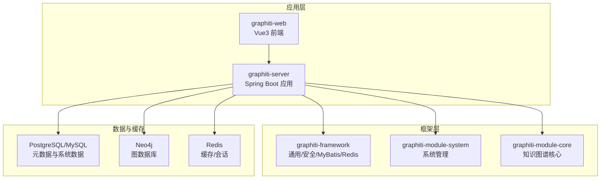
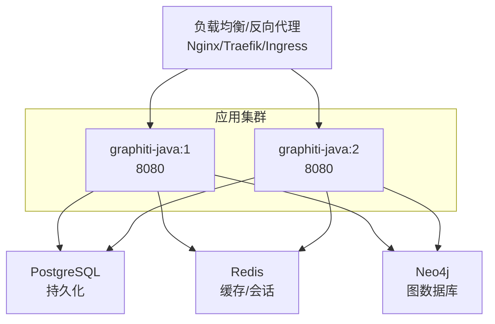
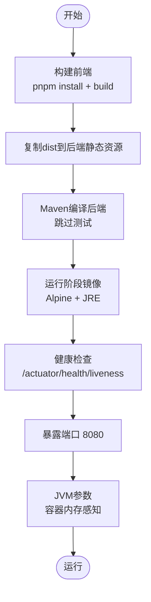
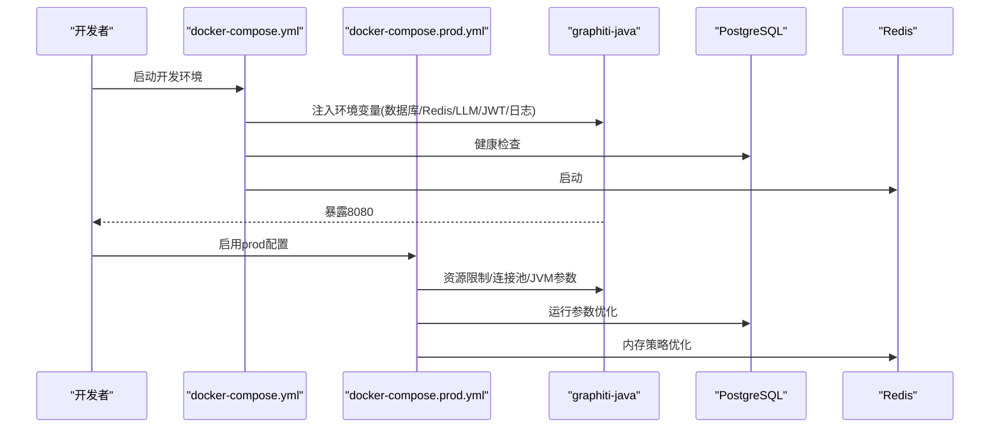
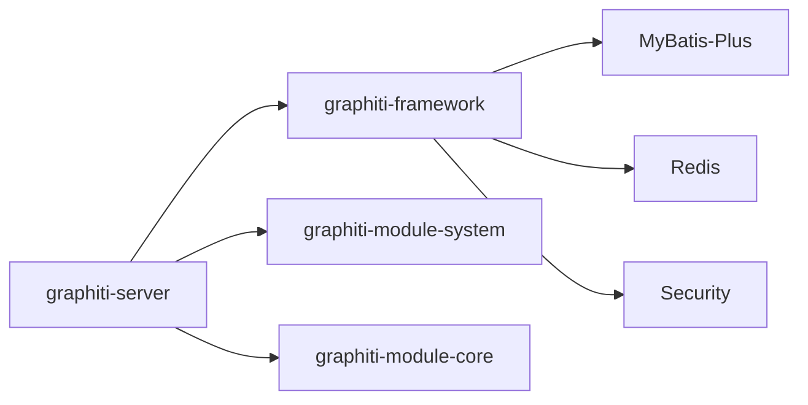

# 部署运维

<cite>
**本文引用的文件**
- [README.md](file://README.md)
- [pom.xml](file://pom.xml)
- [graphiti-server/src/main/java/com/graphiti/GraphitiApplication.java](file://graphiti-server/src/main/java/com/graphiti/GraphitiApplication.java)
- [graphiti-server/src/main/resources/application.yml](file://graphiti-server/src/main/resources/application.yml)
- [graphiti-server/src/main/resources/application-dev.yml](file://graphiti-server/src/main/resources/application-dev.yml)
- [graphiti-framework/graphiti-spring-boot-starter-security/src/main/java/com/graphiti/framework/security/config/SecurityConfig.java](file://graphiti-framework/graphiti-spring-boot-starter-security/src/main/java/com/graphiti/framework/security/config/SecurityConfig.java)
- [docker/Dockerfile](file://docker/Dockerfile)
- [docker-compose.yml](file://docker-compose.yml)
- [docker-compose.prod.yml](file://docker-compose.prod.yml)
- [sql/postgresql/schema.sql](file://sql/postgresql/schema.sql)
- [sql/neo4j/init.cypher](file://sql/neo4j/init.cypher)
</cite>

## 目录
1. [简介](#简介)
2. [项目结构](#项目结构)
3. [核心组件](#核心组件)
4. [架构总览](#架构总览)
5. [详细组件分析](#详细组件分析)
6. [依赖分析](#依赖分析)
7. [性能考虑](#性能考虑)
8. [故障排查指南](#故障排查指南)
9. [结论](#结论)
10. [附录](#附录)

## 简介
本文件面向DevOps工程师与系统管理员，提供Graphiti-Java的容器化部署与生产运维实践指南。内容涵盖Docker容器化方案、生产环境配置、环境变量清单、依赖服务设置、负载均衡与高可用、灾难恢复策略、监控与日志、性能调优、安全加固、备份恢复与版本升级流程，以及运维脚本与自动化工具使用方法。

## 项目结构
Graphiti-Java采用多模块Maven工程组织，后端以Spring Boot应用为核心，前端为独立的Vue3项目，数据库包括PostgreSQL/MySQL与Neo4j，缓存使用Redis。Docker多阶段构建同时完成前端打包与后端JAR生成，并在运行镜像中内置健康检查与JVM调优参数。

图表来源
- [pom.xml:15-20](file://pom.xml#L15-L20)
- [graphiti-server/src/main/java/com/graphiti/GraphitiApplication.java:18-34](file://graphiti-server/src/main/java/com/graphiti/GraphitiApplication.java#L18-L34)

章节来源
- [README.md:110-166](file://README.md#L110-L166)
- [pom.xml:15-20](file://pom.xml#L15-L20)

## 核心组件
- 应用入口与自动装配
  - 启动类位于graphiti-server模块，扫描com.graphiti包并按需排除部分Spring AI自动配置，避免不必要的外部依赖被激活。
- 配置体系
  - application.yml提供基础配置（如Actuator、OpenAPI、JWT密钥、日志级别等），application-dev.yml提供开发环境的完整LLM Provider配置模板与数据库、Redis、Neo4j连接参数。
- 安全与鉴权
  - 基于Spring Security + JWT，无状态会话；CORS放行常见方法与凭证；未认证/权限不足统一返回JSON错误。
- 数据与缓存
  - PostgreSQL/MySQL用于系统与元数据存储；Neo4j用于知识图谱；Redis用于缓存与会话。
- 前后端分离
  - Docker构建阶段将前端dist拷贝至后端静态资源目录，运行时由Spring Boot提供静态页面与后端API。

章节来源
- [graphiti-server/src/main/java/com/graphiti/GraphitiApplication.java:18-34](file://graphiti-server/src/main/java/com/graphiti/GraphitiApplication.java#L18-L34)
- [graphiti-server/src/main/resources/application.yml:25-67](file://graphiti-server/src/main/resources/application.yml#L25-L67)
- [graphiti-server/src/main/resources/application-dev.yml:487-676](file://graphiti-server/src/main/resources/application-dev.yml#L487-L676)
- [graphiti-framework/graphiti-spring-boot-starter-security/src/main/java/com/graphiti/framework/security/config/SecurityConfig.java:68-136](file://graphiti-framework/graphiti-spring-boot-starter-security/src/main/java/com/graphiti/framework/security/config/SecurityConfig.java#L68-L136)

## 架构总览
下图展示容器化部署下的典型拓扑：应用容器依赖PostgreSQL、Redis与Neo4j；通过反向代理实现对外暴露与TLS终止；生产环境建议使用负载均衡器与多副本部署。

图表来源
- [docker-compose.yml:12-112](file://docker-compose.yml#L12-L112)
- [docker-compose.prod.yml:11-122](file://docker-compose.prod.yml#L11-L122)

## 详细组件分析

### Docker容器化与多阶段构建
- 构建阶段
  - 使用Maven 3.9 + Eclipse Temurin 21编译后端；安装Node.js与pnpm构建前端；将dist拷贝到后端静态资源目录。
- 运行阶段
  - 基于Alpine的Eclipse Temurin 21 JRE；非root用户运行；健康检查通过/actuator/health/liveness；JVM参数支持容器内存感知。
- 端口与卷
  - 暴露8080；支持挂载/app/config与/app/logs；生产环境建议挂载外部配置与日志目录。

图表来源
- [docker/Dockerfile:16-36](file://docker/Dockerfile#L16-L36)
- [docker/Dockerfile:40-75](file://docker/Dockerfile#L40-L75)

章节来源
- [docker/Dockerfile:1-75](file://docker/Dockerfile#L1-L75)

### docker-compose开发与生产配置
- 开发环境compose
  - graphiti-java: 映射8080；通过环境变量注入数据库、Redis、Neo4j、LLM Provider、JWT、日志级别等；依赖PostgreSQL健康与Redis启动。
  - postgres: 暴露5432；持久化到./data/postgres；健康检查基于pg_isready。
  - redis: 暴露6379；持久化到./data/redis；LRU策略。
- 生产环境compose
  - 通过profiles: prod启用；限制CPU/内存；调整连接池大小；挂载外部配置与日志；增强PostgreSQL/Redis运行参数；健康检查间隔更长。

图表来源
- [docker-compose.yml:12-112](file://docker-compose.yml#L12-L112)
- [docker-compose.prod.yml:11-122](file://docker-compose.prod.yml#L11-L122)

章节来源
- [docker-compose.yml:12-112](file://docker-compose.yml#L12-L112)
- [docker-compose.prod.yml:11-122](file://docker-compose.prod.yml#L11-L122)

### 环境变量与配置清单
- 应用配置
  - SPRING_PROFILES_ACTIVE: dev/prod
  - SPRING_DATASOURCE_*: 动态数据源主库URL/用户名/密码
  - SPRING_DATA_REDIS_*: 主机/端口
  - NEO4J_URI/USERNAME/PASSWORD: Neo4j连接
  - SPRING_AI_OPENAI/AZURE/OLLAMA_*: LLM Provider配置
  - GRAPHTI_AI_LLM_PROVIDER/EMBEDDING_PROVIDER/RERANK_PROVIDER: Provider选择
  - GRAPHTI_SECURITY_JWT_SECRET/EXPIRATION: JWT密钥与过期
  - LOGGING_LEVEL_ROOT/LOGGING_LEVEL_COM_GRAPHTI: 日志级别
- 生产专属
  - JAVA_OPTS: JVM堆内存与容器感知
  - SPRING_DATASOURCE_HIKARI_*: 连接池参数
  - volumes: /app/config(只读)/logs

章节来源
- [docker-compose.yml:23-54](file://docker-compose.yml#L23-L54)
- [docker-compose.prod.yml:24-48](file://docker-compose.prod.yml#L24-L48)
- [graphiti-server/src/main/resources/application.yml:25-67](file://graphiti-server/src/main/resources/application.yml#L25-L67)
- [graphiti-server/src/main/resources/application-dev.yml:487-676](file://graphiti-server/src/main/resources/application-dev.yml#L487-L676)

### 依赖服务初始化
- PostgreSQL
  - 使用schema.sql创建系统与图谱元数据表、索引与触发器；建议配合初始化数据脚本。
- Neo4j
  - 执行init.cypher创建唯一性约束、索引与全文索引，确保实体/事件/关系属性具备高效查询能力。

章节来源
- [sql/postgresql/schema.sql:1-319](file://sql/postgresql/schema.sql#L1-L319)
- [sql/neo4j/init.cypher:1-33](file://sql/neo4j/init.cypher#L1-L33)

### 安全与访问控制
- 认证与授权
  - JWT无状态会话；CORS放行常见方法与凭证；未认证返回401，权限不足返回403。
- Actuator端点
  - 开发环境暴露全部端点；生产环境建议限制暴露范围或通过网关/代理访问。

章节来源
- [graphiti-framework/graphiti-spring-boot-starter-security/src/main/java/com/graphiti/framework/security/config/SecurityConfig.java:68-136](file://graphiti-framework/graphiti-spring-boot-starter-security/src/main/java/com/graphiti/framework/security/config/SecurityConfig.java#L68-L136)
- [graphiti-server/src/main/resources/application.yml:43-67](file://graphiti-server/src/main/resources/application.yml#L43-L67)

### 监控指标与日志
- Actuator与Prometheus
  - application.yml默认开启health、metrics、info端点；Prometheus导出默认关闭，可按需启用。
- 日志
  - 控制台格式化输出；开发环境可提升日志级别以便排障；生产环境建议集中采集并分级存储。

章节来源
- [graphiti-server/src/main/resources/application.yml:43-67](file://graphiti-server/src/main/resources/application.yml#L43-L67)

### 性能调优与资源管理
- JVM与容器
  - Dockerfile提供容器内存感知的JVM参数；生产环境通过JAVA_OPTS显式设置堆大小。
- 数据库连接池
  - HikariCP最大池大小与空闲数在生产配置中可调优。
- 缓存与索引
  - Redis内存策略与持久化参数；Neo4j索引与向量索引在启动时自动创建。

章节来源
- [docker/Dockerfile:68-74](file://docker/Dockerfile#L68-L74)
- [docker-compose.prod.yml:35-37](file://docker-compose.prod.yml#L35-L37)
- [graphiti-server/src/main/resources/application-dev.yml:487-502](file://graphiti-server/src/main/resources/application-dev.yml#L487-L502)
- [sql/neo4j/init.cypher:1-33](file://sql/neo4j/init.cypher#L1-L33)

### 备份恢复与灾难恢复
- 数据备份
  - PostgreSQL/MySQL：定期执行逻辑备份；Redis：AOF持久化；Neo4j：快照或备份图数据。
- 恢复演练
  - 在隔离环境中验证备份集的完整性与可恢复性；演练跨版本迁移。
- 灾难恢复
  - 多副本与异地多活；结合负载均衡与健康检查实现故障转移。

[本节为通用运维建议，不直接分析具体文件]

### 负载均衡与高可用
- 多副本部署
  - 使用Compose或编排平台部署多个应用实例；通过LB实现流量分发。
- 健康检查
  - 利用/actuator/health/liveness进行存活探针；生产环境延长初始探测时间。
- 会话与缓存
  - 无状态设计；共享Redis作为会话与缓存介质。

章节来源
- [docker/Dockerfile:60-63](file://docker/Dockerfile#L60-L63)
- [docker-compose.prod.yml:43-48](file://docker-compose.prod.yml#L43-L48)

### 版本升级与迁移
- 升级流程
  - 制定灰度发布计划；先在预生产验证；滚动升级减少停机；回滚策略准备。
- 数据迁移
  - 遵循数据库迁移脚本顺序；Neo4j向量索引在启动时自动创建，无需手动干预。
- 前后端协同
  - Docker构建阶段统一产出；升级时保持前后端版本兼容。

章节来源
- [sql/neo4j/init.cypher:1-33](file://sql/neo4j/init.cypher#L1-L33)
- [docker/Dockerfile:16-36](file://docker/Dockerfile#L16-L36)

### 运维脚本与自动化
- Compose命令
  - 启动/停止/查看日志/重启等常用命令；生产环境建议配合守护进程与日志轮转。
- 健康检查与告警
  - 结合LB与/actuator/health/liveness；设置阈值告警。

章节来源
- [docker-compose.yml:4-10](file://docker-compose.yml#L4-L10)
- [docker-compose.prod.yml:43-48](file://docker-compose.prod.yml#L43-L48)

## 依赖分析
- 技术栈与版本
  - Java 21、Spring Boot 3.5.5、Spring AI 1.1.2、MyBatis-Plus 3.5.12、Neo4j驱动5.26、Redisson 3.37、PostgreSQL驱动42.7.4、JWT jjwt 0.12.3、Hutool 5.8.37、SpringDoc 2.8.5。
- 模块依赖
  - graphiti-server依赖framework、system、core模块；framework提供通用与集成组件；system与core分别负责系统管理与知识图谱业务。

图表来源
- [pom.xml:15-20](file://pom.xml#L15-L20)
- [pom.xml:45-196](file://pom.xml#L45-L196)

章节来源
- [pom.xml:22-43](file://pom.xml#L22-L43)
- [pom.xml:45-196](file://pom.xml#L45-L196)

## 性能考虑
- JVM与容器
  - 使用容器内存感知参数，避免过度分配；生产环境明确-Xms/-Xmx。
- 数据库
  - PostgreSQL连接池参数与Redis内存策略在生产配置中已给出参考值。
- 搜索与推理
  - LLM Provider选择与模型维度影响性能；建议在测试环境评估不同Provider与模型组合。

[本节提供通用指导，不直接分析具体文件]

## 故障排查指南
- 健康检查失败
  - 检查/actuator/health/liveness响应；确认数据库、Redis、Neo4j连通性。
- 认证失败
  - 校验JWT密钥与过期时间；确认CORS配置；检查未认证/权限不足的错误响应。
- 日志定位
  - 提升日志级别；关注数据库连接池与LLM调用异常；核对Neo4j索引创建情况。

章节来源
- [graphiti-server/src/main/resources/application.yml:43-67](file://graphiti-server/src/main/resources/application.yml#L43-L67)
- [graphiti-framework/graphiti-spring-boot-starter-security/src/main/java/com/graphiti/framework/security/config/SecurityConfig.java:84-113](file://graphiti-framework/graphiti-spring-boot-starter-security/src/main/java/com/graphiti/framework/security/config/SecurityConfig.java#L84-L113)

## 结论
通过Docker多阶段构建与Compose编排，Graphiti-Java可在开发与生产环境快速落地。结合合理的资源配额、连接池与缓存策略、完善的监控与日志体系，以及严格的备份与灾备流程，可满足生产级可用性与可维护性要求。建议在上线前完成压测与演练，并持续优化JVM与数据库参数。

## 附录

### 部署清单（生产）
- 基础设施
  - 负载均衡/反向代理、NTP、防火墙规则（仅开放80/443与内部管理端口）、SSL证书。
- 容器与编排
  - graphiti-java多副本、PostgreSQL/Redis持久化卷、日志卷、外部配置卷。
- 依赖服务
  - PostgreSQL/MySQL初始化脚本、Neo4j初始化脚本、LLM Provider接入。
- 监控与告警
  - Actuator端点、日志采集、Prometheus/Grafana、告警规则（CPU/内存/磁盘/连接池/健康检查）。
- 安全加固
  - 禁用不必要端点、最小权限原则、密钥管理、网络隔离、TLS终止。

[本节为通用清单，不直接分析具体文件]