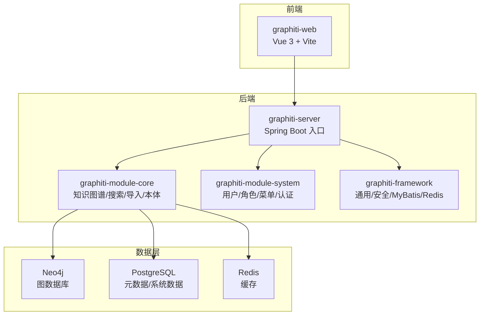
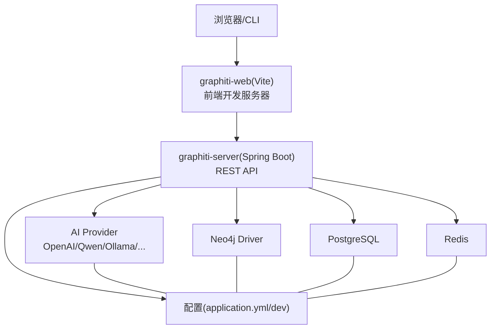
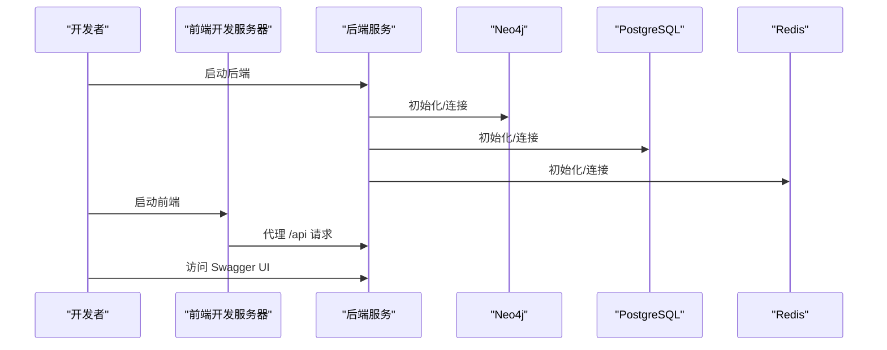

# 快速开始

<!--<cite>
**本文引用的文件**
- [README.md](file://README.md)
- [README_CN.md](file://README_CN.md)
- [pom.xml](file://pom.xml)
- [graphiti-server/src/main/resources/application.yml](file://graphiti-server/src/main/resources/application.yml)
- [graphiti-server/src/main/resources/application-dev.yml](file://graphiti-server/src/main/resources/application-dev.yml)
- [graphiti-server/src/main/java/com/graphiti/GraphitiApplication.java](file://graphiti-server/src/main/java/com/graphiti/GraphitiApplication.java)
- [graphiti-module-core/src/main/java/com/Graphiti/module/graphiti/config/GraphitiAiProperties.java](file://graphiti-module-core/src/main/java/com/graphiti/module/graphiti/config/GraphitiAiProperties.java)
- [graphiti-module-core/src/main/java/com/Graphiti/module/graphiti/config/GraphNeo4jConfig.java](file://graphiti-module-core/src/main/java/com/graphiti/module/graphiti/config/GraphNeo4jConfig.java)
- [sql/postgresql/schema.sql](file://sql/postgresql/schema.sql)
- [sql/postgresql/init-data.sql](file://sql/postgresql/init-data.sql)
- [sql/neo4j/init.cypher](file://sql/neo4j/init.cypher)
- [sql/neo4j/vector-index-init.cypher](file://sql/neo4j/vector-index-init.cypher)
- [graphiti-web/package.json](file://graphiti-web/package.json)
- [graphiti-web/vite.config.ts](file://graphiti-web/vite.config.ts)
- [graphiti-web/setup.bat](file://graphiti-web/setup.bat)
- [graphiti-web/install.bat](file://graphiti-web/install.bat)
</cite>-->

## 目录
1. [简介](#简介)
2. [项目结构](#项目结构)
3. [核心组件](#核心组件)
4. [架构总览](#架构总览)
5. [详细组件分析](#详细组件分析)
6. [依赖分析](#依赖分析)
7. [性能考虑](#性能考虑)
8. [故障排查指南](#故障排查指南)
9. [结论](#结论)
10. [附录](#附录)

## 简介
本指南面向首次接触 ontograph-java 的开发者，帮助你在约 30 分钟内完成环境准备、数据库初始化、应用配置与启动，并验证基础功能（创建图谱、添加数据、混合检索、本体定义等）。项目采用前后端分离架构：后端基于 Spring Boot 3.5.5，前端基于 Vue 3 + Vite，数据层包含 Neo4j（图数据库）、PostgreSQL（元数据与系统数据）以及 Redis（缓存）。

## 项目结构
- 后端入口模块：graphiti-server（Spring Boot 启动类与配置）
- 核心业务模块：graphiti-module-core（知识图谱、搜索、导入、本体、社区等）
- 系统管理模块：graphiti-module-system（用户/角色/菜单/认证）
- 框架基础设施：graphiti-framework（通用组件、安全、MyBatis、Redis）
- 前端工程：graphiti-web（Vue 3 + Vite）
- 数据库初始化脚本：sql/postgresql、sql/neo4j

图表来源
- [pom.xml:15-20](file://pom.xml#L15-L20)
- [graphiti-server/src/main/java/com/graphiti/GraphitiApplication.java:18-34](file://graphiti-server/src/main/java/com/graphiti/GraphitiApplication.java#L18-L34)

章节来源
- [pom.xml:15-20](file://pom.xml#L15-L20)
- [README.md:113-166](file://README.md#L113-L166)

## 核心组件
- 启动入口：GraphitiApplication（Spring Boot 启动类）
- 配置中心：application.yml（基础配置）、application-dev.yml（开发环境配置）
- AI 配置：GraphitiAiProperties（统一读取 graphiti.ai.* 配置）
- Neo4j 配置：GraphNeo4jConfig（读取 neo4j.* 配置并创建 Driver Bean）

章节来源
- [graphiti-server/src/main/java/com/graphiti/GraphitiApplication.java:18-34](file://graphiti-server/src/main/java/com/graphiti/GraphitiApplication.java#L18-L34)
- [graphiti-server/src/main/resources/application.yml:25-34](file://graphiti-server/src/main/resources/application.yml#L25-L34)
- [graphiti-server/src/main/resources/application-dev.yml:508-517](file://graphiti-server/src/main/resources/application-dev.yml#L508-L517)
- [graphiti-module-core/src/main/java/com/Graphiti/module/graphiti/config/GraphitiAiProperties.java:15-31](file://graphiti-module-core/src/main/java/com/graphiti/module/graphiti/config/GraphitiAiProperties.java#L15-L31)
- [graphiti-module-core/src/main/java/com/Graphiti/module/graphiti/config/GraphNeo4jConfig.java:20-45](file://graphiti-module-core/src/main/java/com/graphiti/module/graphiti/config/GraphNeo4jConfig.java#L20-L45)

## 架构总览
后端通过 Spring Boot 启动，加载配置与自动装配，对外提供 REST API；前端通过 Vite 代理转发到后端。数据层由 Neo4j 存储图结构与向量，PostgreSQL 存储系统与元数据，Redis 提供缓存与会话。

图表来源
- [graphiti-web/vite.config.ts:18-26](file://graphiti-web/vite.config.ts#L18-L26)
- [graphiti-server/src/main/resources/application.yml:25-34](file://graphiti-server/src/main/resources/application.yml#L25-L34)
- [graphiti-module-core/src/main/java/com/Graphiti/module/graphiti/config/GraphitiAiProperties.java:15-31](file://graphiti-module-core/src/main/java/com/graphiti/module/graphiti/config/GraphitiAiProperties.java#L15-L31)
- [graphiti-module-core/src/main/java/com/Graphiti/module/graphiti/config/GraphNeo4jConfig.java:20-45](file://graphiti-module-core/src/main/java/com/graphiti/module/graphiti/config/GraphNeo4jConfig.java#L20-L45)

## 详细组件分析

### 环境准备与安装
- 后端环境
  - JDK 21+
  - Maven 3.9+
  - Neo4j 5.26+
  - PostgreSQL 15+（或 MySQL 8.0+）
  - Redis 6+
- 前端环境
  - Node.js 18+

章节来源
- [README.md:223-231](file://README.md#L223-L231)
- [README_CN.md:223-231](file://README_CN.md#L223-L231)

### Docker 部署（建议）
- 使用官方镜像快速拉起依赖服务（Neo4j、PostgreSQL、Redis），并确保网络互通。
- 将后端打包产物（jar）挂载到容器中，或直接在容器内构建。
- 前端可单独部署静态资源，或通过反向代理统一暴露。

[本节为通用实践说明，不直接分析具体文件，故无“章节来源”]

### 本地开发部署
- 后端启动
  - 进入后端模块目录，执行启动命令，应用将在本地端口启动。
  - Swagger UI 地址可在配置中查看。
- 前端启动
  - 进入前端目录，安装依赖后启动开发服务器。
  - 前端通过 Vite 代理将 /api 请求转发至后端。

章节来源
- [README.md:293-312](file://README.md#L293-L312)
- [graphiti-web/vite.config.ts:18-26](file://graphiti-web/vite.config.ts#L18-L26)
- [graphiti-web/setup.bat:1-32](file://graphiti-web/setup.bat#L1-L32)
- [graphiti-web/install.bat:1-10](file://graphiti-web/install.bat#L1-L10)

### 数据库初始化
- Neo4j
  - 执行初始化脚本创建唯一性约束与索引。
  - 执行向量索引初始化脚本创建节点与边的向量索引。
- PostgreSQL
  - 先执行 schema.sql 创建表结构，再执行 init-data.sql 插入初始数据。
- MySQL（可选）
  - 若使用 MySQL 替代 PostgreSQL，执行相应 SQL 文件完成初始化。

章节来源
- [README.md:240-259](file://README.md#L240-L259)
- [sql/neo4j/init.cypher:1-33](file://sql/neo4j/init.cypher#L1-L33)
- [sql/neo4j/vector-index-init.cypher:1-27](file://sql/neo4j/vector-index-init.cypher#L1-L27)
- [sql/postgresql/schema.sql:1-319](file://sql/postgresql/schema.sql#L1-L319)
- [sql/postgresql/init-data.sql:1-110](file://sql/postgresql/init-data.sql#L1-L110)

### 应用配置
- 基础配置
  - application.yml：设置活动 Profile、MyBatis-Plus、JWT、日志、Actuator、OpenAPI 等。
- 开发配置
  - application-dev.yml：LLM Provider 与 Embedding/Rerank/Chat 的详细配置模板，数据库与 Redis 连接配置，Neo4j 连接信息。
- AI Provider 选择
  - 通过 graphiti.ai.llm-provider 与 embedding-provider 指定当前使用的 LLM 与 Embedding 提供商。
- Neo4j 连接
  - 通过 neo4j.uri/username/password 配置连接信息。

章节来源
- [graphiti-server/src/main/resources/application.yml:25-67](file://graphiti-server/src/main/resources/application.yml#L25-L67)
- [graphiti-server/src/main/resources/application-dev.yml:508-517](file://graphiti-server/src/main/resources/application-dev.yml#L508-L517)
- [graphiti-module-core/src/main/java/com/Graphiti/module/graphiti/config/GraphitiAiProperties.java:15-31](file://graphiti-module-core/src/main/java/com/graphiti/module/graphiti/config/GraphitiAiProperties.java#L15-L31)
- [graphiti-module-core/src/main/java/com/Graphiti/module/graphiti/config/GraphNeo4jConfig.java:20-45](file://graphiti-module-core/src/main/java/com/graphiti/module/graphiti/config/GraphNeo4jConfig.java#L20-L45)

### 启动流程
- 后端启动
  - 进入 graphiti-server 目录，执行启动命令，等待服务就绪。
- 前端启动
  - 进入 graphiti-web 目录，安装依赖后启动开发服务器。
- 访问 Swagger
  - 启动后访问 Swagger UI 地址查看与调试接口。

图表来源
- [graphiti-web/vite.config.ts:18-26](file://graphiti-web/vite.config.ts#L18-L26)
- [graphiti-server/src/main/resources/application.yml:58-67](file://graphiti-server/src/main/resources/application.yml#L58-L67)

章节来源
- [README.md:293-312](file://README.md#L293-L312)
- [graphiti-web/vite.config.ts:18-26](file://graphiti-web/vite.config.ts#L18-L26)

### 常用 API 调用示例
- 创建图谱
  - 使用 POST /api/v1/graph 创建新图谱。
- 添加数据（自动抽取）
  - 使用 POST /api/v1/graph/data/add 对文本进行实体/关系抽取并写入图数据库。
- 混合检索
  - 使用 POST /api/v1/search/hybrid 结合 BM25、向量与 BFS 进行融合检索。
- 定义本体
  - 使用 POST /api/v1/graph/{graphId}/ontology 定义实体与关系的本体规则。
- 构建社区
  - 使用 POST /api/v1/graph/{graphId}/communities/build 基于标签传播与 LLM 生成社区摘要。

章节来源
- [README.md:315-403](file://README.md#L315-L403)

## 依赖分析
- 技术栈与版本
  - 后端：Java 21、Spring Boot 3.5.5、Spring AI 1.1.2、MyBatis-Plus 3.5.12、Neo4j Java Driver 5.26.0、Redisson 3.37.0、SpringDoc OpenAPI 2.8.5。
  - 前端：Vue 3.4、Vite 5.2、Ant Design Vue 4.2、Axios 1.7、ECharts 5.5。
  - 数据库：Neo4j 5.26、PostgreSQL 15+、MySQL 8.0+、Redis 6+。
- LLM 提供商支持：OpenAI、Anthropic Claude、阿里 Qwen、Ollama、Mistral AI、Azure OpenAI、AWS Bedrock 等。

章节来源
- [README.md:170-218](file://README.md#L170-L218)
- [README_CN.md:170-218](file://README_CN.md#L170-L218)

## 性能考虑
- 向量索引与全文索引
  - Neo4j 中已提供节点与边的向量索引及全文索引初始化脚本，确保检索性能。
- 数据库连接池
  - application-dev.yml 中配置了 Hikari 连接池参数，可根据并发场景调整。
- 缓存策略
  - Redisson 提供分布式缓存能力，建议对热点数据与会话进行缓存。

章节来源
- [sql/neo4j/vector-index-init.cypher:1-27](file://sql/neo4j/vector-index-init.cypher#L1-L27)
- [graphiti-server/src/main/resources/application-dev.yml:498-502](file://graphiti-server/src/main/resources/application-dev.yml#L498-L502)

## 故障排查指南
- 后端无法启动
  - 检查 application.yml 与 application-dev.yml 中的配置项是否正确（如 LLM Provider、数据库与 Redis 连接、Neo4j 连接）。
  - 查看日志级别与输出，确认 Actuator 端点是否可用。
- 前端无法访问后端接口
  - 确认 Vite 代理配置是否指向后端端口。
  - 检查跨域与鉴权问题。
- 数据库初始化失败
  - 确认数据库服务已启动且账号密码正确。
  - 按顺序执行 schema.sql 与 init-data.sql。
- Neo4j 索引未生效
  - 确认已执行 init.cypher 与 vector-index-init.cypher。
  - 检查向量维度与相似度函数配置。

章节来源
- [graphiti-server/src/main/resources/application.yml:36-41](file://graphiti-server/src/main/resources/application.yml#L36-L41)
- [graphiti-web/vite.config.ts:18-26](file://graphiti-web/vite.config.ts#L18-L26)
- [sql/neo4j/init.cypher:1-33](file://sql/neo4j/init.cypher#L1-L33)
- [sql/neo4j/vector-index-init.cypher:1-27](file://sql/neo4j/vector-index-init.cypher#L1-L27)

## 结论
按照本指南完成环境准备、数据库初始化与配置后，你可以在本地快速启动 ontograph-java，并通过 Swagger 与 curl 验证核心功能。若需进一步扩展，可参考 README 中的技术栈与模块结构，逐步接入更多 LLM 提供商与数据源。

## 附录
- Swagger UI：启动后访问 Swagger UI 地址查看与调试接口。
- API 分组概览：认证、用户、角色、菜单、图谱、节点、边、事件、本体、检索、数据导入、维护等。

章节来源
- [README.md:406-431](file://README.md#L406-L431)