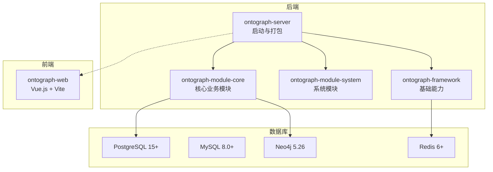
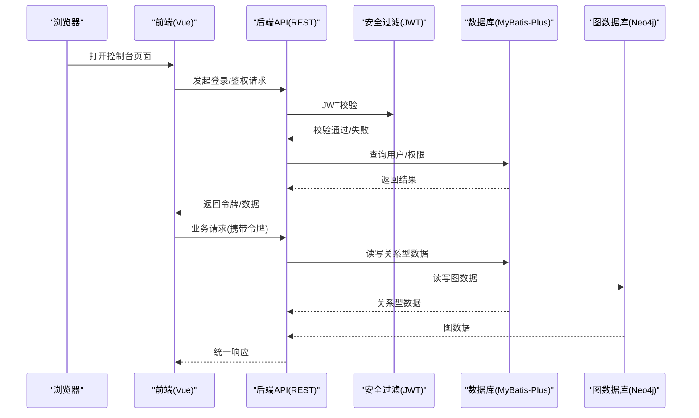
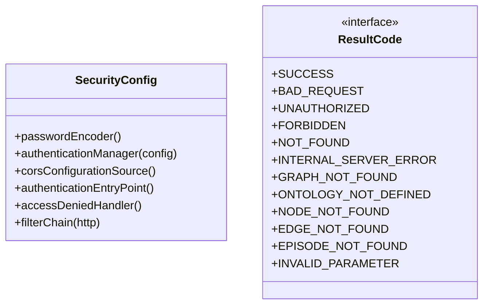
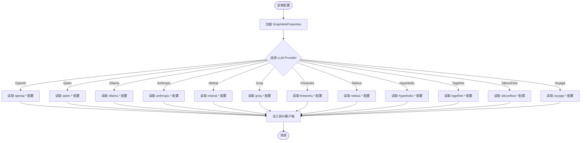
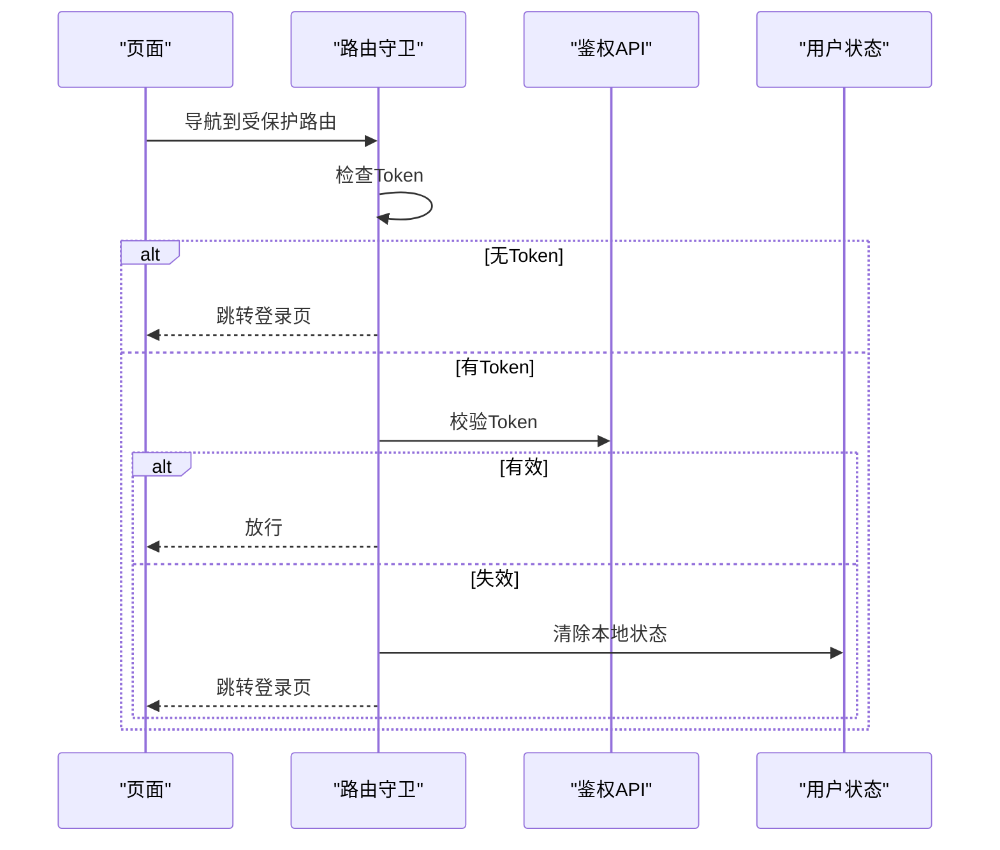
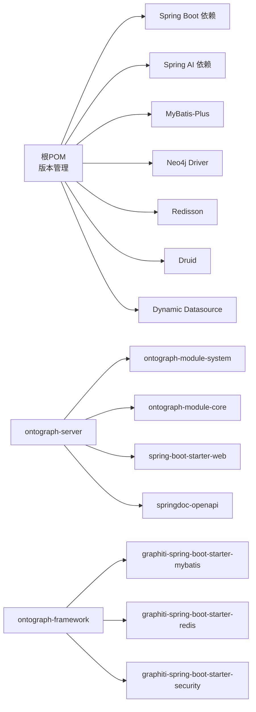

# 技术栈概览

<!--<cite>
**本文引用的文件**
- [pom.xml](file://pom.xml)
- [ontograph-server/pom.xml](file://ontograph-server/pom.xml)
- [ontograph-server/src/main/resources/application.yml](file://ontograph-server/src/main/resources/application.yml)
- [ontograph-server/src/main/resources/application-dev.yml](file://ontograph-server/src/main/resources/application-dev.yml)
- [ontograph-framework/graphiti-common/src/main/java/com/raphiti/common/constants/ResultCode.java](file://ontograph-framework/graphiti-common/src/main/java/com/raphiti/common/constants/ResultCode.java)
- [ontograph-framework/graphiti-spring-boot-starter-security/src/main/java/com/raphiti/framework/security/config/SecurityConfig.java](file://ontograph-framework/graphiti-spring-boot-starter-security/src/main/java/com/raphiti/framework/security/config/SecurityConfig.java)
- [ontograph-framework/graphiti-spring-boot-starter-mybatis/pom.xml](file://ontograph-framework/graphiti-spring-boot-starter-mybatis/pom.xml)
- [ontograph-framework/graphiti-spring-boot-starter-redis/pom.xml](file://ontograph-framework/graphiti-spring-boot-starter-redis/pom.xml)
- [ontograph-module-core/src/main/java/com/raphiti/module/graphiti/config/GraphNeo4jConfig.java](file://ontograph-module-core/src/main/java/com/raphiti/module/graphiti/config/GraphNeo4jConfig.java)
- [ontograph-module-core/src/main/java/com/raphiti/module/graphiti/config/GraphitiAiProperties.java](file://ontograph-module-core/src/main/java/com/raphiti/module/graphiti/config/GraphitiAiProperties.java)
- [ontograph-web/package.json](file://ontograph-web/package.json)
- [ontograph-web/vite.config.ts](file://ontograph-web/vite.config.ts)
- [ontograph-web/tsconfig.json](file://ontograph-web/tsconfig.json)
- [ontograph-web/src/main.ts](file://ontograph-web/src/main.ts)
- [ontograph-web/src/router/index.ts](file://ontograph-web/src/router/index.ts)
</cite>-->

## 目录
1. [引言](#引言)
2. [项目结构](#项目结构)
3. [核心组件](#核心组件)
4. [架构总览](#架构总览)
5. [详细组件分析](#详细组件分析)
6. [依赖分析](#依赖分析)
7. [性能考虑](#性能考虑)
8. [故障排查指南](#故障排查指南)
9. [结论](#结论)
10. [附录](#附录)

## 引言
本文件面向OntoGraph项目的开发者与架构师，系统梳理后端、前端与数据库技术栈，解释各技术的选择原因、在项目中的职责、版本兼容性与升级路径，并给出最佳实践与性能考量建议。目标是帮助读者快速理解整体技术架构设计思路，支撑后续开发与运维工作。

## 项目结构
OntoGraph采用多模块Maven工程组织，分为框架层、业务模块与服务启动模块，前端以独立子项目存在并通过Maven插件集成打包。核心模块包括：
- ontograph-framework：通用能力与基础设施（安全、MyBatis-Plus、Redis等）
- ontograph-module-system：系统管理相关功能（用户、菜单、角色、日志等）
- ontograph-module-core：核心业务功能（知识图谱、本体、抽取、搜索、AI服务等）
- ontograph-server：Spring Boot启动模块，聚合业务与前端构建
- ontograph-web：Vue.js前端工程，通过Vite构建并嵌入后端

图表来源
- [pom.xml:15-20](file://pom.xml#L15-L20)
- [ontograph-server/pom.xml:17-30](file://ontograph-server/pom.xml#L17-L30)
- [ontograph-web/package.json:11-21](file://ontograph-web/package.json#L11-L21)

章节来源
- [pom.xml:15-20](file://pom.xml#L15-L20)
- [ontograph-server/pom.xml:17-30](file://ontograph-server/pom.xml#L17-L30)

## 核心组件
- 后端技术栈
  - Java 21：统一编译与运行时，获得最新语言特性与性能收益
  - Spring Boot 3.5.5：现代化微服务与自动配置
  - Spring AI 1.1.2：统一LLM/Embedding/Rerank抽象与多Provider适配
  - MyBatis-Plus 3.5.12：增强ORM能力与多数据源支持
  - Neo4j Java Driver 5.26.0：原生驱动，稳定可靠
  - Redisson 3.37.0：企业级Redis客户端与分布式能力
  - Lombok/MapStruct/Hutool：提升开发效率与可维护性
- 前端技术栈
  - Vue.js 3.4：响应式与组合式API
  - Vite 5.2：极速构建与热更新
  - Ant Design Vue 4.2：企业级UI组件库
  - TypeScript 5.4：类型安全与更好的IDE体验
- 数据库技术栈
  - Neo4j 5.26：知识图谱存储与查询
  - PostgreSQL 15+：主业务数据存储
  - MySQL 8.0+：历史/兼容场景
  - Redis 6+：缓存与会话

章节来源
- [pom.xml:22-43](file://pom.xml#L22-L43)
- [ontograph-server/pom.xml:31-40](file://ontograph-server/pom.xml#L31-L40)
- [ontograph-web/package.json:11-21](file://ontograph-web/package.json#L11-L21)

## 架构总览
后端采用分层与模块化设计，前端通过Vite构建并由后端统一打包发布。核心交互流程如下：

图表来源
- [ontograph-framework/graphiti-spring-boot-starter-security/src/main/java/com/raphiti/framework/security/config/SecurityConfig.java:115-136](file://ontograph-framework/graphiti-spring-boot-starter-security/src/main/java/com/raphiti/framework/security/config/SecurityConfig.java#L115-L136)
- [ontograph-server/src/main/resources/application.yml:25-34](file://ontograph-server/src/main/resources/application.yml#L25-L34)
- [ontograph-module-core/src/main/java/com/raphiti/module/graphiti/config/GraphNeo4jConfig.java:41-45](file://ontograph-module-core/src/main/java/com/raphiti/module/graphiti/config/GraphNeo4jConfig.java#L41-L45)

## 详细组件分析

### 后端技术栈与职责
- Java 21
  - 选择原因：获得最新的JVM性能、语言特性与长期支持；与Spring Boot 3.x良好兼容
  - 在项目中的作用：统一编译与运行时，确保新语法与并发优化可用
- Spring Boot 3.5.5
  - 选择原因：成熟稳定的微服务框架，生态完善，自动配置简化开发
  - 在项目中的作用：提供Web容器、自动装配、健康检查、Actuator等
- Spring AI 1.1.2
  - 选择原因：统一LLM/Embedding/Rerank抽象，支持多Provider（OpenAI、Qwen、Ollama等）
  - 在项目中的作用：集中配置与调用，便于切换与扩展
- MyBatis-Plus 3.5.12
  - 选择原因：减少DAO层样板代码，内置分页、条件构造器、多数据源
  - 在项目中的作用：ORM映射与SQL构建，配合动态数据源
- Neo4j Java Driver 5.26.0
  - 选择原因：官方驱动，稳定可靠，支持异步与流式结果
  - 在项目中的作用：图数据读写与Cypher执行
- Redisson 3.37.0
  - 选择原因：企业级Redis客户端，提供分布式对象、锁、限流等能力
  - 在项目中的作用：缓存、分布式锁、会话管理

章节来源
- [pom.xml:29-42](file://pom.xml#L29-L42)
- [ontograph-module-core/src/main/java/com/raphiti/module/graphiti/config/GraphitiAiProperties.java:15-31](file://ontograph-module-core/src/main/java/com/raphiti/module/graphiti/config/GraphitiAiProperties.java#L15-L31)
- [ontograph-framework/graphiti-spring-boot-starter-mybatis/pom.xml:35-41](file://ontograph-framework/graphiti-spring-boot-starter-mybatis/pom.xml#L35-L41)
- [ontograph-framework/graphiti-spring-boot-starter-redis/pom.xml:26-28](file://ontograph-framework/graphiti-spring-boot-starter-redis/pom.xml#L26-L28)

### 前端技术栈与职责
- Vue.js 3.4
  - 选择原因：组合式API、更好的TypeScript支持、性能优异
  - 在项目中的作用：单页应用视图渲染与状态管理
- Vite 5.2
  - 选择原因：更快的冷/热启动，现代化构建工具链
  - 在项目中的作用：开发服务器、构建产物与资源优化
- Ant Design Vue 4.2
  - 选择原因：企业级UI组件库，设计规范统一
  - 在项目中的作用：表单、表格、图表等常用组件
- TypeScript 5.4
  - 选择原因：类型安全与更好的IDE体验
  - 在项目中的作用：强类型约束，降低运行时错误

章节来源
- [ontograph-web/package.json:11-21](file://ontograph-web/package.json#L11-L21)
- [ontograph-web/vite.config.ts:1-41](file://ontograph-web/vite.config.ts#L1-L41)
- [ontograph-web/tsconfig.json:1-25](file://ontograph-web/tsconfig.json#L1-L25)
- [ontograph-web/src/main.ts:1-25](file://ontograph-web/src/main.ts#L1-L25)

### 数据库技术栈与职责
- Neo4j 5.26
  - 选择原因：图数据模型天然契合知识图谱，查询与遍历高效
  - 在项目中的作用：实体、关系、时序事件等图数据存储
- PostgreSQL 15+
  - 选择原因：ACID、扩展性强、JSON/JSONB、全文检索、向量扩展潜力
  - 在项目中的作用：主业务数据、本体与元数据
- MySQL 8.0+
  - 选择原因：兼容历史系统，成本低、生态成熟
  - 在项目中的作用：历史数据迁移与兼容场景
- Redis 6+
  - 选择原因：高性能缓存、会话、分布式锁
  - 在项目中的作用：热点数据缓存、限流与会话

章节来源
- [ontograph-server/src/main/resources/application-dev.yml:488-507](file://ontograph-server/src/main/resources/application-dev.yml#L488-L507)
- [ontograph-server/src/main/resources/application-dev.yml:594-599](file://ontograph-server/src/main/resources/application-dev.yml#L594-L599)

### 安全与统一返回
- 安全配置
  - 使用基于JWT的无状态认证，禁用CSRF，开启CORS，统一401/403异常处理
- 统一返回码
  - 定义标准返回码，覆盖业务错误与HTTP语义错误

图表来源
- [ontograph-framework/graphiti-spring-boot-starter-security/src/main/java/com/raphiti/framework/security/config/SecurityConfig.java:35-137](file://ontograph-framework/graphiti-spring-boot-starter-security/src/main/java/com/raphiti/framework/security/config/SecurityConfig.java#L35-L137)
- [ontograph-framework/graphiti-common/src/main/java/com/raphiti/common/constants/ResultCode.java:7-22](file://ontograph-framework/graphiti-common/src/main/java/com/raphiti/common/constants/ResultCode.java#L7-L22)

章节来源
- [ontograph-framework/graphiti-spring-boot-starter-security/src/main/java/com/raphiti/framework/security/config/SecurityConfig.java:35-137](file://ontograph-framework/graphiti-spring-boot-starter-security/src/main/java/com/raphiti/framework/security/config/SecurityConfig.java#L35-L137)
- [ontograph-framework/graphiti-common/src/main/java/com/raphiti/common/constants/ResultCode.java:7-22](file://ontograph-framework/graphiti-common/src/main/java/com/raphiti/common/constants/ResultCode.java#L7-L22)

### AI配置与多Provider适配
- 配置属性
  - 通过配置类读取graphiti.ai.*配置，支持多Provider参数与默认值
- Provider模板
  - application-dev.yml提供OpenAI、Qwen、Ollama、Anthropic、Mistral、Groq、Fireworks、Nebius、Hyperbolic、Together、SiliconFlow、Voyage等完整模板

图表来源
- [ontograph-module-core/src/main/java/com/raphiti/module/graphiti/config/GraphitiAiProperties.java:15-134](file://ontograph-module-core/src/main/java/com/raphiti/module/graphiti/config/GraphitiAiProperties.java#L15-L134)
- [ontograph-server/src/main/resources/application-dev.yml:467-593](file://ontograph-server/src/main/resources/application-dev.yml#L467-L593)

章节来源
- [ontograph-module-core/src/main/java/com/raphiti/module/graphiti/config/GraphitiAiProperties.java:15-134](file://ontograph-module-core/src/main/java/com/raphiti/module/graphiti/config/GraphitiAiProperties.java#L15-L134)
- [ontograph-server/src/main/resources/application-dev.yml:467-593](file://ontograph-server/src/main/resources/application-dev.yml#L467-L593)

### 前端路由与鉴权
- 路由守卫
  - 对需要认证的路由进行拦截，校验Token有效性，定期刷新认证状态
- 代理配置
  - Vite开发服务器代理到后端8080端口，便于前后联调

图表来源
- [ontograph-web/src/router/index.ts:185-230](file://ontograph-web/src/router/index.ts#L185-L230)
- [ontograph-web/vite.config.ts:18-26](file://ontograph-web/vite.config.ts#L18-L26)

章节来源
- [ontograph-web/src/router/index.ts:185-230](file://ontograph-web/src/router/index.ts#L185-L230)
- [ontograph-web/vite.config.ts:18-26](file://ontograph-web/vite.config.ts#L18-L26)

## 依赖分析
- 版本管理
  - 顶层pom集中管理版本号，使用Spring Boot与Spring AI BOM，确保依赖一致性
- 模块依赖
  - ontograph-server依赖系统与核心模块，并引入Web与OpenAPI
  - ontograph-framework子模块按需引入DB、缓存、安全等能力
- 前端集成
  - Maven插件在构建阶段安装pnpm、构建前端并拷贝到后端静态资源目录

图表来源
- [pom.xml:45-196](file://pom.xml#L45-L196)
- [ontograph-server/pom.xml:17-40](file://ontograph-server/pom.xml#L17-L40)
- [ontograph-framework/graphiti-spring-boot-starter-mybatis/pom.xml:19-48](file://ontograph-framework/graphiti-spring-boot-starter-mybatis/pom.xml#L19-L48)
- [ontograph-framework/graphiti-spring-boot-starter-redis/pom.xml:19-37](file://ontograph-framework/graphiti-spring-boot-starter-redis/pom.xml#L19-L37)

章节来源
- [pom.xml:45-196](file://pom.xml#L45-L196)
- [ontograph-server/pom.xml:17-40](file://ontograph-server/pom.xml#L17-L40)
- [ontograph-framework/graphiti-spring-boot-starter-mybatis/pom.xml:19-48](file://ontograph-framework/graphiti-spring-boot-starter-mybatis/pom.xml#L19-L48)
- [ontograph-framework/graphiti-spring-boot-starter-redis/pom.xml:19-37](file://ontograph-framework/graphiti-spring-boot-starter-redis/pom.xml#L19-L37)

## 性能考虑
- JVM与编译
  - 使用Java 21获得更好的JIT与内存管理；合理设置堆大小与GC策略
- 数据库
  - PostgreSQL：启用连接池、索引与分区；对高频查询建立合适索引
  - Neo4j：合理建模节点/关系标签与属性索引，避免N+1查询
  - Redis：使用连接池与合适的序列化策略，避免大key与过期风暴
- 框架与中间件
  - Spring Boot Actuator监控指标，Prometheus/Grafana接入
  - MyBatis-Plus分页与批量操作，避免全表扫描
  - Spring AI调用应设置超时与重试策略，避免阻塞线程
- 前端
  - Vite生产构建开启压缩与Tree-shaking；Ant Design Vue按需加载
  - 路由懒加载与组件缓存，减少首屏压力

## 故障排查指南
- 认证与权限
  - 401/403常见于JWT缺失或过期，检查SecurityConfig与路由守卫逻辑
- 数据库连接
  - 检查application-dev.yml中的datasource与redis配置，确认连接串、账号与密码
- 图数据库
  - 确认Neo4j URI、用户名与密码，以及驱动版本兼容性
- 前后端联调
  - Vite代理配置是否正确，后端是否暴露Swagger与Actuator端点

章节来源
- [ontograph-framework/graphiti-spring-boot-starter-security/src/main/java/com/raphiti/framework/security/config/SecurityConfig.java:84-113](file://ontograph-framework/graphiti-spring-boot-starter-security/src/main/java/com/raphiti/framework/security/config/SecurityConfig.java#L84-L113)
- [ontograph-server/src/main/resources/application-dev.yml:488-507](file://ontograph-server/src/main/resources/application-dev.yml#L488-L507)
- [ontograph-module-core/src/main/java/com/raphiti/module/graphiti/config/GraphNeo4jConfig.java:41-45](file://ontograph-module-core/src/main/java/com/raphiti/module/graphiti/config/GraphNeo4jConfig.java#L41-L45)
- [ontograph-web/vite.config.ts:18-26](file://ontograph-web/vite.config.ts#L18-L26)

## 结论
OntoGraph在技术选型上兼顾了现代性、稳定性与可扩展性：后端以Spring Boot为核心，结合Spring AI实现多Provider统一抽象；数据库采用Neo4j与PostgreSQL互补，满足图与关系数据需求；前端以Vue 3/Vite为基础，提供良好的开发体验与性能表现。通过模块化与版本管理，项目具备清晰的升级路径与维护边界。

## 附录
- 版本兼容性与升级路径
  - Java 21 → Spring Boot 3.5.5：兼容性良好，升级时关注新特性与弃用API
  - Spring AI 1.1.2：建议跟随Spring Boot 3.x路线图，关注LLM SDK变更
  - MyBatis-Plus 3.5.12：注意分页与条件构造器的API演进
  - Neo4j Java Driver 5.26.0：关注驱动与Server版本匹配
  - 前端：Vue 3.4 → 3.x保持兼容；Vite 5.2 → 5.x保持兼容；Ant Design Vue 4.2 → 4.x保持兼容
- 最佳实践
  - 后端：统一异常处理、参数校验、幂等设计、限流与熔断
  - 数据库：规范化设计、索引策略、备份与迁移脚本
  - 前端：组件化与模块化、TypeScript严格模式、按需加载与缓存