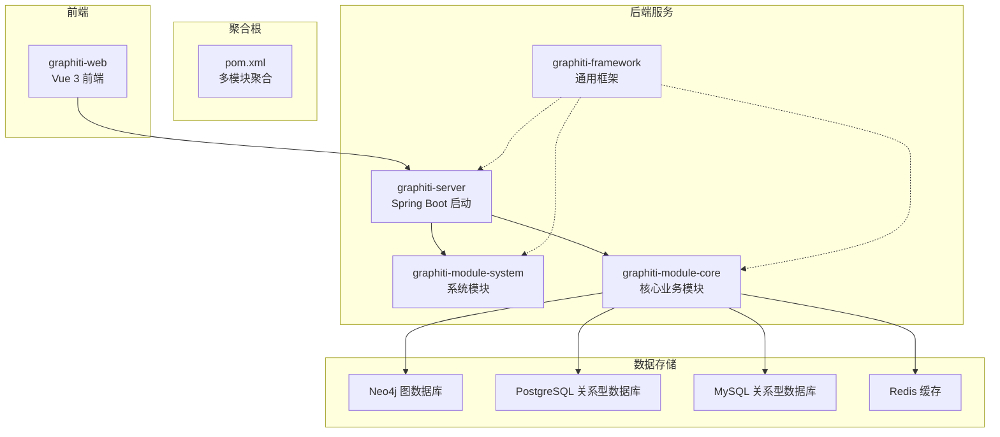
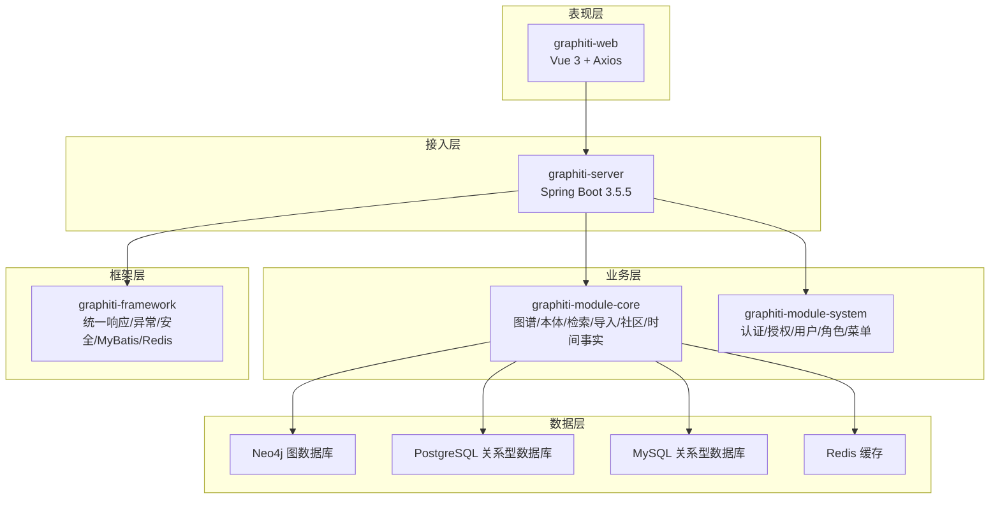
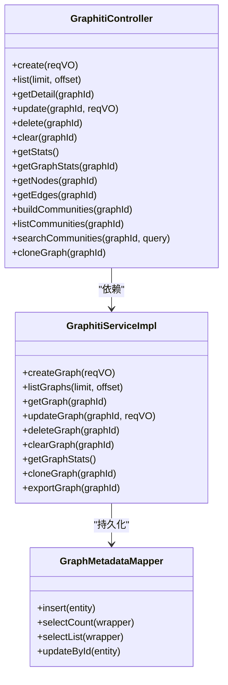
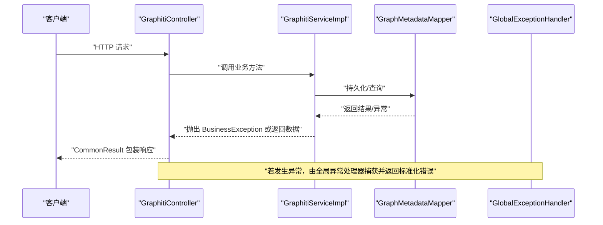
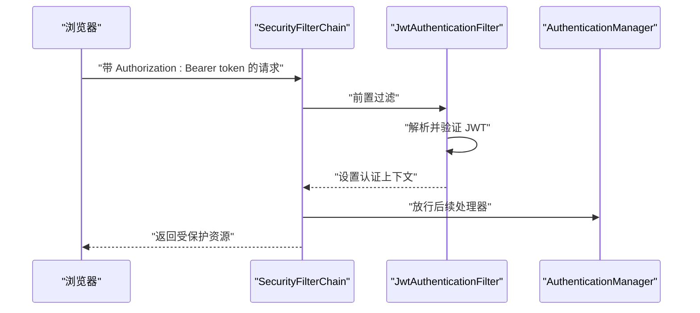
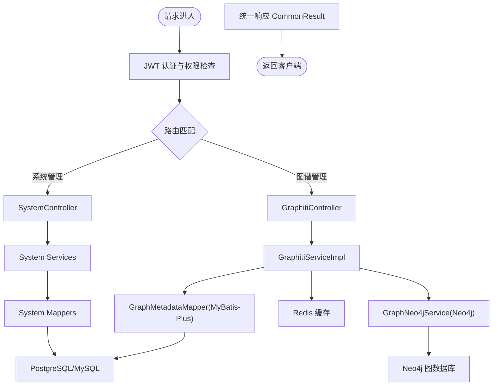
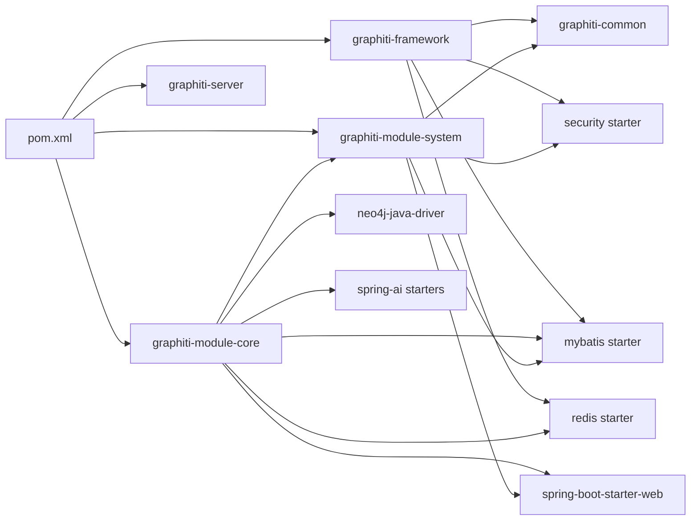

# 架构总览

<cite>
**本文引用的文件**
- [pom.xml](file://pom.xml)
- [README.md](file://README.md)
- [DESIGN.md](file://DESIGN.md)
- [GraphitiApplication.java](file://graphiti-server/src/main/java/com/raphiti/GraphitiApplication.java)
- [graphiti-server/application.yml](file://graphiti-server/src/main/resources/application.yml)
- [graphiti-framework/pom.xml](file://graphiti-framework/pom.xml)
- [graphiti-module-core/pom.xml](file://graphiti-module-core/pom.xml)
- [graphiti-module-system/pom.xml](file://graphiti-module-system/pom.xml)
- [graphiti-common/ResultCode.java](file://graphiti-framework/graphiti-common/src/main/java/com/graphiti/common/constants/ResultCode.java)
- [graphiti-common/CommonResult.java](file://graphiti-framework/graphiti-common/src/main/java/com/graphiti/common/response/CommonResult.java)
- [graphiti-common/GlobalExceptionHandler.java](file://graphiti-framework/graphiti-common/src/main/java/com/graphiti/common/exception/GlobalExceptionHandler.java)
- [graphiti-common/BusinessException.java](file://graphiti-framework/graphiti-common/src/main/java/com/graphiti/common/exception/BusinessException.java)
- [graphiti-security/SecurityConfig.java](file://graphiti-framework/graphiti-spring-boot-starter-security/src/main/java/com/graphiti/framework/security/config/SecurityConfig.java)
- [graphiti-module-core/GraphitiServiceImpl.java](file://graphiti-module-core/src/main/java/com/graphiti/module/graphiti/service/impl/GraphitiServiceImpl.java)
- [graphiti-module-core/GraphitiController.java](file://graphiti-module-core/src/main/java/com/graphiti/module/graphiti/controller/admin/GraphitiController.java)
- [graphiti-module-core/GraphMetadataMapper.java](file://graphiti-module-core/src/main/java/com/graphiti/module/graphiti/dal/mysql/GraphMetadataMapper.java)
</cite>

## 目录
1. [引言](#引言)
2. [项目结构](#项目结构)
3. [核心组件](#核心组件)
4. [架构总览](#架构总览)
5. [详细组件分析](#详细组件分析)
6. [依赖分析](#依赖分析)
7. [性能考虑](#性能考虑)
8. [故障排查指南](#故障排查指南)
9. [结论](#结论)
10. [附录](#附录)

## 引言
本文件为 Graphiti-Java 的架构总览，面向系统架构师、后端工程师与前端工程师，提供从分层架构、模块化设计到数据流与微服务化理念的全景式说明。系统采用多模块 Maven 聚合工程，结合 Spring Boot 3.5.5、MyBatis-Plus、Neo4j Java Driver、Spring AI、Redisson 等技术栈，实现“前端 Vue 3 + 后端 Spring Boot + 图数据库 Neo4j + 关系型数据库 PostgreSQL/MySQL + 缓存 Redis”的完整知识图谱后端服务。

## 项目结构
Graphiti-Java 采用多模块聚合工程组织，核心模块如下：
- graphiti-server：Spring Boot 启动入口与运行容器
- graphiti-framework：框架基础设施层，提供通用组件与 Spring Boot Starter
- graphiti-module-system：系统管理模块（用户、角色、菜单、认证）
- graphiti-module-core：核心业务模块（图谱管理、本体、检索、导入、社区、时间事实等）

图表来源
- [pom.xml:15-20](file://pom.xml#L15-L20)
- [graphiti-server/pom.xml:1-200](file://graphiti-server/pom.xml#L1-L200)
- [graphiti-framework/pom.xml:22-27](file://graphiti-framework/pom.xml#L22-L27)
- [graphiti-module-system/pom.xml:16-35](file://graphiti-module-system/pom.xml#L16-L35)
- [graphiti-module-core/pom.xml:17-45](file://graphiti-module-core/pom.xml#L17-L45)

章节来源
- [pom.xml:15-20](file://pom.xml#L15-L20)
- [README.md:110-166](file://README.md#L110-L166)

## 核心组件
- 统一响应与异常
  - 统一响应体：CommonResult，封装 code、message、data、timestamp
  - 业务错误码：ResultCode，覆盖通用 HTTP 错误与业务错误
  - 全局异常处理：GlobalExceptionHandler，统一拦截业务异常、参数校验异常与未知异常
- 安全与认证
  - 基于 Spring Security + JWT 的无状态认证，SecurityConfig 配置 CORS、未认证/权限不足的 JSON 响应
- 业务服务
  - GraphitiServiceImpl：图谱生命周期管理（创建、查询、更新、删除、克隆、导出、统计）
  - GraphitiController：REST 控制器，暴露图谱管理 API，并委派至各 Service
- 数据访问
  - GraphMetadataMapper：基于 MyBatis-Plus 的图谱元数据持久化接口

章节来源
- [graphiti-common/CommonResult.java:14-67](file://graphiti-framework/graphiti-common/src/main/java/com/graphiti/common/response/CommonResult.java#L14-L67)
- [graphiti-common/ResultCode.java:7-22](file://graphiti-framework/graphiti-common/src/main/java/com/graphiti/common/constants/ResultCode.java#L7-L22)
- [graphiti-common/GlobalExceptionHandler.java:26-72](file://graphiti-framework/graphiti-common/src/main/java/com/graphiti/common/exception/GlobalExceptionHandler.java#L26-L72)
- [graphiti-common/BusinessException.java:10-32](file://graphiti-framework/graphiti-common/src/main/java/com/graphiti/common/exception/BusinessException.java#L10-L32)
- [graphiti-security/SecurityConfig.java:115-136](file://graphiti-framework/graphiti-spring-boot-starter-security/src/main/java/com/graphiti/framework/security/config/SecurityConfig.java#L115-L136)
- [graphiti-module-core/GraphitiServiceImpl.java:27-184](file://graphiti-module-core/src/main/java/com/graphiti/module/graphiti/service/impl/GraphitiServiceImpl.java#L27-L184)
- [graphiti-module-core/GraphitiController.java:41-200](file://graphiti-module-core/src/main/java/com/graphiti/module/graphiti/controller/admin/GraphitiController.java#L41-L200)
- [graphiti-module-core/GraphMetadataMapper.java:11-14](file://graphiti-module-core/src/main/java/com/graphiti/module/graphiti/dal/mysql/GraphMetadataMapper.java#L11-L14)

## 架构总览
系统采用“表现层-业务层-数据访问层”三层架构，结合模块化设计与微服务化理念：
- 表现层：graphiti-web（Vue 3）通过 REST API 与后端交互
- 业务层：graphiti-module-core 与 graphiti-module-system 提供领域服务与系统服务
- 数据访问层：graphiti-module-core 通过 MyBatis-Plus 访问 PostgreSQL/MySQL，Neo4j Java Driver 访问 Neo4j，Redisson 访问 Redis
- 框架层：graphiti-framework 提供通用组件（统一响应、异常、安全、MyBatis、Redis Starter）

图表来源
- [README.md:71-108](file://README.md#L71-L108)
- [graphiti-server/GraphitiApplication.java:18-34](file://graphiti-server/src/main/java/com/graphiti/GraphitiApplication.java#L18-L34)
- [graphiti-framework/pom.xml:22-27](file://graphiti-framework/pom.xml#L22-L27)
- [graphiti-module-core/pom.xml:17-45](file://graphiti-module-core/pom.xml#L17-L45)
- [graphiti-module-system/pom.xml:16-35](file://graphiti-module-system/pom.xml#L16-L35)

## 详细组件分析

### 组件A：图谱管理服务与控制器
- GraphitiController：提供图谱的创建、列表、详情、更新、删除、清空、统计、节点/边查询、社区构建与搜索、克隆与导出等 API
- GraphitiServiceImpl：实现图谱生命周期管理，事务控制，调用 GraphNeo4jService 进行 Neo4j 数据操作，使用 GraphMetadataMapper 持久化元数据

图表来源
- [graphiti-module-core/GraphitiController.java:41-200](file://graphiti-module-core/src/main/java/com/graphiti/module/graphiti/controller/admin/GraphitiController.java#L41-L200)
- [graphiti-module-core/GraphitiServiceImpl.java:27-184](file://graphiti-module-core/src/main/java/com/graphiti/module/graphiti/service/impl/GraphitiServiceImpl.java#L27-L184)
- [graphiti-module-core/GraphMetadataMapper.java:11-14](file://graphiti-module-core/src/main/java/com/graphiti/module/graphiti/dal/mysql/GraphMetadataMapper.java#L11-L14)

章节来源
- [graphiti-module-core/GraphitiController.java:41-200](file://graphiti-module-core/src/main/java/com/graphiti/module/graphiti/controller/admin/GraphitiController.java#L41-L200)
- [graphiti-module-core/GraphitiServiceImpl.java:27-184](file://graphiti-module-core/src/main/java/com/graphiti/module/graphiti/service/impl/GraphitiServiceImpl.java#L27-L184)
- [graphiti-module-core/GraphMetadataMapper.java:11-14](file://graphiti-module-core/src/main/java/com/graphiti/module/graphiti/dal/mysql/GraphMetadataMapper.java#L11-L14)

### 组件B：统一响应与异常处理流程
- 统一响应：CommonResult 封装成功/错误响应
- 全局异常：GlobalExceptionHandler 统一捕获业务异常、参数校验异常与未知异常，返回标准化错误码与消息
- 业务异常：BusinessException 支持自定义错误码

图表来源
- [graphiti-common/CommonResult.java:39-66](file://graphiti-framework/graphiti-common/src/main/java/com/graphiti/common/response/CommonResult.java#L39-L66)
- [graphiti-common/GlobalExceptionHandler.java:26-72](file://graphiti-framework/graphiti-common/src/main/java/com/graphiti/common/exception/GlobalExceptionHandler.java#L26-L72)
- [graphiti-common/BusinessException.java:20-32](file://graphiti-framework/graphiti-common/src/main/java/com/graphiti/common/exception/BusinessException.java#L20-L32)
- [graphiti-module-core/GraphitiController.java:56-94](file://graphiti-module-core/src/main/java/com/graphiti/module/graphiti/controller/admin/GraphitiController.java#L56-L94)
- [graphiti-module-core/GraphitiServiceImpl.java:32-47](file://graphiti-module-core/src/main/java/com/graphiti/module/graphiti/service/impl/GraphitiServiceImpl.java#L32-L47)

章节来源
- [graphiti-common/CommonResult.java:14-67](file://graphiti-framework/graphiti-common/src/main/java/com/graphiti/common/response/CommonResult.java#L14-L67)
- [graphiti-common/GlobalExceptionHandler.java:17-73](file://graphiti-framework/graphiti-common/src/main/java/com/graphiti/common/exception/GlobalExceptionHandler.java#L17-L73)
- [graphiti-common/BusinessException.java:10-32](file://graphiti-framework/graphiti-common/src/main/java/com/graphiti/common/exception/BusinessException.java#L10-L32)

### 组件C：安全与认证流程
- SecurityConfig：配置无状态会话、CORS、JWT 过滤器、未认证/权限不足的 JSON 响应
- JwtAuthenticationFilter：在用户名密码过滤器之前执行，解析 JWT 并注入认证上下文

图表来源
- [graphiti-security/SecurityConfig.java:115-136](file://graphiti-framework/graphiti-spring-boot-starter-security/src/main/java/com/graphiti/framework/security/config/SecurityConfig.java#L115-L136)

章节来源
- [graphiti-security/SecurityConfig.java:35-136](file://graphiti-framework/graphiti-spring-boot-starter-security/src/main/java/com/graphiti/framework/security/config/SecurityConfig.java#L35-L136)

### 组件D：数据流与模块边界
- 前端 graphiti-web 通过 REST API 调用 graphiti-server
- graphiti-server 作为入口，装配 graphiti-framework 与业务模块
- graphiti-module-core 负责核心业务，访问 Neo4j（图数据）、PostgreSQL/MySQL（元数据与系统数据）、Redis（缓存）
- graphiti-module-system 提供认证与系统管理能力

图表来源
- [graphiti-module-core/GraphitiController.java:41-200](file://graphiti-module-core/src/main/java/com/graphiti/module/graphiti/controller/admin/GraphitiController.java#L41-L200)
- [graphiti-module-core/GraphitiServiceImpl.java:27-184](file://graphiti-module-core/src/main/java/com/graphiti/module/graphiti/service/impl/GraphitiServiceImpl.java#L27-L184)
- [graphiti-module-core/GraphMetadataMapper.java:11-14](file://graphiti-module-core/src/main/java/com/graphiti/module/graphiti/dal/mysql/GraphMetadataMapper.java#L11-L14)
- [graphiti-server/application.yml:25-34](file://graphiti-server/src/main/resources/application.yml#L25-L34)

章节来源
- [graphiti-module-core/GraphitiController.java:41-200](file://graphiti-module-core/src/main/java/com/graphiti/module/graphiti/controller/admin/GraphitiController.java#L41-L200)
- [graphiti-module-core/GraphitiServiceImpl.java:27-184](file://graphiti-module-core/src/main/java/com/graphiti/module/graphiti/service/impl/GraphitiServiceImpl.java#L27-L184)
- [graphiti-module-core/GraphMetadataMapper.java:11-14](file://graphiti-module-core/src/main/java/com/graphiti/module/graphiti/dal/mysql/GraphMetadataMapper.java#L11-L14)
- [graphiti-server/application.yml:25-34](file://graphiti-server/src/main/resources/application.yml#L25-L34)

## 依赖分析
- 聚合与模块依赖
  - 根 POM 聚合 framework、system、core、server 四个模块
  - framework 作为基础设施聚合，包含 graphiti-common、security、mybatis、redis 等 Starter
  - core 依赖 system、web、mybatis、redis、neo4j、spring-ai 等
  - system 依赖 common、security、mybatis、web、postgresql 等
- 启动排除
  - GraphitiApplication 显式排除部分 Spring AI 自动配置，避免不必要的自动装配

图表来源
- [pom.xml:15-20](file://pom.xml#L15-L20)
- [graphiti-framework/pom.xml:22-27](file://graphiti-framework/pom.xml#L22-L27)
- [graphiti-module-core/pom.xml:17-80](file://graphiti-module-core/pom.xml#L17-L80)
- [graphiti-module-system/pom.xml:16-48](file://graphiti-module-system/pom.xml#L16-L48)
- [graphiti-server/GraphitiApplication.java:18-34](file://graphiti-server/src/main/java/com/graphiti/GraphitiApplication.java#L18-L34)

章节来源
- [pom.xml:15-20](file://pom.xml#L15-L20)
- [graphiti-framework/pom.xml:22-27](file://graphiti-framework/pom.xml#L22-L27)
- [graphiti-module-core/pom.xml:17-80](file://graphiti-module-core/pom.xml#L17-L80)
- [graphiti-module-system/pom.xml:16-48](file://graphiti-module-system/pom.xml#L16-L48)
- [graphiti-server/GraphitiApplication.java:18-34](file://graphiti-server/src/main/java/com/graphiti/GraphitiApplication.java#L18-L34)

## 性能考虑
- 无状态认证：Spring Security + JWT 无状态，降低会话开销
- 缓存策略：Redisson 用于热点数据与会话缓存，建议结合 LRU/过期策略
- 数据库连接：MyBatis-Plus 与 Druid Starter 提升连接池效率
- 搜索与向量化：Neo4j 向量索引与 Spring AI 向量嵌入，建议合理设置维度与相似度函数
- 批处理与异步：对于大规模导入与清洗任务，建议引入队列与异步处理

## 故障排查指南
- 统一错误响应
  - 使用 ResultCode 与 CommonResult，便于前端统一处理
- 全局异常
  - 参数校验异常：MethodArgumentNotValidException，返回 400 与字段级提示
  - 缺少参数：MissingServletRequestParameterException，返回 400
  - 业务异常：BusinessException，返回自定义业务错误码与消息
  - 未知异常：统一 500 与“系统内部错误”
- 安全相关
  - 未认证/权限不足：返回 401/403 JSON，确保前端正确引导登录或提示权限不足

章节来源
- [graphiti-common/ResultCode.java:7-22](file://graphiti-framework/graphiti-common/src/main/java/com/graphiti/common/constants/ResultCode.java#L7-L22)
- [graphiti-common/CommonResult.java:39-66](file://graphiti-framework/graphiti-common/src/main/java/com/graphiti/common/response/CommonResult.java#L39-L66)
- [graphiti-common/GlobalExceptionHandler.java:37-72](file://graphiti-framework/graphiti-common/src/main/java/com/graphiti/common/exception/GlobalExceptionHandler.java#L37-L72)
- [graphiti-security/SecurityConfig.java:84-113](file://graphiti-framework/graphiti-spring-boot-starter-security/src/main/java/com/graphiti/framework/security/config/SecurityConfig.java#L84-L113)

## 结论
Graphiti-Java 通过清晰的分层与模块化设计，实现了知识图谱后端服务的高内聚低耦合。统一响应与异常处理保障了前后端交互的一致性；JWT 无状态认证提升了可扩展性；Neo4j、PostgreSQL/MySQL、Redis 的多存储架构满足了复杂业务的数据需求。建议在生产环境中进一步完善缓存策略、异步批处理与可观测性建设，持续演进以支持更大规模的知识图谱场景。

## 附录
- 快速启动与配置参考见 README
- 设计风格与组件规范参考 DESIGN 文档

章节来源
- [README.md:221-312](file://README.md#L221-L312)
- [DESIGN.md:258-549](file://DESIGN.md#L258-L549)