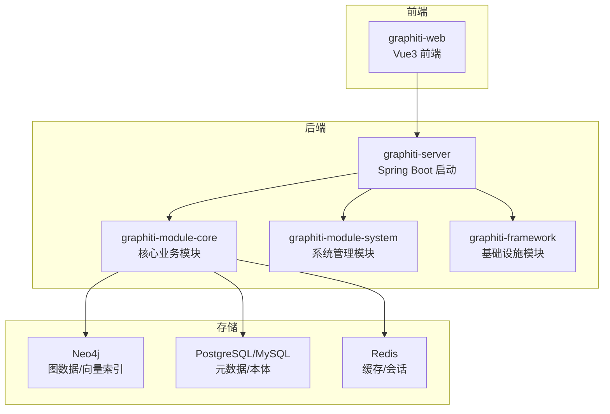
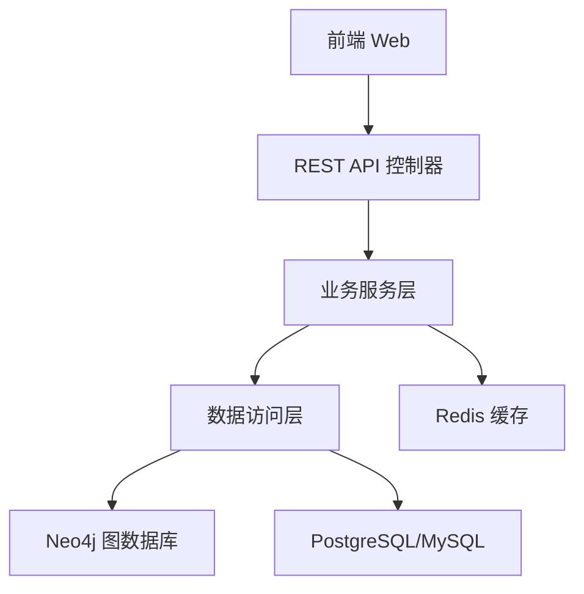
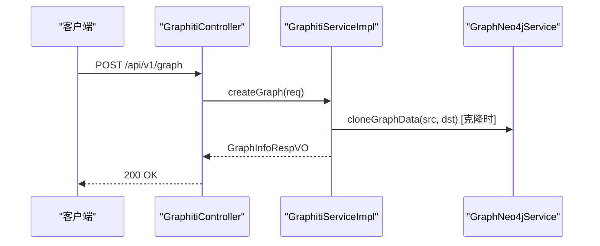
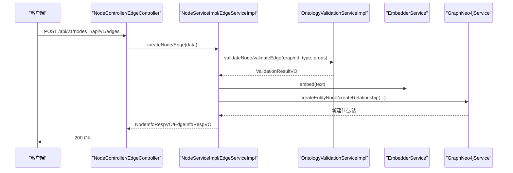
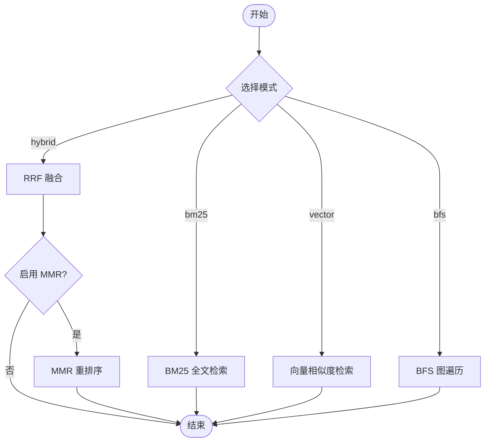
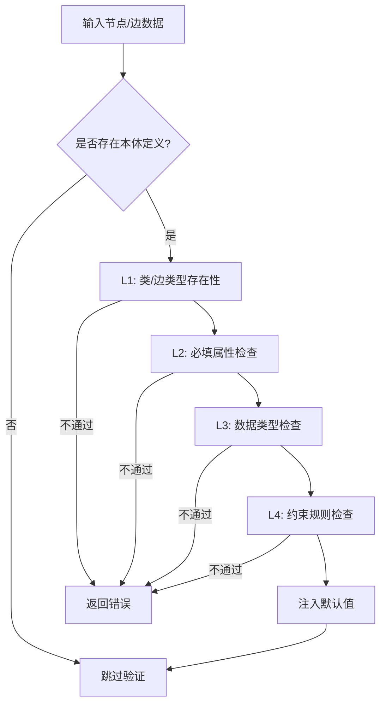
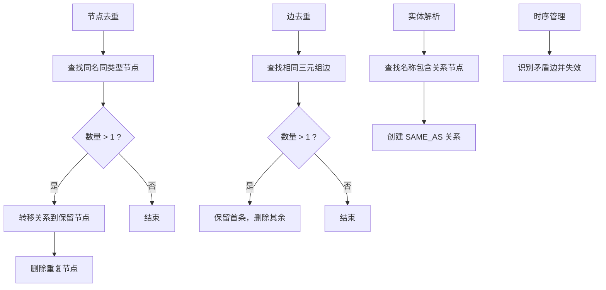
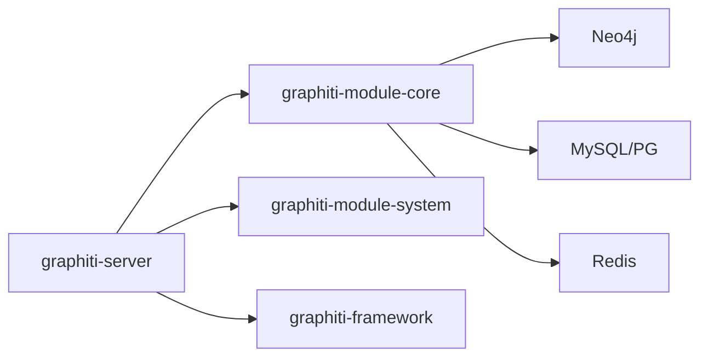

# 核心特性

<!--<cite>
**本文引用的文件**
- [README_CN.md](file://README_CN.md)
- [DESIGN.md](file://DESIGN.md)
- [docs/ontology.md](file://docs/ontology.md)
- [docs/pipeline.md](file://docs/pipeline.md)
- [docs/implementation-summary.md](file://docs/implementation-summary.md)
- [graphiti-module-core/src/main/java/com/graphiti/module/graphiti/service/impl/GraphitiServiceImpl.java](file://graphiti-module-core/src/main/java/com/graphiti/module/graphiti/service/impl/GraphitiServiceImpl.java)
- [graphiti-module-core/src/main/java/com/graphiti/module/graphiti/service/impl/NodeServiceImpl.java](file://graphiti-module-core/src/main/java/com/graphiti/module/graphiti/service/impl/NodeServiceImpl.java)
- [graphiti-module-core/src/main/java/com/graphiti/module/graphiti/service/impl/EdgeServiceImpl.java](file://graphiti-module-core/src/main/java/com/graphiti/module/graphiti/service/impl/EdgeServiceImpl.java)
- [graphiti-module-core/src/main/java/com/graphiti/module/graphiti/service/impl/OntologyValidationServiceImpl.java](file://graphiti-module-core/src/main/java/com/graphiti/module/graphiti/service/impl/OntologyValidationServiceImpl.java)
- [graphiti-module-core/src/main/java/com/graphiti/module/graphiti/service/impl/SearchServiceImpl.java](file://graphiti-module-core/src/main/java/com/graphiti/module/graphiti/service/impl/SearchServiceImpl.java)
- [graphiti-module-core/src/main/java/com/graphiti/module/graphiti/service/impl/DataQualityServiceImpl.java](file://graphiti-module-core/src/main/java/com/graphiti/module/graphiti/service/impl/DataQualityServiceImpl.java)
- [graphiti-module-core/src/main/java/com/graphiti/module/graphiti/service/impl/TemporalServiceImpl.java](file://graphiti-module-core/src/main/java/com/graphiti/module/graphiti/service/impl/TemporalServiceImpl.java)
- [graphiti-module-core/src/main/java/com/graphiti/module/graphiti/util/BinaryTreeSummarizer.java](file://graphiti-module-core/src/main/java/com/graphiti/module/graphiti/util/BinaryTreeSummarizer.java)
- [graphiti-module-core/src/main/java/com/graphiti/module/graphiti/util/MinHashLSH.java](file://graphiti-module-core/src/main/java/com/graphiti/module/graphiti/util/MinHashLSH.java)
- [graphiti-module-core/src/main/java/com/graphiti/module/graphiti/util/UnionFind.java](file://graphiti-module-core/src/main/java/com/graphiti/module/graphiti/util/UnionFind.java)
</cite>-->

## 目录
1. [简介](#简介)
2. [项目结构](#项目结构)
3. [核心组件](#核心组件)
4. [架构总览](#架构总览)
5. [详细组件分析](#详细组件分析)
6. [依赖分析](#依赖分析)
7. [性能考虑](#性能考虑)
8. [故障排查指南](#故障排查指南)
9. [结论](#结论)
10. [附录](#附录)

## 简介
Graphiti-Java 是一个面向 Java 生态的时序知识图谱后端系统，具备“LLM 驱动的数据导入、时序事实管理、混合检索、多厂商 LLM、本体验证、社区发现、数据质量”等核心能力。系统采用双存储架构：Neo4j 作为图数据库存储实体与关系，PostgreSQL/MySQL 存放图谱元数据与本体定义；通过 Spring Boot + Spring AI + Neo4j Java Driver + MyBatis-Plus 构建，提供 REST API 与统一响应格式。

## 项目结构
- 模块划分清晰：framework（公共/安全/Redis/Starter）、module-system（系统管理）、module-core（核心业务）、server（启动入口）、web（前端）
- 核心业务模块 graphiti-module-core 包含控制器、服务、DAO、VO、Prompts 等
- 双存储架构：MySQL/PG 存本体与元数据，Neo4j 存图数据与向量索引

图表来源
- [README_CN.md:71-108](file://README_CN.md#L71-L108)
- [README_CN.md:110-166](file://README_CN.md#L110-L166)

章节来源
- [README_CN.md:19-166](file://README_CN.md#L19-L166)

## 核心组件
- 知识图谱生命周期管理：创建、查询、更新、删除、克隆、导出、统计
- 节点与边管理：CRUD、过滤分页、本体验证、嵌入生成
- 事件（Episode）管理：事件 CRUD、提及查询
- 检索服务：BM25、向量、BFS、RRF 融合、MMR 重排序
- 本体系统：类/属性/约束定义、6 层验证、OWL 推理（预留）
- 数据质量：节点/边去重、实体解析（SAME_AS）、孤立节点处理
- 时序管理：valid_at/invalid_at 时序失效、矛盾边处理
- 社区发现：标签传播 + LLM 摘要（预留）

章节来源
- [README_CN.md:35-68](file://README_CN.md#L35-L68)
- [docs/implementation-summary.md:8-88](file://docs/implementation-summary.md#L8-L88)

## 架构总览
系统采用“双存储 + 多模块”的分层架构：
- 展示层：Vue3 前端通过 API 调用后端
- 服务层：Spring Boot + Spring Security/JWT + MyBatis-Plus
- 数据层：Neo4j（图数据/向量索引）、PostgreSQL/MySQL（元数据/本体）、Redis（缓存）
- AI 能力：Spring AI 集成 OpenAI/Anthropic/Qwen/Ollama 等 LLM 与嵌入模型

图表来源
- [README_CN.md:71-108](file://README_CN.md#L71-L108)
- [docs/ontology.md:3-22](file://docs/ontology.md#L3-L22)

章节来源
- [README_CN.md:71-108](file://README_CN.md#L71-L108)
- [docs/ontology.md:3-22](file://docs/ontology.md#L3-L22)

## 详细组件分析

### 知识图谱生命周期管理
- 功能要点
  - 创建/查询/更新/删除图谱元数据
  - 克隆：复制 group_id 下的节点/边到新图谱
  - 导出：返回图谱元数据 + Neo4j 节点/边/事件
  - 统计：聚合节点/边/事件总数
- 实现方式
  - GraphitiServiceImpl 负责图谱 CRUD、克隆、导出、统计
  - 与 GraphNeo4jService 协作进行 Neo4j 数据操作
- 业务价值
  - 快速建立/复制/迁移知识图谱，支撑多租户隔离与备份

图表来源
- [graphiti-module-core/src/main/java/com/graphiti/module/graphiti/service/impl/GraphitiServiceImpl.java:30-184](file://graphiti-module-core/src/main/java/com/graphiti/module/graphiti/service/impl/GraphitiServiceImpl.java#L30-L184)

章节来源
- [graphiti-module-core/src/main/java/com/graphiti/module/graphiti/service/impl/GraphitiServiceImpl.java:30-256](file://graphiti-module-core/src/main/java/com/graphiti/module/graphiti/service/impl/GraphitiServiceImpl.java#L30-L256)

### 节点与边管理（含本体验证）
- 功能要点
  - 节点/边 CRUD、分页过滤
  - 本体验证：类型存在性、必填属性、数据类型、约束规则（L1-L4）
  - 嵌入生成：基于 name/summary 或 fact 文本生成向量
- 实现方式
  - NodeServiceImpl/EdgeServiceImpl 调用 OntologyValidationServiceImpl 进行验证
  - 通过 EmbedderService 生成向量，再写入 Neo4j
- 业务价值
  - 保证图谱数据一致性与质量，支持后续检索与推理

图表来源
- [graphiti-module-core/src/main/java/com/graphiti/module/graphiti/service/impl/NodeServiceImpl.java:58-111](file://graphiti-module-core/src/main/java/com/graphiti/module/graphiti/service/impl/NodeServiceImpl.java#L58-L111)
- [graphiti-module-core/src/main/java/com/graphiti/module/graphiti/service/impl/EdgeServiceImpl.java:60-102](file://graphiti-module-core/src/main/java/com/graphiti/module/graphiti/service/impl/EdgeServiceImpl.java#L60-L102)
- [graphiti-module-core/src/main/java/com/graphiti/module/graphiti/service/impl/OntologyValidationServiceImpl.java:39-87](file://graphiti-module-core/src/main/java/com/graphiti/module/graphiti/service/impl/OntologyValidationServiceImpl.java#L39-L87)

章节来源
- [graphiti-module-core/src/main/java/com/graphiti/module/graphiti/service/impl/NodeServiceImpl.java:58-214](file://graphiti-module-core/src/main/java/com/graphiti/module/graphiti/service/impl/NodeServiceImpl.java#L58-L214)
- [graphiti-module-core/src/main/java/com/graphiti/module/graphiti/service/impl/EdgeServiceImpl.java:60-172](file://graphiti-module-core/src/main/java/com/graphiti/module/graphiti/service/impl/EdgeServiceImpl.java#L60-L172)
- [graphiti-module-core/src/main/java/com/graphiti/module/graphiti/service/impl/OntologyValidationServiceImpl.java:39-345](file://graphiti-module-core/src/main/java/com/graphiti/module/graphiti/service/impl/OntologyValidationServiceImpl.java#L39-L345)

### 事件（Episode）管理
- 功能要点
  - 事件 CRUD、查询事件提及的节点/边
  - 事件作为原始数据容器，承载来源、内容、时间戳等
- 实现方式
  - 事件数据写入 Neo4j Episode 节点，与实体节点通过 MENTIONS 关系关联
- 业务价值
  - 支撑时序事实追踪与溯源，为检索与推理提供上下文

章节来源
- [docs/ontology.md:312-356](file://docs/ontology.md#L312-L356)

### 检索服务（混合检索：BM25 + 向量 + BFS + RRF + MMR）
- 功能要点
  - 多模式检索：bm25、vector、hybrid（BM25+向量）、bfs
  - 结果融合：RRF（Reciprocal Rank Fusion）
  - 结果重排序：MMR（Maximal Marginal Relevance）
  - 上下文记忆：基于最近消息生成检索上下文
- 实现方式
  - SearchServiceImpl 统一封装检索流程，调用 GraphNeo4jService 执行全文/向量/BFS 查询
  - RerankingUtils 提供 MMR 重排序工具
- 业务价值
  - 提升检索准确性与多样性，满足复杂查询场景

图表来源
- [graphiti-module-core/src/main/java/com/graphiti/module/graphiti/service/impl/SearchServiceImpl.java:94-148](file://graphiti-module-core/src/main/java/com/graphiti/module/graphiti/service/impl/SearchServiceImpl.java#L94-L148)
- [graphiti-module-core/src/main/java/com/graphiti/module/graphiti/service/impl/SearchServiceImpl.java:227-308](file://graphiti-module-core/src/main/java/com/graphiti/module/graphiti/service/impl/SearchServiceImpl.java#L227-L308)

章节来源
- [graphiti-module-core/src/main/java/com/graphiti/module/graphiti/service/impl/SearchServiceImpl.java:26-520](file://graphiti-module-core/src/main/java/com/graphiti/module/graphiti/service/impl/SearchServiceImpl.java#L26-L520)

### 本体系统（类/属性/约束 + 6 层验证）
- 功能要点
  - 本体定义：类、属性、约束（基数、枚举、正则、数值范围、非空）
  - 6 层验证：类型存在性、必填属性、数据类型、约束、默认值注入、边类型兼容
  - OWL 推理（预留）：类继承、子类/父类推断
- 实现方式
  - OntologyValidationServiceImpl 实现 L1-L4 验证，支持批量校验与默认值注入
  - 本体数据模型与关系映射见 docs/ontology.md
- 业务价值
  - 强约束保障数据质量，降低脏数据风险

图表来源
- [graphiti-module-core/src/main/java/com/graphiti/module/graphiti/service/impl/OntologyValidationServiceImpl.java:39-158](file://graphiti-module-core/src/main/java/com/graphiti/module/graphiti/service/impl/OntologyValidationServiceImpl.java#L39-L158)

章节来源
- [graphiti-module-core/src/main/java/com/graphiti/module/graphiti/service/impl/OntologyValidationServiceImpl.java:39-345](file://graphiti-module-core/src/main/java/com/graphiti/module/graphiti/service/impl/OntologyValidationServiceImpl.java#L39-L345)
- [docs/ontology.md:26-138](file://docs/ontology.md#L26-L138)

### 数据质量（去重、实体解析、时序管理）
- 节点去重
  - 同名同类型节点合并，关系转移至保留节点，删除重复节点
- 边去重
  - 相同源/目标/类型的重复边合并为一条
- 实体解析
  - 基于名称包含关系标记 SAME_AS 关系
- 孤立节点处理
  - 删除或添加自环标记
- 时序管理
  - 通过 valid_at/invalid_at 管理事实有效性
  - 矛盾边识别与失效

图表来源
- [graphiti-module-core/src/main/java/com/graphiti/module/graphiti/service/impl/DataQualityServiceImpl.java:27-125](file://graphiti-module-core/src/main/java/com/graphiti/module/graphiti/service/impl/DataQualityServiceImpl.java#L27-L125)
- [graphiti-module-core/src/main/java/com/graphiti/module/graphiti/service/impl/TemporalServiceImpl.java:44-107](file://graphiti-module-core/src/main/java/com/graphiti/module/graphiti/service/impl/TemporalServiceImpl.java#L44-L107)

章节来源
- [graphiti-module-core/src/main/java/com/graphiti/module/graphiti/service/impl/DataQualityServiceImpl.java:27-219](file://graphiti-module-core/src/main/java/com/graphiti/module/graphiti/service/impl/DataQualityServiceImpl.java#L27-L219)
- [graphiti-module-core/src/main/java/com/graphiti/module/graphiti/service/impl/TemporalServiceImpl.java:27-160](file://graphiti-module-core/src/main/java/com/graphiti/module/graphiti/service/impl/TemporalServiceImpl.java#L27-L160)

### 社区发现（标签传播 + LLM 摘要）
- 功能要点
  - 标签传播算法（Label Propagation）进行社区检测
  - 二叉树合并策略生成社区摘要，支持带上下文合并
- 实现方式
  - BinaryTreeSummarizer 负责摘要合并与社区名称生成
  - MinHashLSH 与 UnionFind 用于候选匹配与 UUID 规范映射（工具类）
- 业务价值
  - 自动发现高内聚低耦合的实体群组，生成可读摘要

章节来源
- [graphiti-module-core/src/main/java/com/graphiti/module/graphiti/util/BinaryTreeSummarizer.java:52-141](file://graphiti-module-core/src/main/java/com/graphiti/module/graphiti/util/BinaryTreeSummarizer.java#L52-L141)
- [graphiti-module-core/src/main/java/com/graphiti/module/graphiti/util/MinHashLSH.java:48-94](file://graphiti-module-core/src/main/java/com/graphiti/module/graphiti/util/MinHashLSH.java#L48-L94)
- [graphiti-module-core/src/main/java/com/graphiti/module/graphiti/util/UnionFind.java:20-113](file://graphiti-module-core/src/main/java/com/graphiti/module/graphiti/util/UnionFind.java#L20-L113)

## 依赖分析
- 模块间依赖
  - graphiti-module-core 依赖 graphiti-framework（公共/安全/Redis/Starter）
  - graphiti-module-system 与 graphiti-module-core 独立，通过 API 协作
  - graphiti-server 作为启动模块，聚合其他模块
- 外部依赖
  - Neo4j Java Driver、MyBatis-Plus、Spring AI、Redisson、Spring Security/JWT
- 数据依赖
  - MySQL/PG 存本体与元数据，Neo4j 存图数据与向量索引

图表来源
- [README_CN.md:110-166](file://README_CN.md#L110-L166)

章节来源
- [README_CN.md:170-218](file://README_CN.md#L170-L218)

## 性能考虑
- 检索性能
  - 向量索引：Neo4j 向量索引 + RRF 融合 + MMR 重排序
  - 全文索引：BM25 全文检索
  - BFS 扩展：以向量种子节点为基础，限制深度与邻居数
- 去重性能
  - MinHash LSH 用于候选集筛选，降低全量相似度计算成本
  - 并查集 Union-Find 用于 UUID 规范映射与分组
- 并发与吞吐
  - LLM 摘要合并采用固定线程池并发，避免阻塞
- 存储与索引
  - Neo4j 索引：向量索引、全文索引、复合索引
  - Redis 缓存热点数据与会话

[本节为通用指导，无需特定文件引用]

## 故障排查指南
- 常见问题
  - 本体验证失败：检查类/属性/约束定义是否正确
  - 向量检索无结果：确认嵌入模型可用、向量索引已创建
  - 检索结果重复：检查 RRF 融合与 MMR 参数
  - 去重未生效：确认节点/边命名与类型是否一致
- 定位手段
  - 查看统一异常与响应封装
  - 检查日志输出与事务回滚
  - 核对 Neo4j 索引与数据一致性

章节来源
- [graphiti-module-core/src/main/java/com/graphiti/module/graphiti/service/impl/OntologyValidationServiceImpl.java:39-158](file://graphiti-module-core/src/main/java/com/graphiti/module/graphiti/service/impl/OntologyValidationServiceImpl.java#L39-L158)
- [graphiti-module-core/src/main/java/com/graphiti/module/graphiti/service/impl/SearchServiceImpl.java:94-148](file://graphiti-module-core/src/main/java/com/graphiti/module/graphiti/service/impl/SearchServiceImpl.java#L94-L148)
- [docs/implementation-summary.md:66-88](file://docs/implementation-summary.md#L66-L88)

## 结论
Graphiti-Java 通过“双存储 + 多模块 + AI 集成”的架构，实现了从数据导入、本体验证、检索融合到时序管理与数据质量治理的完整闭环。当前基础框架已完成，高级功能（如 LLM 实体/关系抽取、向量检索、社区发现等）正在逐步完善。开发者可基于现有服务与工具类快速扩展，满足企业级知识图谱建设需求。

[本节为总结性内容，无需特定文件引用]

## 附录

### 功能状态与实现程度（摘要）
- 知识图谱核心
  - 图谱生命周期：✅ 完成
  - 节点管理：✅ 完成
  - 边管理：✅ 完成
  - 事件管理：✅ 完成
  - 本体系统：✅ 完成（验证引擎）
- AI 与检索
  - LLM 实体/关系抽取：⚠️ 待实现（TODO）
  - 向量检索：⚠️ 待实现（TODO）
  - 混合检索：⚠️ 待实现（TODO）
  - MMR 重排序：⚠️ 待实现（TODO）
  - 社区发现：⚠️ 待实现（TODO）
- 数据质量与时序
  - 时序管理：⚠️ 待实现（TODO）
  - Saga 管理：⚠️ 待实现（TODO）
  - 节点去重：✅ 完成
  - 边去重：✅ 完成
  - 实体解析：✅ 完成

章节来源
- [README_CN.md:35-68](file://README_CN.md#L35-L68)
- [docs/implementation-summary.md:66-88](file://docs/implementation-summary.md#L66-L88)