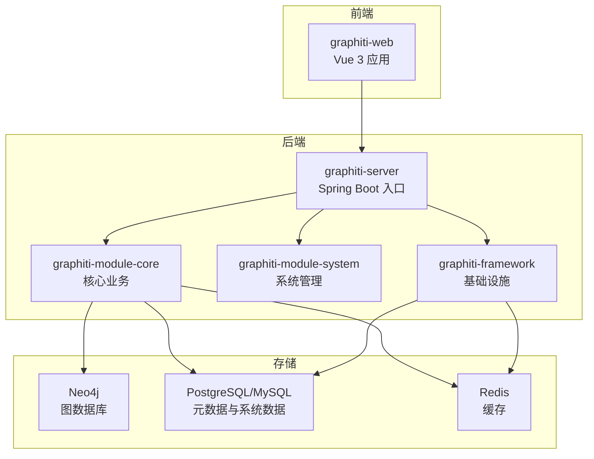
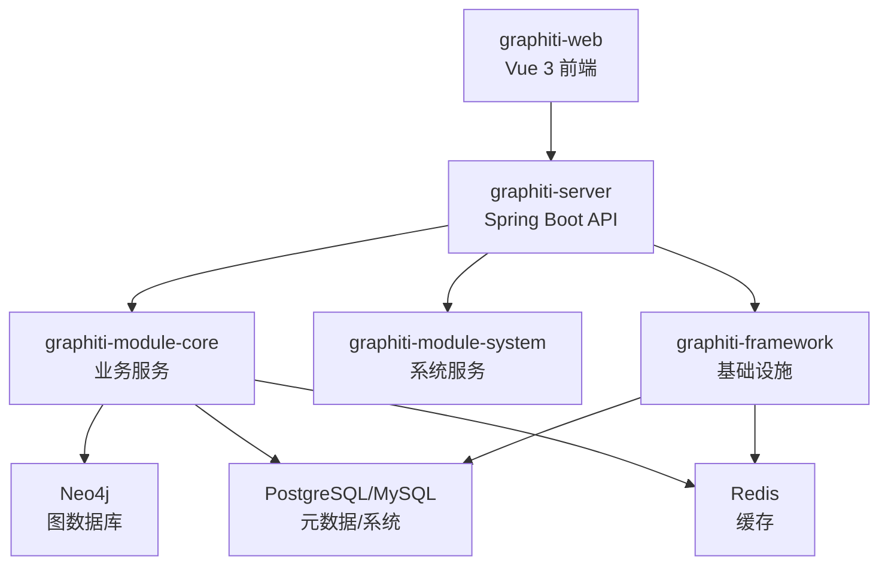
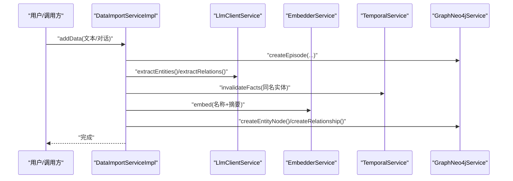
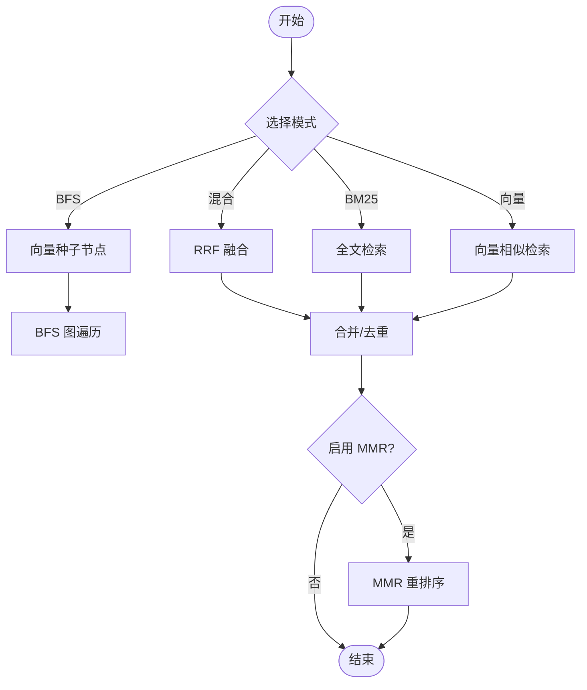
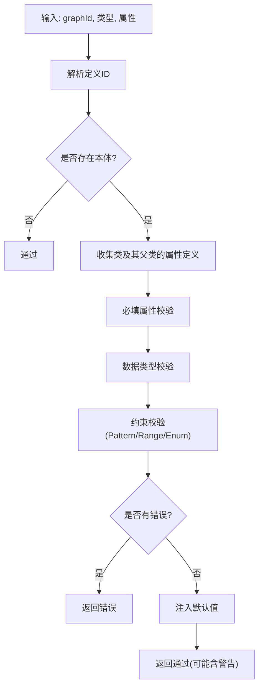
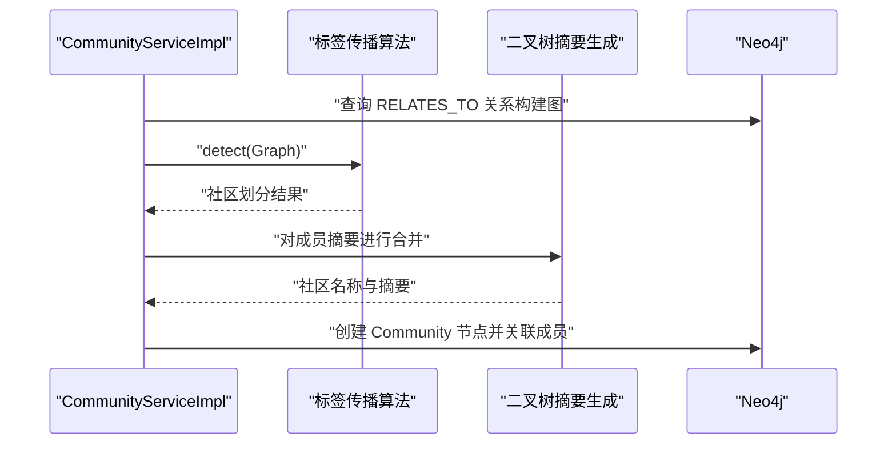
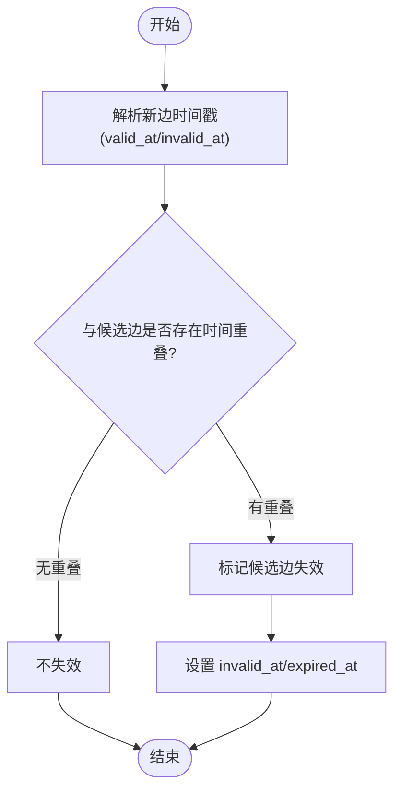
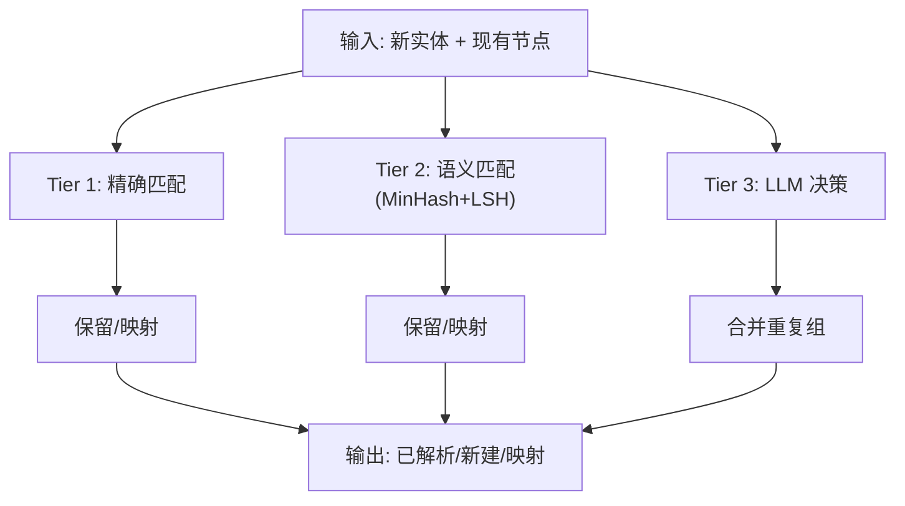
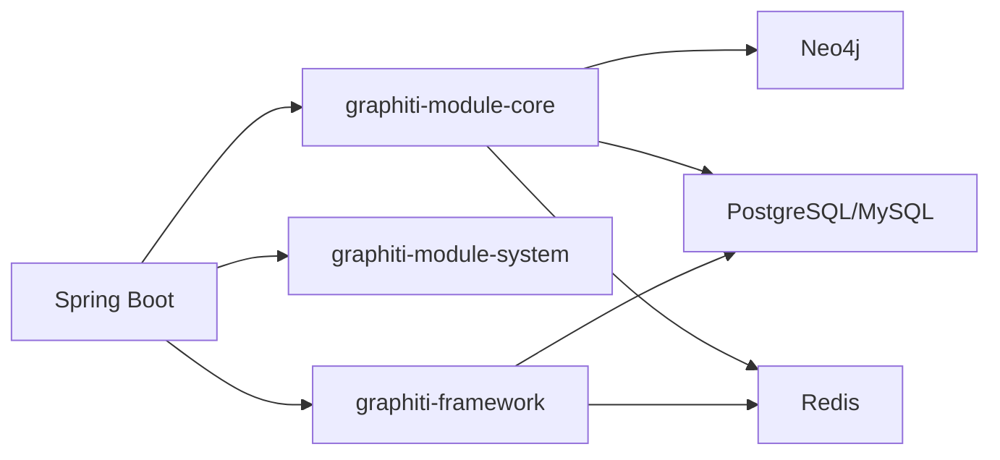

# 项目介绍

<!--<cite>
**本文引用的文件**   
- [README.md](file://README.md)
- [README_CN.md](file://README_CN.md)
- [pom.xml](file://pom.xml)
- [DESIGN.md](file://DESIGN.md)
- [DataImportServiceImpl.java](file://graphiti-module-core/src/main/java/com/graphiti/module/graphiti/service/impl/DataImportServiceImpl.java)
- [SearchServiceImpl.java](file://graphiti-module-core/src/main/java/com/graphiti/module/graphiti/service/impl/SearchServiceImpl.java)
- [OntologyValidationServiceImpl.java](file://graphiti-module-core/src/main/java/com/graphiti/module/graphiti/service/impl/OntologyValidationServiceImpl.java)
- [CommunityServiceImpl.java](file://graphiti-module-core/src/main/java/com/graphiti/module/graphiti/service/impl/CommunityServiceImpl.java)
- [TemporalServiceImpl.java](file://graphiti-module-core/src/main/java/com/graphiti/module/graphiti/service/impl/TemporalServiceImpl.java)
- [EntityDedupServiceImpl.java](file://graphiti-module-core/src/main/java/com/graphiti/module/graphiti/service/impl/EntityDedupServiceImpl.java)
- [OpenAiLlmClientServiceImpl.java](file://graphiti-module-core/src/main/java/com/graphiti/module/graphiti/service/impl/ai/OpenAiLlmClientServiceImpl.java)
- [QwenEmbedderServiceImpl.java](file://graphiti-module-core/src/main/java/com/graphiti/module/graphiti/service/impl/ai/QwenEmbedderServiceImpl.java)
- [system_prompt.txt](file://graphiti-module-core/src/main/resources/prompts/system_prompt.txt)
- [三国人物关系图谱示例.json](file://graphiti-web/三国人物关系图谱示例.json)
- [法律知识图谱示例.json](file://graphiti-web/法律知识图谱示例.json)
</cite>-->

## 目录
1. [简介](#简介)
2. [项目结构](#项目结构)
3. [核心组件](#核心组件)
4. [架构总览](#架构总览)
5. [详细组件分析](#详细组件分析)
6. [依赖分析](#依赖分析)
7. [性能考虑](#性能考虑)
8. [故障排查指南](#故障排查指南)
9. [结论](#结论)
10. [附录](#附录)

## 简介
Graphiti-Java 是一个面向 Java 生态的“时序知识图谱后端系统”，专注于将时序推理、LLM 驱动的实体关系抽取、混合检索与本体治理能力整合到统一平台。它通过 Neo4j 存储图结构与向量索引，结合 PostgreSQL/MySQL 管理元数据与系统数据，提供从“数据导入—抽取—验证—检索—治理”的完整闭环。

- 核心价值与定位
  - 以“时序”为核心：通过 valid_at/invalid_at 精准刻画事实随时间演化的有效性，自动失效过时事实，支持“某时刻有效”的查询与回溯。
  - 以“LLM”为引擎：内置多厂商 LLM 客户端与嵌入服务，统一抽取实体、关系与摘要，降低人工标注成本。
  - 以“混合检索”为体验：融合 BM25 全文、向量相似与 BFS 图遍历，采用 RRF 融合与 MMR 重排序，兼顾召回与多样性。
  - 以“本体治理”为边界：提供 6 层本体验证（类型存在性、必填属性、数据类型、约束、默认值注入、警告提示），保障数据质量与一致性。
  - 以“社区发现”为洞察：基于标签传播与二叉树摘要生成，自动构建社区节点，提升可解释性与可探索性。

- 解决的关键业务问题
  - 非结构化文本到结构化知识的自动化：减少人工抽取成本，提高入库效率与一致性。
  - 多源异构数据的融合与清洗：通过去重、实体解析、时序失效机制，避免“历史噪声”污染当前视图。
  - 复杂查询与上下文检索：在大规模图中实现“既快又准”的混合检索，满足问答、推荐、审计等场景。
  - 知识演化与合规治理：通过时序与本体约束，确保知识随时间演进的可追溯与可验证。

- 主要目标用户群体
  - 数据科学家与 NLP 工程师：构建知识抽取流水线、训练与评估嵌入模型、调优检索策略。
  - 知识图谱工程师：设计与维护本体、进行图谱治理、实现社区与摘要工程。
  - 企业开发者：集成 LLM 与检索能力到业务系统，提供智能问答、推荐与风控决策支持。
  - 产品经理与分析师：通过可视化与检索接口，探索业务知识、发现隐含关系与趋势。

- 与传统知识图谱方案的差异化优势
  - LLM 集成深度：不仅支持抽取，还支持结构化对话抽取、批量消息聚合、事实三元组导入等。
  - 时序管理原生：无需额外设计时间维度，系统自动处理事实失效与版本回溯。
  - 混合检索成熟：BM25 + 向量 + BFS 的组合与 RRF/MRR 融合/重排序，兼顾召回与多样性。
  - 本体验证体系：6 层验证覆盖从“类型/属性/约束”到“默认值/警告”的全流程治理。
  - 社区发现与摘要：标签传播 + LLM 摘要，自动形成高阶知识单元，便于管理与展示。

- 发展历程、版本演进与未来规划
  - 当前处于快速迭代阶段，文档与计划中包含“图谱控制台设计”“本体增强设计”“后端 API 实现设计”“迁移与对齐计划”等，表明项目正逐步完善前端体验、强化本体能力与统一后端接口。
  - 从 Python 版本的 Graphiti 得到启发，Java 版本在模块化、框架化与企业级集成方面持续演进，目标是成为可落地、可扩展、可治理的生产级时序知识图谱平台。

- 使用场景案例
  - 三国人物关系图谱：从历史文本中抽取人物、政权、事件、策略与地点，构建跨维度关系网络，支持“某时刻有效”的查询与回溯。
  - 法律知识图谱：抽取法律条文、罪名、刑罚、权利、原则、概念、机构与案例，形成“法律—罪名—刑罚—权利—原则”的多层映射，支撑法律检索与合规检查。

**章节来源**
- [README_CN.md:19-68](file://README_CN.md#L19-L68)
- [README.md:19-68](file://README.md#L19-L68)

## 项目结构
Graphiti-Java 采用多模块分层架构，核心模块包括：
- graphiti-server：Spring Boot 启动入口，承载 API 与配置。
- graphiti-module-core：核心业务模块，包含知识图谱 CRUD、导入/抽取、检索、本体验证、社区发现、时序管理、数据质量等。
- graphiti-module-system：系统管理模块，提供用户/角色/菜单/认证等基础能力。
- graphiti-framework：框架基础设施，封装通用组件（MyBatis、Redis、安全等）。
- graphiti-web：前端（Vue 3），提供可视化界面与交互。

**图表来源**
- [README_CN.md:112-166](file://README_CN.md#L112-L166)
- [README.md:112-166](file://README.md#L112-L166)

**章节来源**
- [pom.xml:15-20](file://pom.xml#L15-L20)
- [README_CN.md:112-166](file://README_CN.md#L112-L166)
- [README.md:112-166](file://README.md#L112-L166)

## 核心组件
- 数据导入与抽取（DataImportService）
  - 自动创建 Episode 节点，调用 LLM 抽取实体与关系，生成嵌入向量，写入 Neo4j。
  - 支持批量导入、消息对话聚合、事实三元组导入与节点删除等。
- 混合检索（SearchService）
  - 支持 BM25、向量、BFS 三种模式，RRF 融合与 MMR 重排序，提供“获取记忆”用于对话上下文。
- 本体验证（OntologyValidationService）
  - 6 层验证：类型存在性、必填属性、数据类型、约束、默认值注入、警告提示，支持批量校验。
- 社区发现（CommunityService）
  - 标签传播 + 二叉树摘要生成，自动构建社区节点并关联成员。
- 时序管理（TemporalService）
  - 通过 valid_at/invalid_at 管理事实有效性，解决边的时间冲突，支持历史版本查询。
- 数据质量（EntityDedupService）
  - 三层去重：精确匹配、语义匹配（MinHash+LSH）、LLM 决策，结合向量相似度与规范化处理。
- LLM 与嵌入（OpenAiLlmClientServiceImpl、QwenEmbedderServiceImpl）
  - 统一 LLM 客户端接口，支持多厂商接入与私有化部署；嵌入服务支持批量与维度查询。

**章节来源**
- [DataImportServiceImpl.java:35-109](file://graphiti-module-core/src/main/java/com/graphiti/module/graphiti/service/impl/DataImportServiceImpl.java#L35-L109)
- [SearchServiceImpl.java:94-148](file://graphiti-module-core/src/main/java/com/graphiti/module/graphiti/service/impl/SearchServiceImpl.java#L94-L148)
- [OntologyValidationServiceImpl.java:39-87](file://graphiti-module-core/src/main/java/com/graphiti/module/graphiti/service/impl/OntologyValidationServiceImpl.java#L39-L87)
- [CommunityServiceImpl.java:42-61](file://graphiti-module-core/src/main/java/com/graphiti/module/graphiti/service/impl/CommunityServiceImpl.java#L42-L61)
- [TemporalServiceImpl.java:27-41](file://graphiti-module-core/src/main/java/com/graphiti/module/graphiti/service/impl/TemporalServiceImpl.java#L27-L41)
- [EntityDedupServiceImpl.java:54-172](file://graphiti-module-core/src/main/java/com/graphiti/module/graphiti/service/impl/EntityDedupServiceImpl.java#L54-L172)
- [OpenAiLlmClientServiceImpl.java:36-110](file://graphiti-module-core/src/main/java/com/graphiti/module/graphiti/service/impl/ai/OpenAiLlmClientServiceImpl.java#L36-L110)
- [QwenEmbedderServiceImpl.java:24-65](file://graphiti-module-core/src/main/java/com/graphiti/module/graphiti/service/impl/ai/QwenEmbedderServiceImpl.java#L24-L65)

## 架构总览
系统采用“前后端分离 + 多存储”的架构：前端通过 REST API 与后端交互；后端以 Spring Boot 为核心，核心业务在 graphiti-module-core 中实现，Neo4j 负责图存储与向量索引，PostgreSQL/MySQL 负责元数据与系统数据，Redis 负责缓存与会话。

**图表来源**
- [README_CN.md:71-108](file://README_CN.md#L71-L108)
- [README.md:71-108](file://README.md#L71-L108)

**章节来源**
- [README_CN.md:71-108](file://README_CN.md#L71-L108)
- [README.md:71-108](file://README.md#L71-L108)

## 详细组件分析

### 数据导入与抽取流程
- 流程要点
  - 创建 Episode 节点记录来源与内容。
  - LLM 抽取实体与关系，生成摘要与属性。
  - 生成嵌入向量，写入 Neo4j 节点与关系。
  - 时序管理：同名实体在新事实出现时自动失效旧事实。
  - 本体验证：若启用本体，对节点属性进行 6 层验证与默认值注入。
- 关键接口
  - addData、addDataBatch、addMessages、addFactTriple、addEntityNode、deleteEntityEdge、deleteGroup、deleteEpisode。

**图表来源**
- [DataImportServiceImpl.java:35-109](file://graphiti-module-core/src/main/java/com/graphiti/module/graphiti/service/impl/DataImportServiceImpl.java#L35-L109)

**章节来源**
- [DataImportServiceImpl.java:35-109](file://graphiti-module-core/src/main/java/com/graphiti/module/graphiti/service/impl/DataImportServiceImpl.java#L35-L109)

### 混合检索与重排序
- 检索模式
  - BM25：基于全文索引的关键词检索。
  - 向量：基于嵌入相似度的语义检索。
  - BFS：以向量种子节点为基础的图遍历。
  - 混合：RRF 融合两种或多种结果。
- 重排序
  - MMR：最大化边际相关性，提升结果多样性。
  - 节点距离重排序：按与中心节点的图距离排序。
  - 提及次数重排序：按事实在 Episode 中的提及次数排序。

**图表来源**
- [SearchServiceImpl.java:94-148](file://graphiti-module-core/src/main/java/com/graphiti/module/graphiti/service/impl/SearchServiceImpl.java#L94-L148)
- [SearchServiceImpl.java:227-284](file://graphiti-module-core/src/main/java/com/graphiti/module/graphiti/service/impl/SearchServiceImpl.java#L227-L284)
- [SearchServiceImpl.java:288-308](file://graphiti-module-core/src/main/java/com/graphiti/module/graphiti/service/impl/SearchServiceImpl.java#L288-L308)

**章节来源**
- [SearchServiceImpl.java:94-148](file://graphiti-module-core/src/main/java/com/graphiti/module/graphiti/service/impl/SearchServiceImpl.java#L94-L148)
- [SearchServiceImpl.java:227-308](file://graphiti-module-core/src/main/java/com/graphiti/module/graphiti/service/impl/SearchServiceImpl.java#L227-L308)

### 本体验证与默认值注入
- 验证层级
  - 类型存在性：节点类型必须在本体中定义。
  - 必填属性：缺失必填属性则报错。
  - 数据类型：属性值需符合范围数据类型。
  - 约束：支持 Pattern、Range、Enum 等约束。
  - 默认值注入：未提供的属性按默认值注入。
  - 警告提示：边类型未定义等可接受但给出警告。
- 批量校验：支持节点与边的批量验证，输出统计结果。

**图表来源**
- [OntologyValidationServiceImpl.java:39-87](file://graphiti-module-core/src/main/java/com/graphiti/module/graphiti/service/impl/OntologyValidationServiceImpl.java#L39-L87)
- [OntologyValidationServiceImpl.java:256-322](file://graphiti-module-core/src/main/java/com/graphiti/module/graphiti/service/impl/OntologyValidationServiceImpl.java#L256-L322)

**章节来源**
- [OntologyValidationServiceImpl.java:39-87](file://graphiti-module-core/src/main/java/com/graphiti/module/graphiti/service/impl/OntologyValidationServiceImpl.java#L39-L87)
- [OntologyValidationServiceImpl.java:256-322](file://graphiti-module-core/src/main/java/com/graphiti/module/graphiti/service/impl/OntologyValidationServiceImpl.java#L256-L322)

### 社区发现与摘要生成
- 算法流程
  - 加权标签传播：构建实体间关系图，传播标签形成社区。
  - 二叉树合并摘要：对社区成员摘要进行递归合并，生成社区名称与摘要。
  - 并发构建：限制最大并发，保证大规模社区的稳定性。
- 输出：创建 Community 节点并建立 HAS_COMMUNITY 关系。

**图表来源**
- [CommunityServiceImpl.java:42-61](file://graphiti-module-core/src/main/java/com/graphiti/module/graphiti/service/impl/CommunityServiceImpl.java#L42-L61)
- [CommunityServiceImpl.java:137-180](file://graphiti-module-core/src/main/java/com/graphiti/module/graphiti/service/impl/CommunityServiceImpl.java#L137-L180)

**章节来源**
- [CommunityServiceImpl.java:42-61](file://graphiti-module-core/src/main/java/com/graphiti/module/graphiti/service/impl/CommunityServiceImpl.java#L42-L61)
- [CommunityServiceImpl.java:137-180](file://graphiti-module-core/src/main/java/com/graphiti/module/graphiti/service/impl/CommunityServiceImpl.java#L137-L180)

### 时序管理与历史回溯
- 时序策略
  - 同名实体在新事实出现时自动失效旧实体。
  - 边的时间冲突判定：通过 valid_at/invalid_at 解决重叠与先后顺序。
  - 历史查询：支持“当前有效”“某时刻有效”的节点与关系查询。
- 接口：invalidateFacts、resolveEdgeContradictions、expireEdges、getCurrentFacts、getFactsAtTime、getRelationshipsAtTime、getFactHistory。

**图表来源**
- [TemporalServiceImpl.java:44-85](file://graphiti-module-core/src/main/java/com/raphiti/module/graphiti/service/impl/TemporalServiceImpl.java#L44-L85)
- [TemporalServiceImpl.java:88-107](file://graphiti-module-core/src/main/java/com/raphiti/module/graphiti/service/impl/TemporalServiceImpl.java#L88-L107)

**章节来源**
- [TemporalServiceImpl.java:44-85](file://graphiti-module-core/src/main/java/com/raphiti/module/graphiti/service/impl/TemporalServiceImpl.java#L44-L85)
- [TemporalServiceImpl.java:88-107](file://graphiti-module-core/src/main/java/com/raphiti/module/graphiti/service/impl/TemporalServiceImpl.java#L88-L107)

### 数据质量与实体去重
- 三层去重策略
  - Tier 1：精确匹配（规范化字符串）。
  - Tier 2：语义匹配（MinHash+LSH，Jaccard 阈值）。
  - Tier 3：LLM 决策（结构化 JSON 返回重复组）。
- 向量相似度辅助：对剩余实体通过余弦相似度进一步匹配。
- 输出：已解析节点、新建节点、UUID 映射与统计。

**图表来源**
- [EntityDedupServiceImpl.java:54-172](file://graphiti-module-core/src/main/java/com/raphiti/module/graphiti/service/impl/EntityDedupServiceImpl.java#L54-L172)
- [EntityDedupServiceImpl.java:240-312](file://graphiti-module-core/src/main/java/com/raphiti/module/graphiti/service/impl/EntityDedupServiceImpl.java#L240-L312)

**章节来源**
- [EntityDedupServiceImpl.java:54-172](file://graphiti-module-core/src/main/java/com/raphiti/module/graphiti/service/impl/EntityDedupServiceImpl.java#L54-L172)
- [EntityDedupServiceImpl.java:240-312](file://graphiti-module-core/src/main/java/com/raphiti/module/graphiti/service/impl/EntityDedupServiceImpl.java#L240-L312)

### LLM 与嵌入服务
- LLM 客户端
  - OpenAI 客户端：支持私有化部署（自定义 base-url），提供系统提示词与结构化输出。
  - 其他厂商：通过 Spring AI Starter 适配（如 Qwen、Ollama 等）。
- 嵌入服务
  - Qwen 嵌入：兼容 OpenAI 接口，支持批量嵌入与维度查询。
  - 统一接口：EmbedderService，供检索与去重等模块使用。

**章节来源**
- [OpenAiLlmClientServiceImpl.java:36-110](file://graphiti-module-core/src/main/java/com/raphiti/module/graphiti/service/impl/ai/OpenAiLlmClientServiceImpl.java#L36-L110)
- [QwenEmbedderServiceImpl.java:24-65](file://graphiti-module-core/src/main/java/com/raphiti/module/graphiti/service/impl/ai/QwenEmbedderServiceImpl.java#L24-L65)
- [system_prompt.txt:1-11](file://graphiti-module-core/src/main/resources/prompts/system_prompt.txt#L1-L11)

## 依赖分析
- 技术栈概览
  - 后端：Java 21、Spring Boot 3.5.5、Spring AI 1.1.2、MyBatis-Plus 3.5.12、Neo4j Java Driver 5.26、Redisson 3.37、SpringDoc OpenAPI 2.8.5、Hutool 5.8.37。
  - 前端：Vue 3.4、Vite 5.2、Ant Design Vue 4.2、ECharts 5.5。
  - 存储：Neo4j 5.26、PostgreSQL 15+、MySQL 8.0+、Redis 6+。
  - LLM：OpenAI、Anthropic Claude、阿里 Qwen、Ollama、Mistral、Azure OpenAI、AWS Bedrock。
- 模块依赖
  - graphiti-server 依赖 graphiti-module-core、graphiti-module-system、graphiti-framework。
  - graphiti-module-core 依赖 graphiti-framework 与 Neo4j/数据库驱动。
  - graphiti-framework 提供 MyBatis、Redis、安全等通用能力。

**图表来源**
- [pom.xml:45-196](file://pom.xml#L45-L196)
- [README_CN.md:170-218](file://README_CN.md#L170-L218)
- [README.md:170-218](file://README.md#L170-L218)

**章节来源**
- [pom.xml:45-196](file://pom.xml#L45-L196)
- [README_CN.md:170-218](file://README_CN.md#L170-L218)
- [README.md:170-218](file://README.md#L170-L218)

## 性能考虑
- 检索性能
  - 向量索引：Neo4j 5.x 向量索引加速语义检索。
  - RRF 融合与 MMR 重排序：在召回与多样性之间取得平衡，避免过多无关结果。
  - BFS 层控：通过深度与邻居上限限制，控制遍历规模。
- 去重性能
  - MinHash+LSH：在大规模实体集合中高效筛选候选，降低全量相似度计算。
  - 并发构建社区：限制最大并发，避免资源争用。
- 时序与本体
  - 时序失效与历史查询：通过索引与时间字段优化，避免全量扫描。
  - 本体验证批量化：批量校验减少往返次数，提升吞吐。

[本节为通用性能讨论，不直接分析具体文件]

## 故障排查指南
- LLM 与嵌入
  - OpenAI/私有化部署：确认 base-url 与 api-key 配置正确，查看客户端异常日志。
  - Qwen 嵌入：确认兼容 OpenAI 接口，检查维度与批量调用。
- 检索异常
  - 向量维度不匹配：确认嵌入维度与索引配置一致。
  - RRF/MRR 结果异常：检查参数（k、lambda、limit）与输入列表长度。
- 本体检错
  - 类型未定义：在本体中补充类或边定义；必要时接受警告但保持兼容。
  - 约束不满足：修正属性类型或值域，或提供默认值。
- 时序冲突
  - 边时间重叠：检查 valid_at/invalid_at 设置，必要时手动调整或触发冲突解决。
- 社区构建
  - 标签传播不收敛：检查图密度与权重；适当增加迭代上限或调整阈值。
- 去重失败
  - LLM 决策异常：检查 JSON 结构化输出与解析逻辑；必要时降级至向量相似度。

**章节来源**
- [OpenAiLlmClientServiceImpl.java:42-53](file://graphiti-module-core/src/main/java/com/raphiti/module/graphiti/service/impl/ai/OpenAiLlmClientServiceImpl.java#L42-L53)
- [QwenEmbedderServiceImpl.java:29-39](file://graphiti-module-core/src/main/java/com/raphiti/module/graphiti/service/impl/ai/QwenEmbedderServiceImpl.java#L29-L39)
- [SearchServiceImpl.java:227-284](file://graphiti-module-core/src/main/java/com/raphiti/module/graphiti/service/impl/SearchServiceImpl.java#L227-L284)
- [OntologyValidationServiceImpl.java:256-322](file://graphiti-module-core/src/main/java/com/raphiti/module/graphiti/service/impl/OntologyValidationServiceImpl.java#L256-L322)
- [TemporalServiceImpl.java:44-85](file://graphiti-module-core/src/main/java/com/raphiti/module/graphiti/service/impl/TemporalServiceImpl.java#L44-L85)
- [CommunityServiceImpl.java:117-126](file://graphiti-module-core/src/main/java/com/raphiti/module/graphiti/service/impl/CommunityServiceImpl.java#L117-L126)
- [EntityDedupServiceImpl.java:268-312](file://graphiti-module-core/src/main/java/com/raphiti/module/graphiti/service/impl/EntityDedupServiceImpl.java#L268-L312)

## 结论
Graphiti-Java 以“时序+LLM+混合检索+本体治理+社区发现”为核心能力，为企业级知识图谱建设提供了从数据导入到检索治理的一体化解决方案。其模块化设计与多存储架构使其具备良好的扩展性与可维护性；通过严格的本体检错与去重策略，保障了知识质量；通过原生时序管理与丰富的检索模式，提升了用户体验与业务价值。随着前端控制台与本体增强计划的推进，Graphiti-Java 正朝着更易用、更智能、更合规的方向演进。

[本节为总结性内容，不直接分析具体文件]

## 附录
- 快速开始与配置
  - 环境要求：JDK 21+、Maven 3.9+、Neo4j 5.26+、PostgreSQL/MySQL 15+/8.0+、Redis 6+、Node.js 18+。
  - 数据库初始化：Neo4j 向量索引、PostgreSQL/MySQL 初始化脚本。
  - 应用配置：LLM 提供商选择、私有化部署示例、向量索引配置。
- 使用示例
  - 创建图谱、添加数据（自动抽取）、混合检索、定义本体、构建社区。
- 设视觉规范
  - 设计文档提供品牌色、排版、间距与组件规范，便于前端一致性实现。

**章节来源**
- [README_CN.md:221-312](file://README_CN.md#L221-L312)
- [README.md:221-312](file://README.md#L221-L312)
- [DESIGN.md:1-549](file://DESIGN.md#L1-L549)