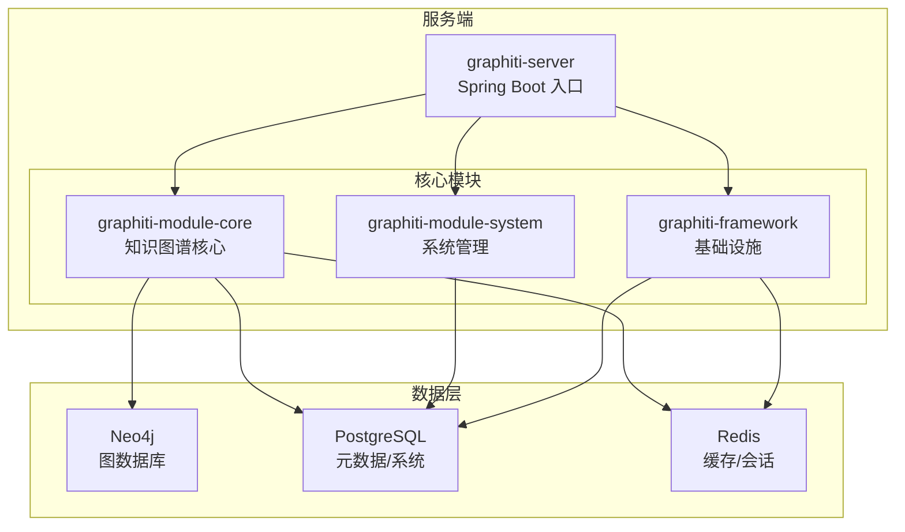
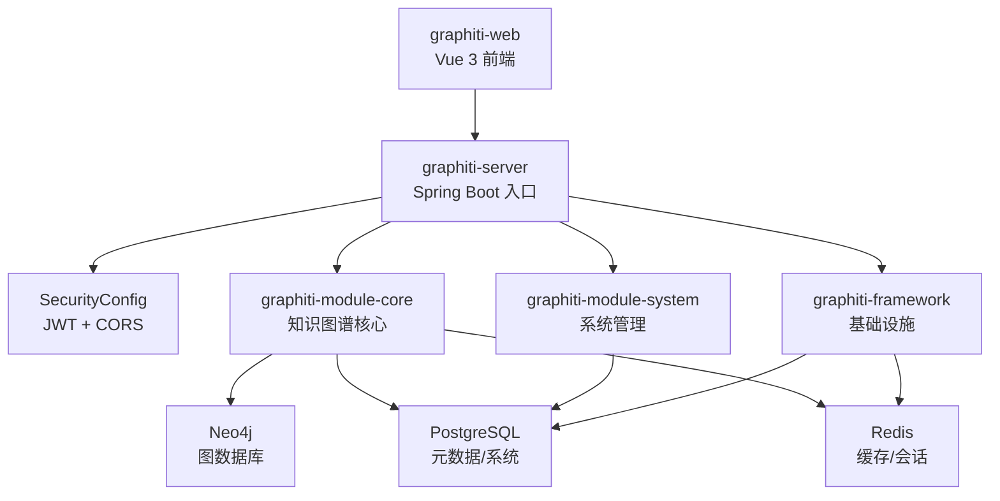
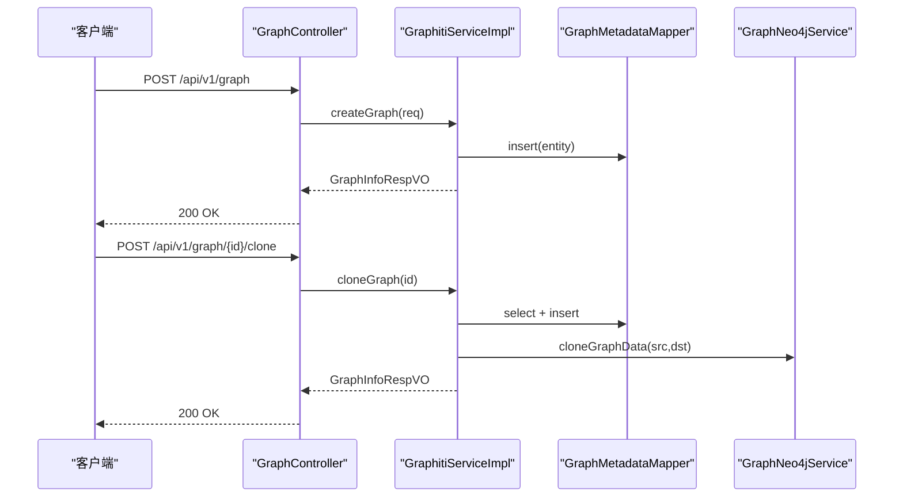
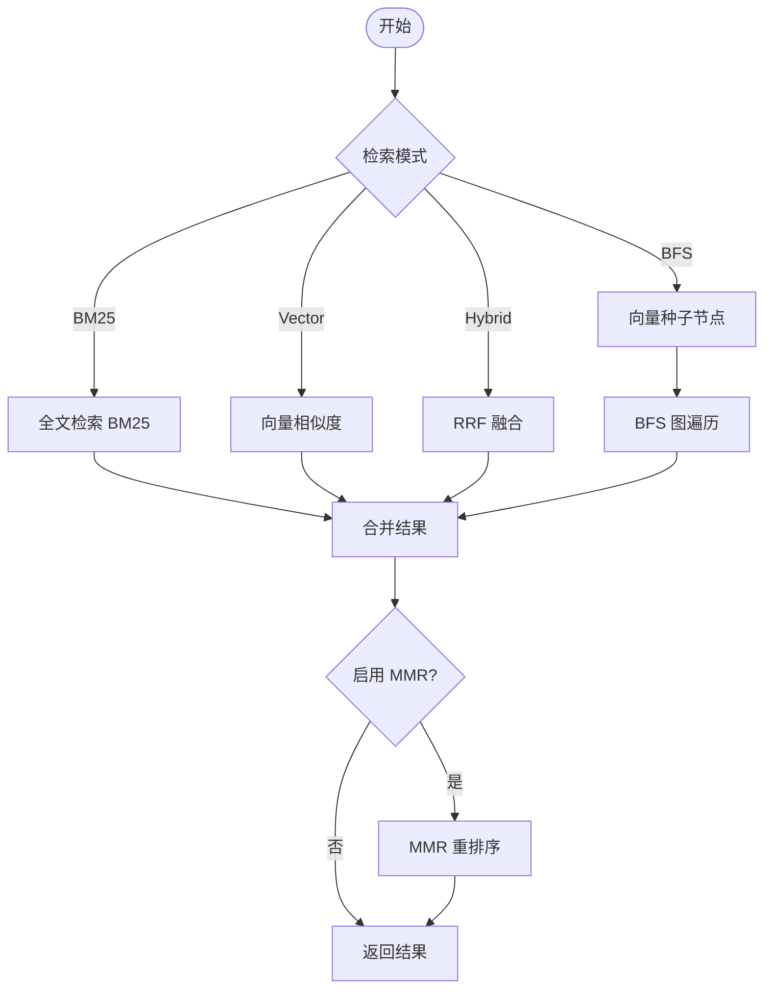
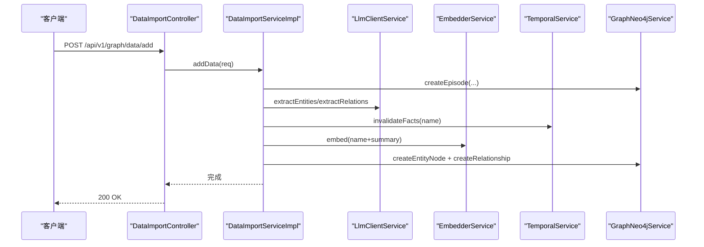
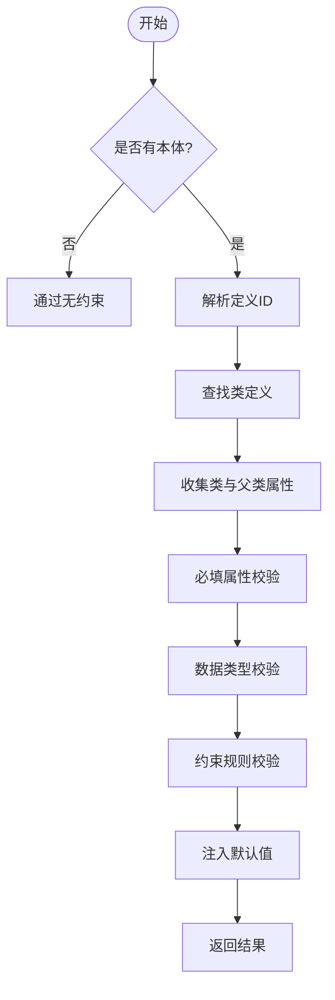
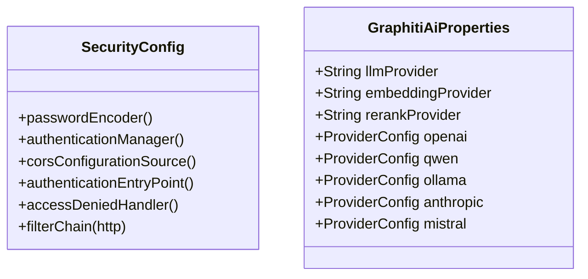
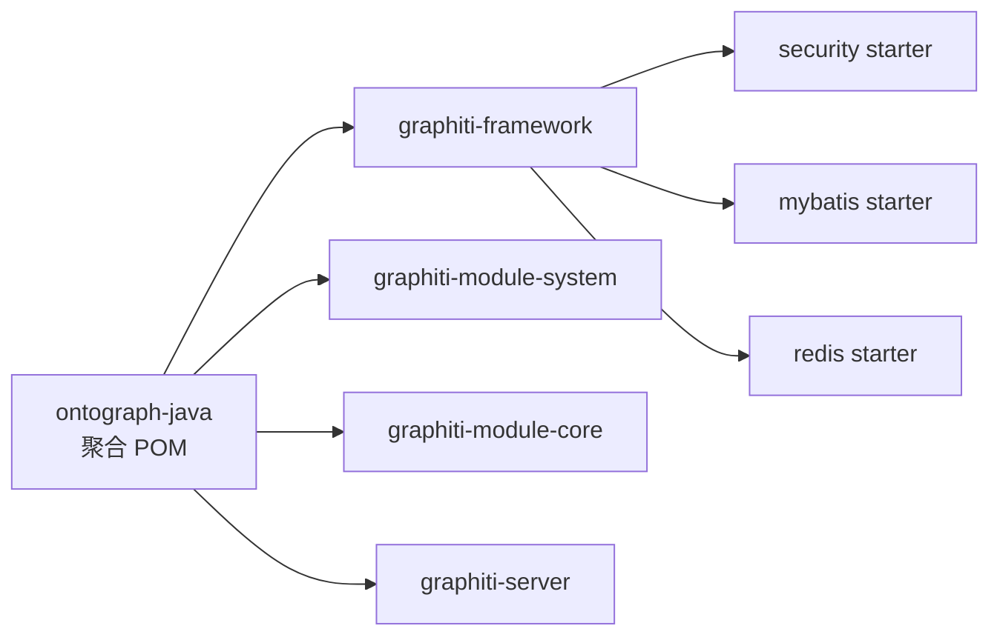

# 项目概述

<!--<cite>
**本文引用的文件**
- [README.md](file://README.md)
- [README_CN.md](file://README_CN.md)
- [DESIGN.md](file://DESIGN.md)
- [pom.xml](file://pom.xml)
- [GraphitiApplication.java](file://graphiti-server/src/main/java/com/graphiti/GraphitiApplication.java)
- [GraphitiServiceImpl.java](file://graphiti-module-core/src/main/java/com/graphiti/module/graphiti/service/impl/GraphitiServiceImpl.java)
- [SearchServiceImpl.java](file://graphiti-module-core/src/main/java/com/graphiti/module/graphiti/service/impl/SearchServiceImpl.java)
- [DataImportServiceImpl.java](file://graphiti-module-core/src/main/java/com/graphiti/module/graphiti/service/impl/DataImportServiceImpl.java)
- [OntologyValidationServiceImpl.java](file://graphiti-module-core/src/main/java/com/graphiti/module/graphiti/service/impl/OntologyValidationServiceImpl.java)
- [SecurityConfig.java](file://graphiti-framework/graphiti-spring-boot-starter-security/src/main/java/com/graphiti/framework/security/config/SecurityConfig.java)
- [graphiti-spring-boot-starter-mybatis/pom.xml](file://graphiti-framework/graphiti-spring-boot-starter-mybatis/pom.xml)
- [GraphitiAiProperties.java](file://graphiti-module-core/src/main/java/com/graphiti/module/graphiti/config/GraphitiAiProperties.java)
- [schema.sql](file://sql/postgresql/schema.sql)
- [init.cypher](file://sql/neo4j/init.cypher)
- [ontology.md](file://docs/ontology.md)
</cite>-->

## 目录
1. [简介](#简介)
2. [项目结构](#项目结构)
3. [核心组件](#核心组件)
4. [架构总览](#架构总览)
5. [详细组件分析](#详细组件分析)
6. [依赖分析](#依赖分析)
7. [性能考量](#性能考量)
8. [故障排查指南](#故障排查指南)
9. [结论](#结论)
10. [附录](#附录)

## 简介
ontograph-java 是一个面向 Java 生态的“时序知识图谱后端系统”，专注于将大规模非结构化文本转化为结构化的实体-关系知识图谱，并提供时序事实管理、混合检索、本体验证与社区发现等能力。系统通过 LLM（大语言模型）自动抽取实体与关系，将节点与边以向量嵌入形式存储于 Neo4j，同时以 PostgreSQL 存储元数据与系统数据，Redis 提供缓存与会话支持，形成“双存储”架构。

- 核心价值
  - 降低知识图谱落地门槛：自动抽取、统一嵌入、即开即用
  - 强大的混合检索：BM25、向量相似度、BFS 图遍历融合，支持 RRF 融合与 MMR 重排序
  - 时序事实管理：valid_at/invalid_at 双时间戳，自动失效过时事实，支持 Saga 事件链
  - 多 LLM 供应商接入：OpenAI、Anthropic、Qwen、Ollama、Mistral 等，支持私有化部署
  - 本体驱动的数据质量：6 层本体验证（类存在性、必填、类型、约束、默认注入、警告）
  - 社区发现：标签传播 + LLM 摘要，提升知识可理解性

- 目标用户
  - 需要从海量文档、对话、日志中抽取知识的企业与研究团队
  - 对检索体验有高要求的智能问答、推荐与决策系统
  - 希望以本体约束保障数据质量与一致性的产品与数据团队

- 与同类方案的区别
  - 双存储架构：Neo4j 负责图结构与向量检索，PostgreSQL 负责元数据与系统数据，兼顾灵活性与稳定性
  - 时序知识图谱：内置 bi-temporal 设计，支持事实随时间演进与回溯
  - 混合检索管线：从 BM25、向量到 BFS 的多路融合，配合 RRF/MRR，兼顾召回与多样性
  - 本体驱动的质量工程：在写入阶段即进行 6 层验证，减少脏数据进入图数据库

- 发展历程与版本
  - 当前版本：1.0.0-SNAPSHOT
  - 技术栈：Java 21、Spring Boot 3.5.5、Spring AI 1.1.2、Neo4j Java Driver 5.26.0、MyBatis-Plus 3.5.12、Redisson 3.37.0
  - 许可证：MIT

**章节来源**
- [README.md:19-68](file://README.md#L19-L68)
- [README_CN.md:19-68](file://README_CN.md#L19-L68)
- [pom.xml:10-43](file://pom.xml#L10-L43)

## 项目结构
项目采用多模块聚合结构，分为框架基础设施、系统管理模块、核心业务模块与服务入口：

- graphiti-framework：公共组件与基础能力（安全、MyBatis、Redis 等）
- graphiti-module-system：系统管理（用户、角色、菜单、认证）
- graphiti-module-core：知识图谱核心（图管理、节点/边、本体、检索、导入、社区等）
- graphiti-server：Spring Boot 启动入口与配置

**图表来源**
- [pom.xml:15-20](file://pom.xml#L15-L20)
- [GraphitiApplication.java:18-34](file://graphiti-server/src/main/java/com/graphiti/GraphitiApplication.java#L18-L34)

**章节来源**
- [pom.xml:15-20](file://pom.xml#L15-L20)
- [README.md:110-166](file://README.md#L110-L166)
- [README_CN.md:110-166](file://README_CN.md#L110-L166)

## 核心组件
- 图管理服务：提供图谱的创建、查询、更新、删除、克隆、导出与统计
- 检索服务：混合检索（BM25、向量、BFS），支持 RRF 融合与 MMR 重排序
- 数据导入服务：支持 LLM 自动抽取与批量导入，时序失效与实体解析
- 本体验证服务：6 层验证引擎（类存在性、必填、类型、约束、默认注入、警告）
- 安全与配置：JWT 过滤链、跨域、密码编码器、AI 配置属性
- 基础设施：MyBatis-Plus、Redisson、OpenAPI 文档

**章节来源**
- [GraphitiServiceImpl.java:30-184](file://graphiti-module-core/src/main/java/com/graphiti/module/graphiti/service/impl/GraphitiServiceImpl.java#L30-L184)
- [SearchServiceImpl.java:26-148](file://graphiti-module-core/src/main/java/com/graphiti/module/graphiti/service/impl/SearchServiceImpl.java#L26-L148)
- [DataImportServiceImpl.java:36-109](file://graphiti-module-core/src/main/java/com/graphiti/module/graphiti/service/impl/DataImportServiceImpl.java#L36-L109)
- [OntologyValidationServiceImpl.java:40-87](file://graphiti-module-core/src/main/java/com/graphiti/module/graphiti/service/impl/OntologyValidationServiceImpl.java#L40-L87)
- [SecurityConfig.java:116-136](file://graphiti-framework/graphiti-spring-boot-starter-security/src/main/java/com/graphiti/framework/security/config/SecurityConfig.java#L116-L136)
- [GraphitiAiProperties.java:16-56](file://graphiti-module-core/src/main/java/com/graphiti/module/graphiti/config/GraphitiAiProperties.java#L16-L56)

## 架构总览
系统采用“双存储 + 多 LLM 供应商”的混合架构：Neo4j 负责图数据与向量索引，PostgreSQL 负责元数据与系统数据，Redis 提供缓存与会话，Spring Security + JWT 提供认证授权，Spring AI 驱动 LLM 能力。

**图表来源**
- [README.md:71-108](file://README.md#L71-L108)
- [README_CN.md:71-108](file://README_CN.md#L71-L108)
- [SecurityConfig.java:116-136](file://graphiti-framework/graphiti-spring-boot-starter-security/src/main/java/com/graphiti/framework/security/config/SecurityConfig.java#L116-L136)

## 详细组件分析

### 图管理服务（GraphitiServiceImpl）
- 职责：图谱生命周期管理（创建、查询、更新、删除、克隆、导出）、统计汇总
- 关键流程：创建图谱时生成 graphId，写入元数据；克隆时复制 Neo4j 数据并更新 MySQL 元数据；导出时聚合元数据与图数据
- 时序统计：遍历所有图谱统计 Episode 数量，后续可优化为 Neo4j 直接聚合

**图表来源**
- [GraphitiServiceImpl.java:30-184](file://graphiti-module-core/src/main/java/com/graphiti/module/graphiti/service/impl/GraphitiServiceImpl.java#L30-L184)

**章节来源**
- [GraphitiServiceImpl.java:30-184](file://graphiti-module-core/src/main/java/com/graphiti/module/graphiti/service/impl/GraphitiServiceImpl.java#L30-L184)

### 检索服务（SearchServiceImpl）
- 职责：混合检索（BM25、向量、BFS），RRF 融合与 MMR 重排序
- 关键流程：根据模式选择 BM25、向量或 BFS；向量模式下生成嵌入；BFS 以向量种子节点展开；最后可选 MMR 重排序
- 距离与提及重排：支持按节点距离与事件提及次数重排

**图表来源**
- [SearchServiceImpl.java:94-148](file://graphiti-module-core/src/main/java/com/graphiti/module/graphiti/service/impl/SearchServiceImpl.java#L94-L148)
- [SearchServiceImpl.java:178-223](file://graphiti-module-core/src/main/java/com/graphiti/module/graphiti/service/impl/SearchServiceImpl.java#L178-L223)
- [SearchServiceImpl.java:227-284](file://graphiti-module-core/src/main/java/com/graphiti/module/graphiti/service/impl/SearchServiceImpl.java#L227-L284)
- [SearchServiceImpl.java:288-308](file://graphiti-module-core/src/main/java/com/graphiti/module/graphiti/service/impl/SearchServiceImpl.java#L288-L308)

**章节来源**
- [SearchServiceImpl.java:26-148](file://graphiti-module-core/src/main/java/com/graphiti/module/graphiti/service/impl/SearchServiceImpl.java#L26-L148)

### 数据导入服务（DataImportServiceImpl）
- 职责：支持 LLM 自动抽取实体与关系，创建 Episode、节点与关系；支持批量导入与消息对话导入；时序失效与实体解析
- 关键流程：创建 Episode → LLM 抽取实体/关系 → 生成嵌入 → 写入 Neo4j → 可选本体验证与默认值注入

**图表来源**
- [DataImportServiceImpl.java:36-109](file://graphiti-module-core/src/main/java/com/graphiti/module/graphiti/service/impl/DataImportServiceImpl.java#L36-L109)

**章节来源**
- [DataImportServiceImpl.java:36-109](file://graphiti-module-core/src/main/java/com/graphiti/module/graphiti/service/impl/DataImportServiceImpl.java#L36-L109)

### 本体验证服务（OntologyValidationServiceImpl）
- 职责：6 层验证引擎（类存在性、必填属性、数据类型、约束、默认值注入、警告）
- 关键流程：解析定义 ID → 解析类与继承链 → 收集属性 → 逐层校验 → 注入默认值 → 返回结果

**图表来源**
- [OntologyValidationServiceImpl.java:40-87](file://graphiti-module-core/src/main/java/com/graphiti/module/graphiti/service/impl/OntologyValidationServiceImpl.java#L40-L87)
- [OntologyValidationServiceImpl.java:207-240](file://graphiti-module-core/src/main/java/com/graphiti/module/graphiti/service/impl/OntologyValidationServiceImpl.java#L207-L240)
- [OntologyValidationServiceImpl.java:256-322](file://graphiti-module-core/src/main/java/com/graphiti/module/graphiti/service/impl/OntologyValidationServiceImpl.java#L256-L322)

**章节来源**
- [OntologyValidationServiceImpl.java:40-87](file://graphiti-module-core/src/main/java/com/graphiti/module/graphiti/service/impl/OntologyValidationServiceImpl.java#L40-L87)

### 安全与配置（SecurityConfig、GraphitiAiProperties）
- 安全：JWT 过滤链、CORS、未认证/权限不足统一 JSON 响应
- AI 配置：多提供商（OpenAI、Qwen、Ollama、Anthropic、Mistral 等）与私有化部署支持

**图表来源**
- [SecurityConfig.java:44-136](file://graphiti-framework/graphiti-spring-boot-starter-security/src/main/java/com/figiti/framework/security/config/SecurityConfig.java#L44-L136)
- [GraphitiAiProperties.java:16-135](file://graphiti-module-core/src/main/java/com/figiti/module/graphiti/config/GraphitiAiProperties.java#L16-L135)

**章节来源**
- [SecurityConfig.java:116-136](file://graphiti-framework/graphiti-spring-boot-starter-security/src/main/java/com/figiti/framework/security/config/SecurityConfig.java#L116-L136)
- [GraphitiAiProperties.java:16-56](file://graphiti-module-core/src/main/java/com/figiti/module/graphiti/config/GraphitiAiProperties.java#L16-L56)

## 依赖分析
- 模块依赖：聚合模块统一管理版本，核心模块依赖框架模块提供的安全、MyBatis、Redis 等能力
- 外部依赖：Spring Boot、Spring AI、Neo4j、MyBatis-Plus、Redisson、PostgreSQL 驱动、Druid 等
- 启动排除：按需排除部分自动配置，避免冲突

**图表来源**
- [pom.xml:15-20](file://pom.xml#L15-L20)
- [graphiti-spring-boot-starter-mybatis/pom.xml:19-41](file://graphiti-framework/graphiti-spring-boot-starter-mybatis/pom.xml#L19-L41)

**章节来源**
- [pom.xml:45-196](file://pom.xml#L45-L196)
- [GraphitiApplication.java:20-33](file://graphiti-server/src/main/java/com/figiti/GraphitiApplication.java#L20-L33)

## 性能考量
- 检索性能
  - 向量索引：Neo4j 5.x 向量索引（节点/边 embedding），支持余弦相似度
  - 全文索引：实体与关系的全文索引，提升 BM25 召回
  - RRF 融合与 MMR 重排序：在多路召回基础上平衡多样性与相关性
- 写入性能
  - LLM 抽取与嵌入生成异步化与批量化（当前实现为串行，可扩展为批量/并发）
  - 时序失效策略：按名称失效旧实体，减少冗余节点
- 存储与缓存
  - 双存储架构：Neo4j 高效图遍历，PostgreSQL 稳定元数据与系统数据，Redis 提升热点数据访问
- 索引与查询
  - Neo4j：唯一性约束与复合索引（group_id、name、type、valid_at 等）
  - PostgreSQL：常用字段建立索引，触发器自动维护更新时间

**章节来源**
- [init.cypher:4-32](file://sql/neo4j/init.cypher#L4-L32)
- [schema.sql:150-177](file://sql/postgresql/schema.sql#L150-L177)
- [SearchServiceImpl.java:152-174](file://graphiti-module-core/src/main/java/com/figiti/module/graphiti/service/impl/SearchServiceImpl.java#L152-L174)

## 故障排查指南
- 认证与权限
  - 未认证/权限不足：统一返回 401/403 JSON，检查 JWT Token 与权限配置
- 数据导入
  - 本体验证失败：检查类定义、必填属性、数据类型与约束；必要时注入默认值
  - LLM 抽取异常：确认提供商配置与网络连通性
- 检索异常
  - 向量索引缺失：确认 Neo4j 初始化脚本执行；检查 embedding 维度与相似度函数
  - BFS 结果为空：确认种子节点向量生成与邻居查询逻辑
- 系统日志
  - 操作日志与搜索历史：便于审计与问题定位

**章节来源**
- [SecurityConfig.java:84-113](file://graphiti-framework/graphiti-spring-boot-starter-security/src/main/java/com/figiti/framework/security/config/SecurityConfig.java#L84-L113)
- [OntologyValidationServiceImpl.java:40-87](file://graphiti-module-core/src/main/java/com/figiti/module/graphiti/service/impl/OntologyValidationServiceImpl.java#L40-L87)
- [schema.sql:242-270](file://sql/postgresql/schema.sql#L242-L270)

## 结论
ontograph-java 将时序知识图谱、混合检索与本体驱动的质量工程整合为一套可落地的 Java 后端方案。其双存储架构、完备的 LLM 集成、严格的本体验证与灵活的检索管线，使其在企业知识管理、智能问答与决策支持场景具备显著优势。建议在生产环境中结合业务需求，完善批量导入、向量索引与缓存策略，持续迭代本体定义与检索策略。

## 附录
- 快速开始与 API 文档参见项目根目录文档与 Swagger UI
- 数据库初始化脚本与迁移指南位于 sql 与 docs/sql 目录
- 本体与数据导入管线详见 docs/ontology.md

**章节来源**
- [README.md:406-431](file://README.md#L406-L431)
- [README_CN.md:406-431](file://README_CN.md#L406-L431)
- [ontology.md:1-50](file://docs/ontology.md#L1-L50)