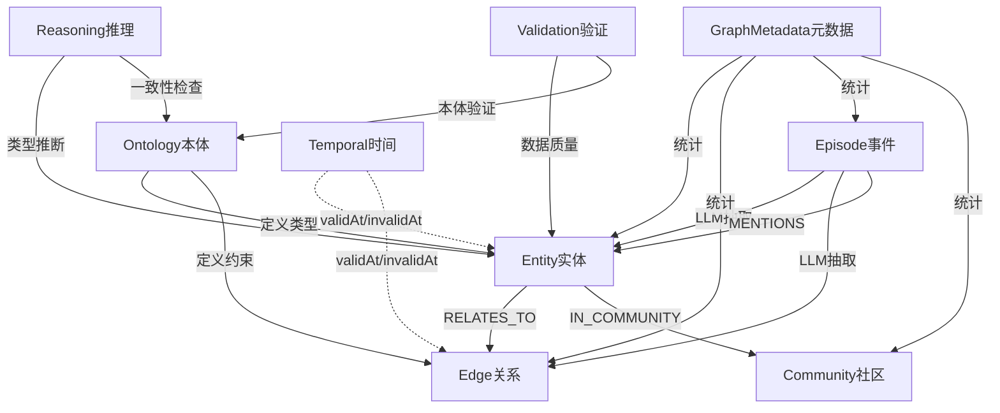

让我查看项目的文档和代码，全面了解知识图谱系统中的核心概念。


基于对文档和代码的全面分析,我来系统梳理知识图谱系统中的所有核心概念:

---

## 知识图谱核心概念体系

根据项目文档(`graphiti-ddl.md`, `ontology.md`)和代码实现,完整的概念层级如下:

### 📊 核心概念全景图

```
知识图谱系统
│
├─ 1️⃣ 本体层 (Ontology) ← 定义"是什么"
│   ├─ OntologyDefinition (本体定义容器)
│   ├─ OntClass (类定义)
│   ├─ OntProperty (属性定义)
│   ├─ OntConstraint (约束规则)
│   ├─ OntDraft (草稿)
│   └─ OntVersionHistory (版本历史)
│
├─ 2️⃣ 数据层 (Data) ← 存储"实例"
│   ├─ Entity (实体节点)
│   ├─ Edge/Relationship (关系边)
│   ├─ Episode (事件/片段)
│   └─ Community (社区)
│
├─ 3️⃣ 时间层 (Temporal) ← 记录"何时有效"
│   ├─ validAt (生效时间)
│   ├─ invalidAt (失效时间)
│   └─ 时序事实查询
│
├─ 4️⃣ 组织层 (Organization) ← 发现"群组结构"
│   ├─ Community Detection (社区检测)
│   ├─ Label Propagation (标签传播算法)
│   └─ Community Hierarchy (社区层级)
│
├─ 5️⃣ 元数据层 (Metadata) ← 管理"系统信息"
│   ├─ GraphMetadata (图谱元数据)
│   ├─ EpisodeType (事件类型元数据)
│   ├─ CommunityType (社区类型元数据)
│   ├─ EntityCategory (实体分类)
│   └─ RelationshipMeta (关系元数据)
│
├─ 6️⃣ 推理层 (Reasoning) ← 实现"智能推断"
│   ├─ Type Inference (类型推断)
│   ├─ OWL Consistency (OWL一致性检查)
│   ├─ Jena Reasoner (Jena推理机)
│   └─ Domain Inference (领域推断)
│
├─ 7️⃣ 验证层 (Validation) ← 确保"数据质量"
│   ├─ Ontology Validation (本体验证)
│   ├─ Data Quality (数据质量)
│   └─ Schema Completeness (模式完整性)
│
└─ 8️⃣ 操作层 (Operation) ← 提供"管理能力"
    ├─ Pipeline (数据处理流水线)
    ├─ Import/Export (导入导出)
    ├─ Clone (图谱克隆)
    └─ Audit (审计日志)
```

---

## 详细概念解析

### 1️⃣ **Episode (事件/片段)** ⭐ 重要但容易被忽略

**定义**: 原始数据的容器,是知识抽取的起点

**作用**:
- 存储未处理的原始文本(新闻报道、法律条文、对话记录)
- 作为LLM抽取Entity和Edge的数据源
- 保留数据的原始上下文,支持溯源

**实际例子**:
```json
{
  "uuid": "episode-001",
  "name": "2024年公司法修订新闻",
  "source": "NEWS_ARTICLE",
  "content": "2024年3月15日,全国人大常委会通过了新的公司法修订案...",
  "episode_type": "LEGAL_AMENDMENT",
  "legal_process": "立法程序",
  "stage_label": "审议通过",
  "processed": false  // 是否已被LLM处理
}
```

**与其他概念的关系**:
```
Episode (原始数据)
   │
   ├─[LLM抽取]→ Entity (提取出实体: 全国人大常委会、公司法)
   │
   ├─[LLM抽取]→ Edge (提取出关系: 修订了)
   │
   └─[MENTIONS关系]→ 记录Episode提及了哪些Entity/Edge
```

**为什么需要Episode?**
- **可追溯性**: 知道某个实体是从哪篇文章中提取的
- **增量更新**: 新文章到来时,只处理新Episode,不影响已有数据
- **质量评估**: 可以对比不同Episode抽取结果的准确性

---

### 2️⃣ **Entity (实体节点)**

**定义**: 知识图谱中的基本节点,代表现实世界中的对象

**类型示例**:
```
Person (人): 张三、李四
Company (公司): 阿里巴巴、腾讯
Law (法律): 《民法典》、《公司法》
Product (产品): iPhone、微信
Location (地点): 北京、上海
Event (事件): 2024年春节、COVID-19疫情
```

**属性结构**:
```json
{
  "uuid": "entity-001",
  "name": "张三",
  "type": "Person",
  "summary": "张三,男,1980年生,现任阿里巴巴CTO",
  "embedding": [0.1, 0.2, ...],  // 向量嵌入,用于语义搜索
  "validAt": "2020-01-01T00:00:00Z",
  "invalidAt": null,  // null表示当前有效
  "properties": {
    "age": 44,
    "gender": "male",
    "company": "阿里巴巴"
  }
}
```

---

### 3️⃣ **Edge/Relationship (关系边)**

**定义**: 连接两个实体的有向关系

**核心属性**:
```json
{
  "uuid": "edge-001",
  "source": "entity-001",  // 张三
  "target": "entity-002",  // 阿里巴巴
  "type": "WORKS_AT",
  "fact": "张三在阿里巴巴担任CTO",  // 自然语言描述
  "embedding": [0.3, 0.4, ...],
  "validAt": "2020-01-01",
  "invalidAt": null
}
```

**关系类型**:
- `RELATES_TO` - 通用实体关系
- `MENTIONS` - Episode提及Entity
- `IN_COMMUNITY` - Entity属于Community
- `BELONGS_TO` - Entity属于Episode (待实现)

---

### 4️⃣ **Community (社区)** 

**定义**: 通过算法自动发现的紧密连接的实体群组

**与手动分类的区别**:
| 特征 | 手动分类 (OntClass) | 自动发现 (Community) |
|------|-------------------|---------------------|
| 创建方式 | 人工定义 | 算法检测 |
| 示例 | "所有Person类节点" | "经常一起出现的人形成的朋友圈" |
| 更新频率 | 低 | 高(数据变化后重新检测) |
| 用途 | 类型约束 | 知识发现 |

---

### 5️⃣ **GraphMetadata (图谱元数据)**

**定义**: 知识图谱实例的基本信息

```json
{
  "graphId": "legal-kg-2024",
  "name": "法律知识图谱2024",
  "description": "包含中国民商事法律的知识图谱",
  "nodeCount": 15678,
  "edgeCount": 45234,
  "episodeCount": 892,
  "communityCount": 156,
  "classCount": 45,
  "ontVersionId": 12,  // 当前使用的本体版本
  "status": "ACTIVE",
  "createdAt": "2024-01-01",
  "updatedAt": "2024-03-15"
}
```

---

### 6️⃣ **EpisodeType (事件类型元数据)**

**定义**: Episode的分类体系

**层级结构**:
```
法律流程 (legalProcess)
├─ 立法程序
│  ├─ 草案提出
│  ├─ 审议中
│  └─ 审议通过
├─ 司法程序
│  ├─ 立案
│  ├─ 审理中
│  └─ 判决
└─ 执法程序
   ├─ 调查
   └─ 处罚
```

**代码中的体现**:
```java
// CommunityServiceImpl.java
String episodeType = (String) episodeData.get("episode_type");
String legalProcess = (String) episodeData.get("legal_process");
String stageLabel = (String) episodeData.get("stage_label");
```

---

### 7️⃣ **CommunityType (社区类型元数据)**

**定义**: 社区的分类维度

**分类维度**:
```java
// CommunityServiceImpl.java
domain_type: "法律"           // 领域类型
community_type: "法规簇"     // 社区类型
region: "REGION_CN"          // 地域
scenario_type: "SCENARIO_ROOT"  // 场景类型
```

---

### 8️⃣ **EntityCategory (实体分类)**

**定义**: 实体的业务分类体系(独立于OntClass)

**与OntClass的区别**:
| 特征 | OntClass | EntityCategory |
|------|----------|----------------|
| 作用 | 本体定义(类型系统) | 业务分类(导航体系) |
| 示例 | `class Person extends Agent` | "民法典→总则→自然人" |
| 用途 | 验证、推理 | 浏览、过滤 |

---

### 9️⃣ **RelationshipMeta (关系元数据)**

**定义**: 关系类型的定义和约束

```json
{
  "relationshipType": "WORKS_AT",
  "relationshipName": "就职于",
  "sourceEntityTypes": ["Person"],
  "targetEntityTypes": ["Company", "Organization"],
  "isDirectional": true,
  "isTransitive": false,
  "multiplicity": "N:1",  // 多人可就职于同一公司,一人只能就职于一家
  "validityPeriod": "P1Y",  // 默认有效期1年
  "description": "表示某人在某机构工作"
}
```

---

### 🔟 **Pipeline (数据处理流水线)**

**定义**: 从原始数据到知识图谱的自动化处理流程

**典型Pipeline**:
```
原始文档 (PDF/Word/HTML)
   │
   ├─[步骤1: 文本提取]→ 纯文本
   │
   ├─[步骤2: 分段]→ Episode列表
   │
   ├─[步骤3: LLM抽取]→ Entity + Edge
   │
   ├─[步骤4: 本体验证]→ 验证Entity/Edge是否符合Ontology
   │
   ├─[步骤5: 向量嵌入]→ 生成embedding
   │
   ├─[步骤6: 社区检测]→ 发现Community
   │
   └─[步骤7: 索引构建]→ 向量索引 + 全文索引
```

---

### 1️⃣1️⃣ **Domain Inference (领域推断)**

**定义**: 自动推断实体/事件所属的业务领域

**应用场景**:
```
输入Episode: "张三因盗窃罪被判处有期徒刑3年"
   │
   ├─[LLM提取]→ Entity: 张三, 盗窃罪, 有期徒刑
   │
   ├─[领域推断]→ 
   │   - 张三 → 领域: 刑事法
   │   - 盗窃罪 → 领域: 刑法
   │   - 有期徒刑 → 领域: 刑罚
   │
   └─[自动分类]→ 归入"刑事法律社区"
```

---

### 1️⃣2️⃣ **Data Quality (数据质量)**

**定义**: 知识图谱数据的完整性、一致性、准确性评估

**质量维度**:
```
1. 完整性 (Completeness)
   - 必填属性是否有值
   - 关系是否有缺失

2. 一致性 (Consistency)
   - 是否符合本体约束
   - 是否存在矛盾(某人既是Person又是Company)

3. 准确性 (Accuracy)
   - 与事实是否相符
   - LLM抽取的置信度

4. 时效性 (Timeliness)
   - 数据是否过期
   - invalidAt是否正确设置
```

---

### 1️⃣3️⃣ **Ontology Draft (本体草稿)**

**定义**: 本体变更的暂存区,支持审核流程

**工作流程**:
```
1. 知识工程师创建Draft
   └─ 新增类: "AI模型"
   └─ 新增属性: "训练数据量"

2. 审核员Review Draft
   └─ 检查: 是否与现有类冲突?
   └─ 检查: 属性定义是否合理?

3. 审核通过 → Draft → Active Definition
   └─ 版本号: v1.0 → v1.1

4. 审核拒绝 → Draft → 修改或删除
```

---

### 1️⃣4️⃣ **Saga (事件链/ saga模式)**

**定义**: 多个Episode组成的时序链条

**应用场景**:
```
Saga: "张三的职业生涯"
   │
   ├─ Episode 1: "2010年张三加入腾讯"
   │
   ├─ Episode 2: "2015年张三晋升为技术总监"
   │
   ├─ Episode 3: "2020年张三跳槽到阿里巴巴"
   │
   └─ Episode 4: "2024年张三成为阿里巴巴CTO"

关系:
Episode 1 --NEXT_EPISODE--> Episode 2 --NEXT_EPISODE--> ...
```

**当前状态**: 代码中有 `SagaServiceImpl`,但功能可能未完全实现。

---

## 概念间的关系图



---

## 总结: 8大核心概念群

| 概念群 | 核心概念 | 作用 | 前端页面 |
|-------|---------|------|---------|
| **本体** | OntClass, OntProperty, OntConstraint | 定义类型系统 | 本体管理控制台 |
| **实体** | Entity | 存储知识节点 | ide.vue图谱可视化 |
| **关系** | Edge | 连接实体 | ide.vue图谱可视化 |
| **事件** | Episode | 原始数据容器 | episodes/index.vue |
| **社区** | Community | 自动发现群组 | communities/index.vue |
| **时间** | validAt, invalidAt | 时序管理 | graph/temporal.vue |
| **元数据** | GraphMetadata, EpisodeType, CommunityType | 系统信息 | 各页面的过滤/统计 |
| **推理验证** | Reasoner, Validator | 智能推断 | 本体管理控制台 |

所以,除了你提到的**本体**、**时序**、**社区**外,还有这些重要概念:
1. **Episode**(事件) - 知识抽取的起点
2. **Entity/Edge**(实体/关系) - 知识的核心载体
3. **元数据体系**(EpisodeType, CommunityType, EntityCategory, RelationshipMeta)
4. **推理系统**(Type Inference, OWL Reasoner)
5. **验证系统**(Ontology Validation, Data Quality)
6. **Pipeline**(数据处理流水线)
7. **Saga**(事件链)
8. **Draft**(本体草稿与审核)