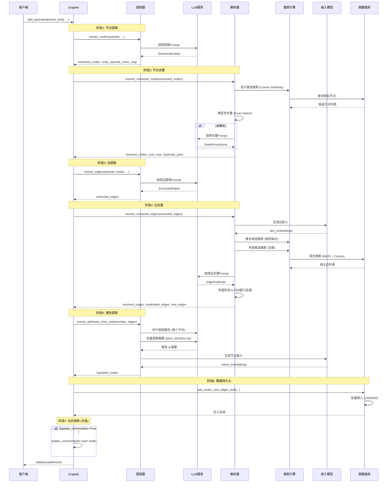

# Graphiti Graph API 数据处理流程详解

本文档详细梳理 Graphiti 工程中 Graph API 的完整数据处理流程,以 `add_episode` 方法为核心入口,涵盖信息抽取、实体/关系构建、去重、嵌入生成、数据持久化和检索等关键环节。

---

## 目录

1. [整体架构概览](#1-整体架构概览)
2. [信息抽取阶段](#2-信息抽取阶段)
3. [实体/关系提取阶段](#3-实体关系提取阶段)
4. [去重阶段](#4-去重阶段)
5. [嵌入阶段](#5-嵌入阶段)
6. [写入阶段](#6-写入阶段)
7. [检索阶段](#7-检索阶段)
8. [数据流转时序图](#8-数据流转时序图)

---

## 1. 整体架构概览

### 1.1 核心入口: `add_episode` 方法

**文件位置**: `graphiti_core/graphiti.py:933-1176`

`add_episode` 是整个数据处理流程的核心入口,负责协调以下关键步骤:

```python
async def add_episode(
    self,
    name: str,                    # 剧集名称
    episode_body: str,            # 剧集内容
    source_description: str,      # 来源描述
    reference_time: datetime,     # 参考时间
    source: EpisodeType = EpisodeType.message,
    group_id: str | None = None,  # 图分区ID
    entity_types: dict[str, type[BaseModel]] | None = None,      # 实体类型定义
    edge_types: dict[str, type[BaseModel]] | None = None,        # 边类型定义
    edge_type_map: dict[tuple[str, str], list[str]] | None = None,  # 节点类型到边类型的映射
    # ... 其他参数
) -> AddEpisodeResults:
```

### 1.2 核心组件

- **GraphitiClients**: 聚合客户端,包含:
  - `driver`: 图数据库驱动 (Neo4j/FalkorDB/Kuzu/Neptune)
  - `llm_client`: LLM 客户端 (OpenAI/Anthropic/Gemini等)
  - `embedder`: 嵌入模型客户端 (OpenAI/Voyage/Gemini)
  - `cross_encoder`: 重排序器客户端 (BGE/OpenAI/Gemini)
  - `tracer`: OpenTelemetry 追踪器

- **数据模型**:
  - `EpisodicNode`: 剧集节点 (数据源)
  - `EntityNode`: 实体节点 (知识图谱节点)
  - `EntityEdge`: 实体关系边 (知识图谱边)
  - `EpisodicEdge`: 剧集-实体关联边

### 1.3 处理流程概览

```
add_episode()
  ├─ 1. 提取节点 (extract_nodes)
  ├─ 2. 解析节点去重 (resolve_extracted_nodes)
  ├─ 3. 提取边 (extract_edges)
  ├─ 4. 解析边去重 (resolve_extracted_edges)
  ├─ 5. 提取节点属性 (extract_attributes_from_nodes)
  ├─ 6. 处理剧集数据 (_process_episode_data)
  ├─ 7. 更新社区 (update_community) [可选]
  └─ 8. 批量写入数据库 (add_nodes_and_edges_bulk)
```

---

## 2. 信息抽取阶段

### 2.1 实体节点提取

**核心函数**: `extract_nodes()`  
**文件位置**: `graphiti_core/utils/maintenance/node_operations.py:69-148`

#### 2.1.1 提取机制

```python
async def extract_nodes(
    clients: GraphitiClients,
    episode: EpisodicNode | list[EpisodicNode],
    previous_episodes: list[EpisodicNode],
    entity_types: dict[str, type[BaseModel]] | None = None,
    excluded_entity_types: list[str] | None = None,
    custom_extraction_instructions: str | None = None,
) -> tuple[list[EntityNode], dict[str, list[int]]]:
```

**返回值**:
- `extracted_nodes`: 提取的实体节点列表
- `node_episode_index_map`: 节点 UUID 到剧集索引的映射 (用于溯源)

#### 2.1.2 提取流程

1. **构建上下文**:
   ```python
   context = {
       'episode_content': concatenate_episodes(episodes),  # 拼接多剧集内容
       'episode_timestamp': primary_episode.valid_at.isoformat(),
       'previous_episodes': [...],  # 历史剧集作为上下文
       'entity_types': entity_types_context,  # 实体类型定义
       'custom_extraction_instructions': '...'  # 自定义提取指令
   }
   ```

2. **调用 LLM 提取**:
   - 根据剧集类型选择不同 prompt:
     - `EpisodeType.message` → `extract_message` (对话消息)
     - `EpisodeType.text` → `extract_text` (非结构化文本)
     - `EpisodeType.json` → `extract_json` (JSON 数据)

3. **LLM 响应解析**:
   ```python
   llm_response = await llm_client.generate_response(
       prompt,
       response_model=ExtractedEntities,  # Pydantic 模型
       group_id=episode.group_id,
       prompt_name='extract_nodes.extract_message'
   )
   response_object = ExtractedEntities(**llm_response)
   ```

#### 2.1.3 实体提取规则 (Prompt 设计)

**文件位置**: `graphiti_core/prompts/extract_nodes.py:83-210`

核心规则:
1. **禁止提取**:
   - 代词 (you, me, he, she, they...)
   - 抽象概念 (joy, balance, growth...)
   - 通用名词 (day, life, people, stuff...)
   - 日期/时间信息
   - 模糊的关系词 (dad, mom, friend...) - 需限定为 "Nisha's dad"

2. **提取要求**:
   - 始终提取说话人 (冒号前部分)
   - 使用最具体的形式 ("road cycling" 而非 "cycling")
   - 实体名称最多 5 个词
   - 每个实体仅出现一次

3. **实体类型分类**:
   ```python
   entity_types_context = [
       {
           'entity_type_id': 0,
           'entity_type_name': 'Entity',  # 默认类型
           'entity_type_description': '...'
       },
       # 自定义类型...
   ]
   ```

#### 2.1.4 后处理

- **过滤空名称**: `filtered_entities = [e for e in extracted_entities if e.name.strip()]`
- **精确去重**: `_collapse_exact_duplicate_extracted_nodes()` - 合并标准化名称相同的节点
- **构建 EntityNode 对象**:
  ```python
  new_node = EntityNode(
      name=extracted_entity.name,
      group_id=primary_episode.group_id,
      labels=['Entity', entity_type_name],  # 多标签
      summary='',
      created_at=utc_now()
  )
  ```

### 2.2 关系边提取

**核心函数**: `extract_edges()`  
**文件位置**: `graphiti_core/utils/maintenance/edge_operations.py:116-321`

#### 2.2.1 提取机制

```python
async def extract_edges(
    clients: GraphitiClients,
    episode: EpisodicNode | list[EpisodicNode],
    nodes: list[EntityNode],           # 已提取的实体节点
    previous_episodes: list[EpisodicNode],
    edge_type_map: dict[tuple[str, str], list[str]],  # 节点类型对 → 边类型列表
    group_id: str = '',
    edge_types: dict[str, type[BaseModel]] | None = None,
    custom_extraction_instructions: str | None = None,
) -> list[EntityEdge]:
```

#### 2.2.2 提取流程

1. **构建边类型上下文**:
   ```python
   edge_type_signatures_map: dict[str, list[tuple[str, str]]] = {}
   for signature, edge_type_names in edge_type_map.items():
       for edge_type in edge_type_names:
           edge_type_signatures_map[edge_type].append(signature)
   
   edge_types_context = [
       {
           'fact_type_name': type_name,
           'fact_type_signatures': edge_type_signatures_map.get(type_name, [('Entity', 'Entity')]),
           'fact_type_description': type_model.__doc__
       }
       for type_name, type_model in edge_types.items()
   ]
   ```

2. **构建实体名称映射** (用于验证):
   ```python
   name_to_node: dict[str, EntityNode] = {node.name: node for node in nodes}
   ```

3. **调用 LLM 提取**:
   ```python
   llm_response = await llm_client.generate_response(
       prompt_library.extract_edges.edge(context),
       response_model=ExtractedEdges,
       max_tokens=16384,
       group_id=group_id,
       prompt_name='extract_edges.edge'
   )
   ```

#### 2.2.3 边提取规则 (Prompt 设计)

**文件位置**: `graphiti_core/prompts/extract_edges.py:94-178`

核心规则:
1. **实体名称验证**: `source_entity_name` 和 `target_entity_name` 必须来自 ENTITIES 列表
2. **禁止自环**: 源和目标必须是不同实体
3. **事实完整性**:
   - 保留所有具体细节 (品牌名、产品名、数量、颜色等)
   - 禁止泛化 ("Gamecube" → "gaming console" ❌)
   - 使用实体名称而非代词

4. **关系类型规则**:
   - 如果提供了 FACT_TYPES,使用匹配的 `fact_type_name`
   - 否则使用 SCREAMING_SNAKE_CASE (WORKS_AT, LIVES_IN...)

5. **时间规则**:
   - 使用 ISO 8601 + "Z" 后缀 (UTC)
   - 进行时态设置 `valid_at` 为剧集时间戳
   - 终止/变更设置 `invalid_at`

6. **去重规则**:
   - 相同事实仅提取一次,列出所有剧集索引
   - 更详细版本视为新事实 (非重复)

#### 2.2.4 验证与转换

1. **验证实体名称**:
   ```python
   if source_name not in name_to_node:
       logger.warning('Source entity not found...')
       continue
   
   if source_node.uuid == target_node.uuid:
       logger.info('Dropping self-edge...')
       continue
   ```

2. **时间解析**:
   ```python
   if valid_at:
       valid_at_datetime = ensure_utc(
           datetime.fromisoformat(valid_at.replace('Z', '+00:00'))
       )
   ```

3. **构建 EntityEdge**:
   ```python
   edge = EntityEdge(
       source_node_uuid=source_node_uuid,
       target_node_uuid=target_node_uuid,
       name=edge_data.relation_type,  # 关系类型
       group_id=group_id,
       fact=edge_data.fact,           # 事实描述
       episodes=edge_episode_uuids,   # 溯源剧集
       created_at=utc_now(),
       valid_at=valid_at_datetime,
       invalid_at=invalid_at_datetime,
       reference_time=episode.valid_at
   )
   ```

---

## 3. 实体/关系提取阶段

### 3.1 节点解析与去重

**核心函数**: `resolve_extracted_nodes()`  
**文件位置**: `graphiti_core/utils/maintenance/node_operations.py:626-707`

#### 3.1.1 三级去重策略

```
提取节点
  ↓
1. 语义候选搜索 (Cosine Similarity)
  ↓
2. 确定性去重 (Exact/Normalized Match)
  ↓
3. LLM 辅助去重 (当确定性方法失败时)
  ↓
解析后的节点 + UUID 映射 + 重复对
```

#### 3.1.2 候选节点搜索

**函数**: `_collect_candidate_nodes()` → `_semantic_candidate_search()`

```python
async def _semantic_candidate_search(
    clients: GraphitiClients,
    extracted_nodes: list[EntityNode],
) -> list[list[EntityNode]]:
    # 批量生成查询向量
    queries = [node.name.replace('\n', ' ') for node in extracted_nodes]
    query_vectors = await clients.embedder.create_batch(queries)
    
    # 并行余弦相似度搜索
    return await semaphore_gather(*[
        node_similarity_search(
            clients.driver,
            query_vector,
            SearchFilters(),
            [node.group_id],
            NODE_DEDUP_CANDIDATE_LIMIT,  # 15
            NODE_DEDUP_COSINE_MIN_SCORE  # 0.6
        )
        for node, query_vector in zip(extracted_nodes, query_vectors)
    ])
```

#### 3.1.3 确定性去重

**函数**: `_resolve_with_similarity()`

基于以下条件判断重复:
- 标准化名称完全匹配
- 嵌入向量余弦相似度超过阈值

#### 3.1.4 LLM 辅助去重

**函数**: `_resolve_with_llm()`

当确定性方法无法解析时,调用 LLM:

```python
context = {
    'extracted_nodes': [...],      # 待解析节点
    'existing_nodes': [...],       # 候选重复节点
    'episode_content': episode.content,
    'previous_episodes': [...]
}

llm_response = await llm_client.generate_response(
    prompt_library.dedupe_nodes.nodes(context),
    response_model=NodeResolutions,
    prompt_name='dedupe_nodes.nodes'
)
```

**LLM 响应验证**:
- 检查 ID 范围有效性
- 检测缺失/额外 ID
- 忽略无效的 `duplicate_candidate_id`

#### 3.1.5 节点提升逻辑

当发现重复时,选择更具体的节点:

```python
def _promote_resolved_node(extracted_node, existing_node):
    # 比较标签特异性
    extracted_specific = len([l for l in extracted_node.labels if l != 'Entity'])
    existing_specific = len([l for l in existing_node.labels if l != 'Entity'])
    
    if extracted_specific > existing_specific:
        return extracted_node
    return existing_node
```

### 3.2 边解析与去重

**核心函数**: `resolve_extracted_edges()`  
**文件位置**: `graphiti_core/utils/maintenance/edge_operations.py:324-534`

#### 3.2.1 双重搜索策略

```python
# 1. 重复候选搜索 (相同端点)
valid_edges_list = await semaphore_gather(*[
    EntityEdge.get_between_nodes(driver, edge.source_node_uuid, edge.target_node_uuid)
    for edge in extracted_edges
])

# 2. 语义相关搜索 (混合检索)
related_edges_results = await semaphore_gather(*[
    search(
        clients,
        extracted_edge.fact,
        group_ids=[extracted_edge.group_id],
        config=EDGE_HYBRID_SEARCH_RRF,
        search_filter=SearchFilters(edge_uuids=[edge.uuid for edge in valid_edges])
    )
    for extracted_edge, valid_edges in zip(extracted_edges, valid_edges_list)
])

# 3. 矛盾候选搜索 (全图范围)
edge_invalidation_candidate_results = await semaphore_gather(*[
    search(
        clients,
        extracted_edge.fact,
        group_ids=[extracted_edge.group_id],
        config=EDGE_HYBRID_SEARCH_RRF,
        search_filter=SearchFilters()  # 无过滤
    )
    for extracted_edge in extracted_edges
])
```

#### 3.2.2 去重逻辑

**文件位置**: `graphiti_core/utils/maintenance/edge_operations.py:622-824`

**核心函数**: `resolve_extracted_edge()`

1. **快速路径 - 精确匹配**:
   ```python
   normalized_fact = _normalize_string_exact(extracted_edge.fact)
   for edge in related_edges:
       if (edge.source_node_uuid == extracted_edge.source_node_uuid
           and edge.target_node_uuid == extracted_edge.target_node_uuid
           and _normalize_string_exact(edge.fact) == normalized_fact):
           return edge, [], []  # 返回现有边,无重复,无矛盾
   ```

2. **LLM 去重**:
   ```python
   context = {
       'existing_edges': [{'idx': i, 'fact': edge.fact} for i, edge in enumerate(related_edges)],
       'new_edge': extracted_edge.fact,
       'edge_invalidation_candidates': [...]  # 矛盾候选
   }
   
   llm_response = await llm_client.generate_response(
       prompt_library.dedupe_edges.resolve_edge(context),
       response_model=EdgeDuplicate,
       model_size=ModelSize.small,
       prompt_name='dedupe_edges.resolve_edge'
   )
   ```

3. **结果处理**:
   - `duplicate_facts`: 重复事实索引 (仅来自 EXISTING FACTS)
   - `contradicted_facts`: 矛盾事实索引 (来自两个列表)
   - 连续索引: INVALIDATION CANDIDATES 从 EXISTING FACTS 结束处开始

4. **矛盾检测**:
   ```python
   def resolve_edge_contradictions(resolved_edge, invalidation_candidates):
       for edge in invalidation_candidates:
           # 检查时间窗口重叠
           if edge.invalid_at <= resolved_edge.valid_at:
               continue  # 无重叠
           
           # 新边使旧边失效
           if edge.valid_at < resolved_edge.valid_at:
               edge.invalid_at = resolved_edge.valid_at
               edge.expired_at = utc_now()
               invalidated_edges.append(edge)
   ```

#### 3.2.3 边类型验证

根据节点类型对验证边类型:

```python
edge_types_lst: list[dict[str, type[BaseModel]]] = []
for extracted_edge in extracted_edges:
    source_node = uuid_entity_map.get(extracted_edge.source_node_uuid)
    target_node = uuid_entity_map.get(extracted_edge.target_node_uuid)
    
    source_labels = source_node.labels + ['Entity'] if source_node else ['Entity']
    target_labels = target_node.labels + ['Entity'] if target_node else ['Entity']
    
    # 查找匹配的边类型
    label_tuples = [(s, t) for s in source_labels for t in target_labels]
    extracted_edge_types = {}
    for label_tuple in label_tuples:
        type_names = edge_type_map.get(label_tuple, [])
        for type_name in type_names:
            type_model = edge_types.get(type_name)
            if type_model:
                extracted_edge_types[type_name] = type_model
    
    edge_types_lst.append(extracted_edge_types)
```

---

## 4. 去重阶段

### 4.1 实体去重算法

#### 4.1.1 候选索引构建

**文件位置**: `graphiti_core/utils/maintenance/dedup_helpers.py`

```python
def _build_candidate_indexes(candidates: list[EntityNode]) -> DedupCandidateIndexes:
    # 1. 精确匹配索引
    exact_index: dict[str, EntityNode] = {
        _normalize_string_exact(node.name): node
        for node in candidates
    }
    
    # 2. 嵌入向量索引 (用于余弦相似度)
    embedding_index: list[tuple[str, list[float]]] = [
        (node.uuid, node.name_embedding)
        for node in candidates
        if node.name_embedding
    ]
    
    # 3. 名称映射
    name_to_nodes: dict[str, list[EntityNode]] = {...}
```

#### 4.1.2 去重分辨率状态

```python
@dataclass
class DedupResolutionState:
    resolved_nodes: list[EntityNode | None]  # 解析后的节点
    uuid_map: dict[str, str]                  # 原始UUID → 解析后UUID
    unresolved_indices: list[int]             # 未解析的索引
    duplicate_pairs: list[tuple[EntityNode, EntityNode]]  # 重复对
```

#### 4.1.3 冲突处理

**提升策略** (`_promote_resolved_node`):
1. 比较标签特异性 (排除 'Entity' 后的标签数量)
2. 如果特异性相同,选择名称更长的节点
3. 保留合并后的剧集索引映射

### 4.2 关系边去重机制

#### 4.2.1 去重层级

```
提取的边
  ↓
1. 精确去重 (同一批次内)
   - 标准化事实文本匹配
   - 端点相同
  ↓
2. 数据库重复检测
   - EntityEdge.get_between_nodes()
   - 相同源/目标节点的所有边
  ↓
3. 语义重复检测
   - 混合搜索 (BM25 + 余弦相似度)
   - RRF 重排序
  ↓
4. LLM 去重
   - 判断语义重复
   - 检测矛盾事实
```

#### 4.2.2 矛盾处理

**时间窗口重叠检测**:

```python
def resolve_edge_contradictions(resolved_edge, invalidation_candidates):
    invalidated_edges = []
    for edge in invalidation_candidates:
        edge_invalid = ensure_utc(edge.invalid_at)
        resolved_valid = ensure_utc(resolved_edge.valid_at)
        edge_valid = ensure_utc(edge.valid_at)
        resolved_invalid = ensure_utc(resolved_edge.invalid_at)
        
        # 情况1: 时间窗口无重叠
        if (edge_invalid is not None and resolved_valid is not None 
            and edge_invalid <= resolved_valid):
            continue
        
        # 情况2: 旧边使新边失效
        if (edge_valid is not None and resolved_valid is not None
            and edge_valid < resolved_valid):
            edge.invalid_at = resolved_edge.valid_at
            edge.expired_at = edge.expired_at or utc_now()
            invalidated_edges.append(edge)
    
    return invalidated_edges
```

#### 4.2.3 信息合并

当检测到重复时:
- 保留现有边的 UUID (维持图谱稳定性)
- 将新剧集 UUID 添加到 `episodes` 列表 (溯源)
- 提取结构化属性 (如果定义了边类型)
- 提取时间戳 (`valid_at`, `invalid_at`)

---

## 5. 嵌入阶段

### 5.1 实体节点名称嵌入

**核心函数**: `create_entity_node_embeddings()`  
**文件位置**: `graphiti_core/nodes.py:1101-1110`

```python
async def create_entity_node_embeddings(embedder: EmbedderClient, nodes: list[EntityNode]):
    # 过滤有效节点
    filtered_nodes = [node for node in nodes if node.name]
    
    if not filtered_nodes:
        return
    
    # 批量生成嵌入
    name_embeddings = await embedder.create_batch([node.name for node in filtered_nodes])
    
    # 分配嵌入向量
    for node, name_embedding in zip(filtered_nodes, name_embeddings, strict=True):
        node.name_embedding = name_embedding
```

#### 5.1.1 调用时机

- **节点属性提取后**: `extract_attributes_from_nodes()` 末尾
- **批量写入前**: `add_nodes_and_edges_bulk_tx()` 中检查并生成

#### 5.1.2 嵌入模型配置

**默认配置**: OpenAI `text-embedding-3-small`  
**维度**: 1024 (由 `EMBEDDING_DIM` 常量定义)

**支持的嵌入器**:
- `OpenAIEmbedder` (默认)
- `AzureOpenAIEmbedder`
- `VoyageEmbedder`
- `GeminiEmbedder`

**配置示例**:
```python
from graphiti_core.embedder import OpenAIEmbedder

embedder = OpenAIEmbedder(
    model='text-embedding-3-small',
    dimensions=1024
)

graphiti = Graphiti(
    uri='neo4j://localhost:7687',
    user='neo4j',
    password='password',
    embedder=embedder
)
```

### 5.2 关系边事实嵌入

**核心函数**: `create_entity_edge_embeddings()`  
**文件位置**: `graphiti_core/edges.py`

```python
async def create_entity_edge_embeddings(embedder: EmbedderClient, edges: list[EntityEdge]):
    filtered_edges = [edge for edge in edges if edge.fact]
    
    if not filtered_edges:
        return
    
    # 批量生成事实嵌入
    fact_embeddings = await embedder.create_batch([edge.fact for edge in filtered_edges])
    
    for edge, fact_embedding in zip(filtered_edges, fact_embeddings, strict=True):
        edge.fact_embedding = fact_embedding
```

#### 5.2.1 调用时机

- **边提取后**: `resolve_extracted_edges()` 中两次调用
  1. 解析前生成嵌入 (用于相似度搜索)
  2. 解析后生成嵌入 (持久化)

#### 5.2.2 嵌入优化

**批量处理**:
```python
# 在 resolve_extracted_edges 中
await create_entity_edge_embeddings(embedder, extracted_edges)

# 并行生成解析后边的嵌入
await semaphore_gather(
    create_entity_edge_embeddings(embedder, resolved_edges),
    create_entity_edge_embeddings(embedder, invalidated_edges)
)
```

### 5.3 嵌入模型选择机制

#### 5.3.1 依赖注入

```python
class Graphiti:
    def __init__(
        self,
        uri: str,
        user: str,
        password: str,
        llm_client: LLMClient | None = None,
        embedder: EmbedderClient | None = None,
        cross_encoder: CrossEncoderClient | None = None,
        graph_driver: GraphDriver | None = None,
    ):
        if embedder:
            self.embedder = embedder
        else:
            self.embedder = OpenAIEmbedder()  # 默认
```

#### 5.3.2 环境变量

```bash
# OpenAI (默认)
OPENAI_API_KEY=sk-...

# Azure OpenAI
AZURE_OPENAI_API_KEY=...
AZURE_OPENAI_ENDPOINT=https://...
AZURE_OPENAI_EMBEDDING_DEPLOYMENT=text-embedding-3-small

# Voyage
VOYAGE_API_KEY=...

# Gemini
GEMINI_API_KEY=...
```

---

## 6. 写入阶段

### 6.1 批量写入机制

**核心函数**: `add_nodes_and_edges_bulk()`  
**文件位置**: `graphiti_core/utils/bulk_utils.py:128-148`

```python
async def add_nodes_and_edges_bulk(
    driver: GraphDriver,
    episodic_nodes: list[EpisodicNode],
    episodic_edges: list[EpisodicEdge],
    entity_nodes: list[EntityNode],
    entity_edges: list[EntityEdge],
    embedder: EmbedderClient,
):
    session = driver.session()
    try:
        await session.execute_write(
            add_nodes_and_edges_bulk_tx,
            episodic_nodes,
            episodic_edges,
            entity_nodes,
            entity_edges,
            embedder,
            driver=driver,
        )
    finally:
        await session.close()
```

### 6.2 事务处理

**函数**: `add_nodes_and_edges_bulk_tx()`  
**文件位置**: `graphiti_core/utils/bulk_utils.py:151-275`

#### 6.2.1 数据准备

1. **剧集节点序列化**:
   ```python
   episodes = [dict(episode) for episode in episodic_nodes]
   for episode in episodes:
       episode['source'] = str(episode['source'].value)
       episode.pop('labels', None)
   ```

2. **实体节点序列化**:
   ```python
   nodes = []
   for node in entity_nodes:
       # 生成嵌入 (如果缺失)
       if node.name_embedding is None:
           await node.generate_name_embedding(embedder)
       
       entity_data = {
           'uuid': node.uuid,
           'name': node.name,
           'group_id': node.group_id,
           'summary': node.summary,
           'created_at': node.created_at,
           'name_embedding': node.name_embedding,
           'labels': list(set(node.labels + ['Entity']))
       }
       
       # 属性处理 (Kuzu 特殊处理)
       if driver.provider == GraphProvider.KUZU:
           attributes = convert_datetimes_to_strings(node.attributes)
           entity_data['attributes'] = json.dumps(attributes)
       else:
           for k, v in (node.attributes or {}).items():
               if k not in entity_data:
                   entity_data[k] = v
       
       nodes.append(entity_data)
   ```

3. **实体边序列化**:
   ```python
   edges = []
   for edge in entity_edges:
       # 生成嵌入 (如果缺失)
       if edge.fact_embedding is None:
           await edge.generate_embedding(embedder)
       
       edge_data = {
           'uuid': edge.uuid,
           'source_node_uuid': edge.source_node_uuid,
           'target_node_uuid': edge.target_node_uuid,
           'name': edge.name,
           'fact': edge.fact,
           'group_id': edge.group_id,
           'episodes': edge.episodes,
           'created_at': edge.created_at,
           'expired_at': edge.expired_at,
           'valid_at': edge.valid_at,
           'invalid_at': edge.invalid_at,
           'reference_time': edge.reference_time,
           'fact_embedding': edge.fact_embedding
       }
       
       # 属性合并 (避免覆盖类型化字段)
       for k, v in (edge.attributes or {}).items():
           if k not in edge_data:
               edge_data[k] = v
       
       edges.append(edge_data)
   ```

#### 6.2.2 写入执行

**三种路径**:

1. **IoC 接口路径** (推荐):
   ```python
   if driver.graph_operations_interface:
       await driver.graph_operations_interface.episodic_node_save_bulk(...)
       await driver.graph_operations_interface.node_save_bulk(...)
       await driver.graph_operations_interface.episodic_edge_save_bulk(...)
       await driver.graph_operations_interface.edge_save_bulk(...)
   ```

2. **Kuzu 路径** (逐条插入):
   ```python
   elif driver.provider == GraphProvider.KUZU:
       # Kuzu 的 UNWIND 不支持 STRUCT[] 类型
       for episode in episodes:
           await tx.run(episode_query, **episode)
       for node in nodes:
           await tx.run(entity_node_query, **node)
       for edge in edges:
           await tx.run(entity_edge_query, **edge)
   ```

3. **标准 Cypher 路径** (Neo4j/Neptune):
   ```python
   else:
       await tx.run(get_episode_node_save_bulk_query(driver.provider), episodes=episodes)
       await tx.run(get_entity_node_save_bulk_query(driver.provider, nodes), nodes=nodes)
       await tx.run(get_episodic_edge_save_bulk_query(driver.provider), episodic_edges=episodic_edges)
       await tx.run(get_entity_edge_save_bulk_query(driver.provider), entity_edges=edges)
   ```

### 6.3 数据库适配层

#### 6.3.1 支持的图数据库

| 数据库 | Provider 枚举 | 向量索引 | 全文索引 | 批量插入 |
|--------|--------------|---------|---------|---------|
| Neo4j  | `NEO4J` | ✅ HNSW | ✅ Lucene | ✅ UNWIND |
| FalkorDB | `FALKORDB` | ✅ HNSW | ✅ RedisSearch | ✅ UNWIND |
| Kuzu   | `KUZU` | ✅ | ❌ | ⚠️ 逐条 |
| Neptune | `NEPTUNE` | ✅ OpenSearch | ✅ OpenSearch | ✅ UNWIND |

#### 6.3.2 查询生成器

**文件位置**: `graphiti_core/driver/operations/`

```python
def get_entity_node_save_bulk_query(provider: GraphProvider, nodes: list[dict]) -> str:
    if provider == GraphProvider.NEPTUNE:
        return """
            UNWIND $nodes AS node
            MERGE (n:Entity {uuid: node.uuid})
            SET n += node
        """
    elif provider == GraphProvider.KUZU:
        return """
            MERGE (n:Entity {uuid: $uuid})
            SET n.name = $name, n.summary = $summary, ...
        """
    else:  # Neo4j, FalkorDB
        return """
            UNWIND $nodes AS node
            MERGE (n:Entity {uuid: node.uuid})
            SET n += node
            WITH n, node
            CALL db.create.setNodeVectorProperty(n, 'name_embedding', node.name_embedding)
        """
```

### 6.4 数据验证与错误处理

#### 6.4.1 写入前验证

```python
# 1. Group ID 验证
validate_group_id(group_id)

# 2. 实体类型验证
validate_entity_types(entity_types)
validate_excluded_entity_types(excluded_entity_types, entity_types)

# 3. 节点/边完整性检查
assert all(node.uuid for node in entity_nodes)
assert all(edge.source_node_uuid for edge in entity_edges)
```

#### 6.4.2 事务回滚

```python
try:
    await session.execute_write(tx_func, ...)
except Exception as e:
    logger.error(f'Bulk write failed: {e}')
    raise  # 事务自动回滚
finally:
    await session.close()
```

#### 6.4.3 嵌入向量验证

```python
def validate_embedding(embedding: list[float] | None) -> list[float]:
    if embedding is None:
        raise ValueError('Embedding is None')
    if len(embedding) != EMBEDDING_DIM:
        raise ValueError(f'Embedding dimension mismatch: {len(embedding)} != {EMBEDDING_DIM}')
    return embedding
```

---

## 7. 检索阶段

### 7.1 搜索系统架构

**核心文件**: `graphiti_core/search/search.py`

#### 7.1.1 搜索入口

```python
async def search(
    clients: GraphitiClients,
    query: str,
    group_ids: list[str] | None,
    config: SearchConfig,
    search_filter: SearchFilters,
    center_node_uuid: str | None = None,
    bfs_origin_node_uuids: list[str] | None = None,
    query_vector: list[float] | None = None,
    driver: GraphDriver | None = None,
) -> SearchResults:
```

**返回结构**:
```python
@dataclass
class SearchResults:
    edges: list[EntityEdge]
    edge_reranker_scores: list[float]
    nodes: list[EntityNode]
    node_reranker_scores: list[float]
    episodes: list[EpisodicNode]
    episode_reranker_scores: list[float]
    communities: list[CommunityNode]
    community_reranker_scores: list[float]
```

### 7.2 搜索配置

**文件位置**: `graphiti_core/search/search_config.py`

#### 7.2.1 节点搜索配置

```python
@dataclass
class NodeSearchConfig:
    search_methods: list[NodeSearchMethod]  # 搜索方法组合
    reranker: NodeReranker                  # 重排序器
    sim_min_score: float = 0.0             # 相似度阈值
    mmr_lambda: float = 0.5                # MMR 多样性参数
    bfs_max_depth: int = 2                 # BFS 最大深度

class NodeSearchMethod(Enum):
    bm25 = 'bm25'                          # 全文检索
    cosine_similarity = 'cosine_similarity' # 向量相似度
    bfs = 'bfs'                            # 广度优先搜索
```

#### 7.2.2 边搜索配置

```python
@dataclass
class EdgeSearchConfig:
    search_methods: list[EdgeSearchMethod]
    reranker: EdgeReranker
    sim_min_score: float = 0.0
    mmr_lambda: float = 0.5
    bfs_max_depth: int = 2
```

### 7.3 混合搜索实现

#### 7.3.1 节点搜索

**文件位置**: `graphiti_core/search/search.py:463-660`

```python
async def node_search(
    driver: GraphDriver,
    cross_encoder: CrossEncoderClient,
    query: str,
    query_vector: list[float],
    group_ids: list[str] | None,
    config: NodeSearchConfig | None,
    search_filter: SearchFilters,
    center_node_uuid: str | None = None,
    bfs_origin_node_uuids: list[str] | None = None,
    limit=DEFAULT_SEARCH_LIMIT,
    reranker_min_score: float = 0,
    search_tracer: Tracer | None = None,
) -> tuple[list[EntityNode], list[float]]:
```

**搜索方法执行**:

1. **BM25 全文检索**:
   ```python
   if NodeSearchMethod.bm25 in config.search_methods:
       search_tasks.append(
           node_fulltext_search(driver, query, search_filter, group_ids, 2 * limit)
       )
   ```

2. **余弦相似度搜索**:
   ```python
   if NodeSearchMethod.cosine_similarity in config.search_methods:
       search_tasks.append(
           node_similarity_search(
               driver,
               query_vector,
               search_filter,
               group_ids,
               2 * limit,
               config.sim_min_score
           )
       )
   ```

3. **BFS 图遍历**:
   ```python
   if NodeSearchMethod.bfs in config.search_methods:
       search_tasks.append(
           node_bfs_search(
               driver,
               bfs_origin_node_uuids,
               search_filter,
               config.bfs_max_depth,
               group_ids,
               2 * limit
           )
       )
   ```

**并行执行**:
```python
search_results = list(await semaphore_gather(*search_tasks))
```

#### 7.3.2 边搜索

**文件位置**: `graphiti_core/search/search.py:253-460`

与节点搜索类似,但额外支持:
- **BFS 扩展**: 当 `bfs_origin_node_uuids=None` 时,从搜索结果中自动扩展
  ```python
  if EdgeSearchMethod.bfs in config.search_methods and bfs_origin_node_uuids is None:
      source_node_uuids = [edge.source_node_uuid for result in search_results for edge in result]
      search_results.append(
          await edge_bfs_search(driver, source_node_uuids, config.bfs_max_depth, ...)
      )
  ```

### 7.4 重排序机制

#### 7.4.1 RRF (Reciprocal Rank Fusion)

**函数**: `rrf()`  
**文件位置**: `graphiti_core/search/search_utils.py`

```python
def rrf(
    search_result_uuids: list[list[str]],
    k: int = 60,
    min_score: float = 0
) -> tuple[list[str], list[float]]:
    """
    多搜索结果融合算法
    score = Σ(1 / (k + rank))
    """
    scores: dict[str, float] = {}
    for result_set in search_result_uuids:
        for rank, uuid in enumerate(result_set):
            scores[uuid] = scores.get(uuid, 0) + 1 / (k + rank + 1)
    
    # 过滤并排序
    ranked = sorted(
        [(uuid, score) for uuid, score in scores.items() if score >= min_score],
        key=lambda x: x[1],
        reverse=True
    )
    
    return [uuid for uuid, _ in ranked], [score for _, score in ranked]
```

#### 7.4.2 MMR (Maximal Marginal Relevance)

```python
def maximal_marginal_relevance(
    query_vector: list[float],
    uuids_and_vectors: list[tuple[str, list[float]]],
    mmr_lambda: float = 0.5,
    min_score: float = 0
) -> tuple[list[str], list[float]]:
    """
    多样性重排序
    score = λ * similarity(query, doc) - (1-λ) * max(similarity(doc, selected))
    """
    selected = []
    scores = []
    
    while uuids_and_vectors:
        best_uuid = None
        best_score = -float('inf')
        
        for uuid, vector in uuids_and_vectors:
            query_sim = cosine_similarity(query_vector, vector)
            
            if selected:
                max_selected_sim = max(
                    cosine_similarity(vector, sel_vector)
                    for _, sel_vector in selected
                )
            else:
                max_selected_sim = 0
            
            mmr_score = mmr_lambda * query_sim - (1 - mmr_lambda) * max_selected_sim
            
            if mmr_score > best_score:
                best_score = mmr_score
                best_uuid = uuid
        
        if best_score < min_score:
            break
        
        selected.append((best_uuid, ...))
        scores.append(best_score)
        uuids_and_vectors.remove(...)
    
    return [uuid for uuid, _ in selected], scores
```

#### 7.4.3 Cross-Encoder 重排序

```python
elif config.reranker == NodeReranker.cross_encoder:
    name_to_uuid_map = {node.name: node.uuid for node in node_uuid_map.values()}
    
    # 使用 Cross-Encoder 精细排序
    reranked_node_names = await cross_encoder.rank(
        query, 
        list(name_to_uuid_map.keys())
    )
    
    reranked_uuids = [
        name_to_uuid_map[name]
        for name, score in reranked_node_names
        if score >= reranker_min_score
    ]
```

#### 7.4.4 节点距离重排序

```python
elif config.reranker == NodeReranker.node_distance:
    if center_node_uuid is None:
        raise SearchRerankerError('No center node provided...')
    
    # 基于图距离排序
    reranked_uuids, node_scores = await node_distance_reranker(
        driver, 
        seeded_uuids, 
        center_node_uuid,
        min_score=reranker_min_score
    )
```

### 7.5 搜索过滤器

**文件位置**: `graphiti_core/search/search_filters.py`

```python
@dataclass
class SearchFilters:
    source_node_uuids: list[str] | None = None
    target_node_uuids: list[str] | None = None
    edge_uuids: list[str] | None = None
    node_uuids: list[str] | None = None
    # 自定义属性过滤
    attribute_filters: dict[str, Any] | None = None
```

**应用示例**:
```python
search_filter = SearchFilters(
    edge_uuids=[edge.uuid for edge in valid_edges],  # 排除已存在的边
    source_node_uuids=['node-uuid-1', 'node-uuid-2']
)
```

### 7.6 搜索配置示例

#### 7.6.1 边混合搜索 RRF

**文件位置**: `graphiti_core/search/search_config_recipes.py`

```python
EDGE_HYBRID_SEARCH_RRF = SearchConfig(
    edge_config=EdgeSearchConfig(
        search_methods=[
            EdgeSearchMethod.bm25,
            EdgeSearchMethod.cosine_similarity
        ],
        reranker=EdgeReranker.rrf
    ),
    node_config=NodeSearchConfig(
        search_methods=[
            NodeSearchMethod.bm25,
            NodeSearchMethod.cosine_similarity
        ],
        reranker=NodeReranker.rrf
    ),
    episode_config=EpisodeSearchConfig(
        search_methods=[EpisodeSearchMethod.bm25],
        reranker=EpisodeReranker.rrf
    ),
    limit=10
)
```

#### 7.6.2 节点 BFS + MMR

```python
NODE_BFS_MMR_CONFIG = SearchConfig(
    node_config=NodeSearchConfig(
        search_methods=[
            NodeSearchMethod.bfs,
            NodeSearchMethod.cosine_similarity
        ],
        reranker=NodeReranker.mmr,
        bfs_max_depth=2,
        mmr_lambda=0.7
    ),
    limit=20
)
```

---

## 8. 数据流转时序图

### 8.1 完整处理流程



### 8.2 数据格式转换

```
原始输入 (字符串)
  ↓
[EpisodicNode] (剧集节点)
  ↓ extract_nodes()
[ExtractedEntity] (LLM 输出)
  ↓ _create_entity_nodes()
[EntityNode] (未解析)
  ↓ resolve_extracted_nodes()
[EntityNode] (已解析) + uuid_map
  ↓ extract_edges()
[ExtractedEdge] (LLM 输出)
  ↓ EntityEdge 构造函数
[EntityEdge] (未解析)
  ↓ resolve_extracted_edges()
[EntityEdge] (已解析)
  ↓ extract_attributes_from_nodes()
[EntityNode] (已填充属性 & 嵌入)
[EntityEdge] (已填充嵌入)
  ↓ 序列化 (dict)
[JSON] (批量写入)
  ↓ Cypher UNWIND
图数据库 (Neo4j/FalkorDB/Kuzu/Neptune)
```

### 8.3 关键数据传递格式

#### 8.3.1 节点数据结构

```python
EntityNode:
  uuid: str                           # UUID4
  name: str                           # 实体名称
  group_id: str                       # 图分区ID
  labels: list[str]                   # ['Entity', 'Person', ...]
  summary: str                        # 摘要文本
  name_embedding: list[float] | None  # 1024维向量
  attributes: dict[str, Any]          # 自定义属性
  created_at: datetime                # 创建时间
```

#### 8.3.2 边数据结构

```python
EntityEdge:
  uuid: str                           # UUID4
  source_node_uuid: str               # 源节点UUID
  target_node_uuid: str               # 目标节点UUID
  name: str                           # 关系类型 (WORKS_AT, ...)
  fact: str                           # 事实描述
  group_id: str                       # 图分区ID
  episodes: list[str]                 # 溯源剧集UUID列表
  fact_embedding: list[float] | None  # 1024维向量
  valid_at: datetime | None           # 生效时间
  invalid_at: datetime | None         # 失效时间
  expired_at: datetime | None         # 过期时间
  reference_time: datetime            # 参考时间
  attributes: dict[str, Any]          # 自定义属性
  created_at: datetime                # 创建时间
```

#### 8.3.3 LLM 响应格式

**节点提取**:
```python
ExtractedEntities:
  extracted_entities: list[ExtractedEntity]
    - name: str
    - entity_type_id: int
    - episode_indices: list[int]
```

**边提取**:
```python
ExtractedEdges:
  edges: list[Edge]
    - source_entity_name: str
    - target_entity_name: str
    - relation_type: str
    - fact: str
    - valid_at: str | None
    - invalid_at: str | None
    - episode_indices: list[int]
```

---

## 总结

Graphiti 的数据处理流程是一个**多阶段、可扩展的知识图谱构建流水线**:

1. **信息抽取** (LLM 驱动): 从非结构化文本中提取实体和关系
2. **语义去重** (混合策略): 结合向量搜索、确定性匹配和 LLM 推理
3. **时间管理** (时序图谱): 每个事实带有时间窗口,支持历史查询
4. **溯源机制** (Episode 关联): 所有节点/边可追溯至原始数据
5. **混合检索** (BM25 + 向量 + 图遍历): 多模态搜索策略
6. **多数据库支持** (插件架构): Neo4j/FalkorDB/Kuzu/Neptune

整个流程通过 `GraphitiClients` 聚合组件,使用 `semaphore_gather` 实现并发优化,并通过 OpenTelemetry 提供完整的可观测性。
