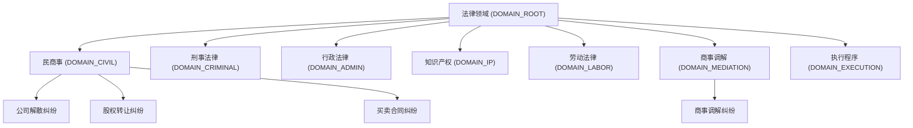
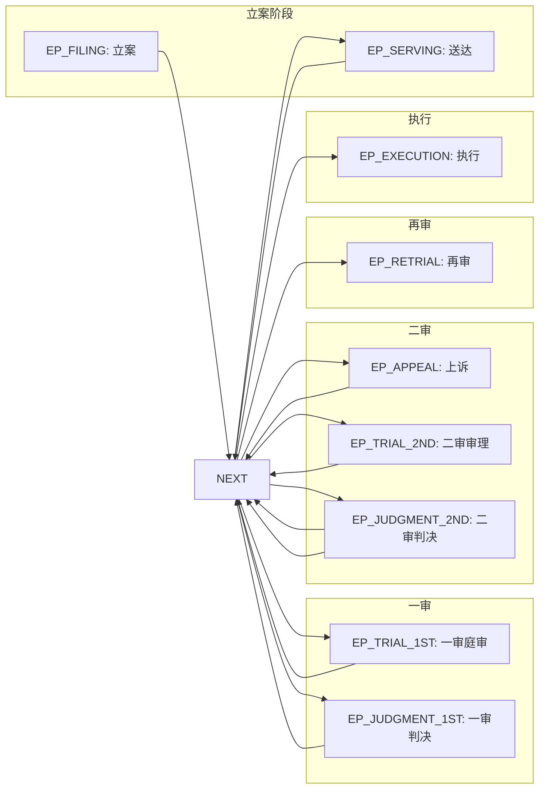
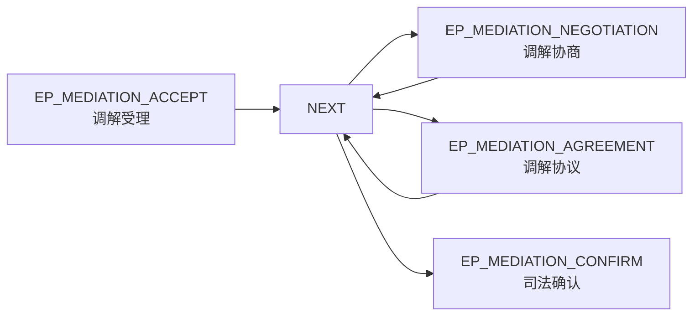

# 法律知识图谱 V3.0.0 设计方案

> 版本: V3.0.0-draft
> 日期: 2026-05-20
> 状态: 待评审
> 关联文档: `docs/legal_graph.md`、`sql/neo4j/init.cypher`、`sql/postgresql/schema.sql`、`sql/mysql/schema.sql`

---

## 1. 背景与设计目标

### 1.1 现有系统问题分析

当前 V2.0.0 版本存在以下不足：

| 问题 | 现状 | 影响 |
|------|------|------|
| Community 分类维度单一 | 仅按纠纷类型划分，无法律领域、辖区、场景等多维度 | 无法支持跨领域的聚合分析 |
| Episode 粒度粗糙 | 仅区分事件类型，无审级嵌套 | 诉讼程序还原不完整，ADR 灵活性差 |
| Entity 类型体系不完整 | `ont_class` 仅覆盖 20 个通用类，缺少法律专项分类 | 无法精确过滤和检索法律实体 |
| Relationship 语义缺失 | Neo4j 中关系类型无元数据，权重、有效性等属性分散 | 无法支持关系驱动的推理和排序 |
| 元数据与运行时数据不同步 | PostgreSQL 元数据与 Neo4j 运行时数据独立管理 | 数据一致性风险 |

### 1.2 V3.0.0 优化目标

1. **Community 分类体系** — 混合方案 C：层级嵌套（法律领域）+ 独立正交属性（辖区、场景）
2. **Episode 分类体系** — 混合方案 C：诉讼审级嵌套 + ADR 扁平化，兼容两种典型法律过程
3. **Entity 类型层次** — 8 个一级分类、完整二级分类，与 `ont_class` 一一映射
4. **Relationship 元数据** — 13 个预定义关系类型，含语义属性、权重、示例 Cypher

---

## 2. Community 分类体系

### 2.1 设计原则

采用**混合方案 C**：
- **法律领域** 用层级嵌套结构（`PARENT_OF` 关系），便于还原分类树
- **司法管辖区** 和 **应用场景** 用独立正交属性标注，便于精确过滤和跨维度查询

### 2.2 层级结构（法律领域）



### 2.3 节点属性设计

```cypher
// Community 节点示例（Neo4j）
(:Community {
  name: "公司解散纠纷",
  community_type: "dispute_resolution",     // 兼容旧字段
  legal_domain: "DOMAIN_CIVIL",             // 新增：法律领域代码
  jurisdiction: "JURISDICTION_CN",           // 新增：司法管辖区
  practice_type: "PRACTICE_JUDICIAL",       // 新增：应用场景
  definition_id: 1,
  description: "涵盖公司僵局情形下的解散清算纠纷",
  metadata: {icon: "building", color: "#2E7D32", displayPriority: 1},
  created_at: datetime(),
  updated_at: datetime()
})
```

### 2.4 社区层级关系

| 关系类型 | 说明 | 示例 |
|---------|------|------|
| `PARENT_OF` | 父社区指向子社区 | `(:Community {name:"民商事"})-[:PARENT_OF]->(:Community {name:"公司解散纠纷"})` |

### 2.5 独立属性枚举值

**jurisdiction（司法管辖区）：**

| code | 名称 | 说明 |
|------|------|------|
| `JURISDICTION_CN` | 中国法律体系 | 中华人民共和国法律体系 |
| `JURISDICTION_INTERNATIONAL` | 国际法律体系 | 国际公约、惯例等 |

**practice_type（应用场景）：**

| code | 名称 | 说明 |
|------|------|------|
| `PRACTICE_JUDICIAL` | 司法实践 | 诉讼审判 |
| `PRACTICE_ARBITRATION` | 仲裁实践 | 仲裁程序 |
| `PRACTICE_MEDIATION` | 调解实践 | 商事调解、人民调解 |
| `PRACTICE_COMPLIANCE` | 企业合规 | 合规审查、风险控制 |

---

## 3. Episode 分类体系

### 3.1 设计原则

采用**混合方案 C**：
- **诉讼类 Episode**：按审级嵌套（立案 → 一审 → 二审 → 再审 → 执行），还原完整诉讼程序
- **ADR 类 Episode（调解/仲裁）**：扁平化结构，可跨 Case 组合，支持灵活的事件聚合分析
- `court_level` 属性：仅审判类有值（一审 / 二审 / 再审 / 死刑复核），ADR 类为空

### 3.2 诉讼类 Episode 嵌套结构



### 3.3 ADR 类 Episode 扁平结构



### 3.4 Episode 节点属性设计

```cypher
// 诉讼类 Episode（Neo4j）
(:Episode {
  name: "一审庭审",
  episode_type: "EP_TRIAL_1ST",
  legal_process: "litigation",           // litigation | mediation | arbitration | execution
  stage_label: "庭审",
  court_level: "一审",                   // 一审 | 二审 | 再审 | 死刑复核（ADR类为空）
  is_trial_stage: true,
  case_id: "case_001",
  definition_id: 1,
  description: "一审法院开庭审理，当事人举证质证",
  start_time: datetime("2023-06-15T09:00:00"),
  end_time: datetime("2023-06-15T12:30:00"),
  metadata: {hearing_type: "公开审理", presiding_judge: "张某"},
  created_at: datetime(),
  updated_at: datetime()
})

// ADR类 Episode（Neo4j）
(:Episode {
  name: "调解协商",
  episode_type: "EP_MEDIATION_NEGOTIATION",
  legal_process: "mediation",
  stage_label: "调解进行",
  court_level: null,                     // ADR类无审级
  is_trial_stage: false,
  case_id: "case_mediation_001",
  definition_id: 1,
  description: "调解员主持当事人协商",
  start_time: datetime("2023-07-01T14:00:00"),
  end_time: datetime("2023-07-01T17:00:00"),
  metadata: {mediator: "李某", mediation_organization: "XX商事调解中心"},
  created_at: datetime(),
  updated_at: datetime()
})
```

### 3.5 Episode 类型枚举

| type_code | 名称 | legal_process | court_level | is_trial_stage |
|-----------|------|--------------|-------------|----------------|
| `EP_FILING` | 立案 | litigation | null | false |
| `EP_SERVING` | 送达 | litigation | null | false |
| `EP_TRIAL_1ST` | 一审庭审 | litigation | 一审 | true |
| `EP_JUDGMENT_1ST` | 一审判决 | litigation | 一审 | true |
| `EP_APPEAL` | 提起上诉 | litigation | null | false |
| `EP_TRIAL_2ND` | 二审审理 | litigation | 二审 | true |
| `EP_JUDGMENT_2ND` | 二审判决 | litigation | 二审 | true |
| `EP_RETRIAL` | 再审 | litigation | 再审 | true |
| `EP_EXECUTION` | 判决执行 | execution | null | false |
| `EP_MEDIATION_ACCEPT` | 调解受理 | mediation | null | false |
| `EP_MEDIATION_NEGOTIATION` | 调解协商 | mediation | null | false |
| `EP_MEDIATION_AGREEMENT` | 调解协议 | mediation | null | false |
| `EP_MEDIATION_CONFIRM` | 司法确认 | mediation | null | false |

---

## 4. Entity 类型层次

### 4.1 分类层次总览

```mermaid
graph TD
    CASE["案件 CASE"]
    PARTY["当事人 PARTY"]
    COURT["司法机构 COURT"]
    LAW["法律规范 LAW"]
    DOCUMENT["案件文书 DOCUMENT"]
    EVIDENCE["证据材料 EVIDENCE"]
    REASONING["裁判要旨 REASONING"]
    MEDIATION["调解主体 MEDIATION"]

    CASE --> CIVIL["民事案件 CASE_CIVIL"]
    CASE --> CRIMINAL["刑事案件 CASE_CRIMINAL"]
    CASE --> COMMERCIAL["商事案件 CASE_COMMERCIAL"]
    CASE --> ADMIN["行政案件 CASE_ADMIN"]
    CASE --> EXEC["执行案件 CASE_EXECUTION"]

    PARTY --> NATURAL["自然人 PARTY_NATURAL"]
    PARTY --> LEGAL["法人 PARTY_LEGAL"]
    PARTY --> ATTORNEY["诉讼代理人 PARTY_ATTORNEY"]

    COURT --> COURT_ORG["法院 COURT_ORG"]
    COURT --> JUDGE["法官 JUDGE"]

    LAW --> PROVISION["法律条文 LAW_PROVISION"]
    LAW --> DOC["法律法规文件 LAW_DOC"]

    DOCUMENT --> JUDGMENT["裁判文书 DOCUMENT_JUDGMENT"]
    DOCUMENT --> MED_AGREEMENT["调解协议 DOCUMENT_MED_AGREEMENT"]

    EVIDENCE --> EVID["证据 EVID_EVIDENCE"]
    EVIDENCE --> FACT["案件事实 EVID_FACT"]

    REASONING --> REAS["案例裁判要旨 REAS_REASONING"]

    MEDIATION --> MED_ORG["商事调解组织 MED_ORG"]
    MEDIATION --> MEDIATOR["调解员 MEDIATOR"]
```



### 4.2 实体分类表

| 分类代码 | 分类名称 | 级别 | 父分类 | 适用实体类型 |
|---------|---------|-----|-------|------------|
| `CASE` | 案件 | 1 | - | Case |
| `CASE_CIVIL` | 民事案件 | 2 | CASE | CivilCase |
| `CASE_CRIMINAL` | 刑事案件 | 2 | CASE | CriminalCase |
| `CASE_COMMERCIAL` | 商事案件 | 2 | CASE | CommercialCase |
| `CASE_ADMIN` | 行政案件 | 2 | CASE | AdministrativeCase |
| `CASE_EXECUTION` | 执行案件 | 2 | CASE | ExecutionCase |
| `PARTY` | 当事人 | 1 | - | Party, LegalPerson, Lawyer |
| `PARTY_NATURAL` | 自然人 | 2 | PARTY | Party |
| `PARTY_LEGAL` | 法人 | 2 | PARTY | LegalPerson |
| `PARTY_ATTORNEY` | 诉讼代理人 | 2 | PARTY | Lawyer |
| `COURT` | 司法机构 | 1 | - | Court, Judge |
| `COURT_ORG` | 法院 | 2 | COURT | Court |
| `JUDGE` | 法官 | 2 | COURT | Judge |
| `LAW` | 法律规范 | 1 | - | LegalProvision, LegalDocument |
| `LAW_PROVISION` | 法律条文 | 2 | LAW | LegalProvision |
| `LAW_DOC` | 法律法规文件 | 2 | LAW | LegalDocument |
| `DOCUMENT` | 案件文书 | 1 | - | JudgmentDocument, MediationAgreement |
| `DOCUMENT_JUDGMENT` | 裁判文书 | 2 | DOCUMENT | JudgmentDocument |
| `DOCUMENT_MED_AGREEMENT` | 调解协议 | 2 | DOCUMENT | MediationAgreement |
| `EVIDENCE` | 证据材料 | 1 | - | Evidence, CaseFact |
| `EVID_EVIDENCE` | 证据 | 2 | EVIDENCE | Evidence |
| `EVID_FACT` | 案件事实 | 2 | EVIDENCE | CaseFact |
| `REASONING` | 裁判要旨 | 1 | - | CaseReasoning |
| `REAS_REASONING` | 案例裁判要旨 | 2 | REASONING | CaseReasoning |
| `MEDIATION` | 调解主体 | 1 | - | CommercialMediationOrganization, Mediator |
| `MED_ORG` | 商事调解组织 | 2 | MEDIATION | CommercialMediationOrganization |
| `MEDIATOR` | 调解员 | 2 | MEDIATION | Mediator |

---

## 5. Relationship 元数据

### 5.1 预定义关系类型

| 关系类型 | 中文名 | 源实体类型 | 目标实体类型 | 方向性 | 多重性 | 默认权重 | 含义 |
|---------|-------|----------|------------|-------|-------|--------|------|
| `HAS_COMMUNITY` | 所属社区 | Case, LegalProvision, Court, JudgmentDocument | Community | 有向 | many-to-many | 0.9000 | 法律实体归入对应社区 |
| `PARENT_OF` | 父社区 | Community | Community | 有向 | one-to-many | 1.0000 | 社区层级关系 |
| `MENTIONS` | 涉及/提及 | Episode | Case, Party, Court, LegalProvision, Evidence, JudgmentDocument | 有向 | many-to-many | 1.0000 | 事件提及/涉及的关键法律实体 |
| `NEXT_EPISODE` | 后续事件 | Episode | Episode | 有向 | one-to-many | 1.0000 | 法律过程中事件的时序关系 |
| `CITES` | 引用/依据 | JudgmentDocument, CaseReasoning | LegalProvision | 有向 | many-to-many | 0.9500 | 裁判文书引用法条作为判决依据 |
| `INVOLVES` | 涉及 | Case, Episode | Party, LegalProvision | 有向 | many-to-many | 0.8000 | 案件或事件涉及的当事人或法条 |
| `BELONGS_TO` | 属于 | LegalProvision | LegalDocument | 有向 | many-to-many | 1.0000 | 法条属于某法律法规文件 |
| `PRECEDES` | 先例 | Case, JudgmentDocument | Case, JudgmentDocument | 有向 | many-to-many | 0.7000 | 作为后续案件参考的先例 |
| `REPRESENTS` | 代理 | Lawyer | Party | 有向 | many-to-many | 1.0000 | 律师代理当事人参与诉讼 |
| `PRESIDES_OVER` | 主持审理 | Judge | Case | 有向 | many-to-many | 1.0000 | 法官主持案件审理 |
| `PARTY_OF` | 当事人关系 | Party | Party | 无向 | many-to-many | 1.0000 | 案件中当事人之间的关系 |
| `SUBSTANTIATES` | 证明 | Evidence | CaseFact | 有向 | many-to-many | 0.9000 | 证据用于证明案件事实 |
| `AFFIRMED_BY` | 被司法确认 | MediationAgreement | JudgmentDocument | 无向 | one-to-one | 1.0000 | 调解协议经法院确认获得强制执行力 |

### 5.2 示例 Cypher 语句

```cypher
// HAS_COMMUNITY: 法律案例归入对应社区
MATCH (c:Case {caseNumber: "（2023）沪01民终11293号"})-[:HAS_COMMUNITY]->(comm:Community {name: "公司解散纠纷"})
RETURN c, comm

// MENTIONS: 事件提及关键法律实体
MATCH (ep:Episode {name: "一审起诉"})-[:MENTIONS {entity_role: "诉讼标的"}]->(ca:Case)
RETURN ep, ca

// NEXT_EPISODE: 事件时序关系
MATCH (ep1:Episode)-[:NEXT_EPISODE {sequence_order: 3}]->(ep2:Episode)
WHERE ep1.case_id = "case_001"
RETURN ep1, ep2

// CITES: 裁判文书引用法条
MATCH (jd:JudgmentDocument)-[:CITES {basisType: "判决依据"}]->(lp:LegalProvision {article: "第182条"})
RETURN jd.title, lp.content

// PRECEDES: 先例关系
MATCH (ca1:Case)-[:PRECEDES {citation_count: 15}]->(ca2:Case {caseNumber: "（2024）最高法民申123号"})
RETURN ca1.caseNumber, ca1.caseName

// AFFIRMED_BY: 调解协议司法确认
MATCH (ma:MediationAgreement)-[:AFFIRMED_BY]->(jd:JudgmentDocument)
RETURN ma.protocolContent, jd.judgmentDate

// PARENT_OF: 社区层级关系
MATCH (parent:Community)-[:PARENT_OF]->(child:Community {name: "公司解散纠纷"})
RETURN parent.name, child.name
```

---

## 6. PostgreSQL/MySQL Schema 扩展

### 6.1 新增表清单

| 表名 | 说明 |
|------|------|
| `ont_community_type` | 社区类型维度表 |
| `ont_episode_type` | 剧集类型维度表 |
| `ont_entity_category` | 实体分类层次表 |
| `ont_relationship_meta` | 关系类型元数据表 |

### 6.2 `ont_community_type` — 社区类型维度表

```sql
-- ============================================================
-- 法律知识图谱：社区类型维度表
-- 扩展法律知识图谱的社区分类体系，支持多维度分类
-- ============================================================
CREATE TABLE ont_community_type (
    id BIGSERIAL PRIMARY KEY,
    definition_id BIGINT NOT NULL,
    type_code VARCHAR(32) NOT NULL UNIQUE,
    type_name VARCHAR(128) NOT NULL,
    type_name_en VARCHAR(64),
    category VARCHAR(32) NOT NULL DEFAULT 'domain',
        -- domain: 法律领域（层级嵌套）
        -- jurisdiction: 司法管辖区
        -- practice: 应用场景
    description TEXT,
    parent_type_code VARCHAR(32),
        -- 自引用：子类型指向父类型代码（如 DOMAIN_CIVIL 指向 DOMAIN_ROOT）
    sort_order INT DEFAULT 0,
    metadata JSONB,
        -- {icon, color, displayPriority}
    status VARCHAR(20) DEFAULT 'ACTIVE',
    created_at TIMESTAMP DEFAULT CURRENT_TIMESTAMP,
    updated_at TIMESTAMP DEFAULT CURRENT_TIMESTAMP,
    CONSTRAINT fk_community_type_definition FOREIGN KEY (definition_id) REFERENCES ont_definition(id) ON DELETE CASCADE
);

CREATE INDEX idx_community_type_definition ON ont_community_type(definition_id);
CREATE INDEX idx_community_type_category ON ont_community_type(category);
CREATE INDEX idx_community_type_parent ON ont_community_type(parent_type_code);
CREATE INDEX idx_community_type_sort ON ont_community_type(sort_order);

COMMENT ON TABLE ont_community_type IS '社区类型维度表 — 定义法律知识图谱中社区的分类体系';
COMMENT ON COLUMN ont_community_type.category IS '分类维度: domain(法律领域)|jurisdiction(管辖区)|practice(应用场景)';
```

### 6.3 `ont_episode_type` — 剧集类型维度表

```sql
-- ============================================================
-- 法律知识图谱：剧集类型维度表
-- 定义法律过程中事件的分类体系
-- ============================================================
CREATE TABLE ont_episode_type (
    id BIGSERIAL PRIMARY KEY,
    definition_id BIGINT NOT NULL,
    type_code VARCHAR(32) NOT NULL UNIQUE,
    type_name VARCHAR(128) NOT NULL,
    type_name_en VARCHAR(64),
    legal_process VARCHAR(32),
        -- litigation: 诉讼 | mediation: 调解 | arbitration: 仲裁 | execution: 执行
    stage_label VARCHAR(32),
        -- 立案 | 庭审 | 调解 | 判决 | 执行
    court_level VARCHAR(32),
        -- 一审 | 二审 | 再审 | 死刑复核（仅审判程序有值，ADR类为空）
    is_trial_stage BOOLEAN DEFAULT FALSE,
        -- 是否审判阶段（庭审类为 true）
    description TEXT,
    sort_order INT DEFAULT 0,
    metadata JSONB,
    status VARCHAR(20) DEFAULT 'ACTIVE',
    created_at TIMESTAMP DEFAULT CURRENT_TIMESTAMP,
    updated_at TIMESTAMP DEFAULT CURRENT_TIMESTAMP,
    CONSTRAINT fk_episode_type_definition FOREIGN KEY (definition_id) REFERENCES ont_definition(id) ON DELETE CASCADE
);

CREATE INDEX idx_episode_type_definition ON ont_episode_type(definition_id);
CREATE INDEX idx_episode_type_legal_process ON ont_episode_type(legal_process);
CREATE INDEX idx_episode_type_court_level ON ont_episode_type(court_level);

COMMENT ON TABLE ont_episode_type IS '剧集类型维度表 — 定义法律过程中事件的分类体系';
COMMENT ON COLUMN ont_episode_type.legal_process IS '法律程序: litigation(诉讼)|mediation(调解)|arbitration(仲裁)|execution(执行)';
COMMENT ON COLUMN ont_episode_type.court_level IS '审级: 一审|二审|再审|死刑复核（仅审判程序有值）';
```

### 6.4 `ont_entity_category` — 实体分类层次表

```sql
-- ============================================================
-- 法律知识图谱：实体分类层次表
-- 扩展 ont_class，补充法律特有的分类维度
-- ============================================================
CREATE TABLE ont_entity_category (
    id BIGSERIAL PRIMARY KEY,
    definition_id BIGINT NOT NULL,
    category_code VARCHAR(32) NOT NULL,
    category_name VARCHAR(128) NOT NULL,
    category_level INT NOT NULL DEFAULT 1,
        -- 1=一级, 2=二级, 3=三级
    parent_category_code VARCHAR(32),
        -- 自引用父分类
    entity_type_scope TEXT,
        -- 适用的实体类型(JSON数组): ["Case", "Court"]
    default_attributes JSONB,
        -- 该分类下实体的默认属性模板
    description TEXT,
    sort_order INT DEFAULT 0,
    metadata JSONB,
    status VARCHAR(20) DEFAULT 'ACTIVE',
    created_at TIMESTAMP DEFAULT CURRENT_TIMESTAMP,
    updated_at TIMESTAMP DEFAULT CURRENT_TIMESTAMP,
    CONSTRAINT fk_entity_category_definition FOREIGN KEY (definition_id) REFERENCES ont_definition(id) ON DELETE CASCADE,
    CONSTRAINT uk_entity_category_code UNIQUE (definition_id, category_code)
);

CREATE INDEX idx_entity_category_definition ON ont_entity_category(definition_id);
CREATE INDEX idx_entity_category_level ON ont_entity_category(category_level);
CREATE INDEX idx_entity_category_parent ON ont_entity_category(parent_category_code);
CREATE INDEX idx_entity_category_scope ON ont_entity_category USING GIN (entity_type_scope);

COMMENT ON TABLE ont_entity_category IS '实体分类层次表 — 定义法律实体的层级分类体系';
COMMENT ON COLUMN ont_entity_category.entity_type_scope IS 'JSON数组，适用的Neo4j实体类型标签';
```

### 6.5 `ont_relationship_meta` — 关系类型元数据表

```sql
-- ============================================================
-- 法律知识图谱：关系类型元数据表
-- 定义预置关系类型的语义属性
-- ============================================================
CREATE TABLE ont_relationship_meta (
    id BIGSERIAL PRIMARY KEY,
    definition_id BIGINT NOT NULL,
    relationship_type VARCHAR(64) NOT NULL,
        -- 对应 Neo4j 关系类型名
    relationship_name VARCHAR(128) NOT NULL,
        -- 中文显示名
    relationship_name_en VARCHAR(64),
        -- 英文名
    source_entity_types TEXT,
        -- 源实体类型(JSON数组): ["Case", "JudgmentDocument"]
    target_entity_types TEXT,
        -- 目标实体类型(JSON数组)
    is_directional BOOLEAN DEFAULT TRUE,
        -- 是否有向（无向关系如 PARTY_OF, AFFIRMED_BY 为 false）
    is_transitive BOOLEAN DEFAULT FALSE,
        -- 是否可传递（仅 PRECEDES 支持）
    multiplicity VARCHAR(16) DEFAULT 'many-to-many',
        -- one-to-one | one-to-many | many-to-many
    default_weight DECIMAL(5,4) DEFAULT 1.0000,
        -- 默认权重（0.0000 - 1.0000）
    validity_period JSONB,
        -- {hasPeriod: boolean, defaultDays: integer|null}
    description TEXT,
    example_cypher TEXT,
        -- 示例 Cypher 语句
    sort_order INT DEFAULT 0,
    metadata JSONB,
    status VARCHAR(20) DEFAULT 'ACTIVE',
    created_at TIMESTAMP DEFAULT CURRENT_TIMESTAMP,
    updated_at TIMESTAMP DEFAULT CURRENT_TIMESTAMP,
    CONSTRAINT fk_relationship_meta_definition FOREIGN KEY (definition_id) REFERENCES ont_definition(id) ON DELETE CASCADE,
    CONSTRAINT uk_relationship_type UNIQUE (definition_id, relationship_type)
);

CREATE INDEX idx_relationship_meta_definition ON ont_relationship_meta(definition_id);
CREATE INDEX idx_relationship_meta_source ON ont_relationship_meta USING GIN (source_entity_types);
CREATE INDEX idx_relationship_meta_target ON ont_relationship_meta USING GIN (target_entity_types);
CREATE INDEX idx_relationship_meta_directional ON ont_relationship_meta(is_directional);

COMMENT ON TABLE ont_relationship_meta IS '关系类型元数据表 — 定义预置关系类型的语义属性和约束';
COMMENT ON COLUMN ont_relationship_meta.default_weight IS '默认权重，范围 0.0000 - 1.0000，用于关系驱动的排序和推理';
```

### 6.6 MySQL 兼容语法差异说明

| PostgreSQL 特性 | MySQL 等价处理 |
|----------------|---------------|
| `BIGSERIAL` | `BIGINT AUTO_INCREMENT` |
| `JSONB` | `JSON` |
| `CREATE INDEX ... USING GIN` | 移除 GIN，改为普通索引或使用函数索引 |
| `COMMENT ON` | 使用 `-- COMMENT` 或应用层文档 |
| `tsvector`/`tsquery` | MySQL 8.0+ FULLTEXT 索引替代 |

---

## 7. init-data.sql 扩展

### 7.1 Community 类型初始化

```sql
-- ============================================================
-- 法律知识图谱 V3.0.0: 社区类型维度初始化
-- ============================================================

-- 获取 definition_id（假设 legal_graph 定义 ID = 1）
DO $$
DECLARE
    v_def_id BIGINT := 1;
BEGIN

-- 一、按法律领域分类 (domain) - 层级嵌套
INSERT INTO ont_community_type (definition_id, type_code, type_name, type_name_en, category, parent_type_code, sort_order, metadata, description) VALUES
-- 顶级父类型
(v_def_id, 'DOMAIN_ROOT', '法律领域', 'Legal Domain', 'domain', NULL, 0,
 '{"icon": "book", "color": "#1565C0"}', '法律AI顶级社区，所有法律专题子社区的父社区'),

-- 民商事领域
(v_def_id, 'DOMAIN_CIVIL', '民商事', 'Civil & Commercial', 'domain', 'DOMAIN_ROOT', 1,
 '{"icon": "scale", "color": "#2E7D32"}', '涵盖民法、商法范围内的纠纷解决'),

-- 刑事领域
(v_def_id, 'DOMAIN_CRIMINAL', '刑事法律', 'Criminal Law', 'domain', 'DOMAIN_ROOT', 2,
 '{"icon": "shield", "color": "#C62828"}', '涵盖刑法及刑事诉讼法相关'),

-- 行政法律
(v_def_id, 'DOMAIN_ADMIN', '行政法律', 'Administrative Law', 'domain', 'DOMAIN_ROOT', 3,
 '{"icon": "building", "color": "#6A1B9A"}', '涵盖行政法、行政诉讼法'),

-- 知识产权
(v_def_id, 'DOMAIN_IP', '知识产权', 'Intellectual Property', 'domain', 'DOMAIN_ROOT', 4,
 '{"icon": "lightbulb", "color": "#F57F17"}', '涵盖专利、商标、著作权'),

-- 劳动法律
(v_def_id, 'DOMAIN_LABOR', '劳动法律', 'Labor Law', 'domain', 'DOMAIN_ROOT', 5,
 '{"icon": "briefcase", "color": "#00838F"}', '涵盖劳动法、劳动合同法'),

-- 商事调解
(v_def_id, 'DOMAIN_MEDIATION', '商事调解', 'Commercial Mediation', 'domain', 'DOMAIN_ROOT', 6,
 '{"icon": "handshake", "color": "#AD1457"}', '涵盖多元化纠纷解决机制（ADR）'),

-- 执行程序
(v_def_id, 'DOMAIN_EXECUTION', '执行程序', 'Execution Procedure', 'domain', 'DOMAIN_ROOT', 7,
 '{"icon": "gavel", "color": "#37474F"}', '涵盖民事执行、刑事执行');

-- 二、按应用场景分类 (practice) - 独立维度
INSERT INTO ont_community_type (definition_id, type_code, type_name, type_name_en, category, parent_type_code, sort_order, metadata) VALUES
(v_def_id, 'PRACTICE_JUDICIAL', '司法实践', 'Judicial Practice', 'practice', NULL, 10,
 '{"icon": "court", "color": "#1565C0"}'),
(v_def_id, 'PRACTICE_ARBITRATION', '仲裁实践', 'Arbitration Practice', 'practice', NULL, 11,
 '{"icon": "scale", "color": "#0288D1"}'),
(v_def_id, 'PRACTICE_MEDIATION', '调解实践', 'Mediation Practice', 'practice', NULL, 12,
 '{"icon": "handshake", "color": "#AD1457"}'),
(v_def_id, 'PRACTICE_COMPLIANCE', '企业合规', 'Corporate Compliance', 'practice', NULL, 13,
 '{"icon": "shield", "color": "#558B2F"}');

-- 三、按司法管辖区分类 (jurisdiction) - 独立维度
INSERT INTO ont_community_type (definition_id, type_code, type_name, type_name_en, category, sort_order, metadata) VALUES
(v_def_id, 'JURISDICTION_CN', '中国法律体系', 'China Legal System', 'jurisdiction', 20,
 '{"icon": "flag", "color": "#C62828"}'),
(v_def_id, 'JURISDICTION_INTERNATIONAL', '国际法律体系', 'International Law', 'jurisdiction', 21,
 '{"icon": "globe", "color": "#0277BD"}');

END $$;
```

### 7.2 Episode 类型初始化

```sql
-- ============================================================
-- 法律知识图谱 V3.0.0: 剧集类型维度初始化
-- ============================================================

DO $$
DECLARE
    v_def_id BIGINT := 1;
BEGIN

-- 诉讼程序 (litigation)
INSERT INTO ont_episode_type (definition_id, type_code, type_name, legal_process, stage_label, court_level, is_trial_stage, sort_order, description) VALUES
-- 立案阶段
(v_def_id, 'EP_FILING', '立案', 'litigation', '立案', NULL, FALSE, 1, '原告向法院提交诉状，法院审查受理'),
(v_def_id, 'EP_SERVING', '送达', 'litigation', '立案', NULL, FALSE, 2, '法院向被告送达起诉状副本'),

-- 一审阶段
(v_def_id, 'EP_TRIAL_1ST', '一审庭审', 'litigation', '庭审', '一审', TRUE, 10, '一审法院开庭审理，当事人举证质证'),
(v_def_id, 'EP_JUDGMENT_1ST', '一审判决', 'litigation', '判决', '一审', TRUE, 11, '一审法院作出判决'),
(v_def_id, 'EP_APPEAL', '提起上诉', 'litigation', '上诉', NULL, FALSE, 20, '当事人不服一审判决提起上诉'),

-- 二审阶段
(v_def_id, 'EP_TRIAL_2ND', '二审审理', 'litigation', '庭审', '二审', TRUE, 30, '二审法院审理上诉案件'),
(v_def_id, 'EP_JUDGMENT_2ND', '二审判决', 'litigation', '判决', '二审', TRUE, 31, '二审法院作出终审判决'),

-- 再审
(v_def_id, 'EP_RETRIAL', '再审', 'litigation', '再审', '再审', TRUE, 40, '法院依申请或依职权启动再审程序'),

-- 执行
(v_def_id, 'EP_EXECUTION', '判决执行', 'execution', '执行', NULL, FALSE, 50, '胜诉方向法院申请强制执行');

-- 调解程序 (mediation) - 扁平化
INSERT INTO ont_episode_type (definition_id, type_code, type_name, legal_process, stage_label, court_level, is_trial_stage, sort_order, description) VALUES
(v_def_id, 'EP_MEDIATION_ACCEPT', '调解受理', 'mediation', '调解启动', NULL, FALSE, 60, '调解机构受理调解申请'),
(v_def_id, 'EP_MEDIATION_NEGOTIATION', '调解协商', 'mediation', '调解进行', NULL, FALSE, 61, '调解员主持当事人协商'),
(v_def_id, 'EP_MEDIATION_AGREEMENT', '调解协议', 'mediation', '调解完成', NULL, FALSE, 62, '双方达成调解协议'),
(v_def_id, 'EP_MEDIATION_CONFIRM', '司法确认', 'mediation', '执行', NULL, FALSE, 63, '调解协议经法院确认获得强制执行力');

END $$;
```

### 7.3 Entity 分类层次初始化

```sql
-- ============================================================
-- 法律知识图谱 V3.0.0: 实体分类层次初始化
-- ============================================================

DO $$
DECLARE
    v_def_id BIGINT := 1;
BEGIN

-- 一级分类
INSERT INTO ont_entity_category (definition_id, category_code, category_name, category_level, parent_category_code, entity_type_scope, sort_order, description) VALUES
(v_def_id, 'CASE', '案件', 1, NULL, '["Case"]', 1, '所有类型案件的公共基类'),
(v_def_id, 'PARTY', '当事人', 1, NULL, '["Party", "LegalPerson", "Lawyer"]', 2, '案件中的自然人、法人及代理人'),
(v_def_id, 'COURT', '司法机构', 1, NULL, '["Court", "Judge"]', 3, '审判机关及审判人员'),
(v_def_id, 'LAW', '法律规范', 1, NULL, '["LegalProvision", "LegalDocument"]', 4, '法律法规条文及文件'),
(v_def_id, 'DOCUMENT', '案件文书', 1, NULL, '["JudgmentDocument", "MediationAgreement"]', 5, '裁判文书及调解文书'),
(v_def_id, 'EVIDENCE', '证据材料', 1, NULL, '["Evidence", "CaseFact"]', 6, '证据及案件事实'),
(v_def_id, 'REASONING', '裁判要旨', 1, NULL, '["CaseReasoning"]', 7, '案例的裁判要旨和指导意义'),
(v_def_id, 'MEDIATION', '调解主体', 1, NULL, '["CommercialMediationOrganization", "Mediator"]', 8, '商事调解组织和调解员');

-- 二级分类 - 案件
INSERT INTO ont_entity_category (definition_id, category_code, category_name, category_level, parent_category_code, entity_type_scope, sort_order) VALUES
(v_def_id, 'CASE_CIVIL', '民事案件', 2, 'CASE', '["CivilCase"]', 11),
(v_def_id, 'CASE_CRIMINAL', '刑事案件', 2, 'CASE', '["CriminalCase"]', 12),
(v_def_id, 'CASE_COMMERCIAL', '商事案件', 2, 'CASE', '["CommercialCase"]', 13),
(v_def_id, 'CASE_ADMIN', '行政案件', 2, 'CASE', '["AdministrativeCase"]', 14),
(v_def_id, 'CASE_EXECUTION', '执行案件', 2, 'CASE', '["ExecutionCase"]', 15);

-- 二级分类 - 当事人
INSERT INTO ont_entity_category (definition_id, category_code, category_name, category_level, parent_category_code, entity_type_scope, sort_order) VALUES
(v_def_id, 'PARTY_NATURAL', '自然人', 2, 'PARTY', '["Party"]', 21),
(v_def_id, 'PARTY_LEGAL', '法人', 2, 'PARTY', '["LegalPerson"]', 22),
(v_def_id, 'PARTY_ATTORNEY', '诉讼代理人', 2, 'PARTY', '["Lawyer"]', 23);

-- 二级分类 - 司法机构
INSERT INTO ont_entity_category (definition_id, category_code, category_name, category_level, parent_category_code, entity_type_scope, sort_order) VALUES
(v_def_id, 'COURT_ORG', '法院', 2, 'COURT', '["Court"]', 31),
(v_def_id, 'JUDGE', '法官', 2, 'COURT', '["Judge"]', 32);

-- 二级分类 - 法律规范
INSERT INTO ont_entity_category (definition_id, category_code, category_name, category_level, parent_category_code, entity_type_scope, sort_order) VALUES
(v_def_id, 'LAW_PROVISION', '法律条文', 2, 'LAW', '["LegalProvision"]', 41),
(v_def_id, 'LAW_DOC', '法律法规文件', 2, 'LAW', '["LegalDocument"]', 42);

-- 二级分类 - 案件文书
INSERT INTO ont_entity_category (definition_id, category_code, category_name, category_level, parent_category_code, entity_type_scope, sort_order) VALUES
(v_def_id, 'DOCUMENT_JUDGMENT', '裁判文书', 2, 'DOCUMENT', '["JudgmentDocument"]', 51),
(v_def_id, 'DOCUMENT_MED_AGREEMENT', '调解协议', 2, 'DOCUMENT', '["MediationAgreement"]', 52);

-- 二级分类 - 证据材料
INSERT INTO ont_entity_category (definition_id, category_code, category_name, category_level, parent_category_code, entity_type_scope, sort_order) VALUES
(v_def_id, 'EVID_EVIDENCE', '证据', 2, 'EVIDENCE', '["Evidence"]', 61),
(v_def_id, 'EVID_FACT', '案件事实', 2, 'EVIDENCE', '["CaseFact"]', 62);

-- 二级分类 - 裁判要旨
INSERT INTO ont_entity_category (definition_id, category_code, category_name, category_level, parent_category_code, entity_type_scope, sort_order) VALUES
(v_def_id, 'REAS_REASONING', '案例裁判要旨', 2, 'REASONING', '["CaseReasoning"]', 71);

-- 二级分类 - 调解主体
INSERT INTO ont_entity_category (definition_id, category_code, category_name, category_level, parent_category_code, entity_type_scope, sort_order) VALUES
(v_def_id, 'MED_ORG', '商事调解组织', 2, 'MEDIATION', '["CommercialMediationOrganization"]', 81),
(v_def_id, 'MEDIATOR', '调解员', 2, 'MEDIATION', '["Mediator"]', 82);

END $$;
```

### 7.4 Relationship 元数据初始化

```sql
-- ============================================================
-- 法律知识图谱 V3.0.0: 关系类型元数据初始化
-- ============================================================

DO $$
DECLARE
    v_def_id BIGINT := 1;
BEGIN

INSERT INTO ont_relationship_meta
    (definition_id, relationship_type, relationship_name, source_entity_types, target_entity_types,
     is_directional, is_transitive, multiplicity, default_weight, validity_period, description, example_cypher)
VALUES
-- HAS_COMMUNITY
(v_def_id, 'HAS_COMMUNITY', '所属社区',
 '["Case", "LegalProvision", "Court", "JudgmentDocument"]', '["Community"]',
 TRUE, FALSE, 'many-to-many', 0.9000,
 '{"hasPeriod": false}',
 '法律实体归入对应社区',
 'MATCH (c:Case {caseNumber: "（2023）沪01民终11293号"})-[:HAS_COMMUNITY]->(comm:Community {name: "公司解散纠纷"})'),

-- PARENT_OF
(v_def_id, 'PARENT_OF', '父社区',
 '["Community"]', '["Community"]',
 TRUE, FALSE, 'one-to-many', 1.0000,
 '{"hasPeriod": false}',
 '社区层级关系',
 'MATCH (parent:Community)-[:PARENT_OF]->(child:Community {name: "公司解散纠纷"})'),

-- MENTIONS
(v_def_id, 'MENTIONS', '涉及/提及',
 '["Episode"]', '["Case", "Party", "Court", "LegalProvision", "Evidence", "JudgmentDocument"]',
 TRUE, FALSE, 'many-to-many', 1.0000,
 '{"hasPeriod": false}',
 '事件提及/涉及的关键法律实体',
 'MATCH (ep:Episode {name: "一审起诉"})-[:MENTIONS {entity_role: "诉讼标的"}]->(ca:Case)'),

-- NEXT_EPISODE
(v_def_id, 'NEXT_EPISODE', '后续事件',
 '["Episode"]', '["Episode"]',
 TRUE, FALSE, 'one-to-many', 1.0000,
 '{"hasPeriod": false}',
 '法律过程中事件的时序关系',
 'MATCH (ep1:Episode)-[:NEXT_EPISODE {sequence_order: 3}]->(ep2:Episode)'),

-- CITES
(v_def_id, 'CITES', '引用/依据',
 '["JudgmentDocument", "CaseReasoning"]', '["LegalProvision"]',
 TRUE, FALSE, 'many-to-many', 0.9500,
 '{"hasPeriod": true, "defaultDays": null}',
 '裁判文书引用法条作为判决依据',
 'MATCH (jd:JudgmentDocument)-[:CITES {basisType: "判决依据"}]->(lp:LegalProvision)'),

-- INVOLVES
(v_def_id, 'INVOLVES', '涉及',
 '["Case", "Episode"]', '["Party", "LegalProvision"]',
 TRUE, FALSE, 'many-to-many', 0.8000,
 '{"hasPeriod": false}',
 '案件或事件涉及的当事人或法条',
 'MATCH (ca:Case)-[:INVOLVES {partyRole: "被告"}]->(p:Party)'),

-- BELONGS_TO
(v_def_id, 'BELONGS_TO', '属于',
 '["LegalProvision"]', '["LegalDocument"]',
 TRUE, FALSE, 'many-to-many', 1.0000,
 '{"hasPeriod": true, "defaultDays": null}',
 '法条属于某法律法规文件',
 'MATCH (lp:LegalProvision)-[:BELONGS_TO]->(ld:LegalDocument)'),

-- PRECEDES
(v_def_id, 'PRECEDES', '先例',
 '["Case", "JudgmentDocument"]', '["Case", "JudgmentDocument"]',
 TRUE, TRUE, 'many-to-many', 0.7000,
 '{"hasPeriod": false}',
 '案件或裁判作为后续案件参考的先例',
 'MATCH (ca1:Case)-[:PRECEDES {citation_count: 15}]->(ca2:Case)'),

-- REPRESENTS
(v_def_id, 'REPRESENTS', '代理',
 '["Lawyer"]', '["Party"]',
 TRUE, FALSE, 'many-to-many', 1.0000,
 '{"hasPeriod": true, "defaultDays": null}',
 '律师代理当事人参与诉讼',
 'MATCH (law:Lawyer)-[:REPRESENTS {caseNumber: "（2023）沪01民终11293号"}]->(p:Party)'),

-- PRESIDES_OVER
(v_def_id, 'PRESIDES_OVER', '主持审理',
 '["Judge"]', '["Case"]',
 TRUE, FALSE, 'many-to-many', 1.0000,
 '{"hasPeriod": true, "defaultDays": null}',
 '法官主持案件审理',
 'MATCH (j:Judge)-[:PRESIDES_OVER {courtLevel: "二审"}]->(ca:Case)'),

-- PARTY_OF
(v_def_id, 'PARTY_OF', '当事人关系',
 '["Party"]', '["Party"]',
 FALSE, FALSE, 'many-to-many', 1.0000,
 '{"hasPeriod": true, "defaultDays": null}',
 '案件中当事人之间的关系（原告/被告/第三人）',
 'MATCH (p1:Party)-[:PARTY_OF {relationship: "原告", caseNumber: "（2023）"}]->(p2:Party)'),

-- SUBSTANTIATES
(v_def_id, 'SUBSTANTIATES', '证明',
 '["Evidence"]', '["CaseFact"]',
 TRUE, FALSE, 'many-to-many', 0.9000,
 '{"hasPeriod": false}',
 '证据用于证明案件事实',
 'MATCH (ev:Evidence)-[:SUBSTANTIATES {weight: 0.8}]->(f:CaseFact)'),

-- AFFIRMED_BY
(v_def_id, 'AFFIRMED_BY', '被司法确认',
 '["MediationAgreement"]', '["JudgmentDocument"]',
 FALSE, FALSE, 'one-to-one', 1.0000,
 '{"hasPeriod": true, "defaultDays": null}',
 '调解协议经法院确认获得强制执行力',
 'MATCH (ma:MediationAgreement)-[:AFFIRMED_BY]->(jd:JudgmentDocument)');

END $$;
```

---

## 8. Neo4j init.cypher 增强

### 8.1 现有社区节点的类型映射

| 现有 `community_type` 值 | 映射到 `ont_community_type.type_code` | 分类维度 |
|---------------------|--------------------------------------|---------|
| `top_level` | `DOMAIN_ROOT` | domain |
| `dispute_resolution` | `DOMAIN_MEDIATION` | domain |
| `corporate_dispute` | `DOMAIN_CIVIL` | domain |
| `procedural_law` | `DOMAIN_CIVIL` | domain |
| `intellectual_property` | `DOMAIN_IP` | domain |
| `labor_dispute` | `DOMAIN_LABOR` | domain |
| `foundational_civil_law` | `DOMAIN_CIVIL` | domain |

**迁移 Cypher（V3.0.0 数据迁移脚本中执行）：**

```cypher
// 迁移现有 Community 节点，补充新字段
MATCH (c:Community)
WHERE c.community_type = 'top_level'
SET c.legal_domain = 'DOMAIN_ROOT', c.jurisdiction = 'JURISDICTION_CN', c.practice_type = 'PRACTICE_JUDICIAL';

MATCH (c:Community)
WHERE c.community_type = 'dispute_resolution'
SET c.legal_domain = 'DOMAIN_MEDIATION', c.jurisdiction = 'JURISDICTION_CN', c.practice_type = 'PRACTICE_MEDIATION';

MATCH (c:Community)
WHERE c.community_type = 'corporate_dispute'
SET c.legal_domain = 'DOMAIN_CIVIL', c.jurisdiction = 'JURISDICTION_CN', c.practice_type = 'PRACTICE_JUDICIAL';

// ... 其他映射类似
```

### 8.2 新增 PARENT_OF 关系

```cypher
// ============================================================
// 法律知识图谱 V3.0.0: 社区层级关系初始化
// ============================================================

// 民商事领域层级
MATCH (parent:Community {name: '民商事'}), (child:Community {name: '公司解散纠纷'})
MERGE (parent)-[:PARENT_OF]->(child);

// 民商事 - 股权转让
MATCH (parent:Community {name: '民商事'}), (child:Community {name: '股权转让纠纷'})
MERGE (parent)-[:PARENT_OF]->(child);

// 民商事 - 买卖合同
MATCH (parent:Community {name: '民商事'}), (child:Community {name: '买卖合同纠纷'})
MERGE (parent)-[:PARENT_OF]->(child);

// 法律领域顶层
MATCH (root:Community {community_type: 'top_level'}), (civil:Community {name: '民商事'})
MERGE (root)-[:PARENT_OF]->(civil);

// 商事调解
MATCH (root:Community {community_type: 'top_level'}), (med:Community {community_type: 'dispute_resolution'})
MERGE (root)-[:PARENT_OF]->(med);
```

### 8.3 增强索引建议

```cypher
// ============================================================
// 法律知识图谱 V3.0.0: 增强索引
// ============================================================

// 按社区类型维度建复合索引
CREATE INDEX community_domain_jurisdiction IF NOT EXISTS
  FOR (c:Community) ON (c.legal_domain, c.jurisdiction);

// 按社区场景建复合索引
CREATE INDEX community_practice IF NOT EXISTS
  FOR (c:Community) ON (c.practice_type, c.legal_domain);

// 按剧集类型和时间范围建复合索引
CREATE INDEX episode_type_time IF NOT EXISTS
  FOR (e:Episode) ON (e.episode_type, e.start_time);

// 按剧集审级建复合索引
CREATE INDEX episode_court_level IF NOT EXISTS
  FOR (e:Episode) ON (e.court_level, e.episode_type);

// 按关系类型建全局索引
CREATE INDEX relationship_type_v3 IF NOT EXISTS
  FOR ()-[r]-() ON (r.graph_id, type(r));

// 按关系权重建索引（支持关系驱动的排序）
CREATE INDEX relationship_weight IF NOT EXISTS
  FOR ()-[r]-() ON (r.weight);
```

### 8.4 现有 Episode 节点迁移

```cypher
// ============================================================
// V3.0.0 Episode 节点迁移：补充 episode_type 字段
// ============================================================

// 现有 Episode 节点回填 episode_type
MATCH (e:Episode)
WHERE e.episode_type IS NULL
SET e.episode_type = CASE e.name
    WHEN '起诉' THEN 'EP_FILING'
    WHEN '一审庭审' THEN 'EP_TRIAL_1ST'
    WHEN '一审判决' THEN 'EP_JUDGMENT_1ST'
    WHEN '上诉' THEN 'EP_APPEAL'
    WHEN '二审庭审' THEN 'EP_TRIAL_2ND'
    WHEN '二审判决' THEN 'EP_JUDGMENT_2ND'
    WHEN '再审' THEN 'EP_RETRIAL'
    WHEN '执行' THEN 'EP_EXECUTION'
    WHEN '调解受理' THEN 'EP_MEDIATION_ACCEPT'
    WHEN '调解协商' THEN 'EP_MEDIATION_NEGOTIATION'
    WHEN '调解协议' THEN 'EP_MEDIATION_AGREEMENT'
    WHEN '司法确认' THEN 'EP_MEDIATION_CONFIRM'
    ELSE 'EP_UNKNOWN'
END,
    e.legal_process = CASE
    WHEN e.name IN ['起诉', '一审庭审', '一审判决', '上诉', '二审庭审', '二审判决', '再审'] THEN 'litigation'
    WHEN e.name IN ['调解受理', '调解协商', '调解协议', '司法确认'] THEN 'mediation'
    WHEN e.name = '执行' THEN 'execution'
    ELSE 'unknown'
END,
    e.court_level = CASE
    WHEN e.name IN ['一审庭审', '一审判决'] THEN '一审'
    WHEN e.name IN ['二审庭审', '二审判决'] THEN '二审'
    WHEN e.name = '再审' THEN '再审'
    ELSE NULL
END,
    e.is_trial_stage = CASE WHEN e.name IN ['一审庭审', '一审判决', '二审庭审', '二审判决', '再审'] THEN true ELSE false END;
```

---

## 9. 数据迁移策略

### 9.1 增量迁移（零停机）

```
Step 1: 新增表（向后兼容，无数据破坏）
        直接运行 DDL 添加 4 张新表，不影响现有业务

Step 2: 初始化基础元数据
        运行 ont_community_type / ont_episode_type /
        ont_entity_category / ont_relationship_meta 的 INSERT 语句

Step 3: 历史数据回填（从 Neo4j 读取，映射到关系库）
        执行 8.1 - 8.4 的迁移 Cypher
        Service 层实现：读取 Neo4j 中已有的 Community/Episode，
        补充新字段，同时写入 PostgreSQL 元数据表

Step 4: 增量写入双写
        新增/修改 Community/Episode 时，
        同时写入 Neo4j 和 PostgreSQL 元数据表
        （在 SchemaManagementService 中实现）
```

### 9.2 版本升级路径

```
V2.0.0 (当前)    仅通用本体类
    │
    ▼  新增 4 张元数据表 + 基础元数据初始化
V3.0.0           完整的 Community/Episode/Entity/Relationship 元数据
    │
    ▼  回填历史数据 + Service 层双写逻辑
V3.1.0           元数据与运行时数据同步
    │
    ▼  前端 UI 集成元数据管理
V3.2.0           GraphIDE 集成元数据管理（社区类型、剧集类型管理）
```

---

## 10. 变更文件清单

| 文件 | 变更类型 | 变更内容摘要 |
|------|---------|------------|
| `sql/postgresql/schema.sql` | 修改 | 追加 4 张新表（`ont_community_type`、`ont_episode_type`、`ont_entity_category`、`ont_relationship_meta`） |
| `sql/mysql/schema.sql` | 修改 | 追加 4 张新表（MySQL 兼容语法） |
| `sql/postgresql/init-data.sql` | 修改 | 追加 V3.0.0 元数据初始化（Community/Episode/Entity/Relationship） |
| `sql/mysql/init-data.sql` | 修改 | 追加 V3.0.0 元数据初始化（MySQL 兼容语法） |
| `sql/neo4j/init.cypher` | 修改 | 增强索引 + 新增 `PARENT_OF` 关系 + Episode 节点迁移 Cypher |

---

## 附录 A：PostgreSQL 与 Neo4j 元数据映射关系

```
PostgreSQL/MySQL 元数据表               →    Neo4j 图数据
────────────────────────────────────────────────────────────────────────
ont_community_type (类型枚举)           →    Community.legal_domain 属性
                                         →    Community.jurisdiction 属性
                                         →    Community.practice_type 属性

ont_episode_type (剧集分类)            →    Episode.episode_type 属性
                                         →    Episode.legal_process 属性
                                         →    Episode.court_level 属性
                                         →    Episode.is_trial_stage 属性

ont_entity_category (实体分类)          →    Entity.type 属性（与 ont_class.local_name 对应）
                                         →    Entity.subType 属性（二级分类）

ont_relationship_meta (关系元数据)      →    Neo4j 中每种关系类型作为 Label
                                         →    关系属性与元数据对齐（weight, validity 等）
```

---

## 11. 前端代码变更

> 关联文件：`graphiti-web/src/`

### 11.1 变更概览

| 文件 | 变更类型 | 核心变更 |
|------|---------|---------|
| `src/api/graph.ts` | 扩展类型 + 新增接口 | `CommunityV3`、`EpisodeV3`、`EntityV3`、`RelationshipV3` 接口；新增层级/过滤 API |
| `src/api/episode.ts` | 扩展类型 | 新增 `episode_type`、`legal_process`、`court_level`、`is_trial_stage` |
| `src/api/edge.ts` | 扩展类型 | 新增 `type_name`、`weight`、`is_directional` |
| `src/types/graph-ide.ts` | 新增类型 | `CommunityType`、`EpisodeType`、`EntityCategory`、`RelationshipMeta` |
| `src/views/graph/ide.vue` | UI 更新 | 社区树形视图、层级 Episode 展示、V3 色彩体系 |
| `src/views/episodes/index.vue` | 列更新 | 新增 episode_type、legal_process、court_level、stage_label 列 |
| `src/views/communities/index.vue` | 重构 | 树形视图、多维度过滤器、扩展详情面板 |
| `src/views/edges/index.vue` | 新增选择器 | 13 种预定义关系类型下拉选择、元数据显示 |
| `src/views/data/entities.vue` | 新增列 | 显示实体分类层级、按分类过滤 |
| `src/components/Graph/NodeEditModal.vue` | 新增选择器 | 分类下拉树 |

### 11.2 新增 TypeScript 类型定义

```typescript
// src/types/graph-ide.ts — 新增以下类型

// 社区 V3 节点
interface CommunityV3 {
  uuid: string
  name: string
  community_type: string          // 兼容旧字段
  legal_domain: string            // NEW: DOMAIN_CIVIL, DOMAIN_CRIMINAL, etc.
  jurisdiction: string            // NEW: JURISDICTION_CN, etc.
  practice_type: string            // NEW: PRACTICE_JUDICIAL, PRACTICE_MEDIATION, etc.
  parentCommunityId?: string       // NEW: PARENT_OF 父社区
  summary?: string
  memberCount?: number
  keyProvisions?: string[]         // NEW: 关键法条 ID 列表
  description?: string
  metadata?: { icon: string; color: string; displayPriority: number }
}

// Episode V3 节点
interface EpisodeV3 {
  uuid: string
  name: string
  episode_type: string              // NEW: EP_TRIAL_1ST, EP_MEDIATION_NEGOTIATION, etc.
  legal_process: string            // NEW: litigation | mediation | arbitration | execution
  stage_label: string              // NEW: 立案 | 庭审 | 调解 | 判决 | 执行
  court_level: string | null       // NEW: 一审 | 二审 | 再审 | 死刑复核（ADR类为空）
  is_trial_stage: boolean          // NEW: 是否审判阶段
  case_id: string
  start_time?: string
  end_time?: string
  content?: string
  source?: string
}

// 实体 V3（含分类层级）
interface EntityV3 {
  uuid: string
  name: string
  type: string                     // e.g., "Case", "Party", "Judge"
  category: string                 // NEW: CASE, PARTY_NATURAL, COURT_ORG, etc.
  categoryLevel: number            // NEW: 1 (一级) or 2 (二级)
  properties: Record<string, any>
}

// 关系 V3（含元数据）
interface RelationshipV3 {
  uuid: string
  source: string
  target: string
  type: string                     // HAS_COMMUNITY, MENTIONS, CITES, PRECEDES, etc.
  name: string                     // 中文名: 所属社区, 涉及/提及, etc.
  is_directional: boolean          // NEW: 有向 or 无向
  default_weight: number           // NEW: 0.0000 - 1.0000
  properties?: Record<string, any>
}

// 社区类型元数据
interface CommunityType {
  id: number
  type_code: string                // DOMAIN_CIVIL, PRACTICE_JUDICIAL, JURISDICTION_CN, etc.
  type_name: string
  category: 'domain' | 'jurisdiction' | 'practice'
  parent_type_code?: string
  sort_order: number
  metadata: { icon: string; color: string; displayPriority: number }
}

// Episode 类型元数据
interface EpisodeType {
  id: number
  type_code: string                // EP_TRIAL_1ST, EP_MEDIATION_NEGOTIATION, etc.
  type_name: string
  legal_process: string             // litigation | mediation | arbitration | execution
  stage_label: string
  court_level: string | null
  is_trial_stage: boolean
}

// 实体分类（层级）
interface EntityCategory {
  id: number
  category_code: string            // CASE, PARTY_NATURAL, COURT_ORG, etc.
  category_name: string
  category_level: number           // 1 or 2
  parent_category_code?: string
  entity_type_scope: string[]      // 适用的 Neo4j 实体类型标签
}

// 关系元数据
interface RelationshipMeta {
  id: number
  relationship_type: string        // HAS_COMMUNITY, CITES, PRECEDES, etc.
  relationship_name: string         // 所属社区, 引用/依据, etc.
  source_entity_types: string[]
  target_entity_types: string[]
  is_directional: boolean
  is_transitive: boolean
  multiplicity: string
  default_weight: number
  validity_period: { hasPeriod: boolean; defaultDays: number | null }
  description: string
  example_cypher: string
}
```

### 11.3 新增 API 接口

```typescript
// src/api/graph.ts — 新增接口

// 社区层级结构（PARENT_OF 树）
export const getCommunityHierarchy = (graphId: string) =>
  request.get<CommunityV3[]>(`/graph/${graphId}/communities/hierarchy`)

// 按法律领域过滤社区
export const getCommunitiesByDomain = (graphId: string, domain: string) =>
  request.get<CommunityV3[]>(`/graph/${graphId}/communities/by-domain`, {
    params: { domain }
  })

// 按司法管辖区过滤社区
export const getCommunitiesByJurisdiction = (graphId: string, jurisdiction: string) =>
  request.get<CommunityV3[]>(`/graph/${graphId}/communities/by-jurisdiction`, {
    params: { jurisdiction }
  })

// Episode 按法律程序分组
export const getEpisodesByProcess = (graphId: string, legalProcess?: string) =>
  request.get<Record<string, EpisodeV3[]>>(`/graph/${graphId}/episodes/by-process`, {
    params: { legalProcess }
  })

// 实体按分类分组
export const getEntitiesByCategory = (graphId: string, category?: string) =>
  request.get<Record<string, EntityV3[]>>(`/graph/${graphId}/entities/by-category`, {
    params: { category }
  })

// 关系类型元数据
export const getRelationshipMetadata = (graphId: string) =>
  request.get<RelationshipMeta[]>(`/graph/${graphId}/relationships/metadata`)

// 社区类型元数据
export const getCommunityTypes = (graphId: string) =>
  request.get<CommunityType[]>(`/graph/${graphId}/community-types`)

// Episode 类型元数据
export const getEpisodeTypes = (graphId: string) =>
  request.get<EpisodeType[]>(`/graph/${graphId}/episode-types`)

// 实体分类元数据
export const getEntityCategories = (graphId: string) =>
  request.get<EntityCategory[]>(`/graph/${graphId}/entity-categories`)
```

### 11.4 `ide.vue` 可视化组件变更

**社区面板变更：**

```vue
<!-- ide.vue — 左侧边栏社区面板（简化示意） -->
<template>
  <!-- 维度切换 Tabs -->
  <a-tabs v-model:activeKey="communityFilterDimension">
    <a-tab-pane key="domain" tab="法律领域" />
    <a-tab-pane key="jurisdiction" tab="司法辖区" />
    <a-tab-pane key="practice" tab="应用场景" />
  </a-tabs>

  <!-- 树形视图（支持 PARENT_OF 层级） -->
  <a-tree
    :treeData="communityTreeData"
    :loadData="loadCommunityChildren"
    :showIcon="true"
    @select="handleCommunitySelect"
  >
    <template #icon="{ node }">
      <Tag :color="node.communityColor">{{ node.communityType }}</Tag>
    </template>
  </a-tree>

  <!-- 搜索框 -->
  <a-input-search
    v-model:value="communitySearchText"
    placeholder="搜索社区..."
    @search="searchCommunities"
    style="margin-bottom: 12px"
  />
</template>

<script setup lang="ts">
// 新增数据
const communityTreeData = ref<CommunityTreeNode[]>([])
const communityFilterDimension = ref<'domain' | 'jurisdiction' | 'practice'>('domain')
const communitySearchText = ref('')

// 获取社区树（按维度）
const loadCommunityTree = async () => {
  const data = await getCommunityHierarchy(props.graphId)
  communityTreeData.value = buildTree(data, communityFilterDimension.value)
}

// 维度切换时重新加载
watch(communityFilterDimension, () => loadCommunityTree())

// 社区节点颜色方案（V3 色彩体系）
const communityColorMap: Record<string, string> = {
  DOMAIN_CIVIL: '#2E7D32',
  DOMAIN_CRIMINAL: '#C62828',
  DOMAIN_ADMIN: '#6A1B9A',
  DOMAIN_IP: '#F57F17',
  DOMAIN_LABOR: '#00838F',
  DOMAIN_MEDIATION: '#AD1457',
  DOMAIN_EXECUTION: '#37474F',
  JURISDICTION_CN: '#C62828',
  PRACTICE_JUDICIAL: '#1565C0',
  PRACTICE_MEDIATION: '#AD1457',
}
</script>
```

**Episode 面板变更（按 legal_process 分组）：**

```vue
<!-- ide.vue — Episode 面板（简化示意） -->
<template>
  <!-- 按法律程序分组的 Accordion -->
  <a-collapse v-model:activeKey="episodeActiveKeys">
    <a-collapse-panel
      v-for="(episodes, process) in episodesByProcess"
      :key="process"
      :header="processLabelMap[process]"
    >
      <a-timeline>
        <a-timeline-item
          v-for="ep in episodes"
          :key="ep.uuid"
          :color="episodeColorMap[ep.episode_type]"
        >
          <div>{{ ep.name }}</div>
          <Tag v-if="ep.court_level" size="small">{{ ep.court_level }}</Tag>
          <Tag v-if="ep.episode_type" size="small" :color="typeColorMap[ep.episode_type]">
            {{ ep.episode_type }}
          </Tag>
          <div v-if="ep.start_time" class="episode-time">
            {{ formatDate(ep.start_time) }}
          </div>
        </a-timeline-item>
      </a-timeline>
    </a-collapse-panel>
  </a-collapse>
</template>

<script setup lang="ts">
// 按 legal_process 分组
const episodesByProcess = computed(() =>
  groupBy(episodes.value, 'legal_process')
)

const processLabelMap: Record<string, string> = {
  litigation: '诉讼程序',
  mediation: '调解程序',
  arbitration: '仲裁程序',
  execution: '执行程序',
}
</script>
```

### 11.5 `communities/index.vue` 重构

**详情面板新增字段：**

```vue
<!-- 社区详情面板 -->
<a-descriptions :column="2" bordered size="small">
  <a-descriptions-item label="UUID">{{ community.uuid }}</a-descriptions-item>
  <a-descriptions-item label="成员数量">{{ community.memberCount }}</a-descriptions-item>
  <!-- V3 新增字段 -->
  <a-descriptions-item label="法律领域">
    <Tag :color="domainColorMap[community.legal_domain]">
      {{ community.legal_domain }}
    </Tag>
  </a-descriptions-item>
  <a-descriptions-item label="司法管辖区">
    <Tag>{{ community.jurisdiction }}</Tag>
  </a-descriptions-item>
  <a-descriptions-item label="应用场景">
    <Tag>{{ community.practice_type }}</Tag>
  </a-descriptions-item>
  <a-descriptions-item label="父社区">
    <a @click="navigateToParent(community.parentCommunityId)">
      {{ community.parentCommunityId || '无' }}
    </a>
  </a-descriptions-item>
  <a-descriptions-item label="关键法条" :span="2">
    <Tag v-for="p in community.keyProvisions" :key="p">{{ p }}</Tag>
  </a-descriptions-item>
  <a-descriptions-item label="摘要" :span="2">{{ community.summary }}</a-descriptions-item>
</a-descriptions>
```

**多维度过滤器：**

```vue
<a-form layout="inline" style="margin-bottom: 16px">
  <a-form-item label="法律领域">
    <a-select
      v-model:value="filters.legal_domain"
      :options="domainOptions"
      placeholder="全部"
      allowClear
      style="width: 140px"
    />
  </a-form-item>
  <a-form-item label="管辖区">
    <a-select
      v-model:value="filters.jurisdiction"
      :options="jurisdictionOptions"
      placeholder="全部"
      allowClear
      style="width: 140px"
    />
  </a-form-item>
  <a-form-item label="应用场景">
    <a-select
      v-model:value="filters.practice_type"
      :options="practiceOptions"
      placeholder="全部"
      allowClear
      style="width: 140px"
    />
  </a-form-item>
  <a-form-item>
    <a-button @click="resetFilters">重置</a-button>
  </a-form-item>
</a-form>
```

### 11.6 `edges/index.vue` 关系类型选择器

```vue
<!-- 关系创建/编辑 — 预定义类型选择 -->
<a-form-item label="关系类型" name="relationshipType">
  <a-select
    v-model:value="formState.relationshipType"
    placeholder="选择关系类型"
    showSearch
    :options="relationshipOptions"
    @change="onRelationshipTypeChange"
  >
    <a-select-option :value="rel.relationship_type" v-for="rel in relationshipMeta" :key="rel.id">
      <div>
        <span>{{ rel.relationship_name }}</span>
        <span style="color: #999; font-size: 12px; margin-left: 8px">
          {{ rel.relationship_type }}
        </span>
      </div>
    </a-select-option>
  </a-select>
</a-form-item>

<!-- 选择后显示关系说明 -->
<a-alert
  v-if="selectedRelationshipMeta"
  :message="selectedRelationshipMeta.description"
  type="info"
  showIcon
  style="margin-bottom: 16px"
>
  <template #action>
    <a-tooltip :title="selectedRelationshipMeta.example_cypher">
      <a-button size="small">查看 Cypher 示例</a-button>
    </a-tooltip>
  </template>
</a-alert>

<!-- 关系权重 -->
<a-form-item label="权重" name="weight">
  <a-input-number
    v-model:value="formState.weight"
    :min="0"
    :max="1"
    :step="0.0001"
    :precision="4"
    style="width: 200px"
  />
  <span style="margin-left: 8px; color: #999">
    默认: {{ selectedRelationshipMeta?.default_weight }}
  </span>
</a-form-item>

<!-- 关系列表新增列 -->
<a-table-columns>
  <a-table-column title="关系类型" dataIndex="type">
    <template #default="{ record }">
      <Tag :color="getRelationshipColor(record.type)">{{ record.name }}</Tag>
    </template>
  </a-table-column>
  <a-table-column title="方向性">
    <template #default="{ record }">
      {{ record.is_directional ? '有向' : '无向' }}
    </template>
  </a-table-column>
  <a-table-column title="权重" dataIndex="default_weight" />
</a-table-columns>
```

### 11.7 `entities/index.vue` 分类列

```vue
<!-- 实体列表新增分类列 -->
<a-table-column title="分类" dataIndex="category">
  <template #default="{ record }">
    <a-tag :color="categoryColorMap[record.category]">
      {{ record.category }}
    </a-tag>
    <span v-if="record.categoryLevel === 2" style="color: #999; font-size: 12px">
      ({{ record.parentCategory }})
    </span>
  </template>
</a-table-column>

<!-- 分类过滤器 -->
<a-form-item label="实体分类">
  <a-tree-select
    v-model:value="entityFilter.category"
    :treeData="entityCategoryTree"
    placeholder="按分类筛选"
    allowClear
    treeDefaultExpandAll
    style="width: 200px"
  />
</a-form-item>
```

---

## 12. 后端代码变更

> 关联文件：`graphiti-module-core/src/main/java/com/graphiti/module/graphiti/`

### 12.1 变更概览

| 文件 | 变更类型 | 核心变更 |
|------|---------|---------|
| `service/impl/CommunityServiceImpl.java` | Cypher 更新 | `buildSingleCommunity` 增加 V3 字段；`listCommunities`/`searchCommunities` RETURN 新字段 |
| `service/impl/EpisodeServiceImpl.java` | VO 扩展 | `createEpisode` 提取新字段；查询结果包含 V3 字段 |
| `service/GraphNeo4jService.java` | Cypher 更新 | Episode 查询 RETURN 新字段；新增 V3 索引查询 |
| `service/GraphVisualizationService.java` | VO 扩展 | Community/Episode 可视化返回 V3 字段；`getGraphStats` 统计 Episode 数量 |
| `service/SchemaManagementService.java` | 逻辑更新 | `getClassInstances` 关键词搜索扩展；`extractNodeName` 新增类型分支 |
| `vo/episode/EpisodeInfoRespVO.java` | 新增字段 | `episodeType`、`legalProcess`、`courtLevel`、`stageLabel`、`startTime`、`endTime` |
| `vo/community/CommunityInfoRespVO.java` | 新增类型 | 替代 `Map<String, Object>` 返回类型，含所有 V3 字段 |
| `vo/community/CommunityFilterReqVO.java` | 新增类型 | 按 `legalDomain`、`jurisdiction`、`practiceType` 过滤 |
| `vo/community/CommunityListRespVO.java` | 新增类型 | 分页返回社区列表 |

### 12.2 CommunityServiceImpl — `buildSingleCommunity` 更新

```java
// service/impl/CommunityServiceImpl.java

private static final String BUILD_SINGLE_COMMUNITY_CYPHER = """
    MATCH (m:Entity {graph_id: $graphId, community: $communityName})
    WITH collect(DISTINCT m) AS members
    // ... LLM summary generation ...
    // ... other fields ...

    // 创建社区节点
    CREATE (c:Community {
        uuid: $communityUuid,
        name: $communityName,
        graph_id: $graphId,
        summary: $summary,
        member_count: size(members),
        parent_community_uuid: $parentCommunityUuid,

        // V3.0.0 新增字段
        community_type: $communityType,           // e.g. 'corporate_dispute'
        legal_domain: $legalDomain,               // e.g. 'DOMAIN_CIVIL'
        jurisdiction: $jurisdiction,               // e.g. 'JURISDICTION_CN'
        practice_type: $practiceType,             // e.g. 'PRACTICE_JUDICIAL'
        key_provisions: $keyProvisions,           // e.g. ['art_182', 'art_183']
        metadata: $metadata,

        created_at: datetime()
    })
    // ... HAS_MEMBER 关系创建 ...
    RETURN c.uuid AS uuid, c.name AS name,
           c.community_type AS communityType,     // NEW
           c.legal_domain AS legalDomain,         // NEW
           c.jurisdiction AS jurisdiction,        // NEW
           c.practice_type AS practiceType,       // NEW
           c.summary AS summary,
           c.member_count AS memberCount,
           c.parent_community_uuid AS parentCommunityUuid
    """;

// 辅助方法：从 $params 中提取社区分类
private String resolveCommunityType(String communityName) {
    if (communityName == null) return "top_level";
    if (communityName.contains("公司解散") || communityName.contains("股权转让") || communityName.contains("买卖合同"))
        return "corporate_dispute";
    if (communityName.contains("劳动") || communityName.contains("工资") || communityName.contains("社保"))
        return "labor_dispute";
    if (communityName.contains("专利") || communityName.contains("商标") || communityName.contains("著作权"))
        return "intellectual_property";
    return "top_level";
}

private String resolveLegalDomain(String communityType) {
    Map<String, String> typeToDomain = Map.of(
        "corporate_dispute", "DOMAIN_CIVIL",
        "dispute_resolution", "DOMAIN_MEDIATION",
        "procedural_law", "DOMAIN_CIVIL",
        "intellectual_property", "DOMAIN_IP",
        "labor_dispute", "DOMAIN_LABOR",
        "foundational_civil_law", "DOMAIN_CIVIL",
        "top_level", "DOMAIN_ROOT"
    );
    return typeToDomain.getOrDefault(communityType, "DOMAIN_ROOT");
}
```

### 12.3 EpisodeServiceImpl — `createEpisode` 更新

```java
// service/impl/EpisodeServiceImpl.java

public Map<String, Object> createEpisode(String graphId, Map<String, Object> episodeData) {
    Map<String, Object> params = new HashMap<>();
    params.put("graphId", graphId);
    params.put("episodeData", episodeData);

    String cypher = """
        CREATE (e:Episode {
            uuid: $params.episodeData.uuid,
            name: $params.episodeData.name,
            graph_id: $graphId,
            source: $params.episodeData.source,
            source_description: $params.episodeData.sourceDescription,
            content: $params.episodeData.content,
            processed: false,
            created_at: datetime(),

            // V3.0.0 新增字段
            episode_type: $params.episodeData.episode_type,       // NEW
            episode_stage: $params.episodeData.episode_stage,       // NEW
            legal_process: $params.episodeData.legal_process,       // NEW
            start_time: CASE
                WHEN $params.episodeData.start_time IS NOT NULL
                THEN datetime($params.episodeData.start_time)
                ELSE NULL
            END,
            end_time: CASE
                WHEN $params.episodeData.end_time IS NOT NULL
                THEN datetime($params.episodeData.end_time)
                ELSE NULL
            END,
            case_id: $params.episodeData.case_id,
            metadata: $params.episodeData.metadata
        })
        RETURN e.uuid AS uuid, e.name AS name,
               e.episode_type AS episodeType,      // NEW
               e.episode_stage AS episodeStage,    // NEW
               e.legal_process AS legalProcess,   // NEW
               e.court_level AS courtLevel,        // NEW
               e.start_time AS startTime,          // NEW
               e.end_time AS endTime               // NEW
        """;

    return neo4jDriverAdapter.executeWrite(cypher, params).next();
}
```

### 12.4 GraphNeo4jService — Episode 查询扩展

```java
// service/GraphNeo4jService.java

// getEpisodesByGraphId — RETURN 新增字段
private static final String GET_EPISODES_CYPHER = """
    MATCH (e:Episode {graph_id: $graphId})
    WHERE e.end_time IS NULL OR e.end_time >= $validAt
    RETURN e.uuid AS uuid, e.name AS name,
           e.source AS source, e.source_description AS sourceDescription,
           e.content AS content, e.created_at AS createdAt,
           // V3.0.0 新增字段
           e.episode_type AS episodeType,
           e.episode_stage AS episodeStage,
           e.legal_process AS legalProcess,
           e.court_level AS courtLevel,
           e.start_time AS startTime,
           e.end_time AS endTime,
           e.case_id AS caseId,
           e.metadata AS metadata
    ORDER BY e.start_time DESC
    SKIP $offset LIMIT $limit
    """;

// getEpisodeByUuid — RETURN 新增字段
private static final String GET_EPISODE_BY_UUID_CYPHER = """
    MATCH (e:Episode {uuid: $episodeUuid, graph_id: $graphId})
    RETURN e.uuid AS uuid, e.name AS name,
           e.source AS source, e.source_description AS sourceDescription,
           e.content AS content,
           // V3.0.0 新增字段
           e.episode_type AS episodeType,
           e.episode_stage AS episodeStage,
           e.legal_process AS legalProcess,
           e.court_level AS courtLevel,
           e.start_time AS startTime,
           e.end_time AS endTime,
           e.case_id AS caseId,
           e.metadata AS metadata,
           e.created_at AS createdAt
    """;

// getGraphStats — 统计 Episode 数量
private static final String GET_GRAPH_STATS_CYPHER = """
    MATCH (n) WHERE n.graph_id = $graphId AND n:Entity
    WITH count(n) AS entityCount
    MATCH ()-[r:RELATES_TO]->() WHERE r.graph_id = $graphId
    WITH entityCount, count(r) AS edgeCount
    // V3.0.0: 统计 Episode 节点数量
    MATCH (e:Episode {graph_id: $graphId})
    WITH entityCount, edgeCount, count(e) AS episodeCount
    MATCH (c:Community {graph_id: $graphId})
    RETURN entityCount, edgeCount, episodeCount, count(c) AS communityCount
    """;
```

### 12.5 GraphNeo4jService — `getTypeNameField` / `extractNodeName` 扩展

```java
// service/GraphNeo4jService.java — 新增类型处理

public String getTypeNameField(String type) {
    return switch (type) {
        case "Court" -> "courtName";
        case "Party", "LegalPerson" -> "partyName";
        case "Judge" -> "judgeName";
        case "LegalProvision" -> "provisionId";    // V3: 改为 provisionId 更精确
        case "Case", "CivilCase", "CriminalCase",
             "CommercialCase", "AdministrativeCase",
             "ExecutionCase" -> "caseName";
        case "LegalDocument" -> "documentName";
        case "JudgmentDocument" -> "judgmentTitle";  // V3: 新增
        case "MediationAgreement" -> "agreementDate"; // V3: 新增
        case "CommercialMediationOrganization" -> "orgName"; // V3: 新增
        case "Mediator" -> "mediatorName";          // V3: 新增
        case "Evidence" -> "evidenceType";          // V3: 新增
        case "CaseFact" -> "factCategory";          // V3: 新增
        case "CaseReasoning" -> "reasoningSummary";  // V3: 新增
        default -> null;
    };
}

public String extractNodeName(Map<String, Object> node) {
    String type = (String) node.get("type");
    String name = (String) node.get(getTypeNameField(type));
    if (name == null) name = (String) node.get("name");
    return name != null ? name : (String) node.get("uuid");
}
```

### 12.6 新增 VO 类

**`vo/community/CommunityInfoRespVO.java`：**

```java
@Data
@Schema(description = "社区信息响应")
public class CommunityInfoRespVO {
    @Schema(description = "UUID")
    private String uuid;

    @Schema(description = "社区名称")
    private String name;

    @Schema(description = "社区类型（旧字段）")
    private String communityType;

    // V3.0.0 新增字段
    @Schema(description = "法律领域代码")
    private String legalDomain;

    @Schema(description = "司法管辖区代码")
    private String jurisdiction;

    @Schema(description = "应用场景代码")
    private String practiceType;

    @Schema(description = "父社区 UUID")
    private String parentCommunityUuid;

    @Schema(description = "摘要")
    private String summary;

    @Schema(description = "成员数量")
    private Integer memberCount;

    @Schema(description = "关键法条 ID 列表")
    private List<String> keyProvisions;

    @Schema(description = "元数据")
    private Map<String, Object> metadata;

    @Schema(description = "创建时间")
    private LocalDateTime createdAt;
}
```

**`vo/community/CommunityFilterReqVO.java`：**

```java
@Data
@Schema(description = "社区过滤请求")
public class CommunityFilterReqVO {
    @Schema(description = "法律领域")
    private String legalDomain;

    @Schema(description = "司法管辖区")
    private String jurisdiction;

    @Schema(description = "应用场景")
    private String practiceType;

    @Schema(description = "父社区 UUID")
    private String parentCommunityUuid;

    @Schema(description = "关键词搜索")
    private String keyword;
}
```

**`vo/episode/EpisodeInfoRespVO.java` — 新增字段：**

```java
// 在现有字段基础上新增
@Schema(description = "Episode 类型代码 (V3)")
private String episodeType;

@Schema(description = "法律程序 (V3): litigation|mediation|arbitration|execution")
private String legalProcess;

@Schema(description = "阶段标签 (V3): 立案|庭审|调解|判决|执行")
private String stageLabel;

@Schema(description = "审级 (V3): 一审|二审|再审|null")
private String courtLevel;

@Schema(description = "是否审判阶段 (V3)")
private Boolean isTrialStage;

@Schema(description = "开始时间 (V3)")
private LocalDateTime startTime;

@Schema(description = "结束时间 (V3)")
private LocalDateTime endTime;
```

### 12.7 GraphIDEController — 新增端点

```java
// controller/admin/GraphIDEController.java — 新增端点

@GetMapping("/{graphId}/communities/hierarchy")
@Operation(summary = "获取社区层级结构（PARENT_OF 树）")
public List<CommunityInfoRespVO> getCommunityHierarchy(
        @PathVariable String graphId,
        @RequestParam(required = false) String dimension) {
    // dimension: domain | jurisdiction | practice
    return communityService.getCommunityHierarchy(graphId, dimension);
}

@GetMapping("/{graphId}/communities/by-domain")
@Operation(summary = "按法律领域过滤社区")
public List<CommunityInfoRespVO> getCommunitiesByDomain(
        @PathVariable String graphId,
        @RequestParam String domain) {
    return communityService.listByDomain(graphId, domain);
}

@GetMapping("/{graphId}/episode-types")
@Operation(summary = "获取 Episode 类型元数据")
public List<Map<String, Object>> getEpisodeTypes(@PathVariable String graphId) {
    return schemaManagementService.getEpisodeTypes(graphId);
}

@GetMapping("/{graphId}/relationships/metadata")
@Operation(summary = "获取关系类型元数据")
public List<Map<String, Object>> getRelationshipMetadata(@PathVariable String graphId) {
    return schemaManagementService.getRelationshipMetadata(graphId);
}
```

---

## 13. 实施顺序与里程碑

### Phase 1: 数据库层（不依赖代码变更，可独立进行）

1. 在 PostgreSQL/MySQL 中创建 4 张新表
2. 执行 `init-data.sql` 扩展脚本
3. 在 Neo4j 中执行 `init.cypher` 增强部分（索引、`PARENT_OF` 关系）
4. 执行历史数据迁移 Cypher（回填 `community_type`、`legal_domain`、`episode_type` 等字段）

### Phase 2: 后端核心层

1. 扩展 `EpisodeServiceImpl` 的 `createEpisode` 方法（接收 V3 字段）
2. 扩展 `GraphNeo4jService` 的 Episode 查询 Cypher（RETURN 新字段）
3. 修复 `getGraphStats` 统计 Episode 数量
4. 创建 `CommunityInfoRespVO`、`CommunityFilterReqVO`、`CommunityListRespVO`
5. 创建/扩展 `EpisodeInfoRespVO` 新字段
6. 扩展 `CommunityServiceImpl` 的 `buildSingleCommunity` 方法
7. 扩展 `GraphNeo4jService.getTypeNameField` 处理新实体类型
8. 在 `GraphIDEController` 中新增 V3 API 端点

### Phase 3: 后端增强层

1. 扩展 `GraphVisualizationService` 的 Community/Episode 可视化查询
2. 扩展 `SchemaManagementService.getClassInstances` 关键词搜索
3. 实现 `CommunityService.getCommunityHierarchy` 层级查询
4. 实现 `SchemaManagementService.getRelationshipMetadata` 查询

### Phase 4: 前端层

1. 在 `src/types/graph-ide.ts` 中新增 V3 类型定义
2. 在 `src/api/graph.ts` 中新增 V3 API 调用
3. 重构 `ide.vue` 社区面板为树形视图 + 维度切换
4. 重构 `ide.vue` Episode 面板为按 legal_process 分组展示
5. 更新 `communities/index.vue` 详情面板 + 多维度过滤器
6. 更新 `edges/index.vue` 关系类型选择器
7. 更新 `entities/index.vue` 分类列和过滤器
8. 更新 `NodeEditModal.vue` 分类选择器

---

## 14. 最终变更文件清单（完整版）

| 层级 | 文件路径 | 变更类型 |
|------|---------|---------|
| **SQL** | `sql/postgresql/schema.sql` | 修改 - 新增 4 张元数据表 |
| **SQL** | `sql/mysql/schema.sql` | 修改 - 新增 4 张元数据表（MySQL 语法） |
| **SQL** | `sql/postgresql/init-data.sql` | 修改 - V3.0.0 元数据初始化 |
| **SQL** | `sql/mysql/init-data.sql` | 修改 - V3.0.0 元数据初始化（MySQL 语法） |
| **Cypher** | `sql/neo4j/init.cypher` | 修改 - 增强索引 + `PARENT_OF` 关系 + Episode 节点迁移 |
| **Schema** | `docs/superpowers/specs/2026-05-20-legal-graph-v3-design.md` | 新增 - 本设计文档 |
| **Java VO** | `graphiti-module-core/src/main/java/com/graphiti/module/graphiti/vo/community/CommunityInfoRespVO.java` | 新增 |
| **Java VO** | `graphiti-module-core/src/main/java/com/graphiti/module/graphiti/vo/community/CommunityFilterReqVO.java` | 新增 |
| **Java VO** | `graphiti-module-core/src/main/java/com/graphiti/module/graphiti/vo/community/CommunityListRespVO.java` | 新增 |
| **Java VO** | `graphiti-module-core/src/main/java/com/graphiti/module/graphiti/vo/episode/EpisodeInfoRespVO.java` | 扩展 - 新增 V3 字段 |
| **Java Svc** | `graphiti-module-core/src/main/java/com/graphiti/module/graphiti/service/impl/CommunityServiceImpl.java` | 修改 - `buildSingleCommunity`/`listCommunities`/`searchCommunities` |
| **Java Svc** | `graphiti-module-core/src/main/java/com/graphiti/module/graphiti/service/impl/EpisodeServiceImpl.java` | 修改 - `createEpisode` |
| **Java Svc** | `graphiti-module-core/src/main/java/com/graphiti/module/graphiti/service/GraphNeo4jService.java` | 修改 - Episode 查询、`getTypeNameField`、`getGraphStats` |
| **Java Svc** | `graphiti-module-core/src/main/java/com/graphiti/module/graphiti/service/GraphVisualizationService.java` | 修改 - Community/Episode 可视化字段 |
| **Java Svc** | `graphiti-module-core/src/main/java/com/graphiti/module/graphiti/service/SchemaManagementService.java` | 修改 - 关键词搜索扩展 |
| **Java Ctrl** | `graphiti-module-core/src/main/java/com/graphiti/module/graphiti/controller/admin/GraphIDEController.java` | 扩展 - 新增 4 个 V3 端点 |
| **TS Type** | `graphiti-web/src/types/graph-ide.ts` | 扩展 - 新增 V3 类型定义 |
| **TS API** | `graphiti-web/src/api/graph.ts` | 扩展 - 新增 V3 API 调用 |
| **TS API** | `graphiti-web/src/api/episode.ts` | 扩展 - Episode 类型新增字段 |
| **TS API** | `graphiti-web/src/api/edge.ts` | 扩展 - Relationship 类型新增字段 |
| **Vue** | `graphiti-web/src/views/graph/ide.vue` | 重构 - 社区树形视图 + Episode 分组展示 |
| **Vue** | `graphiti-web/src/views/communities/index.vue` | 重构 - 多维度过滤器 + 详情面板扩展 |
| **Vue** | `graphiti-web/src/views/episodes/index.vue` | 扩展 - 新增 V3 列 |
| **Vue** | `graphiti-web/src/views/edges/index.vue` | 扩展 - 关系类型选择器 + 元数据显示 |
| **Vue** | `graphiti-web/src/views/data/entities.vue` | 扩展 - 分类列和过滤器 |
| **Vue** | `graphiti-web/src/components/Graph/NodeEditModal.vue` | 扩展 - 分类下拉树 |

---

*本文档由 Graphiti 法律知识图谱设计评审流程生成，版本 V3.0.0-draft*
*更新日期: 2026-05-20*
*追加内容: 前后端代码变更方案（第 11-14 章）*
