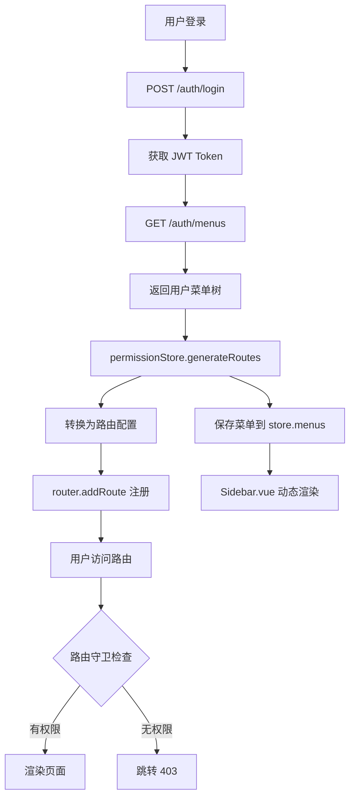

# 动态菜单与路由权限系统设计文档

**日期**: 2026-06-16  
**状态**: 待实现  
**作者**: AI Assistant

---

## 一、需求背景

### 1.1 当前问题

当前系统的菜单和路由采用**硬编码**方式,存在以下问题:

1. **菜单无权限控制**: Sidebar.vue 中所有菜单项硬编码,所有登录用户看到相同菜单
2. **路由无权限拦截**: 用户可直接访问任何路由,只要在浏览器地址栏输入 URL
3. **权限数据未生效**: 虽然数据库有 `sys_menu` 和 `sys_role_menu` 表,但前端未使用
4. **缺少动态能力**: 无法根据用户角色动态显示/隐藏菜单

### 1.2 设计目标

实现**完全动态**的菜单和路由权限系统:

- ✅ 菜单从后端动态获取并渲染
- ✅ 路由在登录时动态注册
- ✅ 用户只能看到和访问有权限的内容
- ✅ 刷新页面时自动恢复路由
- ✅ 支持国际化多语言显示

---

## 二、架构设计

### 2.1 整体架构

```
用户登录 
  ↓
获取用户信息 + 菜单权限 (新增API: GET /auth/menus)
  ↓
前端 permission store 处理
  ├─ 保存菜单树到 store
  └─ 动态注册路由 (router.addRoute)
  ↓
Sidebar.vue 动态渲染
  └─ 从 store 读取菜单树,递归渲染
  ↓
路由守卫权限拦截
  └─ 检查用户是否有权访问目标路由
```

### 2.2 路由分类策略

| 路由类型 | 示例 | 注册时机 | 权限控制 |
|---------|------|---------|---------|
| **基础路由** | `/login`, `/404`, `/403` | 应用启动时 | 无 |
| **布局路由** | `/`(BasicLayout) | 应用启动时 | 无 |
| **动态路由** | `/dashboard`, `/system/role` 等 | 登录后 | 根据菜单权限 |

### 2.3 数据流



---

## 三、后端 API 设计

### 3.1 新增接口: `GET /auth/menus`

**目的**: 返回当前登录用户有权访问的菜单树

**Controller 实现**:

```java
// AuthController.java 新增方法
@Operation(summary = "获取用户菜单", description = "获取当前登录用户有权访问的菜单树", 
           security = {@SecurityRequirement(name = "Bearer Authentication")})
@GetMapping("/menus")
public CommonResult<List<MenuDO>> getUserMenus() {
    return CommonResult.success(menuService.getUserMenusByUserId(currentUserId));
}
```

**Service 实现**:

```java
// MenuService.java 新增方法
public List<MenuDO> getUserMenusByUserId(Long userId) {
    // 1. 查询用户的所有角色
    List<Long> roleIds = userRoleMapper.selectRoleIdsByUserId(userId);
    
    // 2. 查询角色关联的所有菜单ID
    List<Long> menuIds = roleMenuMapper.selectMenuIdsByRoleIds(roleIds);
    
    // 3. 查询菜单详情
    List<MenuDO> menus = menuMapper.selectBatchIds(menuIds);
    
    // 4. 过滤已启用和未删除的菜单
    menus = menus.stream()
        .filter(m -> m.getStatus() == 1 && !m.getDeleted())
        .sorted(Comparator.comparing(MenuDO::getSort))
        .collect(Collectors.toList());
    
    // 5. 构建树形结构
    return buildMenuTree(menus, 0L);
}

private List<MenuDO> buildMenuTree(List<MenuDO> allMenus, Long parentId) {
    return allMenus.stream()
        .filter(m -> m.getParentId().equals(parentId))
        .peek(m -> m.setChildren(buildMenuTree(allMenus, m.getId())))
        .toList();
}
```

**SQL 查询**:

```sql
SELECT m.* FROM sys_menu m
INNER JOIN sys_role_menu rm ON m.id = rm.menu_id
INNER JOIN sys_user_role ur ON rm.role_id = ur.role_id
WHERE ur.user_id = ? 
  AND m.status = 1 
  AND m.deleted = 0
ORDER BY m.sort ASC
```

**返回数据示例**:

```json
[
  {
    "id": 1,
    "name": "nav.dashboard",
    "permission": "dashboard:view",
    "url": "/dashboard",
    "parentId": 0,
    "type": 1,
    "icon": "DashboardOutlined",
    "sort": 0,
    "status": 1,
    "children": []
  },
  {
    "id": 2,
    "name": "nav.systemManagement",
    "permission": "system:manage",
    "url": "/system",
    "parentId": 0,
    "type": 1,
    "icon": "SettingOutlined",
    "sort": 4,
    "status": 1,
    "children": [
      {
        "id": 20,
        "name": "nav.userManagement",
        "permission": "system:user:list",
        "url": "/system/user",
        "parentId": 2,
        "type": 2,
        "icon": "UserOutlined",
        "sort": 0,
        "status": 1,
        "children": []
      },
      {
        "id": 21,
        "name": "nav.roleManagement",
        "permission": "system:role:list",
        "url": "/system/role",
        "parentId": 2,
        "type": 2,
        "icon": "TeamOutlined",
        "sort": 1,
        "status": 1,
        "children": []
      }
    ]
  }
]
```

### 3.2 字段说明

| 字段 | 类型 | 说明 |
|------|------|------|
| id | Long | 菜单ID |
| name | String | 国际化 key(如 `nav.dashboard`) |
| permission | String | 权限标识(如 `dashboard:view`) |
| url | String | 路由路径(如 `/dashboard`) |
| parentId | Long | 父菜单ID,0表示顶级 |
| type | Integer | 1-目录, 2-菜单, 3-按钮 |
| icon | String | Ant Design 图标名称 |
| sort | Integer | 排序号,越小越靠前 |
| status | Integer | 0-禁用, 1-启用 |
| children | List<MenuDO> | 子菜单列表 |

---

## 四、前端 Store 设计

### 4.1 Permission Store

**文件**: `src/store/modules/permission.ts`

```typescript
import { defineStore } from 'pinia'
import { ref } from 'vue'
import { authApi } from '@/api/auth'
import router from '@/router'
import type { RouteRecordRaw } from 'vue-router'

export interface MenuItem {
  id: number
  name: string            // 国际化 key
  permission: string      // 权限标识
  url: string            // 路由路径
  parentId: number
  type: number           // 1-目录, 2-菜单, 3-按钮
  icon: string           // 图标名称
  sort: number
  status: number
  children?: MenuItem[]
}

export const usePermissionStore = defineStore('permission', () => {
  // State
  const menus = ref<MenuItem[]>([])
  const routes = ref<RouteRecordRaw[]>([])
  const isRoutesLoaded = ref(false)

  // 组件映射表
  const componentMap: Record<string, () => Promise<any>> = {
    // 仪表盘
    '/dashboard': () => import('@/views/dashboard/index.vue'),
    
    // 图谱管理
    '/graph/list': () => import('@/views/graph/list.vue'),
    '/graph/ide': () => import('@/views/graph/ide.vue'),
    '/graph/temporal': () => import('@/views/graph/temporal.vue'),
    '/graph/create': () => import('@/views/graph/create.vue'),
    
    // 数据管理
    '/data/classes': () => import('@/views/data/classes.vue'),
    '/data/properties': () => import('@/views/data/properties.vue'),
    '/data/constraints': () => import('@/views/data/constraints.vue'),
    '/data/entities': () => import('@/views/data/entities.vue'),
    '/data/edges': () => import('@/views/data/edges.vue'),
    '/data/communities': () => import('@/views/data/communities.vue'),
    '/data/community-episode': () => import('@/views/data/community-episode.vue'),
    '/data/episodes': () => import('@/views/data/episodes.vue'),
    '/data/import': () => import('@/views/data/import.vue'),
    '/data/export': () => import('@/views/data/export.vue'),
    '/legal-kg': () => import('@/views/legal-kg/index.vue'),
    
    // 工具
    '/search': () => import('@/views/search/index.vue'),
    '/custom-instructions': () => import('@/views/custom-instructions/index.vue'),
    '/prompt': () => import('@/views/prompt/index.vue'),
    
    // 系统管理
    '/system/user': () => import('@/views/system/user/index.vue'),
    '/system/role': () => import('@/views/system/role/index.vue'),
    '/system/menu': () => import('@/views/system/menu/index.vue'),
    '/system/config': () => import('@/views/system/config/index.vue'),
    '/system/log': () => import('@/views/system/log/index.vue'),
    '/monitor': () => import('@/views/monitor/index.vue'),
    
    // 其他
    '/profile': () => import('@/views/profile/index.vue'),
    '/notification': () => import('@/views/notification/index.vue')
  }

  // Actions
  const generateRoutes = async () => {
    try {
      // 1. 从后端获取用户菜单
      const menuData = await authApi.getUserMenus()
      menus.value = menuData
      
      // 2. 转换为路由配置
      const dynamicRoutes = convertMenusToRoutes(menuData)
      routes.value = dynamicRoutes
      
      // 3. 注册到 Vue Router
      dynamicRoutes.forEach(route => {
        router.addRoute(route)
      })
      
      isRoutesLoaded.value = true
      return dynamicRoutes
    } catch (error) {
      console.error('生成路由失败:', error)
      throw error
    }
  }

  // 菜单转路由
  const convertMenusToRoutes = (menus: MenuItem[]): RouteRecordRaw[] => {
    return menus
      .filter(m => m.type === 1 || m.type === 2) // 只处理目录和菜单
      .map(menu => {
        const route: RouteRecordRaw = {
          path: menu.url,
          name: menu.permission?.replace(/:/g, '_'), // graph:list → graph_list
          component: componentMap[menu.url],
          meta: {
            title: menu.name,          // i18n key
            icon: menu.icon,
            permission: menu.permission,
            requiresAuth: true
          },
          children: []
        }
        
        // 递归处理子菜单
        if (menu.children?.length) {
          route.children = convertMenusToRoutes(menu.children)
        }
        
        return route
      })
  }

  // 重置权限(登出时调用)
  const resetPermission = () => {
    // 移除动态路由
    routes.value.forEach(route => {
      if (route.name) {
        router.removeRoute(route.name)
      }
    })
    
    menus.value = []
    routes.value = []
    isRoutesLoaded.value = false
  }

  return {
    menus,
    routes,
    isRoutesLoaded,
    generateRoutes,
    resetPermission
  }
})

export default usePermissionStore
```

---

## 五、Sidebar.vue 动态渲染

### 5.1 核心改造

**文件**: `src/components/Layout/Sidebar.vue`

**改造前**: 所有菜单硬编码在模板中

**改造后**: 从 permission store 读取菜单树,动态渲染

### 5.2 实现代码

```vue
<template>
  <aside class="graphiti-sidebar">
    <div class="sidebar-header">
      <AppstoreOutlined class="sidebar-icon" />
      <span class="sidebar-title">{{ $t('nav.navigation') }}</span>
    </div>

    <!-- 动态菜单 -->
    <template v-for="menu in visibleMenus" :key="menu.id">
      <!-- 类型1: 目录(可折叠) -->
      <div v-if="menu.type === 1 && hasChildren(menu)" class="menu-section">
        <div class="menu-section-title" @click="toggleSection(menu.url)">
          <component :is="getIconComponent(menu.icon)" class="menu-section-icon" />
          <span class="menu-section-text">{{ $t(menu.name) }}</span>
          <DownOutlined :class="['menu-section-arrow', { collapsed: !isOpen(menu.url) }]" />
        </div>
        
        <div v-show="isOpen(menu.url)" class="menu-section-content">
          <a-menu
            v-model:selectedKeys="selectedKeys"
            mode="inline"
            class="sidebar-menu nested-menu"
            @click="handleMenuClick"
          >
            <a-menu-item 
              v-for="child in menu.children" 
              :key="child.url"
            >
              <template #icon>
                <component :is="getIconComponent(child.icon)" />
              </template>
              {{ $t(child.name) }}
            </a-menu-item>
          </a-menu>
        </div>
      </div>

      <!-- 类型2: 直接菜单项(无子菜单) -->
      <a-menu-item 
        v-else-if="menu.type === 1 && !hasChildren(menu)" 
        :key="menu.url"
      >
        <template #icon>
          <component :is="getIconComponent(menu.icon)" />
        </template>
        {{ $t(menu.name) }}
      </a-menu-item>

      <!-- 类型2: 普通菜单项 -->
      <a-menu-item v-else-if="menu.type === 2" :key="menu.url">
        <template #icon>
          <component :is="getIconComponent(menu.icon)" />
        </template>
        {{ $t(menu.name) }}
      </a-menu-item>
    </template>
  </aside>
</template>

<script setup lang="ts">
import { ref, computed, onMounted } from 'vue'
import { useRoute, useRouter } from 'vue-router'
import { usePermissionStore } from '@/store/modules/permission'
import * as Icons from '@ant-design/icons-vue'
import { DownOutlined, AppstoreOutlined } from '@ant-design/icons-vue'

const route = useRoute()
const router = useRouter()
const permissionStore = usePermissionStore()

const selectedKeys = ref<string[]>([])
const openSections = ref<string[]>([])

// 从 store 获取菜单
const visibleMenus = computed(() => permissionStore.menus)

// 判断菜单是否有子菜单
const hasChildren = (menu: any) => {
  return menu.children && menu.children.length > 0
}

// 判断目录是否展开
const isOpen = (url: string) => {
  return openSections.value.includes(url)
}

// 切换目录展开/折叠
const toggleSection = (url: string) => {
  const index = openSections.value.indexOf(url)
  if (index > -1) {
    openSections.value.splice(index, 1)
  } else {
    openSections.value.push(url)
  }
}

// 动态渲染图标组件
const getIconComponent = (iconName: string) => {
  return Icons[iconName] || Icons.AppstoreOutlined
}

// 更新菜单选中状态
const updateMenuState = () => {
  const path = route.path
  selectedKeys.value = [path]
  
  // 自动展开包含当前路由的目录
  autoExpandCurrentMenu()
}

// 自动展开当前路由所在目录
const autoExpandCurrentMenu = () => {
  const currentPath = route.path
  for (const menu of visibleMenus.value) {
    if (menu.children?.some((child: any) => child.url === currentPath)) {
      if (!openSections.value.includes(menu.url)) {
        openSections.value.push(menu.url)
      }
    }
  }
}

// 菜单点击事件
const handleMenuClick = ({ key }: { key: string }) => {
  router.push(key)
}

// 监听路由变化
watch(() => route.path, updateMenuState, { immediate: true })

// 初始化时展开所有目录
onMounted(() => {
  openSections.value = visibleMenus.value
    .filter(m => m.type === 1 && hasChildren(m))
    .map(m => m.url)
})
</script>

<style scoped lang="less">
/* 保持原有样式不变 */
.graphiti-sidebar {
  width: 240px;
  height: 100%;
  background: @bg-sidebar;
  border-right: 1px solid @border-color;
  display: flex;
  flex-direction: column;
  overflow-y: auto;
}

/* ... 其他样式保持不变 ... */
</style>
```

---

## 六、登录流程改造

### 6.1 User Store 修改

**文件**: `src/store/modules/user.ts`

```typescript
import { defineStore } from 'pinia'
import { ref } from 'vue'
import { authApi } from '@/api/auth'
import { getToken, setToken, clearToken, getUser, type LoginResult } from '@/utils/auth'
import { usePermissionStore } from './permission'
import { message } from 'ant-design-vue'

export const useUserStore = defineStore('user', () => {
  const token = ref<string | null>(getToken())
  const userInfo = ref<LoginResult['user'] | null>(getUser())

  const login = async (username: string, password: string) => {
    try {
      const result = await authApi.login({ username, password })
      setToken(result)
      token.value = result.token
      userInfo.value = result.user
      
      // 🆕 加载用户菜单并注册路由
      const permissionStore = usePermissionStore()
      await permissionStore.generateRoutes()
      
      message.success('登录成功')
      return result
    } catch (error: any) {
      message.error(error.message || '登录失败')
      throw error
    }
  }

  const logout = async () => {
    try {
      await authApi.logout()
    } finally {
      clearToken()
      token.value = null
      userInfo.value = null
      
      // 🆕 清除动态路由
      const permissionStore = usePermissionStore()
      permissionStore.resetPermission()
      
      message.success('已登出')
    }
  }

  const fetchUserInfo = async () => {
    if (!token.value) return
    try {
      const info = await authApi.getInfo()
      userInfo.value = info
    } catch (error) {
      console.error('获取用户信息失败', error)
    }
  }

  return {
    token,
    userInfo,
    login,
    logout,
    fetchUserInfo
  }
})

export default useUserStore
```

---

## 七、路由守卫权限检查

### 7.1 增强路由守卫

**文件**: `src/router/index.ts`

```typescript
import { createRouter, createWebHistory, type RouteRecordRaw } from 'vue-router'
import { getToken, clearToken } from '@/utils/auth'
import { authApi } from '@/api/auth'
import { useUserStore } from '@/store/modules/user'
import { usePermissionStore } from '@/store/modules/permission'
import { message } from 'ant-design-vue'
import { i18n } from '@/i18n'

// 静态路由(始终存在)
const staticRoutes: RouteRecordRaw[] = [
  {
    path: '/login',
    name: 'Login',
    component: () => import('@/views/login/index.vue'),
    meta: { title: 'login.title' }
  },
  {
    path: '/403',
    name: 'Forbidden',
    component: () => import('@/views/403/index.vue'),
    meta: { title: 'common.forbidden' }
  },
  {
    path: '/:pathMatch(.*)*',
    name: 'NotFound',
    component: () => import('@/views/404/index.vue'),
    meta: { title: 'page404.title' }
  }
]

// 布局路由(作为动态路由的父路由)
const layoutRoute: RouteRecordRaw = {
  path: '/',
  component: () => import('@/components/Layout/BasicLayout.vue'),
  children: [
    {
      path: '',
      redirect: '/dashboard'
    }
  ]
}

const router = createRouter({
  history: createWebHistory(import.meta.env.BASE_URL),
  routes: [...staticRoutes, layoutRoute]
})

// 路由守卫
let lastAuthCheck = 0
const AUTH_CHECK_INTERVAL = 60000 // 1分钟

router.beforeEach(async (to, _from) => {
  const token = getToken()
  
  // 需要认证但未登录
  if (to.meta.requiresAuth && !token) {
    return { name: 'Login', query: { redirect: to.fullPath } }
  }
  
  // 已登录但路由未注册(刷新页面场景)
  if (token && to.meta.requiresAuth && !to.name && to.path !== '/login') {
    const permissionStore = usePermissionStore()
    
    // 如果路由未加载,重新加载
    if (!permissionStore.isRoutesLoaded) {
      try {
        await permissionStore.generateRoutes()
        // 重新导航到目标路由
        return { path: to.fullPath, replace: true }
      } catch (error) {
        // 加载失败,清除登录状态
        clearToken()
        const userStore = useUserStore()
        userStore.logout()
        return { name: 'Login' }
      }
    }
  }
  
  // 权限检查
  if (to.meta.requiresAuth && to.meta.permission) {
    const permissionStore = usePermissionStore()
    const hasPermission = checkRoutePermission(to.meta.permission, permissionStore.menus)
    
    if (!hasPermission) {
      return { name: 'Forbidden' }
    }
  }
  
  // Token 有效性验证(带缓存)
  if (to.meta.requiresAuth && token) {
    const now = Date.now()
    if (now - lastAuthCheck > AUTH_CHECK_INTERVAL) {
      try {
        await authApi.getInfo()
        lastAuthCheck = now
      } catch (error: any) {
        clearToken()
        const userStore = useUserStore()
        userStore.logout()
        
        if (error.response?.status === 401) {
          message.error(i18n.global.t('login.sessionExpired'))
        } else {
          message.error(i18n.global.t('login.authFailed'))
        }
        
        return { name: 'Login', query: { redirect: to.fullPath } }
      }
    }
  }
  
  // 已登录用户访问登录页,跳转仪表盘
  if (to.name === 'Login' && token) {
    return { name: 'Dashboard' }
  }
  
  // 设置页面标题
  if (to.meta.title) {
    const titleKey = to.meta.title as string
    const translated = i18n.global.t(titleKey)
    document.title = `${translated} - OntoGraph Console`
  }
  
  return true
})

// 权限检查工具函数
const checkRoutePermission = (permission: string, menus: any[]): boolean => {
  function search(items: any[]): boolean {
    for (const item of items) {
      if (item.permission === permission) return true
      if (item.children?.length && search(item.children)) return true
    }
    return false
  }
  return search(menus)
}

export default router
```

---

## 八、API 层扩展

### 8.1 Auth API 扩展

**文件**: `src/api/auth.ts`

```typescript
import request from './request'
import type { LoginResult } from '@/utils/auth'
import type { MenuItem } from '@/store/modules/permission'

export interface LoginForm {
  username: string
  password: string
}

export interface UserInfo {
  id: number
  username: string
  nickname: string
  email?: string
  avatar?: string
}

export const authApi = {
  login: (data: LoginForm): Promise<LoginResult> => {
    return request.post('/auth/login', data)
  },

  logout: (): Promise<void> => {
    return request.post('/auth/logout')
  },

  getInfo: (): Promise<UserInfo> => {
    return request.get('/auth/info')
  },

  // 🆕 获取用户菜单
  getUserMenus: (): Promise<MenuItem[]> => {
    return request.get('/auth/menus')
  }
}

export default authApi
```

---

## 九、关键场景处理

### 9.1 刷新页面场景

**问题**: 用户刷新页面时,动态路由丢失

**解决方案**:
1. 路由守卫检测 `to.name` 为空(路由未注册)
2. 自动调用 `permissionStore.generateRoutes()` 重新加载
3. 使用 `replace: true` 重新导航到目标路由

```typescript
// 路由守卫中的处理
if (token && to.meta.requiresAuth && !to.name && to.path !== '/login') {
  if (!permissionStore.isRoutesLoaded) {
    await permissionStore.generateRoutes()
    return { path: to.fullPath, replace: true }
  }
}
```

### 9.2 登出场景

**问题**: 登出后需要清除动态路由

**解决方案**:
1. 调用 `permissionStore.resetPermission()`
2. 移除所有动态注册的路由
3. 清空菜单数据

```typescript
const logout = async () => {
  try {
    await authApi.logout()
  } finally {
    clearToken()
    token.value = null
    userInfo.value = null
    
    const permissionStore = usePermissionStore()
    permissionStore.resetPermission()
    
    message.success('已登出')
  }
}
```

### 9.3 权限变更场景

**问题**: 管理员修改用户角色后,用户需要重新登录才能生效

**解决方案**:
1. 在 Header 添加"刷新权限"按钮
2. 调用 `permissionStore.generateRoutes()` 重新加载
3. 或者提示用户重新登录

### 9.4 403 无权访问场景

**问题**: 用户直接输入无权限的 URL

**解决方案**:
1. 路由守卫检查权限
2. 无权限时跳转到 `/403` 页面
3. 403 页面提供返回主页按钮

---

## 十、国际化支持

### 10.1 菜单 name 字段存储 i18n key

数据库 `sys_menu.name` 字段存储国际化 key,例如:
- `nav.dashboard`
- `nav.systemManagement`
- `nav.userManagement`

### 10.2 前端渲染时使用 $t() 函数

```vue
<span>{{ $t(menu.name) }}</span>
```

### 10.3 i18n 资源文件

**zh-CN.ts**:
```typescript
export default {
  nav: {
    dashboard: '仪表盘',
    systemManagement: '系统管理',
    userManagement: '用户管理',
    roleManagement: '角色管理',
    // ...
  }
}
```

**en-US.ts**:
```typescript
export default {
  nav: {
    dashboard: 'Dashboard',
    systemManagement: 'System Management',
    userManagement: 'User Management',
    roleManagement: 'Role Management',
    // ...
  }
}
```

---

## 十一、测试策略

### 11.1 单元测试

1. **权限检查函数测试**
   - 有权限时返回 true
   - 无权限时返回 false
   - 子菜单权限继承

2. **菜单转路由函数测试**
   - 目录类型路由生成
   - 菜单类型路由生成
   - 按钮类型过滤
   - 子菜单递归

### 11.2 集成测试

1. **登录流程测试**
   - 登录后路由正确注册
   - 菜单正确渲染
   - 无权菜单不显示

2. **路由守卫测试**
   - 未登录跳转登录页
   - 无权访问跳转 403
   - 刷新页面恢复路由

3. **登出流程测试**
   - 动态路由正确移除
   - Token 正确清除

### 11.3 E2E 测试

1. 用户 A 登录,只能看到角色 A 的菜单
2. 用户 B 登录,只能看到角色 B 的菜单
3. 用户 A 尝试访问无权 URL,跳转 403
4. 刷新页面后菜单和路由正常

---

## 十二、性能优化

### 12.1 组件懒加载

所有动态路由组件使用 `import()` 懒加载:

```typescript
'/system/role': () => import('@/views/system/role/index.vue')
```

### 12.2 菜单缓存

后端可添加 Redis 缓存,减少数据库查询:

```java
@Cacheable(value = "userMenus", key = "#userId")
public List<MenuDO> getUserMenusByUserId(Long userId) {
    // ...
}
```

### 12.3 路由注册优化

只在首次登录时注册路由,后续导航不重复注册。

---

## 十三、安全性考虑

### 13.1 双重权限保护

1. **前端菜单过滤**: 用户看不到无权菜单
2. **路由守卫拦截**: 即使用户手动输入 URL,也会被拦截

### 13.2 后端权限验证

所有 API 接口都应添加权限注解:

```java
@PreAuthorize("hasAuthority('system:role:list')")
@GetMapping("/admin/system/role/list")
public CommonResult<List<RoleDO>> listRoles() {
    // ...
}
```

### 13.3 XSS 防护

菜单 name 字段通过 `$t()` 渲染,避免直接 v-html 注入。

---

## 十四、实施步骤

### Phase 1: 后端开发(1-2天)

1. ✅ 实现 `MenuService.getUserMenusByUserId()` 方法
2. ✅ 在 `AuthController` 添加 `GET /auth/menus` 接口
3. ✅ 编写单元测试
4. ✅ 接口测试(使用 Postman)

### Phase 2: 前端 Store(1天)

1. ✅ 创建 `src/store/modules/permission.ts`
2. ✅ 实现 `generateRoutes()` 方法
3. ✅ 实现 `convertMenusToRoutes()` 方法
4. ✅ 实现 `resetPermission()` 方法
5. ✅ 编写单元测试

### Phase 3: 登录流程改造(0.5天)

1. ✅ 修改 `user.ts` 的 `login()` 方法
2. ✅ 修改 `user.ts` 的 `logout()` 方法
3. ✅ 测试登录/登出流程

### Phase 4: Sidebar 动态渲染(1天)

1. ✅ 重构 `Sidebar.vue` 为动态渲染
2. ✅ 实现图标动态加载
3. ✅ 测试菜单显示/折叠
4. ✅ 测试国际化

### Phase 5: 路由守卫增强(0.5天)

1. ✅ 增强 `router/index.ts` 守卫逻辑
2. ✅ 添加权限检查
3. ✅ 添加刷新页面处理
4. ✅ 创建 403 页面

### Phase 6: 集成测试(1天)

1. ✅ 完整流程测试
2. ✅ 边界场景测试
3. ✅ 性能测试
4. ✅ 修复 bug

### Phase 7: 文档与部署(0.5天)

1. ✅ 更新开发文档
2. ✅ 更新 API 文档
3. ✅ 部署测试环境
4. ✅ 用户验收测试

**总计**: 5-6.5 天

---

## 十五、风险与应对

### 15.1 风险: 路由注册失败

**影响**: 登录后无法访问页面

**应对**:
- 添加 try-catch 错误处理
- 失败时回滚路由注册
- 提供用户友好的错误提示

### 15.2 风险: 组件映射表遗漏

**影响**: 某些路由无法找到组件

**应对**:
- 在 `convertMenusToRoutes` 中添加检查
- 未找到组件时使用 fallback 组件
- 编写测试覆盖所有路由

### 15.3 风险: 性能下降

**影响**: 登录耗时增加

**应对**:
- 后端添加 Redis 缓存
- 前端使用组件懒加载
- 监控登录接口响应时间

---

## 十六、总结

本设计方案实现了**完全动态**的菜单和路由权限系统:

✅ **后端**: 新增 `GET /auth/menus` 接口,根据用户角色返回菜单树  
✅ **前端 Store**: 管理菜单数据和动态路由注册  
✅ **Sidebar**: 从 store 读取菜单,动态渲染  
✅ **路由守卫**: 双重权限保护(菜单过滤 + 路由拦截)  
✅ **国际化**: 菜单 name 存储 i18n key,前端 `$t()` 渲染  
✅ **刷新恢复**: 刷新页面时自动重新加载路由  

该方案具有**高安全性**、**良好扩展性**和**优秀用户体验**,适合中大型企业级应用。

---

**文档版本**: v1.0  
**最后更新**: 2026-06-16  
**审核状态**: 待审核
