# Qoder 自动化流程架构图

> **Architecture Diagram: Qoder-Powered Automated Pipeline**

---

## 1. 整体架构

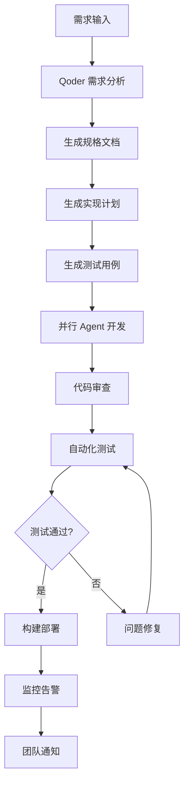

---

## 2. 详细流程

### 2.1 需求分析阶段

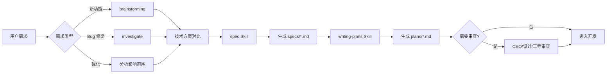

### 2.2 测试生成阶段

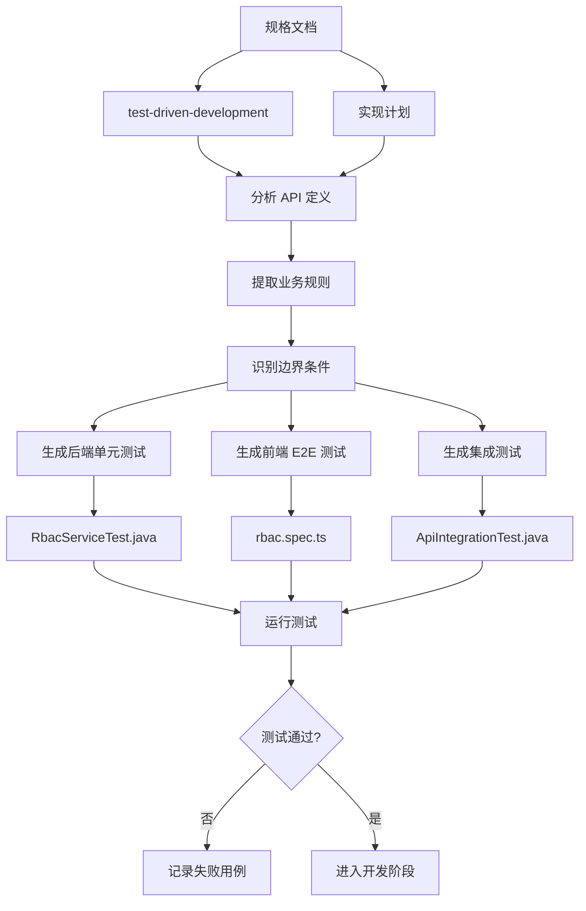

### 2.3 并行开发阶段

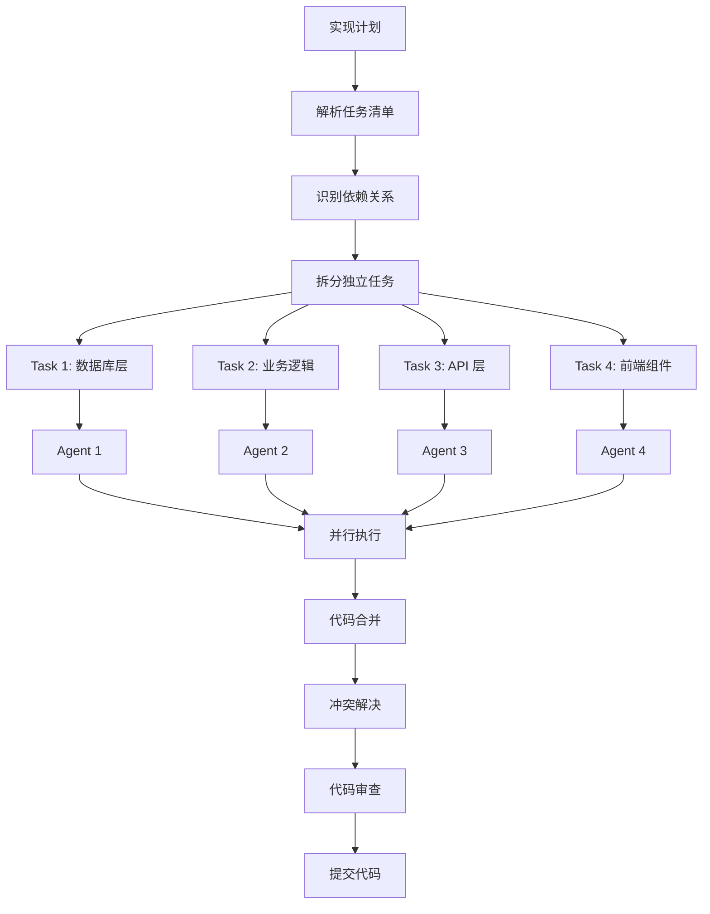

### 2.4 CI/CD 流水线

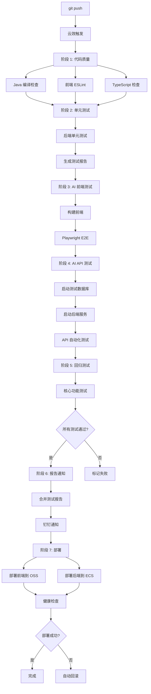

---

## 3. Qoder Skills 工作流

### 3.1 Skills 调用顺序

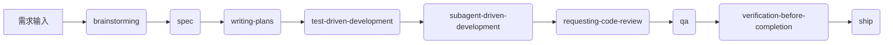

### 3.2 并行 Skills

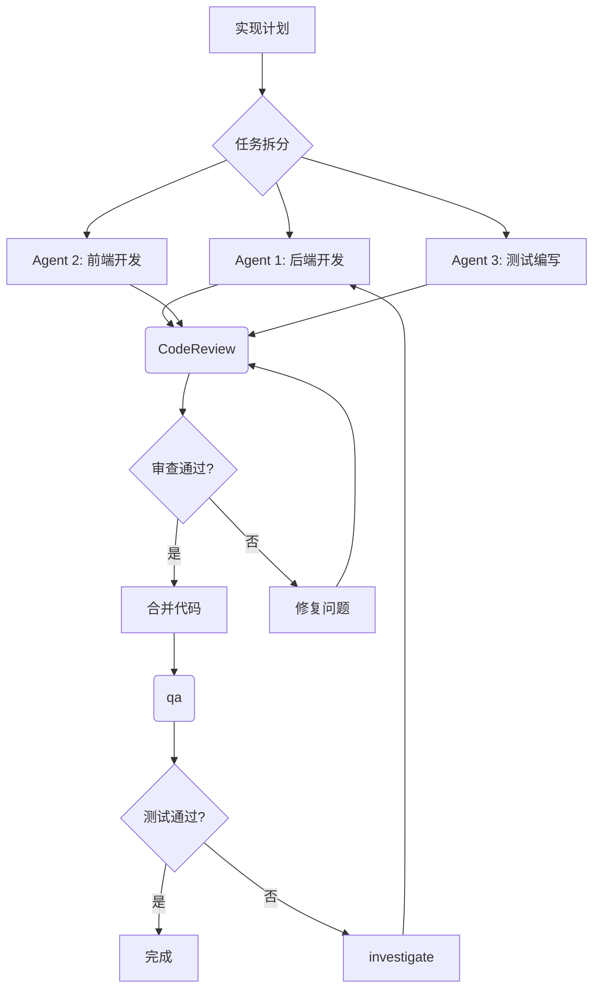

---

## 4. 数据流

### 4.1 文件产物

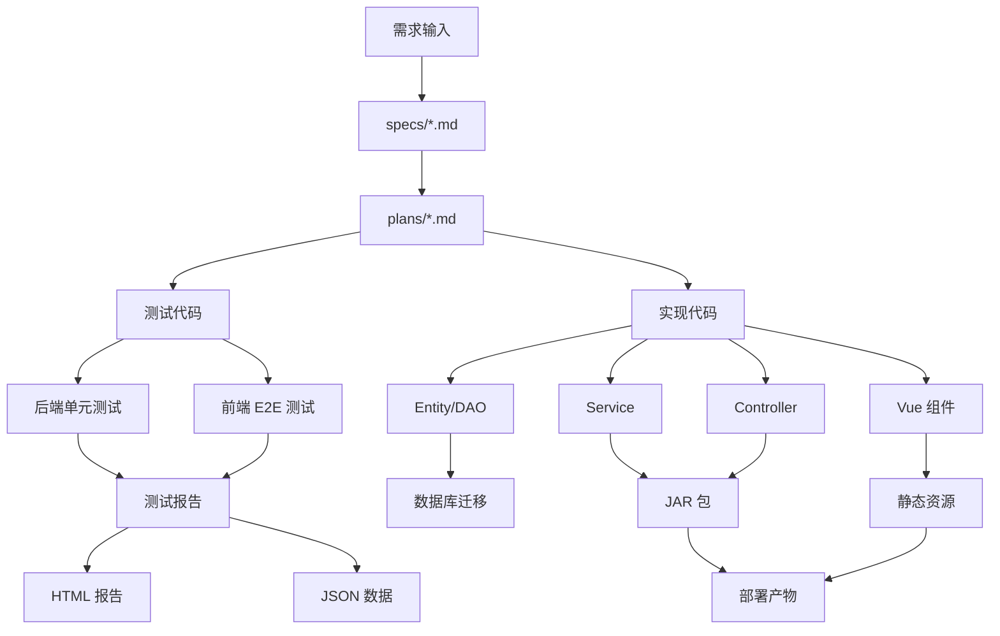

### 4.2 配置流

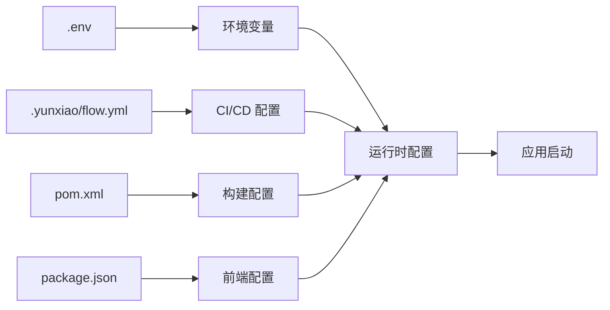

---

## 5. 监控与反馈

### 5.1 监控指标

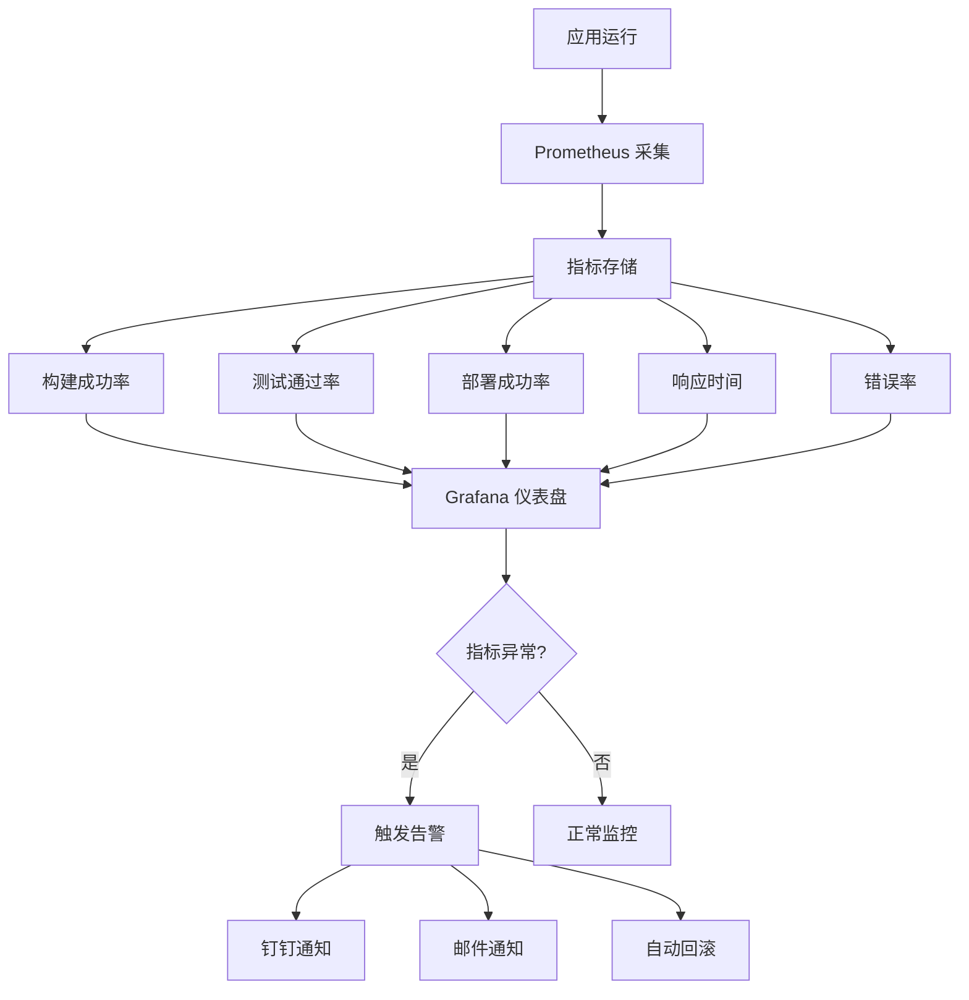

### 5.2 反馈闭环

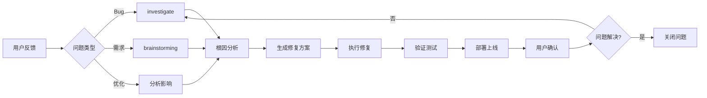

---

## 6. 部署架构

### 6.1 环境划分

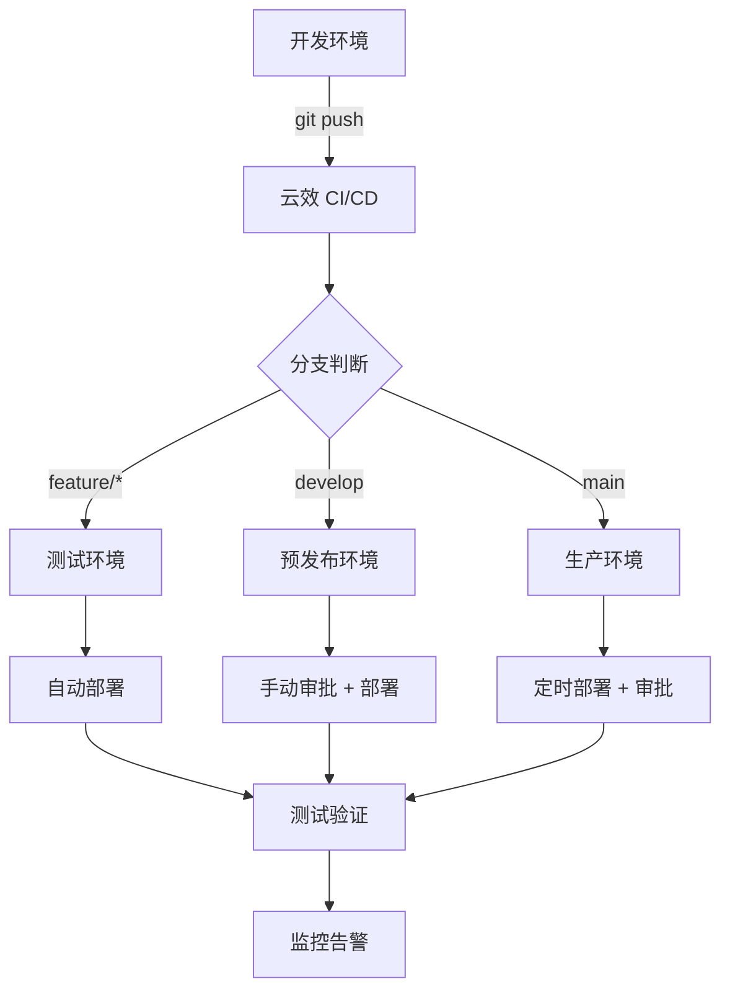

### 6.2 服务部署

```mermaid
graph TB
    A[构建产物] --> B{部署类型}
    
    B -->|前端| C[OSS 静态托管]
    B -->|后端| D[ECS 服务器]
    
    C --> E[CDN 加速]
    E --> F[用户访问]
    
    D --> G[Spring Boot JAR]
    G --> H[systemd 管理]
    H --> I[Nginx 反向代理]
    I --> F
    
    D --> J[数据库连接]
    J --> K[PostgreSQL]
    J --> L[Neo4j]
    
    D --> M[健康检查]
    M --> N[/actuator/health]
    N --> O{健康?}
    O -->|是| P[正常服务]
    O -->|否| Q[自动重启]
```

---

## 7. 故障恢复

### 7.1 自动回滚

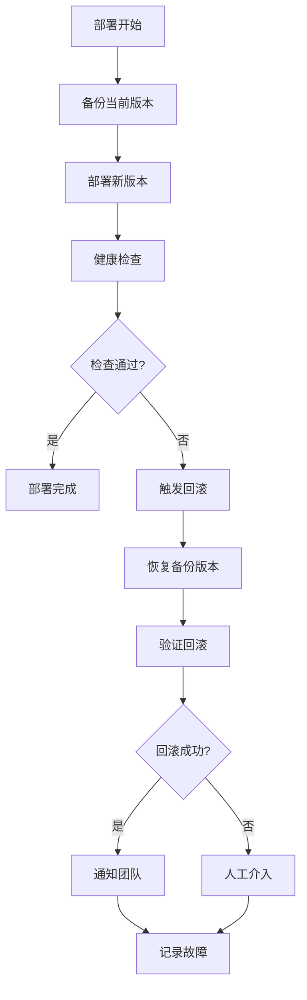

### 7.2 故障诊断

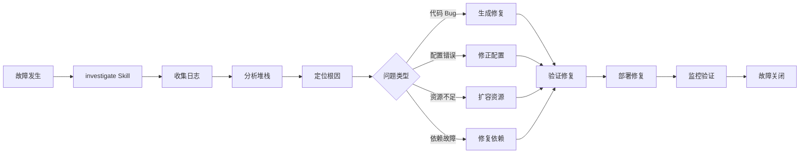

---

## 8. 团队协作

### 8.1 角色分工

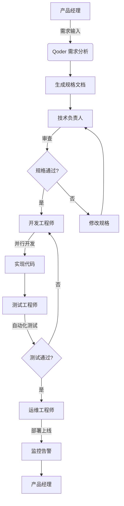

### 8.2 协作流程

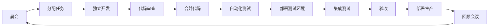

---

## 9. 性能优化

### 9.1 构建优化

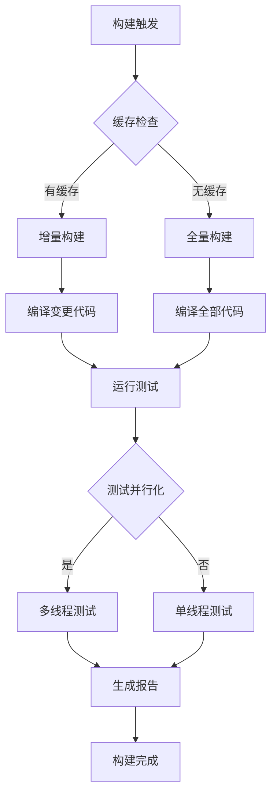

### 9.2 测试优化

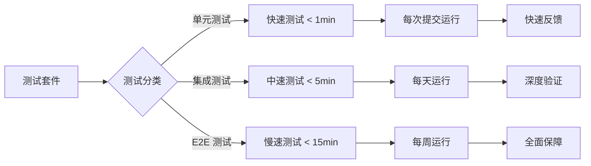

---

## 10. 安全合规

### 10.1 安全检查

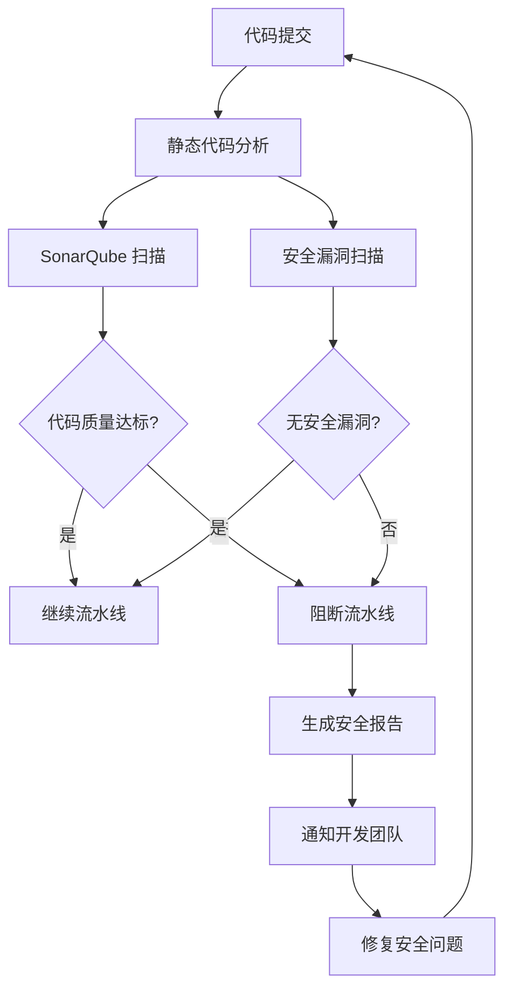

### 10.2 合规检查

```mermaid
graph LR
    A[代码变更] --> B{变更类型}
    
    B -->|数据库| C[数据迁移审查]
    B -->|API| D[API 兼容性审查]
    B -->|配置| E[配置安全审查]
    B -->|依赖| F[依赖许可证审查]
    
    C --> G[合规验证]
    D --> G
    E --> G
    F --> G
    
    G --> H{合规通过?}
    H -->|是| I[继续部署]
    H -->|否| J[阻断部署]
```

---

## 总结

以上架构图展示了 Qoder 自动化流程的完整体系，包括：

1. **整体架构**: 从需求到部署的端到端流程
2. **详细流程**: 各阶段的详细步骤和决策点
3. **Skills 工作流**: Qoder Skills 的调用顺序和并行策略
4. **数据流**: 文件产物和配置流转
5. **监控反馈**: 实时监控和故障恢复
6. **部署架构**: 多环境部署和服务管理
7. **故障恢复**: 自动回滚和故障诊断
8. **团队协作**: 角色分工和协作流程
9. **性能优化**: 构建和测试优化策略
10. **安全合规**: 安全检查和合规验证

这些架构图可以帮助团队理解自动化流程的全貌，识别优化点，并持续改进研发效率。

---

**文档版本**: v1.0.0  
**创建日期**: 2026-06-16  
**维护者**: OntoGraph 团队
