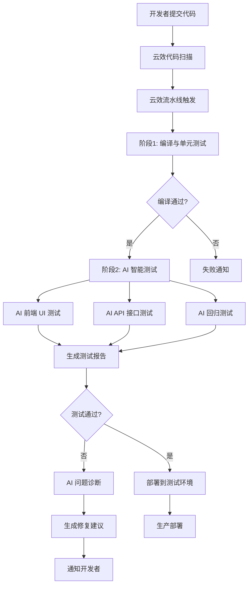

# 阿里云云效自动化 AI 测试 CI/CD 方案

## 📋 方案概述

基于阿里云云效 (Flow) 平台,集成 AI 测试工具 (Qoder/Cursor),实现代码提交后的自动化测试、问题发现和修复建议生成。

---

## 🏗️ 整体架构



---

## 🚀 云效流水线配置

### 1. 创建流水线

**路径**: 云效 → Flow → 新建流水线 → 选择"自定义流水线"

### 2. 流水线阶段设计

```yaml
# 云效流水线 YAML 配置 (flow.yml)
version: "1.0"
name: "OntoGraph AI 自动化测试流水线"
stages:
  # ========== 阶段 1: 代码质量检查 ==========
  - stage: code_quality
    name: "代码质量检查"
    jobs:
      - job: java_compile
        name: "Java 编译检查"
        steps:
          - step: build@java
            name: "Maven 编译"
            inputs:
              java_version: "17"
              command: "mvn clean compile -DskipTests"
              goals: "compile"
      
      - job: frontend_lint
        name: "前端代码检查"
        steps:
          - step: build@nodejs
            name: "ESLint 检查"
            inputs:
              node_version: "18"
              command: |
                cd ontograph-frontend
                npm ci
                npm run lint

  # ========== 阶段 2: 自动化测试 ==========
  - stage: automated_tests
    name: "自动化测试"
    jobs:
      - job: unit_tests
        name: "单元测试"
        steps:
          - step: build@java
            name: "执行单元测试"
            inputs:
              command: "mvn test"
              reports:
                - target/surefire-reports/*.xml
      
      - job: ai_frontend_tests
        name: "AI 前端测试"
        steps:
          - step: run@shell
            name: "启动前端服务"
            inputs:
              command: |
                cd ontograph-frontend
                npm ci
                npm run build
                npx serve dist -p 5173 &
          
          - step: run@shell
            name: "执行 AI 测试"
            inputs:
              command: |
                # 使用 Qoder CLI 或 Cursor 执行测试
                qoder test --suite "dashboard" --auto-fix false
                qoder test --suite "graph-management" --auto-fix false
                qoder test --suite "data-import" --auto-fix false
      
      - job: ai_api_tests
        name: "AI API 测试"
        steps:
          - step: run@shell
            name: "启动后端服务"
            inputs:
              command: |
                cd ontograph-backend
                mvn spring-boot:run -Dspring-boot.run.profiles=test &
                # 等待服务启动
                sleep 30
          
          - step: run@shell
            name: "执行 API 测试"
            inputs:
              command: |
                # AI 驱动的 API 测试
                qoder test --suite "api-auth" --auto-fix false
                qoder test --suite "api-graph" --auto-fix false
                qoder test --suite "api-ontology" --auto-fix false

  # ========== 阶段 3: AI 回归测试 ==========
  - stage: ai_regression
    name: "AI 回归测试"
    jobs:
      - job: full_regression
        name: "完整回归测试"
        steps:
          - step: run@shell
            name: "核心功能回归"
            inputs:
              command: |
                # 基于 graphiti-test.md 的测试提示词执行
                qoder test --spec "docs/graphiti-test.md" \
                  --suite "core-regression" \
                  --auto-fix false \
                  --report ai-test-report.json

  # ========== 阶段 4: 测试报告与通知 ==========
  - stage: report_and_notify
    name: "测试报告与通知"
    jobs:
      - job: generate_report
        name: "生成测试报告"
        steps:
          - step: run@shell
            name: "汇总测试结果"
            inputs:
              command: |
                # 合并所有测试报告
                python scripts/merge-test-reports.py
          
          - step: publish@artifact
            name: "发布测试报告"
            inputs:
              artifact_name: "ai-test-report"
              artifact_path: "reports/ai-test-report.html"
      
      - job: notify
        name: "发送通知"
        steps:
          - step: notify@dingtalk
            name: "钉钉通知"
            inputs:
              webhook: "${DINGTALK_WEBHOOK}"
              message: |
                ## AI 测试结果通知
                - 提交: ${COMMIT_MESSAGE}
                - 分支: ${BRANCH_NAME}
                - 状态: ${TEST_STATUS}
                - 详情: ${REPORT_URL}
```

---

## 🤖 AI 测试工具集成

### 方案 1: Qoder CLI (推荐)

**安装**:
```bash
# 在云效构建环境中安装 Qoder CLI
npm install -g @qoder/cli
```

**测试脚本示例** (`scripts/ai-test.sh`):
```bash
#!/bin/bash
set -e

# 环境变量
BASE_URL=${FRONTEND_URL:-"http://localhost:5173"}
API_URL=${BACKEND_URL:-"http://localhost:8080"}
REPORT_DIR="reports/ai-tests"
mkdir -p $REPORT_DIR

echo "🚀 开始 AI 自动化测试..."

# 1. 仪表盘测试
echo "📊 执行仪表盘测试..."
qoder test \
  --base-url $BASE_URL \
  --spec "docs/graphiti-test.md" \
  --suite "dashboard" \
  --credentials '{"username":"admin","password":"admin123"}' \
  --screenshot true \
  --report "$REPORT_DIR/dashboard.json"

# 2. 图谱管理测试
echo "🕸️ 执行图谱管理测试..."
qoder test \
  --base-url $BASE_URL \
  --spec "docs/graphiti-test.md" \
  --suite "graph-management" \
  --screenshot true \
  --report "$REPORT_DIR/graph-management.json"

# 3. 数据导入测试
echo "📥 执行数据导入测试..."
qoder test \
  --base-url $BASE_URL \
  --api-url $API_URL \
  --spec "docs/graphiti-test.md" \
  --suite "data-import" \
  --report "$REPORT_DIR/data-import.json"

# 4. 回归测试
echo "🔄 执行回归测试..."
qoder test \
  --base-url $BASE_URL \
  --api-url $API_URL \
  --spec "docs/graphiti-test.md" \
  --suite "core-regression" \
  --report "$REPORT_DIR/regression.json"

echo "✅ AI 测试完成,报告生成在 $REPORT_DIR"
```

### 方案 2: Cursor + Playwright

**测试脚本示例** (`scripts/cursor-e2e-test.sh`):
```bash
#!/bin/bash

# 使用 Cursor AI 驱动的 Playwright 测试
npx playwright test \
  --config=playwright.config.ts \
  --reporter=html,json \
  --grep "@ai-test"

# 生成 AI 分析报告
node scripts/ai-analyze-results.js
```

---

## 📊 测试报告生成

### 测试报告合并脚本 (`scripts/merge-test-reports.py`)

```python
#!/usr/bin/env python3
"""合并多个 AI 测试报告为统一的 HTML 报告"""

import json
import os
from datetime import datetime
from jinja2 import Template

def merge_reports(report_dir="reports/ai-tests"):
    """合并所有 JSON 测试报告"""
    all_results = {
        "timestamp": datetime.now().isoformat(),
        "suites": [],
        "summary": {
            "total": 0,
            "passed": 0,
            "failed": 0,
            "skipped": 0
        }
    }
    
    for file in os.listdir(report_dir):
        if file.endswith('.json'):
            with open(os.path.join(report_dir, file)) as f:
                suite = json.load(f)
                all_results["suites"].append(suite)
                
                # 更新统计
                stats = suite.get("stats", {})
                all_results["summary"]["total"] += stats.get("total", 0)
                all_results["summary"]["passed"] += stats.get("passed", 0)
                all_results["summary"]["failed"] += stats.get("failed", 0)
                all_results["summary"]["skipped"] += stats.get("skipped", 0)
    
    return all_results

def generate_html_report(results, output_path="reports/ai-test-report.html"):
    """生成 HTML 测试报告"""
    template = Template("""
    <!DOCTYPE html>
    <html>
    <head>
        <title>AI 自动化测试报告</title>
        <style>
            body { font-family: Arial, sans-serif; margin: 20px; }
            .summary { padding: 20px; background: #f5f5f5; border-radius: 8px; }
            .passed { color: #28a745; }
            .failed { color: #dc3545; }
            .suite { margin: 20px 0; padding: 15px; border: 1px solid #ddd; }
            table { width: 100%; border-collapse: collapse; }
            th, td { padding: 8px; text-align: left; border-bottom: 1px solid #ddd; }
        </style>
    </head>
    <body>
        <h1>🤖 AI 自动化测试报告</h1>
        <div class="summary">
            <h2>测试概览</h2>
            <p>生成时间: {{ results.timestamp }}</p>
            <p>总计: {{ results.summary.total }} 用例</p>
            <p class="passed">通过: {{ results.summary.passed }}</p>
            <p class="failed">失败: {{ results.summary.failed }}</p>
            <p>跳过: {{ results.summary.skipped }}</p>
        </div>
        
        
        <div class="suite">
            <h2>{{ suite.name }}</h2>
            <table>
                <tr>
                    <th>测试用例</th>
                    <th>状态</th>
                    <th>耗时</th>
                    <th>AI 建议</th>
                </tr>
                
                <tr>
                    <td>{{ test.name }}</td>
                    <td class="{{ test.status }}">{{ test.status }}</td>
                    <td>{{ test.duration }}ms</td>
                    <td>{{ test.ai_suggestion or "无" }}</td>
                </tr>
                
            </table>
        </div>
        
    </body>
    </html>
    """)
    
    with open(output_path, 'w', encoding='utf-8') as f:
        f.write(template.render(results=results))

if __name__ == "__main__":
    results = merge_reports()
    generate_html_report(results)
    print(f"✅ 测试报告已生成: reports/ai-test-report.html")
```

---

## 🔧 云效环境变量配置

### 必需的环境变量

在云效流水线 → 变量管理中配置:

| 变量名 | 说明 | 示例值 |
|--------|------|--------|
| `FRONTEND_URL` | 前端服务地址 | `http://localhost:5173` |
| `BACKEND_URL` | 后端 API 地址 | `http://localhost:8080` |
| `DINGTALK_WEBHOOK` | 钉钉通知 Webhook | `https://oapi.dingtalk.com/robot/send?access_token=xxx` |
| `QODER_API_KEY` | Qoder AI API 密钥 | `qoder_xxx` |
| `NEO4J_URI` | Neo4j 数据库地址 | `bolt://localhost:7687` |
| `DB_HOST` | MySQL/PostgreSQL 地址 | `localhost` |
| `TEST_CREDENTIALS` | 测试账号 (JSON) | `{"username":"admin","password":"admin123"}` |

---

## 📝 触发规则配置

### 分支触发策略

```yaml
# 云效触发规则
triggers:
  - type: push
    branches:
      - main
      - develop
      - "feature/**"
      - "release/**"
  
  - type: merge_request
    target_branches:
      - main
      - develop
  
  - type: schedule
    cron: "0 2 * * *"  # 每天凌晨 2 点执行完整回归
    branches:
      - main
```

### 测试套件选择策略

```yaml
# 根据变更文件智能选择测试套件
test_strategy:
  rules:
    - name: "前端变更"
      condition: "ontograph-frontend/**/*"
      suites:
        - dashboard
        - graph-management
        - data-import
        - frontend-regression
    
    - name: "后端变更"
      condition: "ontograph-backend/**/*"
      suites:
        - api-auth
        - api-graph
        - api-ontology
        - backend-regression
    
    - name: "数据库变更"
      condition: "sql/**/*"
      suites:
        - data-migration
        - full-regression
    
    - name: "文档变更"
      condition: "docs/**/*"
      suites:
        - documentation-validation
```

---

## 🎯 分阶段实施计划

### Phase 1: 基础流水线搭建 (1-2 周)

**目标**: 建立基本的 CI/CD 流水线

**任务清单**:
- [ ] 在云效创建流水线
- [ ] 配置 Maven 编译检查
- [ ] 配置 ESLint 前端检查
- [ ] 配置单元测试执行
- [ ] 配置钉钉通知

**验收标准**:
- ✅ 代码提交后自动触发流水线
- ✅ 编译失败时及时通知
- ✅ 单元测试报告可查看

### Phase 2: AI 测试集成 (2-3 周)

**目标**: 集成 AI 驱动的自动化测试

**任务清单**:
- [ ] 安装 Qoder CLI 或配置 Cursor
- [ ] 编写 AI 测试脚本
- [ ] 集成前端 UI 测试
- [ ] 集成后端 API 测试
- [ ] 生成 AI 测试报告

**验收标准**:
- ✅ AI 测试自动执行
- ✅ 测试报告包含 AI 分析建议
- ✅ 失败用例有详细截图

### Phase 3: 回归测试自动化 (1-2 周)

**目标**: 实现智能回归测试

**任务清单**:
- [ ] 基于 `graphiti-test.md` 配置回归测试
- [ ] 实现变更感知的测试选择
- [ ] 配置定时完整回归
- [ ] 优化测试执行速度

**验收标准**:
- ✅ 核心回归测试 < 15 分钟
- ✅ 完整回归测试 < 1 小时
- ✅ 测试覆盖率 > 80%

### Phase 4: 智能修复建议 (持续优化)

**目标**: AI 自动诊断和修复建议

**任务清单**:
- [ ] 配置 AI 问题诊断
- [ ] 生成修复代码建议
- [ ] 自动创建修复 PR
- [ ] 持续优化测试用例

**验收标准**:
- ✅ 80% 常见问题有 AI 修复建议
- ✅ 修复建议准确率 > 70%
- ✅ 开发者采纳率 > 50%

---

## 💡 最佳实践

### 1. 测试并行化

```yaml
# 云效并行任务配置
parallel:
  - job: ai_test_suite_1
    suites: [dashboard, graph-management]
  
  - job: ai_test_suite_2
    suites: [data-import, ontology]
  
  - job: ai_test_suite_3
    suites: [api-auth, api-graph]
```

### 2. 缓存优化

```yaml
# 云效缓存配置
cache:
  paths:
    - ontograph-frontend/node_modules
    - ontograph-backend/.m2/repository
    - qoder-test-cache
```

### 3. 失败重试策略

```yaml
# AI 测试失败重试
retry_policy:
  max_retries: 2
  retry_on:
    - network_error
    - timeout
    - flaky_test
  delay: "30s"
```

### 4. 测试数据隔离

```bash
# 每次测试使用独立数据库
export TEST_DB_NAME="ontograph_test_${BUILD_ID}"
createdb $TEST_DB_NAME
psql -d $TEST_DB_NAME -f sql/init-data.sql

# 测试完成后清理
dropdb $TEST_DB_NAME
```

---

## 📈 监控与度量

### 关键指标

| 指标 | 目标值 | 监控方式 |
|------|--------|----------|
| 流水线执行时间 | < 20 分钟 | 云效仪表盘 |
| AI 测试通过率 | > 95% | 测试报告 |
| 问题发现率 | > 80% | 缺陷追踪 |
| 修复建议准确率 | > 70% | 开发者反馈 |
| 回归测试覆盖率 | > 80% | 代码覆盖率工具 |

### 告警规则

```yaml
alerts:
  - name: "AI 测试失败率过高"
    condition: "test_failure_rate > 20%"
    action: "发送紧急通知"
  
  - name: "流水线执行超时"
    condition: "pipeline_duration > 30min"
    action: "发送警告通知"
  
  - name: "测试覆盖率下降"
    condition: "coverage_drop > 5%"
    action: "标记流水线为警告"
```

---

## 🚨 常见问题与解决方案

### Q1: AI 测试不稳定,偶尔失败

**解决方案**:
```bash
# 添加重试机制
qoder test --suite "dashboard" --retries 2 --retry-delay 30s

# 增加等待时间
sleep 10  # 等待页面完全加载

# 使用更稳定的选择器
# 避免使用动态 ID,改用 data-testid
```

### Q2: 云效构建环境缺少浏览器

**解决方案**:
```yaml
# 在云效构建步骤中安装浏览器
steps:
  - step: run@shell
    name: "安装 Playwright 浏览器"
    inputs:
      command: |
        npx playwright install chromium
        npx playwright install-deps
```

### Q3: 测试执行时间过长

**优化方案**:
```yaml
# 1. 并行执行测试套件
parallel:
  max_concurrent: 5

# 2. 智能选择测试 (基于变更)
test_selection:
  mode: "changed-files"
  strategy: "impact-analysis"

# 3. 使用测试缓存
cache:
  test_results: true
  skip_unchanged: true
```

---

## 📚 参考资源

- [阿里云云效 Flow 文档](https://help.aliyun.com/product/116588.html)
- [Qoder CLI 使用指南](https://qoder.ai/docs/cli)
- [Playwright 自动化测试](https://playwright.dev/docs/intro)
- [graphiti-test.md 测试提示词](./graphiti-test.md)

---

## 🎉 总结

通过阿里云云效 + AI 测试工具的组合,你可以实现:

✅ **自动化测试**: 代码提交后自动执行全栈测试  
✅ **智能诊断**: AI 自动分析问题根因  
✅ **修复建议**: 生成可执行的修复代码  
✅ **回归保障**: 核心功能 100% 回归覆盖  
✅ **快速反馈**: 20 分钟内完成测试并通知  

**下一步**: 
1. 在云效创建流水线
2. 复制 `flow.yml` 配置
3. 配置环境变量
4. 提交代码触发测试
5. 查看 AI 测试报告

祝你实施顺利! 🚀
