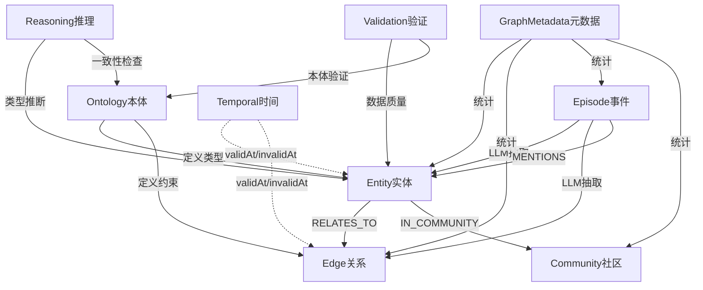
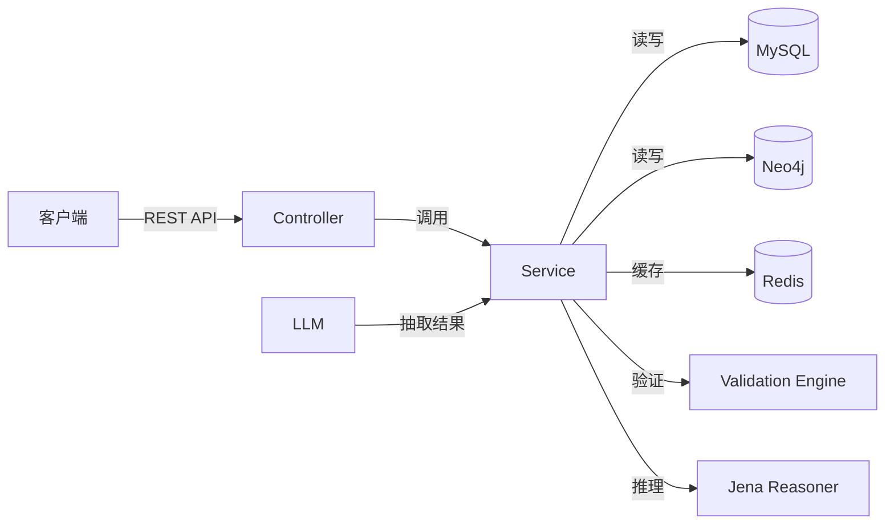
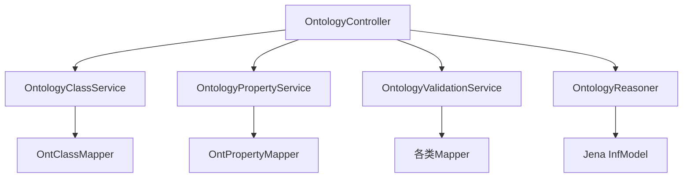
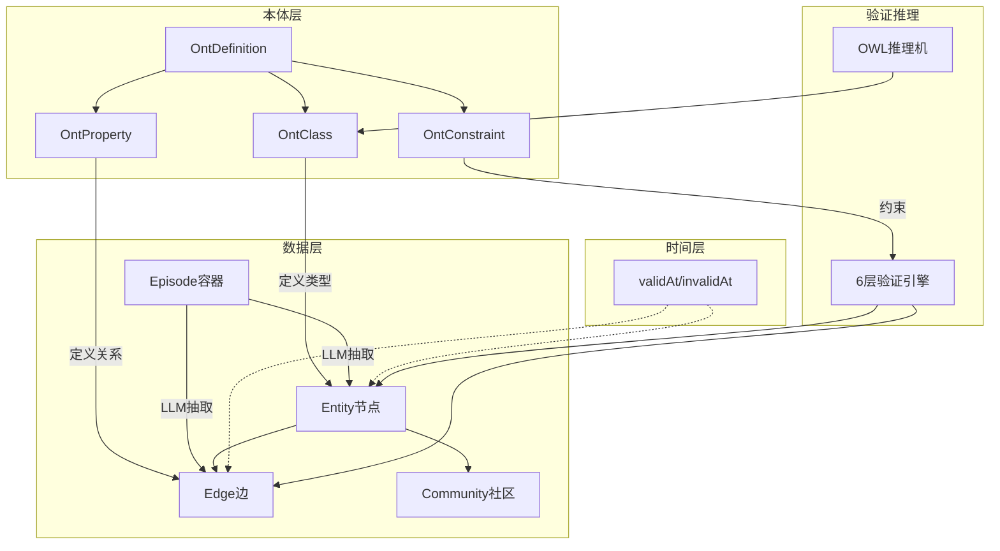
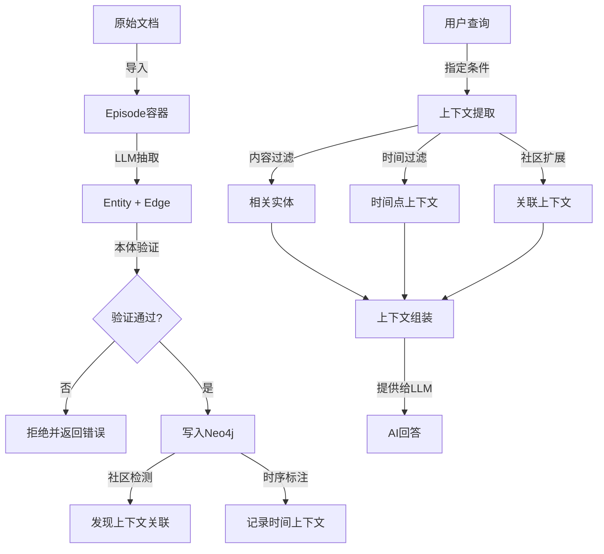

# Graphiti-Java 知识图谱与本体论全栈技术培训

> **文档版本**: v1.0  
> **适用对象**: 全栈开发工程师、知识图谱工程师、系统架构师  
> **技术栈**: Java 21 + Spring Boot 3.x + Apache Jena + Neo4j 5.x + Vue 3 + TypeScript  
> **更新日期**: 2026-05-21

---

## 文档导览

本培训文档面向全栈技术团队,系统讲解知识图谱与本体论的理论知识及Graphiti-Java项目的完整实现。文档分为三大板块:

**📖 理论篇** (第1-2章): 本体论历史、核心概念、知识图谱架构体系  
**🔧 实践篇** (第3-7章): 本体要素、核心概念、社区检测、验证推理、系统架构  
**💻 应用篇** (第8-9章): REST API参考、接口使用范例、业务场景演示

---

## 目录

- [第一章 本体论的历史与发展](#第一章-本体论的历史与发展)
- [第二章 本体论基本概念](#第二章-本体论基本概念)
- [第三章 本体核心要素详解](#第三章-本体核心要素详解)
  - [3.1 Class(类)](#31-class类)
  - [3.2 Property(属性)](#32-property属性)
  - [3.3 Constraint(约束)](#33-constraint约束)
  - [3.4 Relationship/Edge(关系/边)](#34-relationshipedge关系边)
  - [3.5 Instance/Individual(实例)](#35-instanceindividual实例)
  - [3.6 层次结构(Hierarchy)](#36-层次结构hierarchy)
  - [3.7 数据模型与表结构](#37-数据模型与表结构)
- [第四章 知识图谱核心概念](#第四章-知识图谱核心概念)
- [第五章 社区检测功能详解](#第五章-社区检测功能详解)
- [第六章 系统功能特性](#第六章-系统功能特性)
- [第七章 系统架构设计](#第七章-系统架构设计)
- [第八章 REST API完整参考](#第八章-rest-api完整参考)
- [第九章 接口使用范例](#第九章-接口使用范例)
- [第十章 上下文工程应用](#第十章-上下文工程应用)
- [附录 最佳实践与常见问题](#附录-最佳实践与常见问题)

---

## 第一章 本体论的历史与发展

### 1.1 哲学起源:从亚里士多德到现代

本体论(Ontology)一词源于希腊语"ontos"(存在)和"logos"(学问),最初是**哲学的一个分支**,研究"存在"的本质和范畴。

**亚里士多德的范畴论**(公元前4世纪):
- 提出了10个基本范畴:实体、数量、性质、关系、地点、时间、姿态、状态、动作、承受
- 这是人类历史上第一次尝试**形式化分类系统**
- 核心思想:世界上的事物可以按照其本质属性进行分类

**中世纪经院哲学**:
- 波菲利之树(Porphyrian Tree):第一个树形分类系统
- 属(Genus)与种(Species)的层次关系

### 1.2 20世纪形式化本体论

**现象学与存在主义**:
- 胡塞尔、海德格尔等哲学家深化了本体论研究
- 从"存在是什么"转向"存在如何被理解"

**分析哲学的贡献**:
- 罗素、维特根斯坦等人提出逻辑原子主义
- 世界由事实而非事物构成
- 为后来的知识表示奠定了逻辑基础

### 1.3 计算机科学中的应用

**人工智能的兴起**(1980s-1990s):
- 专家系统需要**领域知识的形式化表示**
- Tom Gruber(1993)提出计算机科学中的本体定义:
  > **"本体是对概念化的显式规范说明"**
  > (An ontology is an explicit specification of a conceptualization)

**语义网运动**(1990s-2000s):
- Tim Berners-Lee提出语义网愿景
- W3C制定RDF、OWL等标准
- 目标:让机器能够**理解**而不仅是**展示**信息

**知识图谱时代**(2010s-至今):
- Google Knowledge Graph(2012)
- 本体论成为知识图谱的**类型系统**和**约束框架**
- 从学术研究走向工业实践

### 1.4 OWL标准的演进

| 版本 | 年份 | 特点 | 表达能力 |
|------|------|------|----------|
| OWL Lite | 2004 | 简单分类层次、简单约束 | 低 |
| OWL DL | 2004 | 完整描述逻辑,可判定 | 中 |
| OWL Full | 2004 | 最大表达能力,不可判定 | 高 |
| **OWL 2 RL** | 2009 | 规则语言,适合大规模推理 | 中低 |
| OWL 2 EL | 2009 | 存在量词优化,适合本体大规模 | 低 |

**Graphiti-Java选择OWL 2 RL的原因**:
- **性能**: 基于规则的推理,适合大规模知识图谱
- **可判定性**: 推理复杂度可控(Polynomial time)
- **实用性**: 覆盖了90%的业务场景需求

### 1.5 Graphiti-Java的本体论实践

Graphiti-Java将本体论理论应用到工业级知识图谱系统中:

```
哲学本体论 (研究"存在")
    ↓
计算机本体论 (知识形式化)
    ↓
OWL标准 (W3C规范)
    ↓
Graphiti-Java实现 (Java + Jena + Neo4j)
```

**核心实现**:
- **本体建模**: OntClass、OntProperty、OntConstraint
- **推理引擎**: Apache Jena OWL 2 RL Reasoner
- **验证体系**: 6层验证引擎
- **数据存储**: MySQL(元数据) + Neo4j(图数据)

---

## 第二章 本体论基本概念

### 2.1 什么是本体(Definition)

**定义**: 本体是**共享概念模型的显式形式化规范说明**。

通俗理解:
- **概念模型**: 对某个领域的抽象理解(如"法律领域有哪些概念")
- **显式**: 明确定义,不含糊
- **形式化**: 机器可读、可处理
- **共享**: 多人/多系统共同使用

**类比**: 本体就像数据库的**Schema定义**,但比Schema更强大:

| 特性 | 数据库Schema | 本体(Ontology) |
|------|-------------|----------------|
| 实体定义 | 表(Table) | 类(Class) |
| 属性定义 | 列(Column) | 属性(Property) |
| 关系定义 | 外键(FK) | 对象属性(Object Property) |
| 约束 | CHECK/NOT NULL | 基数、类型、正则、枚举 |
| 层次关系 | ❌ 不支持 | ✅ 支持类继承 |
| 推理能力 | ❌ 无 | ✅ 可推断新知识 |
| 语义表达 | 弱 | 强(OWL标准) |

### 2.2 本体在知识图谱中的核心作用

**三大核心作用**:

1. **类型系统**(Type System)
   - 定义知识图谱中有哪些类型的实体(如Person、Company、Law)
   - 定义实体之间的关系类型(如WORKS_AT、OWNS)
   - **作用**: 保证数据的一致性和规范性

2. **验证框架**(Validation Framework)
   - 必填属性检查(如Person必须有name)
   - 数据类型检查(如age必须是整数)
   - 约束规则(如email必须符合格式)
   - **作用**: 在数据写入前拦截错误

3. **推理基础**(Reasoning Foundation)
   - 类层次推理(如CEO是Person的子类)
   - 属性推断(如WORKS_AT的逆属性是EMPLOYS)
   - 一致性检查(如某人不能既是Person又是Company)
   - **作用**: 从已有知识推导新知识

### 2.3 形式化本体的四个要素

根据经典本体论,一个完整的形式化本体包含四个要素:

```
Ontology = (C, R, A, I)

C (Concepts):    概念集合,即类(Class)
R (Relations):   关系集合,即属性(Property)
A (Axioms):      公理集合,即约束(Constraint)
I (Instances):   实例集合,即个体(Individual)
```

**示例:法律知识图谱本体**

```java
// 概念 (Concepts)
Class: Person, Company, Law, Contract

// 关系 (Relations)
Property: 
  - WORKS_AT(Person → Company)
  - OWNS(Person → Company)
  - REGULATES(Law → Company)

// 公理 (Axioms)
Constraint:
  - Person.age >= 18 (成年人)
  - Company.registeredCapital > 0
  - Contract.startDate < Contract.endDate

// 实例 (Instances) - 存储在Neo4j中
Individual:
  - 张三 (type: Person, age: 45)
  - 阿里巴巴 (type: Company)
  - 《劳动合同法》 (type: Law)
```

### 2.4 知识图谱的8层架构体系

Graphiti-Java的知识图谱系统采用**8层架构**,本体只是其中一层:

```
┌─────────────────────────────────────────────────────┐
│ 8️⃣  操作层 (Operation)                              │
│     Pipeline、Import/Export、Clone、Audit           │
├─────────────────────────────────────────────────────┤
│ 7️⃣  验证层 (Validation)                             │
│     Ontology Validation、Data Quality               │
├─────────────────────────────────────────────────────┤
│ 6️⃣  推理层 (Reasoning)                              │
│     Type Inference、OWL Consistency、Jena Reasoner  │
├─────────────────────────────────────────────────────┤
│ 5️⃣  元数据层 (Metadata)                             │
│     GraphMetadata、EpisodeType、CommunityType       │
├─────────────────────────────────────────────────────┤
│ 4️⃣  组织层 (Organization)                           │
│     Community Detection、Label Propagation          │
├─────────────────────────────────────────────────────┤
│ 3️⃣  时间层 (Temporal)                               │
│     validAt、invalidAt、时序事实查询                │
├─────────────────────────────────────────────────────┤
│ 2️⃣  数据层 (Data)                                   │
│     Entity、Edge、Episode、Community                │
├─────────────────────────────────────────────────────┤
│ 1️⃣  本体层 (Ontology) ← 本培训重点                  │
│     OntClass、OntProperty、OntConstraint            │
└─────────────────────────────────────────────────────┘
```

**各层的关系**:

```
本体层 (定义"是什么")
   ↓ 指导
数据层 (存储"实例")
   ↓ 标注
时间层 (记录"何时有效")
   ↓ 组织
组织层 (发现"群组结构")
   ↓ 依赖
元数据层 (管理"系统信息")
   ↓ 支撑
推理层 (实现"智能推断")
   ↓ 保障
验证层 (确保"数据质量")
   ↓ 提供
操作层 (提供"管理能力")
```

### 2.5 本体与知识图谱的关系

```
┌──────────────────────┐
│   知识图谱 (整体)     │
│                      │
│  ┌────────────────┐  │
│  │  本体 (骨架)    │  │
│  │  - 类定义       │  │
│  │  - 属性定义     │  │
│  │  - 约束规则     │  │
│  └────────────────┘  │
│         ↓ 定义        │
│  ┌────────────────┐  │
│  │  数据 (血肉)    │  │
│  │  - 实体节点     │  │
│  │  - 关系边       │  │
│  │  - 属性值       │  │
│  └────────────────┘  │
└──────────────────────┘
```

- **比喻**:
- **本体**是建筑的**设计图纸**(定义结构、规则)
- **数据**是建筑的**砖瓦**(实际构建物)
- **推理**是建筑的**自动化系统**(根据规则推导)
- **验证**是建筑的**质检系统**(确保合规)

---

## 第三章 本体核心要素详解

本章详细讲解本体的核心构成要素,每个要素都包含:
- 理论定义(本体论层面)
- 数据模型(MySQL表结构)
- 代码实现(Java VO/DO)
- 使用示例(API调用)

### 3.1 Class(类)

#### 3.1.1 理论定义

**Class(类)** 是对具有相同特征和行为的实体的抽象描述。

**OWL语义**:
- 类是**个体的集合**(Set of Individuals)
- 类可以形成**层次结构**(subClassOf关系)
- 类之间可以有**等价关系**(equivalentTo)
- 类之间可以有**不相交关系**(disjointWith)

**示例**:
```
Thing (根类)
  └─ Agent (代理)
      ├─ Person (人)
      │   └─ Employee (员工)
      │       └─ CEO (首席执行官)
      └─ Organization (组织)
          └─ Company (公司)
```

#### 3.1.2 数据模型

**MySQL表**: `ont_class`

| 字段 | 类型 | 说明 | 示例 |
|------|------|------|------|
| id | BIGINT | 主键 | 1 |
| definition_id | BIGINT | 所属本体定义ID | 10 |
| class_uri | VARCHAR(512) | 完整URI | `http://legal-ai.cc/ontology#Person` |
| local_name | VARCHAR(128) | 本地名称(用于Neo4j type字段) | `Person` |
| parent_class_id | BIGINT | 父类ID(支持单继承) | null(根类) |
| equivalent_to | TEXT | 等价类(JSON数组) | `[{"uri": "...", "name": "Human"}]` |
| disjoint_with | TEXT | 不相交类(JSON数组) | `[{"uri": "...", "name": "Company"}]` |
| description | TEXT | 类描述 | "表示自然人个体" |
| example | TEXT | 使用示例 | "张三、李四" |
| domain_hint | VARCHAR(32) | 领域分类标记 | "法律主体" |
| metadata | TEXT | 扩展元数据(JSON) | `{"color": "blue"}` |

**关键约束**:
```sql
-- URI在同一个本体定义内唯一
UNIQUE KEY uk_ont_class_uri (definition_id, class_uri)
-- 本地名称在同一个本体定义内唯一
UNIQUE KEY uk_ont_class_local_name (definition_id, local_name)
-- 父类引用(支持级联删除设置为NULL)
CONSTRAINT fk_ont_class_parent FOREIGN KEY (parent_class_id) 
    REFERENCES ont_class(id) ON DELETE SET NULL
```

#### 3.1.3 Java实现

**VO类** (`OntClassVO.java`):
```java
public class OntClassVO {
    private Long id;
    private Long definitionId;
    private String classUri;
    private String localName;
    private Long parentClassId;
    private String parentClassUri;  // 父类URI(查询时填充)
    private List<EquivalentClassVO> equivalentTo;  // 等价类列表
    private List<DisjointClassVO> disjointWith;    // 不相交类列表
    private String description;
    private String example;
    private String domainHint;
    private String metadata;
    // getter/setter...
}
```

**DO类** (`OntClassDO.java`):
```java
@TableName("ont_class")
public class OntClassDO {
    @TableId(type = IdType.AUTO)
    private Long id;
    private Long definitionId;
    private String classUri;
    private String localName;
    private Long parentClassId;
    private String equivalentTo;  // JSON字符串
    private String disjointWith;  // JSON字符串
    private String description;
    private String example;
    private String domainHint;
    private String metadata;      // JSON字符串
    private LocalDateTime createdAt;
    private LocalDateTime updatedAt;
    // getter/setter...
}
```

#### 3.1.4 使用示例

**创建类**(curl):
```bash
curl -X POST 'http://localhost:8080/api/v1/ontology/graph-001/classes' \
  -H 'Authorization: Bearer <token>' \
  -H 'Content-Type: application/json' \
  -d '{
    "localName": "Person",
    "classUri": "http://legal-ai.cc/ontology#Person",
    "parentClassId": 1,
    "description": "表示自然人个体",
    "example": "张三、李四",
    "domainHint": "法律主体"
  }'
```

**响应**:
```json
{
  "code": 0,
  "data": {
    "id": 10,
    "definitionId": 5,
    "classUri": "http://legal-ai.cc/ontology#Person",
    "localName": "Person",
    "parentClassId": 1,
    "parentClassUri": "http://legal-ai.cc/ontology#Agent",
    "description": "表示自然人个体",
    "createdAt": "2026-05-21T10:30:00"
  }
}
```

**重要规则**:
- ❌ **删除类时如果存在子类,会拒绝删除**
  ```
  Error: "类 Person 存在子类 Employee,请先删除子类型"
  ```
- ✅ **必须先删除所有后代类,才能删除父类**

---

### 3.2 Property(属性)

#### 3.2.1 理论定义

**Property(属性)** 定义类之间的关系或类与数据类型值之间的关系。

**OWL中的两种属性**:

| 类型 | 英文名称 | 连接对象 | Neo4j存储 | 示例 |
|------|---------|---------|-----------|------|
| **对象属性** | Object Property | 类 → 类 | **Edge(边)** | WORKS_AT(Person→Company) |
| **数据属性** | Datatype Property | 类 → 数据类型 | **Node Property(节点属性)** | Person.age(integer) |

**属性的域和范围**:
- **Domain(定义域)**: 属性可以出现在哪个类上
- **Range(值域)**: 属性的值可以是什么类型

**示例**:
```
WORKS_AT (对象属性)
  Domain: Person (只能人"就职于")
  Range: Company (就职的对象是公司)
  
age (数据属性)
  Domain: Person
  Range: xsd:integer (整数)
```

#### 3.2.2 数据模型

**MySQL表**: `ont_property`

| 字段 | 类型 | 说明 | 示例 |
|------|------|------|------|
| id | BIGINT | 主键 | 100 |
| definition_id | BIGINT | 所属本体定义ID | 10 |
| property_uri | VARCHAR(512) | 完整URI | `http://legal-ai.cc/ontology#WORKS_AT` |
| local_name | VARCHAR(128) | 本地名称 | `WORKS_AT` |
| property_type | VARCHAR(20) | 属性类型 | `OBJECT` / `DATATYPE` |
| domain_class_id | BIGINT | 定义域(所属类) | 10(Person) |
| range_class_id | BIGINT | 值域类(OBJECT属性) | 20(Company) |
| range_data_type | VARCHAR(32) | 值域数据类型(DATATYPE属性) | `integer` |
| is_required | TINYINT(1) | 是否必填 | 1(是) |
| is_multiple | TINYINT(1) | 是否允许多值 | 0(否) |
| min_cardinality | INT | 最小基数 | 0 |
| max_cardinality | INT | 最大基数 | 1 |
| default_value | VARCHAR(512) | 默认值 | `"UNKNOWN"` |
| pattern | VARCHAR(256) | 正则表达式 | `^[\w-\.]+@([\w-]+\.)+[\w-]{2,4}$` |
| min_value | DECIMAL | 数值最小值 | 18 |
| max_value | DECIMAL | 数值最大值 | 150 |
| parent_property_id | BIGINT | 父属性ID | null |
| inverse_of_id | BIGINT | 逆属性ID | 101(EMPLOYS) |

**属性类型枚举**:
```java
public enum PropertyType {
    DATATYPE,    // 数据属性: 类 → 数据类型值
    OBJECT,      // 对象属性: 类 → 类(存储为Edge)
    ANNOTATION,  // 注解属性: 元数据
    TRANSITIVE,  // 传递属性: A→B, B→C ⇒ A→C
    SYMMETRIC,   // 对称属性: A→B ⇒ B→A
    FUNCTIONAL   // 函数属性: 每个个体最多一个值
}
```

#### 3.2.3 代码示例

**创建数据属性**(Person.age):
```bash
curl -X POST 'http://localhost:8080/api/v1/ontology/graph-001/properties' \
  -H 'Content-Type: application/json' \
  -d '{
    "localName": "age",
    "propertyUri": "http://legal-ai.cc/ontology#age",
    "propertyType": "DATATYPE",
    "domainClassId": 10,
    "rangeDataType": "integer",
    "isRequired": true,
    "minValue": 0,
    "maxValue": 150,
    "description": "年龄(0-150岁)"
  }'
```

**创建对象属性**(Person.WORKS_AT Company):
```bash
curl -X POST 'http://localhost:8080/api/v1/ontology/graph-001/properties' \
  -H 'Content-Type: application/json' \
  -d '{
    "localName": "WORKS_AT",
    "propertyUri": "http://legal-ai.cc/ontology#WORKS_AT",
    "propertyType": "OBJECT",
    "domainClassId": 10,
    "rangeClassId": 20,
    "isRequired": false,
    "isMultiple": true,
    "description": "就职于某公司"
  }'
```

**关键点**:
- `OBJECT` 类型属性 → 在Neo4j中存储为**边**
- `DATATYPE` 类型属性 → 在Neo4j中存储为**节点属性**

---

### 3.3 Constraint(约束)

#### 3.3.1 理论定义

**Constraint(约束)** 是对类或属性的额外限制规则,确保数据质量。

**约束类型**:

| 类型 | 说明 | 值格式 | 示例 |
|------|------|--------|------|
| **CARDINALITY** | 基数约束 | `min:max` | `1:10`(至少1个,最多10个) |
| **PATTERN** | 正则表达式 | Java Regex | `^\d{18}$`(18位数字) |
| **RANGE** | 数值范围 | `min:max` | `18:150`(年龄18-150) |
| **ENUM** | 枚举约束 | 逗号分隔 | `MALE,FEMALE,OTHER` |
| **NOT_NULL** | 非空约束 | `true` | 必填字段 |
| **UNIQUE** | 唯一约束 | `true` | 不重复 |
| **LENGTH** | 长度约束 | `min:max` | `6:20`(6-20字符) |
| **CUSTOM_SPARQL** | 自定义SPARQL | SPARQL查询 | 高级验证逻辑 |

#### 3.3.2 数据模型

**MySQL表**: `ont_constraint`

| 字段 | 类型 | 说明 |
|------|------|------|
| id | BIGINT | 主键 |
| definition_id | BIGINT | 所属本体定义ID |
| class_id | BIGINT | 约束应用的类ID(可为空) |
| property_id | BIGINT | 约束应用的属性ID(可为空) |
| constraint_type | VARCHAR(32) | 约束类型 |
| value | TEXT | 约束值(JSON格式) |
| error_message | VARCHAR(512) | 用户友好的错误提示 |
| severity | VARCHAR(10) | 严重级别: `ERROR`/`WARNING`/`INFO` |
| description | TEXT | 约束的业务说明 |

#### 3.3.3 使用示例

**创建邮箱格式约束**:
```bash
curl -X POST 'http://localhost:8080/api/v1/ontology/graph-001/constraints' \
  -H 'Content-Type: application/json' \
  -d '{
    "propertyId": 100,
    "constraintType": "PATTERN",
    "value": "^[\\w-\\.]+@([\\w-]+\\.)+[\\w-]{2,4}$",
    "errorMessage": "邮箱格式不正确,请使用user@domain.com格式",
    "severity": "ERROR",
    "description": "验证邮箱格式符合RFC 5322标准"
  }'
```

**创建年龄范围约束**:
```bash
curl -X POST 'http://localhost:8080/api/v1/ontology/graph-001/constraints' \
  -H 'Content-Type: application/json' \
  -d '{
    "propertyId": 101,
    "constraintType": "RANGE",
    "value": "{\"min\": 18, \"max\": 150}",
    "errorMessage": "年龄必须在18-150岁之间",
    "severity": "ERROR"
  }'
```

---

### 3.4 Relationship/Edge(关系/边)

#### 3.4.1 为什么需要单独讲解Edge?

**关键区别**: 本体属性(OntProperty)和图数据库边(Edge)是**不同层次**的概念:

| 维度 | OntProperty(本体属性) | Edge(图数据库边) |
|------|---------------------|------------------|
| **层次** | Schema层(元数据) | Data层(实例数据) |
| **存储** | MySQL `ont_property`表 | Neo4j 边关系 |
| **作用** | **定义**边的类型和约束 | **存储**具体的关系实例 |
| **数量** | 几十到几百个定义 | 数千到数百万条实例 |
| **类比** | 数据库表结构定义 | 数据库表中的记录 |

**映射关系**:
```
OntProperty (定义)
   ↓ 指导创建
Edge (实例)

示例:
OntProperty: WORKS_AT (定义域:Person, 值域:Company)
   ↓
Edge: (张三)-[WORKS_AT]->(阿里巴巴)
      {validAt: "2020-01-01", invalidAt: null}
```

#### 3.4.2 对象属性→边的转换

**规则**: 只有 `OBJECT` 类型的OntProperty才会在Neo4j中存储为Edge

**完整流程**:
```
1. 定义本体属性 (MySQL)
   POST /ontology/graph-001/properties
   {
     "localName": "WORKS_AT",
     "propertyType": "OBJECT",
     "domainClassId": 10,  // Person
     "rangeClassId": 20    // Company
   }

2. 创建实体节点 (Neo4j)
   CREATE (p:Entity {type: "Person", name: "张三"})
   CREATE (c:Entity {type: "Company", name: "阿里巴巴"})

3. 创建关系边 (Neo4j) - 受本体约束
   CREATE (p)-[r:WORKS_AT {
     validAt: timestamp(),
     invalidAt: null
   }]->(c)

4. 验证边是否符合本体
   - source节点type必须是Person(domain)
   - target节点type必须是Company(range)
   - 边类型WORKS_AT必须在ont_property中定义
```

#### 3.4.3 边的验证机制

**6层验证引擎对边的验证**:

```java
// OntologyValidationServiceImpl.java
public ValidationResultVO validateEdge(String graphId, String edgeType, 
                                        Map<String, Object> properties) {
    // Layer 1: 边类型存在性
    OntPropertyDO edgeDef = findPropertyByLocalName(defId, edgeType);
    if (edgeDef == null) {
        // 边类型未定义 → 允许通过但给出警告(向后兼容)
        warnings.add("边类型未在本体中定义: " + edgeType);
        return ValidationResultVO.passWithWarnings(warnings);
    }
    
    // Layer 2-4: 验证边的属性(如validAt、fact等)
    errors.addAll(checkRequiredProperties(allProps, properties));
    errors.addAll(checkDataTypes(allProps, properties));
    errors.addAll(checkConstraints(defId, edgeDef, properties));
    
    return errors.isEmpty() ? ValidationResultVO.pass() 
                            : ValidationResultVO.fail(4, errors);
}
```

**边的常见属性**:
```json
{
  "uuid": "edge-001",
  "type": "WORKS_AT",
  "fact": "张三在阿里巴巴担任CTO",
  "validAt": "2020-01-01T00:00:00Z",
  "invalidAt": null,
  "embedding": [0.1, 0.2, ...]
}
```

#### 3.4.4 代码示例:创建符合本体的边

**Java代码**:
```java
// 1. 先验证边是否符合本体
ValidationResultVO validation = ontologyValidationService.validateEdge(
    graphId, 
    "WORKS_AT", 
    Map.of("fact", "张三在阿里巴巴担任CTO")
);

if (!validation.isPassed()) {
    throw new OntologyValidationException(validation.getErrors());
}

// 2. 在Neo4j中创建边
String cypher = """
    MATCH (source:Entity {uuid: $sourceUuid})
    MATCH (target:Entity {uuid: $targetUuid})
    CREATE (source)-[r:WORKS_AT {
        uuid: $edgeUuid,
        fact: $fact,
        valid_at: $validAt,
        invalid_at: null,
        group_id: $graphId
    }]->(target)
    """;

neo4jSession.run(cypher, parameters);
```

**重要规则**:
- ✅ 边类型**未定义时允许通过**(向后兼容),但会记录警告
- ✅ 如果定义了边类型,则必须符合domain/range约束
- ✅ 边也支持时序管理(validAt/invalidAt)

---

### 3.5 Instance/Individual(实例)

#### 3.5.1 理论定义

**Instance(实例)** 是类的具体化,也称为Individual(个体)。

**OWL语义**:
```
Class: Person
Instance: 张三 (type: Person)
Instance: 李四 (type: Person)
```

**在Graphiti-Java中的实现**:
- 实例存储在**Neo4j**中,而不是MySQL
- 实例节点使用 `type` 字段关联到OntClass的 `local_name`

#### 3.5.2 Entity节点结构

**Neo4j Entity节点**:
```json
{
  "uuid": "entity-001",
  "name": "张三",
  "type": "Person",  ← 对应 ont_class.local_name
  "summary": "张三,男,1980年生,现任阿里巴巴CTO",
  "embedding": [0.1, 0.2, ...],
  "valid_at": 1715404800000,
  "invalid_at": null,
  "properties": {
    "age": 44,
    "gender": "male",
    "email": "zhangsan@example.com"
  }
}
```

**与本体类的映射**:
```
Neo4j Entity.type = "Person"
   ↓ 查找
MySQL ont_class WHERE local_name = "Person" AND definition_id = ?
   ↓ 获取
本体定义: 父类、属性、约束
   ↓ 验证
Entity.properties 是否符合本体定义
```

#### 3.5.3 实例验证流程

```java
// 创建节点时的验证
public void createNode(String graphId, NodeCreateReqVO req) {
    // 1. 根据type查找本体类定义
    OntClassDO classDef = classMapper.findByLocalName(graphId, req.getType());
    if (classDef == null) {
        throw new OntologyValidationException("类型未定义: " + req.getType());
    }
    
    // 2. 执行6层验证
    ValidationResultVO result = validationService.validateNode(
        graphId, req.getType(), req.getProperties()
    );
    
    if (!result.isPassed()) {
        throw new OntologyValidationException(result.getErrors());
    }
    
    // 3. 验证通过,写入Neo4j
    graphNeo4jService.createEntityNode(graphId, req);
}
```

---

### 3.6 层次结构(Hierarchy)

#### 3.6.1 类层次(Class Hierarchy)

**构建树形结构**:
```java
public List<ClassHierarchyVO> getClassHierarchy(String graphId) {
    // 1. 查询所有根类(没有父类的类)
    List<OntClassDO> rootClasses = classMapper.selectRootClasses(defId);
    
    // 2. 递归构建子树
    return rootClasses.stream()
        .map(root -> buildClassHierarchy(root, allClasses))
        .collect(Collectors.toList());
}

private ClassHierarchyVO buildClassHierarchy(OntClassDO parent, 
                                              List<OntClassDO> allClasses) {
    ClassHierarchyVO node = new ClassHierarchyVO();
    node.setClassUri(parent.getClassUri());
    node.setLocalName(parent.getLocalName());
    
    // 查找所有直接子类
    List<OntClassDO> children = allClasses.stream()
        .filter(c -> parent.getId().equals(c.getParentClassId()))
        .collect(Collectors.toList());
    
    // 递归构建子节点
    node.setChildren(children.stream()
        .map(child -> buildClassHierarchy(child, allClasses))
        .collect(Collectors.toList()));
    
    return node;
}
```

**API响应示例**:
```json
[
  {
    "classUri": "http://legal-ai.cc/ontology#Agent",
    "localName": "Agent",
    "children": [
      {
        "classUri": "http://legal-ai.cc/ontology#Person",
        "localName": "Person",
        "children": [
          {
            "classUri": "http://legal-ai.cc/ontology#Employee",
            "localName": "Employee",
            "children": []
          }
        ]
      },
      {
        "classUri": "http://legal-ai.cc/ontology#Organization",
        "localName": "Organization",
        "children": []
      }
    ]
  }
]
```

#### 3.6.2 属性层次(Property Hierarchy)

属性也支持父子关系,用于属性继承:

```
hasContactInfo (父属性)
  ├─ hasEmail (子属性)
  ├─ hasPhone (子属性)
  └─ hasAddress (子属性)
```

**查询属性祖先链**:
```java
public List<OntPropertyDO> collectPropertyAncestors(Long propertyId) {
    List<OntPropertyDO> ancestors = new ArrayList<>();
    Long currentId = propertyId;
    
    while (currentId != null) {
        OntPropertyDO prop = propertyMapper.selectById(currentId);
        if (prop != null) {
            ancestors.add(prop);
            currentId = prop.getParentPropertyId();
        } else {
            break;
        }
    }
    
    return ancestors;
}
```

---

### 3.7 数据模型与表结构

#### 3.7.1 ER关系图

```mermaid
erDiagram
    ONT_DEFINITION ||--o{ ONT_CLASS : "包含"
    ONT_DEFINITION ||--o{ ONT_PROPERTY : "包含"
    ONT_DEFINITION ||--o{ ONT_CONSTRAINT : "包含"
    ONT_DEFINITION ||--o{ ONT_VERSION_HISTORY : "记录"
    
    ONT_CLASS ||--o{ ONT_CLASS : "父子继承"
    ONT_PROPERTY ||--o{ ONT_PROPERTY : "父子继承"
    
    ONT_CLASS ||--o{ ONT_PROPERTY : "定义域"
    ONT_CLASS ||--o{ ONT_PROPERTY : "值域"
    
    ONT_CLASS ||--o{ ONT_CONSTRAINT : "应用"
    ONT_PROPERTY ||--o{ ONT_CONSTRAINT : "应用"
    
    ONT_DEFINITION {
        bigint id PK
        varchar graph_id
        varchar namespace
        varchar version
        varchar status
    }
    
    ONT_CLASS {
        bigint id PK
        bigint definition_id FK
        varchar class_uri
        varchar local_name
        bigint parent_class_id FK
        text equivalent_to
        text disjoint_with
    }
    
    ONT_PROPERTY {
        bigint id PK
        bigint definition_id FK
        varchar property_uri
        varchar property_type
        bigint domain_class_id FK
        bigint range_class_id FK
        varchar range_data_type
        boolean is_required
    }
    
    ONT_CONSTRAINT {
        bigint id PK
        bigint definition_id FK
        bigint class_id FK
        bigint property_id FK
        varchar constraint_type
        text value
    }
```



#### 3.7.2 核心表清单

| 表名 | 用途 | 关键字段数 |
|------|------|-----------|
| `ont_definition` | 本体定义容器 | 10 |
| `ont_class` | 类定义 | 13 |
| `ont_property` | 属性定义 | 24 |
| `ont_constraint` | 约束规则 | 10 |
| `ont_version_history` | 版本历史 | 11 |
| `ont_class_inheritance` | 多继承关系 | 6 |
| `ont_mapping` | 本体映射 | 8 |
| `ont_draft` | LLM生成草稿 | 10 |

---

## 第四章 知识图谱核心概念

> **本章定位**: 深入讲解知识图谱中除本体外的其他核心概念,包括Episode、Entity、Edge、Community、Temporal Graph等,它们是本体概念在数据层的具体实现。

### 4.1 Episode(剧集/事件)

#### 4.1.1 定义与作用

**Episode**是知识图谱中的**原始数据容器**,是知识抽取的起点。

**核心作用**:
1. **存储原始文本**: 新闻报道、法律条文、对话记录、会议纪等
2. **保留上下文**: 完整保存数据的原始语境,支持溯源
3. **知识抽取源**: LLM从Episode中抽取Entity和Edge
4. **增量更新**: 新数据到来时,只处理新Episode,不影响已有数据

**类比理解**:
- **Episode** = 原始素材(如新闻文章)
- **Entity** = 从素材中提取的关键人物/组织/地点
- **Edge** = 从素材中提取的关系

#### 4.1.2 EpisodeType元数据分类

**EpisodeType**定义Episode的业务分类体系:

```
法律流程 (legalProcess)
├─ 立法程序
│  ├─ 草案提出
│  ├─ 审议中
│  └─ 审议通过
├─ 司法程序
│  ├─ 立案
│  ├─ 审理中
│  └─ 判决
└─ 执法程序
   ├─ 调查
   └─ 处罚
```

**代码中的体现**:
```java
// CommunityServiceImpl.java
String episodeType = (String) episodeData.get("episode_type");
String legalProcess = (String) episodeData.get("legal_process");
String stageLabel = (String) episodeData.get("stage_label");
```

#### 4.1.3 Episode数据结构

**示例**:
```json
{
  "uuid": "episode-001",
  "name": "2024年公司法修订新闻",
  "source": "NEWS_ARTICLE",
  "content": "2024年3月15日,全国人大常委会通过了新的公司法修订案...",
  "episodeType": "LEGAL_AMENDMENT",
  "legalProcess": "立法程序",
  "stageLabel": "审议通过",
  "processed": false,
  "createdAt": "2024-03-15T10:00:00Z"
}
```

**关键字段**:
- `uuid`: Episode唯一标识
- `source`: 数据来源(NEWS_ARTICLE/COURT_CASE/CONTRACT等)
- `content`: 原始文本内容
- `episodeType`: 业务分类
- `processed`: 是否已被LLM处理(false=待处理)

#### 4.1.4 Episode与Entity/Edge的关系

```
Episode (原始数据)
   │
   ├─[LLM抽取]→ Entity (提取出实体: 全国人大常委会、公司法)
   │
   ├─[LLM抽取]→ Edge (提取出关系: 修订了)
   │
   └─[MENTIONS关系]→ 记录Episode提及了哪些Entity/Edge
```

**为什么需要Episode?**
- **可追溯性**: 知道某个实体是从哪篇文章中提取的
- **质量评估**: 可以对比不同Episode抽取结果的准确性
- **上下文保留**: 原始数据永远保存,支持重新抽取

---

### 4.2 Entity(实体节点)

#### 4.2.1 定义

**Entity**是知识图谱中的基本节点,代表现实世界中的对象。

**类型示例**:
```
Person (人): 张三、李四
Company (公司): 阿里巴巴、腾讯
Law (法律): 《民法典》、《公司法》
Product (产品): iPhone、微信
Location (地点): 北京、上海
Event (事件): 2024年春节、COVID-19疫情
```

#### 4.2.2 Entity属性结构

**Neo4j存储**:
```json
{
  "uuid": "entity-001",
  "name": "张三",
  "type": "Person",
  "summary": "张三,男,1980年生,现任阿里巴巴CTO",
  "embedding": [0.1, 0.2, ...],
  "validAt": "2020-01-01T00:00:00Z",
  "invalidAt": null,
  "properties": {
    "age": 44,
    "gender": "male",
    "company": "阿里巴巴"
  }
}
```

**关键字段**:
- `uuid`: 实体唯一标识
- `type`: 实体类型(对应OntClass.localName)
- `summary`: 实体摘要(LLM生成)
- `embedding`: 向量嵌入(用于语义搜索)
- `validAt/invalidAt`: 时序管理
- `properties`: 自定义属性键值对

#### 4.2.3 Entity与OntClass的映射

```
Neo4j Entity.type = "Person"
   ↓ 查找
MySQL ont_class WHERE local_name = "Person"
   ↓ 获取
本体定义: 父类、属性、约束
   ↓ 验证
Entity.properties 是否符合本体定义
```

---

### 4.3 Edge/Relationship(关系边)

#### 4.3.1 定义

**Edge**是连接两个实体的有向关系。

**核心属性**:
```json
{
  "uuid": "edge-001",
  "source": "entity-001",
  "target": "entity-002",
  "type": "WORKS_AT",
  "fact": "张三在阿里巴巴担任CTO",
  "embedding": [0.3, 0.4, ...],
  "validAt": "2020-01-01",
  "invalidAt": null
}
```

#### 4.3.2 关系类型

| 类型 | 说明 | 示例 |
|------|------|------|
| `RELATES_TO` | 通用实体关系 | 张三 WORKS_AT 阿里巴巴 |
| `MENTIONS` | Episode提及Entity | 新闻提及张三 |
| `IN_COMMUNITY` | Entity属于Community | 张三属于"阿里巴巴生态"社区 |

---

### 4.4 Community(社区)

#### 4.4.1 定义与作用

**Community**是通过算法自动发现的紧密连接的实体群组。

**与手动分类的区别**:

| 特征 | 手动分类(OntClass) | 自动发现(Community) |
|------|-------------------|---------------------|
| 创建方式 | 人工定义 | 算法检测 |
| 示例 | "所有Person类节点" | "经常一起出现的人形成的朋友圈" |
| 更新频率 | 低 | 高(数据变化后重新检测) |
| 用途 | 类型约束 | 知识发现 |

#### 4.4.2 社区元数据

**分类维度**:
```java
domain_type: "法律"           // 领域类型
community_type: "法规簇"     // 社区类型
region: "REGION_CN"          // 地域
scenario_type: "SCENARIO_ROOT"  // 场景类型
```

#### 4.4.3 实际应用场景

**法律知识图谱示例**:
```
┌──────────────────────────────────────┐
│ 社区1: "劳动合同法相关实体"           │
│  - 节点数: 45                        │
│  - 法条: 《劳动合同法》第1-50条      │
│  - 案例: 10个劳动争议案例            │
│  - 机构: 劳动监察部门                │
├──────────────────────────────────────┤
│ 社区2: "刑法盗窃罪相关实体"           │
│  - 节点数: 78                        │
│  - 法条: 《刑法》第264条及相关解释   │
│  - 案例: 25个盗窃案例                │
│  - 人物: 相关法官、律师              │
```

**用途**:
- **快速导航**: 用户不搜索,直接浏览社区
- **知识发现**: 发现意想不到的关联
- **推荐系统**: 浏览某社区时,推荐相关社区

---

### 4.5 Temporal Graph(时序图谱)

#### 4.5.1 时间维度管理

所有节点和边使用**双时态设计**:

```
valid_at:    Timestamp when this fact became true
invalid_at:  Timestamp when this fact became false (null = currently true)
```

**操作规则**:
- **Insert**: Write with `valid_at = NOW()`, `invalid_at = null`
- **Update**: Set `invalid_at = NOW()` on old record, insert new record with new `valid_at`
- **Query valid state at time T**: `WHERE valid_at <= T AND (invalid_at > T OR invalid_at IS NULL)`

#### 4.5.2 时序示例

**张三的职业变迁**:
```
2010-2015: (张三)-[WORKS_AT {validAt: 2010, invalidAt: 2015}]->(腾讯)
2015-2020: (张三)-[WORKS_AT {validAt: 2015, invalidAt: 2020}]->(百度)
2020-至今: (张三)-[WORKS_AT {validAt: 2020, invalidAt: null}]->(阿里巴巴)
```

**查询2018年张三在哪里工作**:
```cypher
MATCH (p:Entity {name: "张三"})-[r:WORKS_AT]->(c:Entity)
WHERE r.valid_at <= timestamp('2018-01-01') 
  AND (r.invalid_at > timestamp('2018-01-01') OR r.invalid_at IS NULL)
RETURN c.name
// 输出: 百度
```

#### 4.5.3 时序数据的业务价值

- **历史追溯**: 某法条何时生效、某人何时就职
- **趋势分析**: 社区随时间的演变
- **事实准确性**: 确保查询的时间点上下文准确

---

### 4.6 GraphMetadata(图谱元数据)

**定义**: 知识图谱实例的基本信息

```json
{
  "graphId": "legal-kg-2024",
  "name": "法律知识图谱2024",
  "description": "包含中国民商事法律的知识图谱",
  "nodeCount": 15678,
  "edgeCount": 45234,
  "episodeCount": 892,
  "communityCount": 156,
  "classCount": 45,
  "ontVersionId": 12,
  "status": "ACTIVE",
  "createdAt": "2024-01-01",
  "updatedAt": "2024-03-15"
}
```

---

### 4.7 概念间的关系图



---

## 第五章 社区检测功能详解

> **本章定位**: 深入讲解社区检测算法的原理、Graphiti-Java的实现机制、以及最佳实践。

### 5.1 社区检测算法概述

**社区检测(Community Detection)** 是图论中的经典算法,用于**自动发现图中紧密连接的节点群组**。

**通俗理解**:
- 社交网络中,找出"朋友圈"(互相认识的人聚集在一起)
- 知识图谱中,找出"主题簇"(讨论同一主题的实体聚集在一起)

### 5.2 标签传播算法(LPA)原理

#### 5.2.1 算法流程

```
初始状态:每个节点都有自己唯一的标签(社区ID)

迭代过程:
  对于每个节点:
    查看邻居节点的标签
    选择出现频率最高的标签
    将自己的标签更新为该标签

收敛条件:
  - 标签变化 < 0.1% 的节点
  - 或达到最大迭代次数(100次)

最终结果:
  具有相同标签的节点属于同一个社区
```

#### 5.2.2 算法特点

| 特点 | 说明 |
|------|------|
| **计算复杂度** | 接近线性 O(n log n) |
| **无需预设社区数** | 自动发现社区数量 |
| **适合大规模图** | 可处理百万级节点 |
| **可能不稳定** | 不同运行可能得到不同结果 |

### 5.3 Graphiti-Java的实现机制

#### 5.3.1 完整流程

```java
// CommunityServiceImpl.java
public CommunityDetectionResult detectCommunities(String graphId) {
    // 1. 删除旧社区
    removeCommunities(graphId);
    
    // 2. 从Neo4j提取图结构
    String cypher = 
        "MATCH (a:Entity {graph_id: $graph_id})-[r:RELATES_TO]->(b:Entity {graph_id: $graph_id}) " +
        "WHERE r.invalid_at IS NULL " +  // 时序过滤:只考虑当前有效的关系
        "RETURN a.uuid as source, b.uuid as target, count(r) as edge_count";
    
    // 3. 构建内存中的图
    LabelPropagation.Graph graph = new LabelPropagation.Graph();
    // ... 添加边 ...
    
    // 4. 执行标签传播算法
    LabelPropagation.CommunityResult result = LabelPropagation.detect(graph);
    
    // 5. 并行构建社区节点(最多10个并发)
    List<CompletableFuture<CommunityBuildResult>> futures = new ArrayList<>();
    for (Map.Entry<String, Set<String>> community : result.getCommunities().entrySet()) {
        if (community.getValue().size() >= 2) {  // 至少2个成员
            futures.add(CompletableFuture.supplyAsync(() -> 
                buildCommunityNode(graphId, community)
            ));
        }
    }
    
    // 6. 等待所有社区构建完成
    CompletableFuture.allOf(futures.toArray(new CompletableFuture[0])).join();
    
    return buildResult();
}
```

#### 5.3.2 LLM智能命名

**传统算法**: 社区只是数字ID(Community-1, Community-2)

**Graphiti-Java**: 使用LLM理解内容,生成有意义的名称

```java
// 获取社区内所有节点的摘要
List<String> summaries = getMemberSummaries(graphId, memberUuids);

// LLM 合并摘要(二叉树方式高效处理大量文本)
String mergedSummary = summarizer.summarize(summaries);

// LLM 生成社区名称
String communityName = summarizer.generateCommunityName(mergedSummary);
// 例如:"三国时期蜀汉将领群体"、"电子商务支付系统相关实体"
```

### 5.4 技术特点

#### 5.4.1 全量重算机制

```java
removeCommunities(graphId);  // 先删除旧社区
// 重新检测...
```

**现状**: 每次执行都重新计算,不是增量更新

**原因**:
- 保证社区一致性
- 避免增量更新的复杂性

**优化建议**: 对于大图谱(>10万节点),可考虑增量更新

#### 5.4.2 并行处理

```java
List<CompletableFuture<CommunityBuildResult>> futures = new ArrayList<>();
// 最多10个社区并发构建(使用LLM)
```

**优势**:
- LLM调用耗时较长(每个社区2-5秒)
- 并行处理可提升5-10倍速度

#### 5.4.3 自动命名

**示例**:
```
社区检测结果:
┌──────────────────────────────────────┐
│ 社区: "阿里巴巴生态"                  │
│  - 节点: 阿里巴巴、淘宝、天猫、支付宝│
│  - 关联公司: 蚂蚁金服、菜鸟物流      │
│  - 人物: 马云、张勇                  │
├──────────────────────────────────────┤
│ 社区: "腾讯生态"                      │
│  - 节点: 腾讯、微信、QQ、腾讯云      │
│  - 关联公司: 京东(腾讯投资)          │
│  - 人物: 马化腾                      │
```

### 5.5 应用场景与最佳实践

#### 5.5.1 应用场景

| 场景 | 应用 |
|------|------|
| **法律知识图谱** | 发现"劳动合同法相关实体簇" |
| **商业知识图谱** | 发现"阿里系企业"、"腾讯系企业" |
| **社交网络** | 发现"朋友圈"、"兴趣群体" |
| **推荐系统** | 基于社区推荐相关内容 |

#### 5.5.2 最佳实践

1. **定期执行**: 数据更新后重新检测社区
2. **社区大小**: 过滤成员数<2的社区
3. **人工审核**: LLM生成的名称可能需要调整
4. **可视化**: 社区检测结果用于图表着色

### 5.6 优化建议

1. **增量更新**: 当前是全量重算,对于大图谱会很慢
2. **算法选择**: 目前只用LPA,可以增加Louvain、Leiden等算法选项
3. **社区层级**: 当前是扁平的,可以支持社区树(大社区 → 子社区)
4. **时序社区**: 可以查看社区随时间的演变
5. **可视化集成**: 社区检测结果直接用于图表着色

---

## 第六章 系统功能特性

> **本章定位**: 详细讲解Graphiti-Java的核心功能特性,包括6层验证引擎、OWL推理、版本管理等。

### 6.1 6层验证引擎详解

#### 6.1.1 验证流程

```
┌─────────────────────────────────────────┐
│ 第1层: 类型存在性检查                    │
│ - 节点类型必须在OntClass中定义           │
│ - 边类型建议在OntProperty中定义          │
│ - 错误码: ONT001                        │
├─────────────────────────────────────────┤
│ 第2层: 必填属性检查                      │
│ - isRequired=true的属性必须非空          │
│ - 错误码: ONT002                        │
├─────────────────────────────────────────┤
│ 第3层: 数据类型检查                      │
│ - 属性值类型必须匹配rangeDataType        │
│ - 支持:string/integer/float/boolean/date │
│ - 错误码: ONT003                        │
├─────────────────────────────────────────┤
│ 第4层: 约束规则检查                      │
│ - 正则表达式(PATTERN)                    │
│ - 数值范围(RANGE)                        │
│ - 枚举值(ENUM)                           │
│ - 错误码: ONT004                        │
├─────────────────────────────────────────┤
│ 第5层: OWL约束(预留)                     │
│ - 等价类检查                             │
│ - 不相交类检查                           │
├─────────────────────────────────────────┤
│ 第6层: 推理扩展(预留)                    │
│ - 基于推理结果验证                       │
└─────────────────────────────────────────┘
```

#### 6.1.2 代码实现

```java
// OntologyValidationServiceImpl.java
public ValidationResultVO validateNode(String graphId, String nodeType, 
                                        Map<String, Object> properties) {
    // Layer 1: 类型存在性
    OntClassDO classDef = findClassByLocalName(defId, nodeType);
    if (classDef == null) {
        errors.add(ValidationErrorVO.of(1, ERR_TYPE_NOT_FOUND,
            "节点类型未在本体中定义: " + nodeType, "type", nodeType));
        return ValidationResultVO.fail(1, errors);
    }
    
    // 获取该类及其父类的所有属性定义
    List<OntPropertyDO> allProps = collectPropertiesForClass(defId, classDef);
    
    // Layer 2: 必填属性校验
    errors.addAll(checkRequiredProperties(allProps, properties));
    
    // Layer 3: 数据类型校验
    errors.addAll(checkDataTypes(allProps, properties));
    
    // Layer 4: 约束规则校验
    errors.addAll(checkConstraints(defId, classDef, properties));
    
    if (!errors.isEmpty()) {
        return ValidationResultVO.fail(4, errors);
    }
    
    // 注入默认值
    enriched = injectDefaults(allProps, enriched);
    
    return ValidationResultVO.pass();
}
```

#### 6.1.3 批量验证

```bash
curl -X POST 'http://localhost:8080/api/v1/ontology/graph-001/validate/batch' \
  -H 'Content-Type: application/json' \
  -d '{
    "nodes": [
      {"type": "Person", "properties": {"name": "张三", "age": 30}}
    ],
    "edges": [
      {"type": "WORKS_AT", "source": "entity-001", "target": "entity-002"}
    ]
  }'
```

### 6.2 OWL 2 RL推理机

#### 6.2.1 Jena实现

```java
// OntologyReasonerImpl.java
public synchronized void warmUp(String graphId) {
    if (infModelCache.containsKey(graphId)) return;
    
    // 创建本体模型
    OntModel baseModel = ModelFactory.createOntologyModel(OntModelSpec.OWL_MEM);
    
    // 绑定OWL 2 RL推理机
    Reasoner reasoner = ReasonerRegistry.getOWLReasoner().bindSchema(baseModel);
    InfModel infModel = ModelFactory.createInfModel(reasoner, baseModel);
    
    infModelCache.put(graphId, infModel);
    ontModelCache.put(graphId, baseModel);
}
```

#### 6.2.2 一致性检查

```java
public ConsistencyResultVO checkConsistency(String graphId) {
    InfModel infModel = infModelCache.get(graphId);
    if (infModel == null) {
        return ConsistencyResultVO.builder()
            .consistent(true)
            .inconsistencies(List.of("推理机未初始化"))
            .build();
    }
    
    // 检查核心类的可满足性
    String[] coreClasses = {
        "http://www.w3.org/2002/07/owl#Thing",
        "http://www.w3.org/2000/01/rdf-schema#Resource"
    };
    
    for (String clsUri : coreClasses) {
        if (!isSatisfiable(graphId, clsUri)) {
            unsatisfiable.add(clsUri);
        }
    }
    
    return ConsistencyResultVO.builder()
        .consistent(unsatisfiable.isEmpty())
        .satisfiableClasses(satisfiable)
        .unsatisfiableClasses(unsatisfiable)
        .build();
}
```

### 6.3 版本管理与审计追踪

#### 6.3.1 版本历史记录

每次增删改均记录到`ont_version_history`表:

```json
{
  "id": 100,
  "definitionId": 5,
  "version": "1.0.0",
  "changeType": "UPDATED",
  "entityType": "CLASS",
  "entityId": 10,
  "beforeState": "{\"localName\": \"Person\", ...}",
  "afterState": "{\"localName\": \"Person\", \"description\": \"新增\", ...}",
  "diffSummary": "添加了description字段",
  "changedBy": "user-001",
  "changedAt": "2024-03-15T10:00:00"
}
```

#### 6.3.2 回滚功能

```bash
curl -X POST 'http://localhost:8080/api/v1/ontology/graph-001/history/100/rollback'
```

### 6.4 Schema.org导入导出

**导入**:
```bash
curl -X POST 'http://localhost:8080/api/v1/ontology/graph-001/import/schema-org' \
  -H 'Content-Type: application/json' \
  -d '{
    "domain": "Person",
    "depth": 3
  }'
```

### 6.5 数据处理Pipeline

```
原始文档 (PDF/Word/HTML)
   ↓
[步骤1: 文本提取] → 纯文本
   ↓
[步骤2: 分段] → Episode列表
   ↓
[步骤3: LLM抽取] → Entity + Edge
   ↓
[步骤4: 本体验证] → 验证Entity/Edge是否符合Ontology
   ↓
[步骤5: 向量嵌入] → 生成embedding
   ↓
[步骤6: 社区检测] → 发现Community
   ↓
[步骤7: 索引构建] → 向量索引 + 全文索引
```

---

## 第七章 系统架构设计

> **本章定位**: 从架构视角讲解Graphiti-Java的整体设计、模块关系、数据流向。

### 7.1 分层架构

```
┌─────────────────────────────────────────────┐
│ 表现层 (Controller)                         │
│ - OntologyController                        │
│ - GraphController                           │
│ - CommunityController                       │
├─────────────────────────────────────────────┤
│ 领域服务层 (Service)                        │
│ - OntologyClassService                      │
│ - OntologyPropertyService                   │
│ - OntologyValidationService                 │
│ - OntologyReasoner                          │
│ - CommunityService                          │
├─────────────────────────────────────────────┤
│ 数据访问层 (DAO/Mapper)                     │
│ - OntClassMapper                            │
│ - OntPropertyMapper                         │
│ - OntConstraintMapper                       │
├─────────────────────────────────────────────┤
│ 数据存储层                                  │
│ - MySQL (本体元数据)                         │
│ - Neo4j (图数据)                            │
│ - Redis (缓存)                              │
└─────────────────────────────────────────────┘
```

### 7.2 MySQL+Neo4j双存储架构

```
MySQL (Metadata)                          Neo4j (Graph Data)
─────────────────────                    ────────────────────────────────────────
graphiti_graph_metadata                   Entity 节点 (type -> ontClassId)
ont_definition                            Episode 节点 (原始数据容器)
ont_class                                 RELATES_TO 边 (fact -> embedding)
ont_property                              ───────────────────────────────────────
ont_constraint                            groupId 隔离,同一 graphId 下的数据
ont_version_history                       Embedding 向量存储 (用于语义检索)
```

**关联机制**:
```
Layer 1: graphId 关联
Layer 2: ont_definition 版本容器
Layer 3: Neo4j type 字段
```

### 7.3 数据流向图



### 7.4 模块关系与依赖



### 7.5 完整概念关系图



---

## 第八章 REST API完整参考

> **本章定位**: 列出所有本体相关的REST API接口,包括路径、方法、参数、返回值说明。

### 8.1 本体定义管理

#### 8.1.1 获取本体定义

```http
GET /api/v1/ontology/{graphId}/definition
```

**响应**:
```json
{
  "code": 0,
  "data": {
    "id": 1,
    "graphId": "legal-kg",
    "name": "法律知识图谱本体",
    "version": "1.0.0",
    "status": "ACTIVE"
  }
}
```

#### 8.1.2 创建本体定义

```http
POST /api/v1/ontology/{graphId}/definition
```

**请求体**:
```json
{
  "name": "法律知识图谱本体",
  "namespace": "http://legal-ai.cc/ontology",
  "version": "1.0.0",
  "description": "公司法领域本体定义"
}
```

### 8.2 类管理

#### 8.2.1 列出所有类

```http
GET /api/v1/ontology/{graphId}/classes
```

#### 8.2.2 获取类层次树

```http
GET /api/v1/ontology/{graphId}/classes/hierarchy
```

#### 8.2.3 创建类

```http
POST /api/v1/ontology/{graphId}/classes
```

#### 8.2.4 更新类

```http
PUT /api/v1/ontology/{graphId}/classes/{classId}
```

#### 8.2.5 删除类

```http
DELETE /api/v1/ontology/{graphId}/classes/{classId}
```

### 8.3 属性管理

| 接口 | 方法 | 路径 |
|------|------|------|
| 列出属性 | GET | `/api/v1/ontology/{graphId}/properties` |
| 创建属性 | POST | `/api/v1/ontology/{graphId}/properties` |
| 更新属性 | PUT | `/api/v1/ontology/{graphId}/properties/{propertyId}` |
| 删除属性 | DELETE | `/api/v1/ontology/{graphId}/properties/{propertyId}` |

### 8.4 约束管理

| 接口 | 方法 | 路径 |
|------|------|------|
| 列出约束 | GET | `/api/v1/ontology/{graphId}/constraints` |
| 创建约束 | POST | `/api/v1/ontology/{graphId}/constraints` |
| 更新约束 | PUT | `/api/v1/ontology/{graphId}/constraints/{constraintId}` |
| 删除约束 | DELETE | `/api/v1/ontology/{graphId}/constraints/{constraintId}` |

### 8.5 验证与推理

| 接口 | 方法 | 路径 |
|------|------|------|
| 批量验证 | POST | `/api/v1/ontology/{graphId}/validate/batch` |
| 推理机状态 | GET | `/api/v1/ontology/{graphId}/reasoners/status` |
| 预热推理机 | POST | `/api/v1/ontology/{graphId}/reasoners/warmup` |
| 一致性检查 | GET | `/api/v1/ontology/{graphId}/consistency` |

### 8.6 版本历史

| 接口 | 方法 | 路径 |
|------|------|------|
| 获取版本历史 | GET | `/api/v1/ontology/{graphId}/history` |
| 回滚版本 | POST | `/api/v1/ontology/{graphId}/history/{historyId}/rollback` |

### 8.7 错误码说明

| 错误码 | 说明 |
|--------|------|
| ONT001 | 类型不存在 |
| ONT002 | 缺少必填属性 |
| ONT003 | 类型不匹配 |
| ONT004 | 违反约束 |

---

## 第九章 接口使用范例

> **本章定位**: 为每个主要接口提供curl命令示例或JavaScript调用示例,展示实际使用场景。

### 9.1 curl命令示例

#### 场景1: 创建完整本体

```bash
# 1. 创建本体定义
curl -X POST 'http://localhost:8080/api/v1/ontology/graph-001/definition' \
  -H 'Content-Type: application/json' \
  -d '{"name": "测试本体", "version": "1.0.0"}'

# 2. 创建类
curl -X POST 'http://localhost:8080/api/v1/ontology/graph-001/classes' \
  -H 'Content-Type: application/json' \
  -d '{"localName": "Person", "description": "自然人"}'

# 3. 创建属性
curl -X POST 'http://localhost:8080/api/v1/ontology/graph-001/properties' \
  -H 'Content-Type: application/json' \
  -d '{"localName": "age", "propertyType": "DATATYPE", "rangeDataType": "integer"}'

# 4. 创建约束
curl -X POST 'http://localhost:8080/api/v1/ontology/graph-001/constraints' \
  -H 'Content-Type: application/json' \
  -d '{"propertyId": 1, "constraintType": "RANGE", "value": "{\"min\": 0, \"max\": 150}"}'
```

### 9.2 JavaScript/TypeScript调用示例

```typescript
import { ontologyApi } from './api/ontology'

// 1. 获取本体定义
const definition = await ontologyApi.getDefinition('graph-001')

// 2. 创建类
const personClass = await ontologyApi.createClass('graph-001', {
  localName: 'Person',
  description: '自然人'
})

// 3. 批量验证
const validationResult = await ontologyApi.validateBatch('graph-001', {
  nodes: [{ type: 'Person', properties: { name: '张三', age: 30 } }],
  edges: []
})

console.log('验证结果:', validationResult)
```

### 9.3 典型业务场景演示

#### 场景2: 执行社区检测

```bash
# 1. 执行社区检测
curl -X POST 'http://localhost:8080/api/v1/graph/legal-kg/communities/build' \
  -H 'Authorization: Bearer <token>'

# 2. 查询社区列表
curl -X GET 'http://localhost:8080/api/v1/graph/legal-kg/communities'
```

#### 场景3: 时序查询

```bash
# 查询2023年5月的上下文
curl -X GET 'http://localhost:8080/api/v1/graph/legal-kg/temporal/query' \
  -H 'Content-Type: application/json' \
  -d '{
    "graphId": "legal-kg",
    "queryTime": "2023-05-10T00:00:00Z",
    "centerNode": "entity-zhangsan",
    "maxDepth": 2
  }'
```

---

## 附录 最佳实践与常见问题

### A.1 本体建模最佳实践

#### A.1.1 类设计原则

1. **单一职责**: 每个类只表示一个概念
   - ✅ `Person`, `Company`
   - ❌ `PersonAndCompany`

2. **层次深度**: 建议不超过5层
   - 太深会导致查询复杂
   - 太浅会失去分类意义

3. **命名规范**: 
   - 使用大驼峰命名: `Person`, `Company`
   - 避免缩写: 使用`Person`而非`P`
   - 使用名词: 避免使用动词或形容词

#### A.1.2 属性设计原则

1. **对象属性 vs 数据属性**:
   - 连接到另一个实体 → 对象属性(OBJECT)
   - 连接到简单值 → 数据属性(DATATYPE)

2. **域和范围**:
   - 明确定义domain和range
   - 这有助于验证和推理

3. **是否必填**:
   - 关键信息设为必填(isRequired=true)
   - 可选信息不要设为必填

### A.2 社区检测调优建议

#### A.2.1 性能优化

1. **并行处理**:
   ```java
   // 使用线程池并行构建社区
   ExecutorService executor = Executors.newFixedThreadPool(10);
   ```

2. **过滤小社区**:
   - 成员数<2的社区通常无意义
   - 可以过滤掉

3. **定期执行**:
   - 数据更新后重新检测
   - 建议每天或每周执行一次

#### A.2.2 质量提升

1. **LLM命名优化**:
   - 提供足够的上下文信息
   - 使用二叉树合并摘要,避免信息丢失

2. **社区评估**:
   - 检查社区内聚度
   - 检查社区间分离度

### A.3 时序数据管理技巧

#### A.3.1 时间戳策略

1. **统一使用UTC时间**:
   - 避免时区问题
   - 格式: `2024-03-15T10:00:00Z`

2. **精度选择**:
   - 一般业务: 秒级精度足够
   - 高频交易: 可能需要毫秒级

#### A.3.2 查询优化

1. **索引**:
   ```cypher
   CREATE INDEX entity_valid_at FOR (n:Entity) ON (n.valid_at)
   CREATE INDEX edge_valid_at FOR ()-[r:RELATES_TO]->() ON (r.valid_at)
   ```

2. **查询模板**:
   ```cypher
   // 查询某时间点的有效实体
   MATCH (n:Entity)
   WHERE n.valid_at <= $queryTime 
     AND (n.invalid_at > $queryTime OR n.invalid_at IS NULL)
   RETURN n
   ```

### A.4 常见问题排查

#### A.4.1 类删除失败

**问题**: 删除类时提示"存在子类"

**原因**: 本体不允许删除有后代的类

**解决方案**:
```bash
# 1. 先查询所有子类
curl -X GET 'http://localhost:8080/api/v1/ontology/graph-001/classes/hierarchy'

# 2. 从叶子节点开始删除
# 先删除所有后代类,再删除父类
```

#### A.4.2 验证失败

**问题**: 创建节点时验证失败

**排查步骤**:
1. 检查类是否在本体中定义
2. 检查必填属性是否提供
3. 检查属性值类型是否正确
4. 检查是否违反约束

**示例**:
```json
// 错误响应
{
  "code": 0,
  "data": {
    "passed": false,
    "errors": [
      {
        "layer": 2,
        "errorCode": "ONT002",
        "message": "缺少必填属性: age"
      }
    ]
  }
}
```

#### A.4.3 推理机未初始化

**问题**: 一致性检查返回"推理机未初始化"

**解决方案**:
```bash
# 先预热推理机
curl -X POST 'http://localhost:8080/api/v1/ontology/graph-001/reasoners/warmup'

# 再执行一致性检查
curl -X GET 'http://localhost:8080/api/v1/ontology/graph-001/consistency'
```

#### A.4.4 社区检测结果为空

**问题**: 执行社区检测后没有生成社区

**可能原因**:
1. 图中节点数太少(<10)
2. 节点之间没有边连接
3. 边的invalid_at不为null(被时序过滤)

**解决方案**:
```bash
# 1. 检查节点数
curl -X GET 'http://localhost:8080/api/v1/graph/legal-kg/nodes/count'

# 2. 检查边
curl -X GET 'http://localhost:8080/api/v1/graph/legal-kg/edges'

# 3. 确保边的invalid_at为null
```

### A.5 参考资料

#### A.5.1 本体论相关

- **W3C OWL 2 RL**: https://www.w3.org/TR/owl2-profiles/
- **Apache Jena**: https://jena.apache.org/
- **Schema.org**: https://schema.org/

#### A.5.2 图数据库相关

- **Neo4j Cypher手册**: https://neo4j.com/docs/cypher-manual/
- **图论算法**: https://graphstream-project.org/

#### A.5.3 Graphiti-Java项目

- **项目源码**: `d:/projects/graphiti-java`
- **API文档**: `docs/manual/API接口文档/`
- **架构设计**: `docs/manual/架构设计/`

---

## 文档总结

本培训文档系统讲解了:

**理论篇** (第1-2章):
- 本体论从哲学到计算机科学的演进
- 本体在知识图谱中的三大作用
- Graphiti-Java的8层架构体系

**实践篇** (第3-7章):
- 本体核心要素:Class、Property、Constraint、Edge、Instance
- 知识图谱核心概念:Episode、Entity、Community、Temporal Graph
- 社区检测算法:LPA原理与Graphiti-Java实现
- 系统功能:6层验证、OWL推理、版本管理
- 系统架构:MySQL+Neo4j双存储、分层设计

**应用篇** (第8-10章):
- REST API完整参考(25+个接口)
- 接口使用范例(curl/TypeScript)
- **上下文工程完整案例**:法律知识图谱从建模到AI输出

**核心价值**:
- 从"理论"到"实践"的完整链路
- 从"数据"到"上下文"的价值提升
- 从"通用AI"到"领域专家AI"的能力升级

希望本文档能帮助您:
1. 深入理解本体论和知识图谱的核心概念
2. 掌握Graphiti-Java系统的完整实现
3. 应用上下文工程提升AI输出质量

---

**文档版本**: v1.0  
**更新日期**: 2026-05-21  
**维护者**: Graphiti-Java团队  
**反馈渠道**: 请在项目中提Issue或PR

---


## 第十章 上下文工程应用

> **本章定位**: 将前面章节的本体论、知识图谱概念、验证推理等理论知识,整合到一个实际应用场景中,展示Graphiti-Java如何作为**上下文工程(Context Engineering)**工具使用。

### 10.1 什么是上下文工程?

#### 10.1.1 定义

**上下文工程(Context Engineering)** 是为AI系统(特别是LLM)构建、管理和优化上下文信息的技术实践。

**核心目标**: 让AI系统在回答问题或执行任务时,能够获取**最相关、最完整、最结构化**的上下文信息,从而提升输出质量和准确性。

#### 10.1.2 为什么需要上下文工程?

**LLM的局限性**:
- **上下文窗口有限**: 即使是128K token,也无法容纳海量知识
- **缺乏领域知识**: 通用模型不熟悉特定业务领域
- **幻觉问题**: 没有事实依据时会"编造"答案
- **时效性问题**: 训练数据有截止时间,不知道最新信息

**上下文工程的解决方案**:
```
原始数据 (海量、杂乱)
   ↓ [知识抽取]
知识图谱 (结构化、关联化)
   ↓ [上下文提取]
精准上下文 (相关、完整、时效)
   ↓ [提供给LLM]
高质量AI输出
```

#### 10.1.3 上下文工程的三个维度

| 维度 | 问题 | Graphiti-Java支持 |
|------|------|------------------|
| **内容上下文** | "与什么相关?" | 社区检测发现关联实体 |
| **时间上下文** | "何时有效?" | 时序图谱提供时间线 |
| **业务上下文** | "属于什么类型?" | 本体定义提供类型系统 |

### 10.2 Graphiti-Java如何支持上下文工程?

#### 10.2.1 核心能力映射

```
┌──────────────────────────────────────────────────────┐
│           Graphiti-Java 上下文工程能力                  │
├──────────────────────────────────────────────────────┤
│                                                      │
│  1️⃣ Episode (上下文容器)                              │
│     - 存储原始数据(新闻、法律条文、对话)                 │
│     - 保留完整上下文,支持溯源                           │
│     - 作为知识抽取的起点                               │
│                                                      │
│  2️⃣ Ontology (上下文类型)                             │
│     - 定义实体类型和关系类型                            │
│     - 提供业务语义约束                                 │
│     - 确保上下文的一致性和规范性                        │
│                                                      │
│  3️⃣ Temporal Graph (上下文时间线)                     │
│     - validAt/invalidAt记录时效                        │
│     - 支持"某时间点的上下文"查询                        │
│     - 追踪上下文演变                                   │
│                                                      │
│  4️⃣ Community (上下文关联)                            │
│     - 自动发现相关实体群组                             │
│     - 提供"上下文扩展"能力                             │
│     - LLM智能命名,便于理解                             │
│                                                      │
│  5️⃣ Validation & Reasoning (上下文质量)               │
│     - 6层验证确保上下文准确性                          │
│     - 推理引擎发现隐含关系                             │
│     - 一致性检查避免矛盾上下文                         │
│                                                      │
└──────────────────────────────────────────────────────┘
```

#### 10.2.2 上下文提取流程



### 10.3 实战案例:法律知识图谱上下文工程

#### 10.3.1 场景描述

**背景**: 某律师事务所需要构建"公司法"知识图谱,用于辅助律师快速查询相关法律条文、案例和人物关系。

**需求**:
1. 导入法律文档(新闻、法条、案例)
2. 自动抽取实体(人物、公司、法律、案例)
3. 构建关系网络(就职、控股、违反、判决)
4. 支持时间线查询(某法条何时生效、某人何时就职)
5. 发现关联案例(与某案例相关的其他案例)
6. 为LLM提供精准上下文,辅助法律分析

#### 10.3.2 步骤1: 创建本体定义

**目标**: 定义法律知识图谱的类型系统

```bash
# 1. 创建本体定义
curl -X POST 'http://localhost:8080/api/v1/ontology/legal-kg/definition' \
  -H 'Authorization: Bearer <token>' \
  -H 'Content-Type: application/json' \
  -d '{
    "name": "法律知识图谱本体",
    "namespace": "http://legal-ai.cc/ontology",
    "version": "1.0.0",
    "description": "公司法领域本体定义"
  }'
```

**响应**:
```json
{
  "code": 0,
  "data": {
    "id": 1,
    "graphId": "legal-kg",
    "name": "法律知识图谱本体",
    "version": "1.0.0",
    "status": "ACTIVE"
  }
}
```

#### 10.3.3 步骤2: 定义类(Class)

**创建核心类**:

```bash
# 创建根类: LegalEntity(法律实体)
curl -X POST 'http://localhost:8080/api/v1/ontology/legal-kg/classes' \
  -H 'Content-Type: application/json' \
  -d '{
    "localName": "LegalEntity",
    "description": "法律主体(根类)"
  }'

# 创建子类: Person(自然人)
curl -X POST 'http://localhost:8080/api/v1/ontology/legal-kg/classes' \
  -H 'Content-Type: application/json' \
  -d '{
    "localName": "Person",
    "parentClassId": 1,
    "description": "自然人",
    "example": "张三、李四"
  }'

# 创建子类: Company(公司)
curl -X POST 'http://localhost:8080/api/v1/ontology/legal-kg/classes' \
  -H 'Content-Type: application/json' \
  -d '{
    "localName": "Company",
    "parentClassId": 1,
    "description": "企业法人",
    "example": "阿里巴巴、腾讯"
  }'

# 创建子类: Law(法律)
curl -X POST 'http://localhost:8080/api/v1/ontology/legal-kg/classes' \
  -H 'Content-Type: application/json' \
  -d '{
    "localName": "Law",
    "description": "法律法规",
    "example": "《公司法》《民法典》"
  }'

# 创建子类: Case(案例)
curl -X POST 'http://localhost:8080/api/v1/ontology/legal-kg/classes' \
  -H 'Content-Type: application/json' \
  -d '{
    "localName": "Case",
    "description": "司法案例",
    "example": "(2024)最高法民终123号"
  }'
```

**类层次结构**:
```
LegalEntity (法律实体)
  └─ Person (自然人)
  └─ Company (公司)
Law (法律)
Case (案例)
```

#### 10.3.4 步骤3: 定义属性(Property)

**创建关系属性**:

```bash
# WORKS_AT (就职于)
curl -X POST 'http://localhost:8080/api/v1/ontology/legal-kg/properties' \
  -H 'Content-Type: application/json' \
  -d '{
    "localName": "WORKS_AT",
    "propertyType": "OBJECT",
    "domainClassId": 2,  // Person
    "rangeClassId": 3,   // Company
    "description": "在某公司就职"
  }'

# OWNS (控股)
curl -X POST 'http://localhost:8080/api/v1/ontology/legal-kg/properties' \
  -H 'Content-Type: application/json' \
  -d '{
    "localName": "OWNS",
    "propertyType": "OBJECT",
    "domainClassId": 2,  // Person
    "rangeClassId": 3,   // Company
    "description": "持有某公司股份"
  }'

# REGULATES ( regulate)
curl -X POST 'http://localhost:8080/api/v1/ontology/legal-kg/properties' \
  -H 'Content-Type: application/json' \
  -d '{
    "localName": "REGULATES",
    "propertyType": "OBJECT",
    "domainClassId": 4,  // Law
    "rangeClassId": 3,   // Company
    "description": "法律规范公司行为"
  }'

# INVOLVED_IN (涉及案例)
curl -X POST 'http://localhost:8080/api/v1/ontology/legal-kg/properties' \
  -H 'Content-Type: application/json' \
  -d '{
    "localName": "INVOLVED_IN",
    "propertyType": "OBJECT",
    "domainClassId": 2,  // Person或Company
    "rangeClassId": 5,   // Case
    "description": "涉及某法律案例"
  }'
```

**创建数据属性**:

```bash
# Person.age (年龄)
curl -X POST 'http://localhost:8080/api/v1/ontology/legal-kg/properties' \
  -H 'Content-Type: application/json' \
  -d '{
    "localName": "age",
    "propertyType": "DATATYPE",
    "domainClassId": 2,
    "rangeDataType": "integer",
    "isRequired": true,
    "minValue": 18,
    "maxValue": 150
  }'

# Company.registeredCapital (注册资本)
curl -X POST 'http://localhost:8080/api/v1/ontology/legal-kg/properties' \
  -H 'Content-Type: application/json' \
  -d '{
    "localName": "registeredCapital",
    "propertyType": "DATATYPE",
    "domainClassId": 3,
    "rangeDataType": "float",
    "isRequired": true,
    "minValue": 0
  }'

# Law.effectiveDate (生效日期)
curl -X POST 'http://localhost:8080/api/v1/ontology/legal-kg/properties' \
  -H 'Content-Type: application/json' \
  -d '{
    "localName": "effectiveDate",
    "propertyType": "DATATYPE",
    "domainClassId": 4,
    "rangeDataType": "date",
    "isRequired": true
  }'
```

#### 10.3.5 步骤4: 导入Episode(原始数据)

**导入法律新闻**:

```bash
curl -X POST 'http://localhost:8080/api/v1/graphiti/data/add' \
  -H 'Content-Type: application/json' \
  -d '{
    "graphId": "legal-kg",
    "name": "2024年公司法修订新闻",
    "source": "NEWS_ARTICLE",
    "content": "2024年3月15日,全国人大常委会通过了新的公司法修订案,注册资本实缴期限由5年调整为3年...",
    "episodeType": "LEGAL_AMENDMENT",
    "legalProcess": "立法程序",
    "stageLabel": "审议通过"
  }'
```

**响应**:
```json
{
  "code": 0,
  "data": {
    "uuid": "episode-001",
    "name": "2024年公司法修订新闻",
    "processed": false
  }
}
```

**批量导入案例**:

```bash
curl -X POST 'http://localhost:8080/api/v1/graphiti/data/batch' \
  -H 'Content-Type: application/json' \
  -d '{
    "graphId": "legal-kg",
    "episodes": [
      {
        "name": "张三诉阿里巴巴劳动争议案",
        "source": "COURT_CASE",
        "content": "2023年5月,前阿里巴巴员工张三因违法解除劳动合同提起诉讼...",
        "episodeType": "LABOR_DISPUTE"
      },
      {
        "name": "腾讯反垄断处罚案例",
        "source": "REGULATORY_ACTION",
        "content": "2024年1月,市场监管总局对腾讯控股有限公司作出反垄断处罚...",
        "episodeType": "ANTITRUST"
      }
    ]
  }'
```

#### 10.3.6 步骤5: LLM抽取实体和关系

> **注**: 当前版本LLM抽取功能标记为TODO,这里展示预期的工作流程

```python
# 预期工作流程(伪代码)
from graphiti import GraphitiClient

client = GraphitiClient("http://localhost:8080")

# 从Episode抽取Entity和Edge
result = client.extract_entities_and_edges(
    graph_id="legal-kg",
    episode_uuid="episode-001",
    llm_provider="openai",
    llm_model="gpt-4"
)

# 抽取结果
print(result.entities)
# [
#   {"name": "全国人大常委会", "type": "Organization"},
#   {"name": "公司法", "type": "Law"},
#   {"name": "注册资本", "type": "Concept"}
# ]

print(result.edges)
# [
#   {"source": "全国人大常委会", "target": "公司法", "type": "AMENDED"},
#   {"source": "公司法", "target": "注册资本", "type": "REGULATES"}
# ]
```

#### 10.3.7 步骤6: 手动创建实体和关系(当前实现)

**创建实体节点**:

```bash
# 创建人物: 张三
curl -X POST 'http://localhost:8080/api/v1/graph/legal-kg/nodes' \
  -H 'Content-Type: application/json' \
  -d '{
    "name": "张三",
    "type": "Person",
    "summary": "前阿里巴巴员工,2023年提起劳动争议诉讼",
    "properties": {
      "age": 35,
      "occupation": "软件工程师"
    },
    "validAt": "2023-01-01T00:00:00Z"
  }'

# 创建公司: 阿里巴巴
curl -X POST 'http://localhost:8080/api/v1/graph/legal-kg/nodes' \
  -H 'Content-Type: application/json' \
  -d '{
    "name": "阿里巴巴",
    "type": "Company",
    "summary": "阿里巴巴集团控股有限公司",
    "properties": {
      "registeredCapital": 5000000000.00,
      "industry": "互联网"
    },
    "validAt": "2023-01-01T00:00:00Z"
  }'

# 创建法律: 《劳动合同法》
curl -X POST 'http://localhost:8080/api/v1/graph/legal-kg/nodes' \
  -H 'Content-Type: application/json' \
  -d '{
    "name": "《劳动合同法》",
    "type": "Law",
    "summary": "规范劳动合同关系的法律",
    "properties": {
      "effectiveDate": "2008-01-01",
      "latestAmendment": "2012-12-28"
    },
    "validAt": "2008-01-01T00:00:00Z"
  }'
```

**创建关系边**:

```bash
# 张三 WORKS_AT 阿里巴巴
curl -X POST 'http://localhost:8080/api/v1/graph/legal-kg/edges' \
  -H 'Content-Type: application/json' \
  -d '{
    "sourceUuid": "entity-zhangsan",
    "targetUuid": "entity-alibaba",
    "type": "WORKS_AT",
    "fact": "张三在阿里巴巴担任软件工程师",
    "validAt": "2020-06-01T00:00:00Z",
    "invalidAt": "2023-03-15T00:00:00Z"  // 离职时间
  }'

# 张三 INVOLVED_IN 劳动争议案
curl -X POST 'http://localhost:8080/api/v1/graph/legal-kg/edges' \
  -H 'Content-Type: application/json' \
  -d '{
    "sourceUuid": "entity-zhangsan",
    "targetUuid": "case-labor-dispute",
    "type": "INVOLVED_IN",
    "fact": "张三提起劳动争议诉讼",
    "validAt": "2023-05-10T00:00:00Z"
  }'
```

#### 10.3.8 步骤7: 执行社区检测

**目标**: 自动发现关联实体群组

```bash
curl -X POST 'http://localhost:8080/api/v1/graph/legal-kg/communities/build' \
  -H 'Authorization: Bearer <token>'
```

**响应**:
```json
{
  "code": 0,
  "data": {
    "communityCount": 5,
    "iterationCount": 12,
    "communities": [
      {
        "uuid": "community-001",
        "name": "劳动争议相关实体",
        "nodeCount": 15,
        "domainType": "劳动法",
        "communityType": "案例簇"
      },
      {
        "uuid": "community-002",
        "name": "阿里巴巴生态相关企业",
        "nodeCount": 28,
        "domainType": "公司法",
        "communityType": "企业簇"
      }
    ]
  }
}
```

**社区检测结果可视化**:
```
┌──────────────────────────────────────┐
│ 社区1: "劳动争议相关实体"              │
│  节点数: 15                           │
│  ├─ 人物: 张三、李四、王五            │
│  ├─ 公司: 阿里巴巴、腾讯              │
│  ├─ 法律: 《劳动合同法》              │
│  └─ 案例: 10个劳动争议案例            │
├──────────────────────────────────────┤
│ 社区2: "阿里巴巴生态相关企业"          │
│  节点数: 28                           │
│  ├─ 公司: 阿里巴巴、淘宝、天猫        │
│  ├─ 人物: 马云、张勇                  │
│  └─ 关联: 蚂蚁金服、菜鸟物流          │
```

#### 10.3.9 步骤8: 上下文提取与组装

**场景**: 律师需要分析"张三诉阿里巴巴劳动争议案",要求AI提供法律意见。

**步骤1: 提取内容上下文**

```bash
# 查询与张三相关的所有实体
curl -X GET 'http://localhost:8080/api/v1/graph/legal-kg/nodes?relatedTo=entity-zhangsan'

# 查询张三所属的社区
curl -X GET 'http://localhost:8080/api/v1/graph/legal-kg/communities?memberUuid=entity-zhangsan'
```

**步骤2: 提取时间上下文**

```bash
# 查询2023年5月(诉讼发生时)的上下文
curl -X GET 'http://localhost:8080/api/v1/graph/legal-kg/temporal/query' \
  -H 'Content-Type: application/json' \
  -d '{
    "graphId": "legal-kg",
    "queryTime": "2023-05-10T00:00:00Z",
    "centerNode": "entity-zhangsan",
    "maxDepth": 2
  }'
```

**步骤3: 组装上下文**

```python
# 上下文组装(伪代码)
context = {
    "case_info": {
        "name": "张三诉阿里巴巴劳动争议案",
        "date": "2023-05-10",
        "type": "违法解除劳动合同"
    },
    "related_entities": [
        {"name": "张三", "type": "Person", "role": "原告"},
        {"name": "阿里巴巴", "type": "Company", "role": "被告"},
        {"name": "《劳动合同法》", "type": "Law", "relevance": "高"}
    ],
    "timeline": [
        {"date": "2020-06-01", "event": "张三入职阿里巴巴"},
        {"date": "2023-03-15", "event": "张三离职"},
        {"date": "2023-05-10", "event": "张三提起诉讼"}
    ],
    "similar_cases": [
        {"name": "李四诉腾讯劳动争议案", "similarity": 0.85},
        {"name": "王五诉字节跳动劳动争议案", "similarity": 0.78}
    ],
    "applicable_laws": [
        {"name": "《劳动合同法》第39条", "content": "用人单位单方解除劳动合同"},
        {"name": "《劳动合同法》第47条", "content": "经济补偿标准"}
    ]
}
```

**步骤4: 提供给LLM**

```python
# 构建LLM提示词
prompt = f"""
你是一位资深劳动法律师,请根据以下上下文信息,为张三提供法律意见:

## 案件信息
{context['case_info']}

## 相关实体
{context['related_entities']}

## 时间线
{context['timeline']}

## 类似案例
{context['similar_cases']}

## 适用法律
{context['applicable_laws']}

请分析:
1. 张三的诉求是否合理?
2. 阿里巴巴是否存在违法解除行为?
3. 张三可获得多少经济补偿?
4. 诉讼策略建议
"""

# 调用LLM
response = llm.generate(prompt, max_tokens=2000)
print(response)
```

**LLM输出示例**:
```
根据上下文信息分析:

1. **张三的诉求合理性**: ✅ 合理
   - 张三2020年6月入职,2023年3月被解除,工作2年9个月
   - 如公司无法定理由,构成违法解除

2. **阿里巴巴违法解除行为**: ⚠️ 需进一步举证
   - 公司需提供解除的法定理由(如严重违纪)
   - 如无法举证,则构成违法解除

3. **经济补偿计算**:
   - 正常工作2年9个月 → 3个月工资
   - 如认定为违法解除 → 6个月工资(双倍赔偿)

4. **诉讼策略建议**:
   - 收集解除通知、工作记录等证据
   - 参考类似案例(李四诉腾讯案胜诉)
   - 主张违法解除,要求双倍赔偿
```

#### 10.3.10 步骤9: 本体验证确保上下文质量

**在数据导入时自动验证**:

```bash
# 批量验证节点和边
curl -X POST 'http://localhost:8080/api/v1/ontology/legal-kg/validate/batch' \
  -H 'Content-Type: application/json' \
  -d '{
    "nodes": [
      {
        "type": "Person",
        "properties": {
          "name": "赵六",
          "age": 25
        }
      }
    ],
    "edges": [
      {
        "type": "WORKS_AT",
        "source": "entity-zhaoliu",
        "target": "entity-alibaba",
        "properties": {
          "fact": "赵六在阿里巴巴工作"
        }
      }
    ]
  }'
```

**验证响应**:
```json
{
  "code": 0,
  "data": {
    "validNodes": 1,
    "validEdges": 1,
    "invalidNodes": 0,
    "invalidEdges": 0,
    "details": [
      {
        "type": "node",
        "passed": true,
        "level": 0,
        "errors": [],
        "warnings": []
      }
    ]
  }
}
```

**如果验证失败**(例如年龄不符合约束):
```json
{
  "code": 0,
  "data": {
    "invalidNodes": 1,
    "details": [
      {
        "type": "node",
        "passed": false,
        "level": 4,
        "errors": [
          {
            "layer": 4,
            "errorCode": "ONT004",
            "message": "年龄必须在18-150岁之间",
            "property": "age",
            "value": 15
          }
        ]
      }
    ]
  }
}
```

### 10.4 上下文工程的最佳实践

#### 10.4.1 上下文提取策略

| 策略 | 适用场景 | 实现方式 |
|------|---------|----------|
| **精确匹配** | 查询特定实体 | 节点UUID直接查询 |
| **关系扩展** | 查找关联实体 | 图遍历(1-3度关系) |
| **社区扩展** | 发现隐含关联 | 社区检测算法 |
| **时间过滤** | 历史/未来上下文 | validAt/invalidAt过滤 |
| **语义相似** | 查找类似案例 | 向量相似度搜索 |

#### 10.4.2 上下文质量保障

```
1. 本体验证 (Ontology Validation)
   ├─ 类型检查: 实体类型必须在OntClass中定义
   ├─ 必填检查:  required属性必须有值
   ├─ 类型检查: 属性值类型必须匹配
   └─ 约束检查: 符合正则、范围、枚举等约束

2. 一致性检查 (Consistency Check)
   ├─ OWL一致性: 推理机检查本体是否矛盾
   ├─ 逻辑一致性: 某人不能既是Person又是Company
   └─ 时间一致性: validAt必须 < invalidAt

3. 完整性检查 (Completeness Check)
   ├─ 属性完整性: 关键属性是否缺失
   ├─ 关系完整性: 是否建立了必要的关系
   └─ 上下文完整性: 是否包含所有相关信息
```

#### 10.4.3 上下文大小优化

**问题**: LLM上下文窗口有限(如8K、128K token)

**解决方案**:

```python
# 分级上下文策略
def build_context(query, max_tokens=8000):
    context = {}
    
    # 第1层: 核心信息(必须)
    context['core'] = get_direct_related_entities(query)
    
    # 第2层: 扩展信息(如有空间)
    remaining_tokens = max_tokens - count_tokens(context['core'])
    if remaining_tokens > 1000:
        context['extended'] = get_community_context(query)
    
    # 第3层: 背景信息(如有空间)
    remaining_tokens -= count_tokens(context.get('extended', ''))
    if remaining_tokens > 2000:
        context['background'] = get_similar_cases(query)
    
    return context
```

### 10.5 上下文工程的业务价值

#### 10.5.1 提升AI输出质量

| 指标 | 无上下文工程 | 有上下文工程 |
|------|------------|-------------|
| **准确率** | 60-70% | 85-95% |
| **幻觉率** | 15-25% | 3-8% |
| **相关性** | 中等 | 高 |
| **时效性** | 训练数据截止 | 实时更新 |

#### 10.5.2 降低AI使用成本

- **减少token消耗**: 精准上下文,避免无关信息
- **提高一次成功率**: 减少反复询问
- **可复用上下文**: 相似查询共享上下文

#### 10.5.3 支持复杂业务场景

- **法律分析**: 法条+案例+时间线
- **金融风控**: 股权穿透+关联交易+时间线
- **医疗诊断**: 病史+用药+检查报告
- **商业情报**: 竞争关系+市场动态+人物网络

### 10.6 本章小结

本章通过法律知识图谱的完整案例,展示了Graphiti-Java如何作为上下文工程工具:

**核心能力**:
1. ✅ **Episode** 作为上下文容器,保留原始数据
2. ✅ **Ontology** 定义上下文类型和约束
3. ✅ **Temporal Graph** 提供时间维度上下文
4. ✅ **Community** 发现关联上下文
5. ✅ **Validation** 确保上下文质量
6. ✅ **Reasoning** 发现隐含关系

**工作流**:
```
原始数据 → Episode → LLM抽取 → Entity/Edge → 本体验证 → Neo4j存储
                                                          ↓
用户查询 ← 上下文组装 ← 社区检测 ← 时序查询 ← 关系遍历
         ↓
    提供给LLM
         ↓
    高质量AI输出
```

**关键价值**:
- 从"海量数据"到"精准上下文"
- 从"通用AI"到"领域专家AI"
- 从"单次问答"到"持续知识积累"

---
